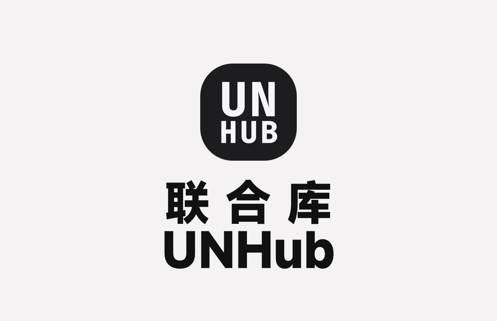

# 📜 第一条说明 · 联合库 UNHub 官方声明

*联合库UNHub*

---

> **UNHub 联合库，由杖雍皓发起并主导构建，是一个面向未来技术生态的开源知识中枢平台。**  
> 我们致力于聚合、梳理与激活散落在全球网络中的高价值知识资产，通过结构化、场景化、智能化的内容组织，为开发者、研究者与决策者提供**一站式认知升级解决方案**。

平台目前由四大核心模块构成：

🔹 **文档教程** —— 系统化操作指南与最佳实践，覆盖主流工具链与企业级部署方案  
🔹 **开源项目** —— 全网雷达扫描 GitHub、Gitee、云平台，挖掘新奇、好用、有前景的开源星辰  
🔹 **前线资讯** —— 跨越 CNN、BBC、新华社、科技媒体与社区暗流，为你提炼“下一秒”的世界信号  
🔹 **内部参考** —— 限域知识沉淀与组织级经验复用，构建企业或团队专属的“认知护城河”

这不是一个静态的文档站，而是一个**持续进化的知识有机体**。  
我们相信：在信息过载的时代，真正的竞争力，来自于**结构化的认知效率**。

🌐 官方站点：**[docs.zyhorg.cn](https://docs.zyhorg.cn)**  
🏛️ 构建者：杖雍皓  
📅 启动于知识重构的黎明时分

---

**备注：** 本日志文件将持续更新，记录更新情况。

