# 超可爱的 Logo 集合

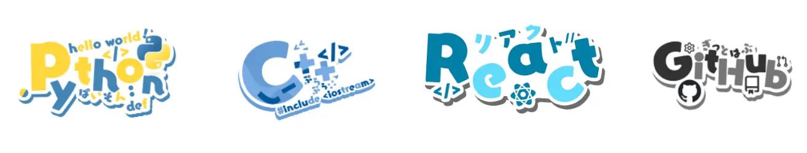

超可爱的 Logo 集合。这里是用来存放 Sawaratsuki 制作的各种 logo 的仓库，这些 logo 制作精美、画风可爱，包括编程语言、框架、工具和各大社交媒体的商标™️。

<!-- truncate -->

## Angular 

**名称**：Angular  
**创始人**：Google（由 Miško Hevery 和 Adam Abrons 最初开发）  
**推出时间**：2010年10月（AngularJS 1.0）；2016年9月（Angular 2，即现代 Angular 的起点）  
**介绍**：Angular 是由 Google 主导开发的一款开源前端 Web 应用框架。最初版本 AngularJS（即 Angular 1.x）采用 MVC 架构，而从 Angular 2 开始，框架被彻底重写，采用基于 TypeScript 的组件化架构，支持响应式编程、依赖注入、模块化开发等现代前端工程化特性。Angular 提供完整的解决方案（“全栈式”前端框架），适用于构建单页应用（SPA）和复杂的大型 Web 应用。其由 Google 和社区共同维护，是企业级 Web 开发的主流框架之一。

## ATProtocol 
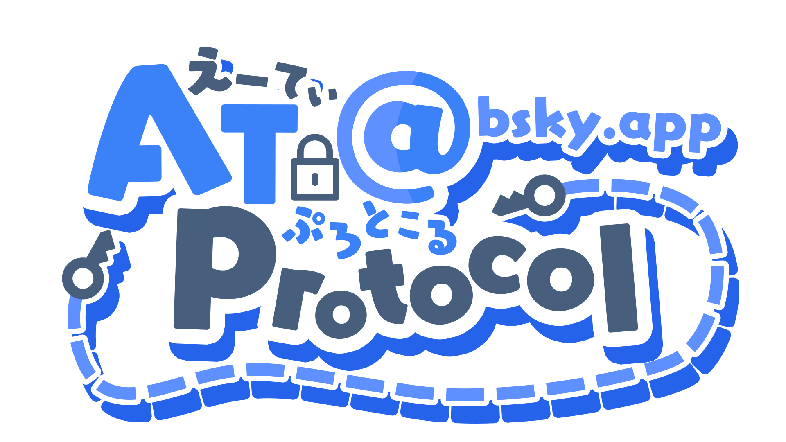
**名称**：AT Protocol（Authenticated Transfer Protocol）  
**创始人**：Bluesky（由 Twitter 联合创始人 Jack Dorsey 资助，团队核心成员包括 Jay Graber 等）  
**推出时间**：2023 年初首次公开技术细节，2023 年 2 月 Bluesky 社交应用正式上线并采用该协议  
**介绍**：AT Protocol 是一个去中心化的社交网络协议，由 Bluesky 开发，旨在构建可互操作、用户可控、高性能的社交平台。其核心设计包括“可移植的用户身份”（通过分布式标识 DID）、“可组合的内容存储”（使用“记录”Record 和“仓库”Repository 模型）、以及“算法可插拔”（用户可选择或自定义内容推荐算法）。AT Protocol 支持“联合式”（federated）架构，允许不同服务器（称为 Personal Data Servers）托管用户数据，同时保持跨实例互操作。它被用于 Bluesky 社交网络，目标是解决传统中心化社交平台在内容审核、数据所有权和算法透明度方面的局限性。

## Bluesky 
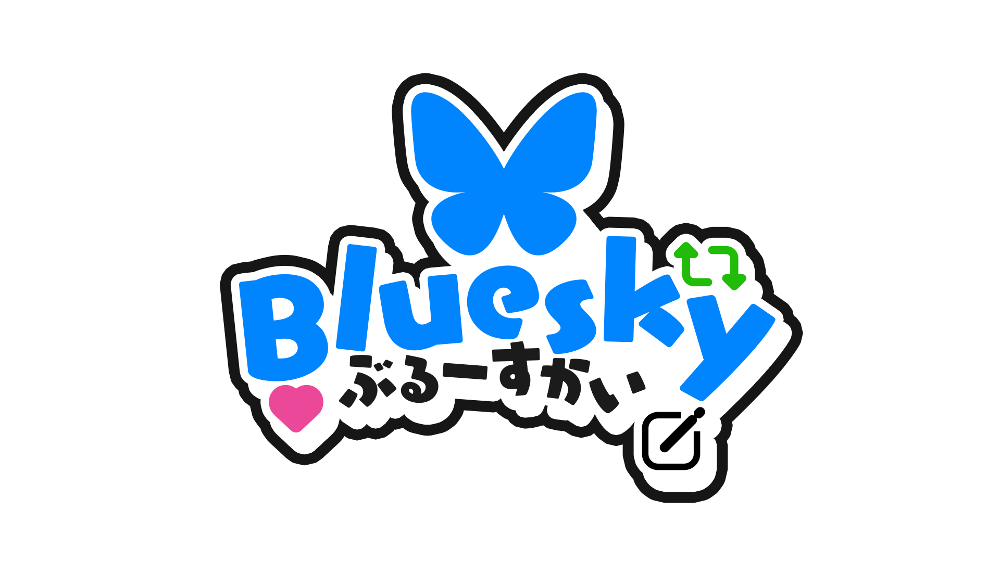
**名称**：Bluesky  
**创始人**：Jack Dorsey（前 Twitter 联合创始人）发起并资助，由 Jay Graber 担任 CEO 领导团队开发  
**推出时间**：2019 年首次宣布；2023 年 2 月向公众开放邀请制访问；2024 年 4 月全面开放注册  
**介绍**：Bluesky 是一个去中心化的社交网络平台，旨在提供更开放、用户可控的社交体验。它基于团队自主研发的 **AT Protocol**（Authenticated Transfer Protocol）构建，支持用户拥有和迁移自己的身份与数据、选择或创建内容推荐算法（“算法选择”功能），并实现跨服务器互操作。Bluesky 的界面类似传统社交媒体（如 Twitter/X），支持发帖（称为“Skeets”）、点赞、转发、话题标签等，但其底层架构强调去中心化、可组合性和开发者生态。平台由 Bluesky PBLLC 运营，初期由 Jack Dorsey 提供资金支持，目标是推动社交网络向开放协议演进。

## Charcoal 
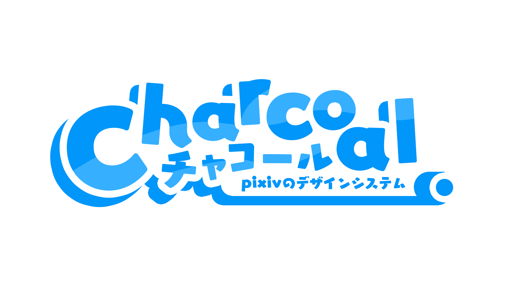
**名称**：Charcoal  
**创始人**：Meta（原 Facebook）AI 团队  
**推出时间**：2024 年 12 月（首次公开发布）  
**介绍**：Charcoal 是 Meta 推出的一个开源、模块化的 AI 安全研究平台，旨在帮助研究人员和开发者评估、测试和改进大语言模型（LLM）的安全性。它提供一套标准化的工具链，支持红队测试（red-teaming）、对抗性提示生成、风险分类、自动评估和缓解策略验证等功能。Charcoal 强调可复现性、可扩展性和透明度，允许社区在统一框架下协作研究 AI 对齐、越狱攻击、偏见、滥用等安全挑战。该项目是 Meta 推动负责任 AI 开发的重要举措之一，代码托管在 GitHub 上，采用 MIT 许可证开源。

## Cloudflare 
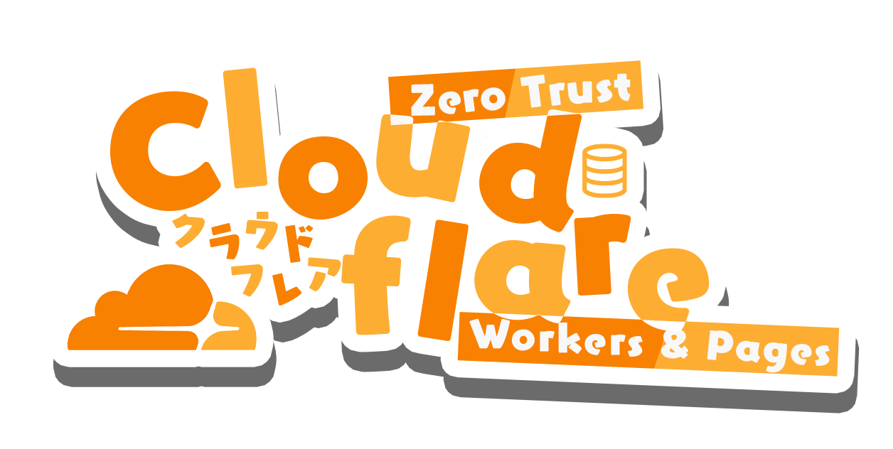
**名称**：Cloudflare  
**创始人**：Matthew Prince、Michelle Zatlyn 和 Lee Holloway  
**推出时间**：2009 年（公司成立），2010 年 9 月正式推出服务  
**介绍**：Cloudflare 是一家提供内容分发网络（CDN）、DDoS 防护、网络安全、域名解析（DNS）、边缘计算（如 Cloudflare Workers）等服务的全球性云计算公司。其核心理念是“让互联网更快、更安全、更可靠”。Cloudflare 通过遍布全球的数据中心网络，为网站和应用提供加速、安全防护（如 WAF、SSL/TLS 加密）、零信任安全架构（Cloudflare Access）以及无服务器计算能力。其服务覆盖从个人博客到大型企业的广泛用户，并以免费基础套餐著称，推动了互联网安全和性能的最佳实践普及。

## Express 

**名称**：Express  
**创始人**：TJ Holowaychuk  
**推出时间**：2010 年  
**介绍**：Express 是一个基于 Node.js 的轻量级、灵活的 Web 应用框架，用于构建服务器端应用和 API。它提供强大的路由系统、中间件支持、模板引擎集成和 HTTP 工具，是 Node.js 生态中最流行和广泛使用的 Web 框架之一。Express 以其简洁的 API、高性能和可扩展性著称，常作为构建 RESTful 服务、单页应用后端或微服务的基础。它也是许多更高级框架（如 NestJS、FeathersJS）的底层核心，并被纳入 Node.js 官方推荐的 Web 开发工具栈。

## Figma 

**名称**：Figma  
**创始人**：Dylan Field 和 Evan Wallace  
**推出时间**：2016 年（正式发布）  
**介绍**：Figma 是一款基于浏览器的协作式界面设计工具，支持 UI/UX 设计、原型制作、设计系统管理及团队协作。其最大特点是“云端优先”，允许多名设计师、开发者和产品经理实时在同一文件中编辑、评论和迭代，无需安装本地软件（也提供桌面应用）。Figma 支持矢量编辑、自动布局、组件库、交互原型、开发者模式（可查看 CSS/代码片段）等功能，广泛用于网页、移动应用和产品设计流程。2022 年被 Adobe 宣布以约 200 亿美元收购（截至 2024 年该交易仍在监管审查中），但 Figma 仍保持独立运营。

## GitHub 

**名称**：GitHub  
**创始人**：Chris Wanstrath、PJ Hyett 和 Tom Preston-Werner  
**推出时间**：2008 年 4 月  
**介绍**：GitHub 是一个基于 Git 的代码托管与协作开发平台，为软件开发者提供版本控制、代码托管、问题跟踪、代码审查、项目管理、持续集成（GitHub Actions）及社区协作等功能。它支持公开和私有仓库，是全球最大的开源项目社区，也被广泛用于企业级软件开发。GitHub 于 2018 年被微软以 75 亿美元收购，但保持独立运营，并持续推出新功能（如 Copilot、Codespaces），成为现代软件开发基础设施的核心组成部分。

## Go-Lang 

**名称**：Go（又称 Go-Lang）  
**创始人**：Google（由 Robert Griesemer、Rob Pike 和 Ken Thompson 主导设计）  
**推出时间**：2009 年 11 月（首次公开发布）  
**介绍**：Go 是一种开源、编译型、静态类型、并发友好的编程语言，由 Google 团队为解决大规模软件工程挑战而设计。它语法简洁，编译速度快，内置垃圾回收和轻量级并发模型（goroutines 和 channels），强调开发效率与运行性能的平衡。Go 广泛应用于云原生开发（如 Docker、Kubernetes）、网络服务、命令行工具和分布式系统，是现代基础设施软件的重要构建语言之一。其标准库丰富，工具链完善，由开源社区和 Google 共同维护。

## Haskell 
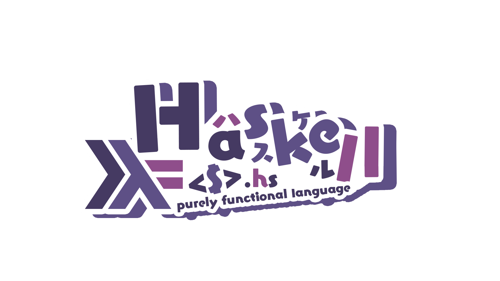
**名称**：Haskell  
**创始人**：由学术界多个研究团队联合设计，主要贡献者包括 Philip Wadler、Paul Hudak、Simon Peyton Jones 等  
**推出时间**：1990 年（Haskell 1.0 正式发布）  
**介绍**：Haskell 是一种纯函数式、静态类型、惰性求值的编程语言，以其数学严谨性和高度抽象能力著称。它强调不可变数据、无副作用的函数、强大的类型系统（支持类型类、高阶类型、GADTs 等）以及表达式推导能力。Haskell 被广泛用于学术研究、编译器开发、形式化验证、金融建模和高可靠性系统。主流实现是 **GHC**（Glasgow Haskell Compiler），提供丰富的扩展和高性能编译能力。尽管在工业界应用相对小众，但 Haskell 的许多特性（如 monad、类型推导）深刻影响了现代编程语言（如 Rust、Swift、Scala）的设计。

## Hono 

**名称**：Hono  
**创始人**：Yusuke Wada（和田雄介）  
**推出时间**：2022 年（首次公开发布）  
**介绍**：Hono 是一个为边缘计算环境（如 Cloudflare Workers、Deno、Bun、Fastly Compute@Edge 等）设计的超轻量、高性能 Web 框架，使用 TypeScript 编写。其名称“Hono”在日语中意为“火野”或“迅猛”，体现了其快速、简洁的设计哲学。Hono 提供类似 Express/Koa 的路由 API，但针对边缘运行环境进行了深度优化，启动极快、零依赖、体积小（核心仅几 KB），并支持中间件、WebSocket、JSX 渲染、OAuth、缓存控制等现代功能。它特别适合构建低延迟、高并发的边缘应用和 Serverless API，已成为边缘开发领域的热门框架之一。

## IntelliJ-IDEA 

**名称**：IntelliJ IDEA  
**创始人**：JetBrains（由 Sergey Dmitriev、Valentin Kipiatkov 和 Eugene Belyaev 等人共同创立）  
**推出时间**：2001 年 1 月（首个公开版本）  
**介绍**：IntelliJ IDEA 是由 JetBrains 公司开发的一款功能强大的集成开发环境（IDE），主要用于 Java 语言开发，同时通过插件或内置支持 Kotlin、Scala、Groovy、Python、JavaScript、TypeScript 等多种编程语言。它以智能代码补全、深度代码分析、重构工具、集成调试器和版本控制、以及对现代框架（如 Spring、Micronaut、Android）的优秀支持而闻名。IntelliJ IDEA 提供社区版（免费开源）和旗舰版（付费，功能更全面），被全球开发者广泛用于企业级应用和开源项目开发，是现代 Java 生态中最主流的 IDE 之一。

## Kotlin
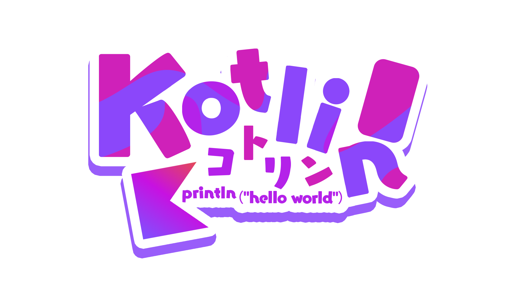
**名称**：Kotlin  
**创始人**：JetBrains（由 Dmitry Jemerov 领导团队设计，关键贡献者包括 Andrey Breslav 等）  
**推出时间**：2011 年 7 月（首次公开发布）；2016 年 2 月发布 1.0 正式版  
**介绍**：Kotlin 是一种由 JetBrains 开发的开源、静态类型、多范式编程语言，运行于 Java 虚拟机（JVM），并可编译为 JavaScript 或原生二进制代码（通过 Kotlin/Native）。它旨在与 Java 完全互操作，同时提供更简洁、安全和富有表现力的语法，显著减少样板代码，并内置空安全机制以避免空指针异常。Kotlin 被 Google 宣布为 Android 官方开发语言（2017 年），广泛用于 Android 应用、服务器端开发（如 Spring Boot）、跨平台移动开发（Kotlin Multiplatform）等领域，已成为现代 JVM 生态中最重要的语言之一。

## Laravel
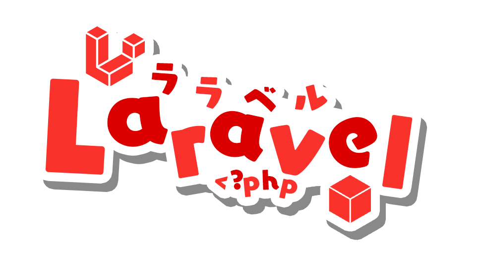
**名称**：Laravel  
**创始人**：Taylor Otwell  
**推出时间**：2011 年 6 月  
**介绍**：Laravel 是一个基于 PHP 的开源 Web 应用框架，遵循 MVC（模型-视图-控制器）架构，以优雅、简洁和富有表现力的语法著称。它提供了路由、ORM（Eloquent）、模板引擎（Blade）、队列、缓存、身份验证、API 支持等现代化开发所需的核心功能，并内置了强大的开发工具如 Artisan 命令行接口和测试支持。Laravel 强调开发者的开发体验和代码可维护性，拥有活跃的社区和丰富的生态系统（包括 Laravel Forge、Vapor、Horizon、Nova 等官方工具）。它已成为全球最流行的 PHP 框架，广泛应用于构建中小型网站、企业级应用和 RESTful API 服务。

## Next.js
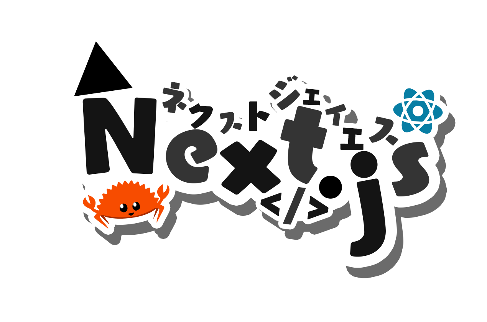
**名称**：Next.js  
**创始人**：Vercel（原 ZEIT 团队），由 Guillermo Rauch 等人主导开发  
**推出时间**：2016 年 10 月  
**介绍**：Next.js 是一个基于 React 的开源 Web 应用框架，由 Vercel 开发并维护，旨在简化高性能 React 应用的构建。它支持服务端渲染（SSR）、静态站点生成（SSG）、增量静态再生（ISR）、客户端渲染（CSR）等多种渲染模式，提供文件系统路由、API 路由、图像优化、字体优化、中间件、TypeScript 支持等开箱即用的功能。Next.js 与 Vercel 平台深度集成，也兼容其他托管服务，广泛用于构建 SEO 友好、快速加载的网站、电子商务平台、博客和全栈应用，是现代 React 开发生态中最主流的框架之一。

## Node.js  
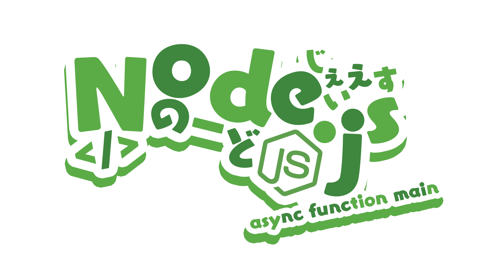
**名称**：Node.js  
**创始人**：Ryan Dahl  
**推出时间**：2009 年（首次发布）  
**介绍**：Node.js 是一个基于 Chrome V8 JavaScript 引擎的开源、跨平台 JavaScript 运行时环境，允许开发者使用 JavaScript 编写服务器端代码。它采用事件驱动、非阻塞 I/O 模型，使其轻量且高效，特别适合构建高性能、可扩展的网络应用和实时服务（如聊天应用、API 服务器、微服务等）。Node.js 拥有庞大的生态系统，通过 npm（Node Package Manager）提供数百万个开源库，是现代 Web 开发、全栈 JavaScript 应用和 DevOps 工具链的核心技术之一。目前由 OpenJS Foundation 维护。

## React  
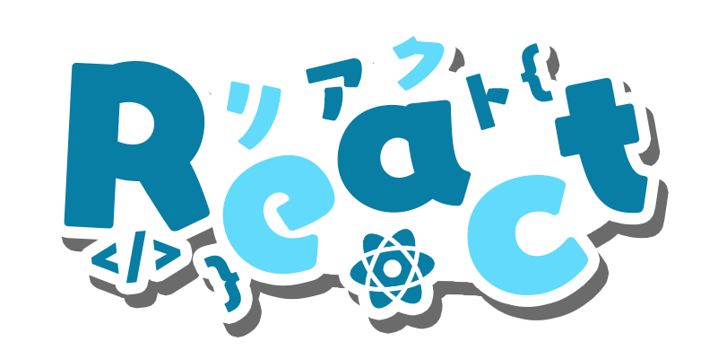
**名称**：React  
**创始人**：Facebook（现 Meta），由 Jordan Walke 主导开发  
**推出时间**：2013 年 5 月（开源发布）  
**介绍**：React 是一个由 Meta（原 Facebook）开发并开源的用于构建用户界面的 JavaScript 库，尤其擅长构建单页应用（SPA）和复杂交互式 UI。它采用组件化架构和声明式编程范式，通过虚拟 DOM（Virtual DOM）高效更新真实 DOM，提升性能与开发体验。React 本身只关注视图层，但可与 React Router、Redux、React Query 等生态工具结合，构建完整应用。其衍生技术如 React Native 还支持跨平台移动开发。凭借灵活、高效和庞大的社区支持，React 成为全球最流行的前端 UI 库之一。

## Replit  
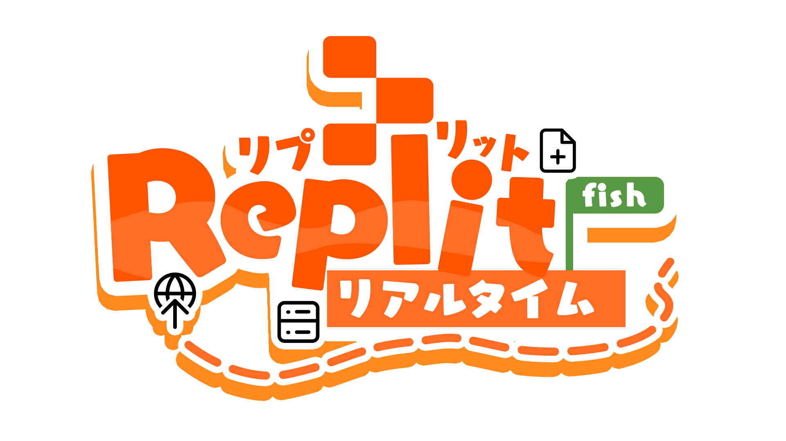
**名称**：Replit  
**创始人**：Amjad Masad、Faris Masad 和 Haya Odeh  
**推出时间**：2016 年（正式公开发布）  
**介绍**：Replit 是一个基于浏览器的云端集成开发环境（IDE）和协作编程平台，支持超过 50 种编程语言（包括 Python、JavaScript、Java、C++、Go、Rust 等）。它允许用户无需本地配置即可即时创建、编写、运行和部署代码，所有项目自动保存在云端，并支持实时多人协作、版本控制（类似 Git）、终端访问、数据库集成和一键部署（通过 Replit Hosting）。Replit 特别受学生、教育者和初学者欢迎，也逐渐被用于原型开发和小型生产应用。其“Always-on”和“Deploy to custom domain”等功能在付费计划中提供，致力于实现“编程无门槛”的愿景。

## Rust  
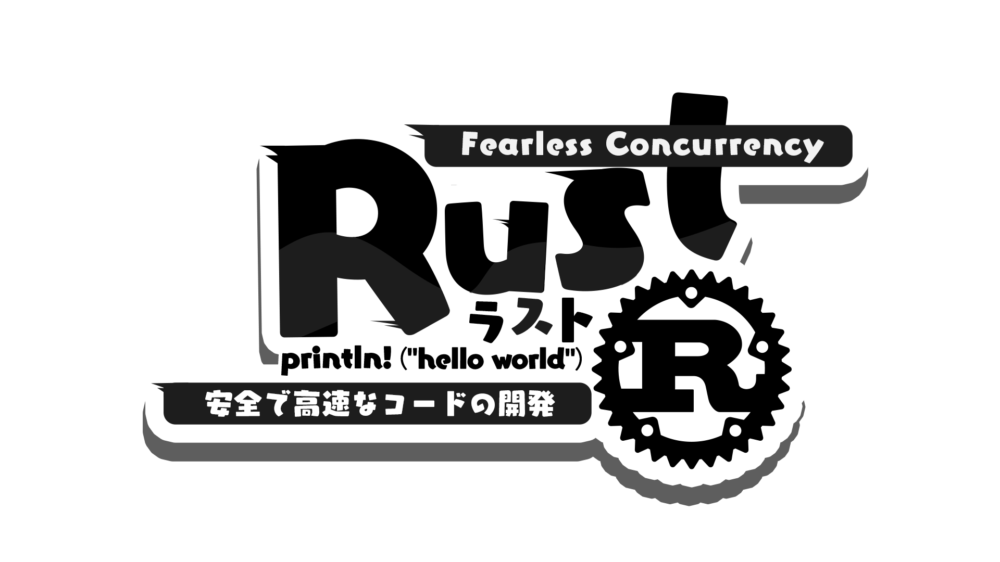
**名称**：Rust  
**创始人**：Graydon Hoare（Mozilla 研究院支持下开发）  
**推出时间**：2010 年（首次公开发布）；2015 年 5 月 15 日发布 1.0 稳定版  
**介绍**：Rust 是一种开源、系统级编程语言，强调内存安全、并发性和高性能。它通过所有权（ownership）、借用（borrowing）和生命周期（lifetimes）等独特机制，在不依赖垃圾回收的情况下防止空指针、数据竞争等常见内存错误。Rust 语法现代，支持函数式、面向对象和泛型编程，编译时即保证内存和线程安全。它被广泛用于操作系统、嵌入式系统、WebAssembly、区块链、浏览器引擎（如 Firefox 的部分组件）和高性能后端服务。自 2016 年起，Rust 连续多年在 Stack Overflow 开发者调查中被评为“最受喜爱的编程语言”。项目现由 Rust 基金会（Rust Foundation）维护。

## Tailwind CSS  
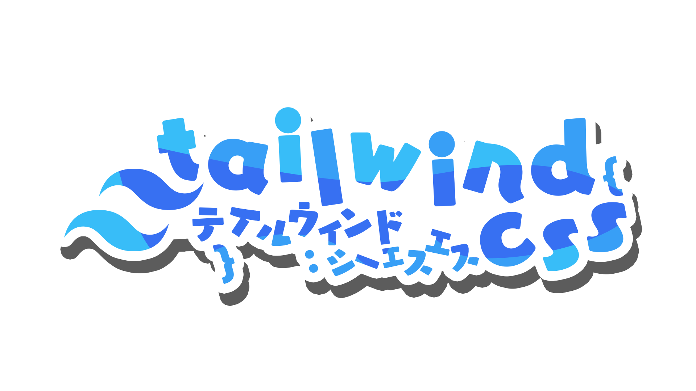
**名称**：Tailwind CSS  
**创始人**：Adam Wathan、Jonathan Reinink、David Hemphill 和 Steve Schoger  
**推出时间**：2017 年（初始版本发布）；2019 年 5 月发布 1.0 正式版  
**介绍**：Tailwind CSS 是一个功能优先（utility-first）的 CSS 框架，提供大量低层级、可组合的工具类（utility classes），用于直接在 HTML 中快速构建高度定制化、无重复样式的用户界面。与传统 CSS 框架（如 Bootstrap）不同，Tailwind 不提供预设组件，而是通过配置文件（tailwind.config.js）和即时编译（JIT 模式）实现灵活设计系统，避免编写自定义 CSS。它支持响应式设计、深色模式、动画、插件扩展，并与现代前端构建工具（如 Vite、Next.js、React）深度集成，已成为高效、可维护的现代 Web 开发主流方案之一。

## TypeScript  
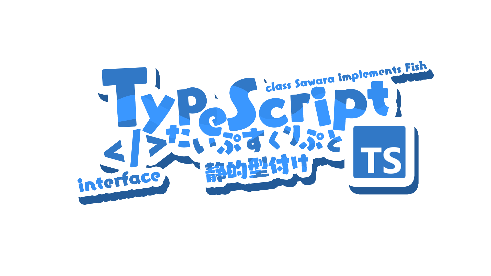
**名称**：TypeScript  
**创始人**：Microsoft（由 Anders Hejlsberg 主导设计）  
**推出时间**：2012 年 10 月（首次公开发布）  
**介绍**：TypeScript 是一种开源的编程语言，由 Microsoft 开发，是 JavaScript 的超集，添加了可选的静态类型系统、类、接口、泛型、枚举等现代编程特性。它编译为纯 JavaScript，可在任何支持 JavaScript 的环境（浏览器、Node.js 等）中运行。TypeScript 的核心优势在于提升代码的可读性、可维护性和可扩展性，尤其适用于大型项目开发。它被广泛用于 Angular、React、Vue 等主流框架，并得到 VS Code、Webpack、Vite 等工具链的深度支持。由开源社区和 Microsoft 共同维护，已成为现代 JavaScript 开发生态中的事实标准之一。