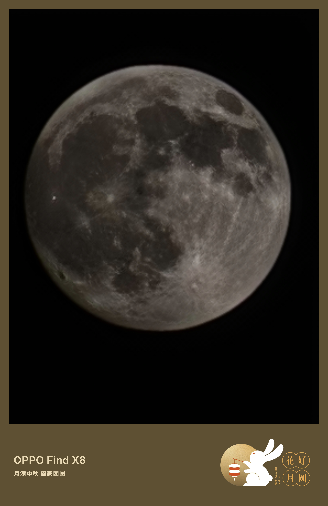

# 古代的皇帝和名人是怎么过中秋节的？

今天是2025年中秋节，点击 **阅读原文** 让我们穿越千年时光，一同回望那些曾经执掌天下的帝王与才情横溢的文人，是如何在一轮明月下，度过这个寄托着团圆与思念的节日的。

<!-- truncate -->

**杖雍皓拍的月亮🌕**

## **一、帝王之月：从祭月的庄严到赏月的雅致**

中秋节的源头，深植于上古的“秋分祭月”之礼。早在《周礼》中便有“中秋夜迎寒”、“秋分夕月”的记载，这并非一个民间的节日，而是国家最高级别的祭祀仪式。帝王作为“天子”，是沟通天地的唯一媒介。每年秋分，天子会亲率百官，前往专门的“月坛”举行盛大的祭月典礼，以祈求国泰民安、五谷丰登。北京的“月坛”，就是明代嘉靖年间为皇家祭月而修造的庄严场所。这一行为，是国家意志的体现，充满了神圣与威严。

到了唐代，中秋节的性质开始悄然转变。它从单纯的皇家祭祀，逐渐向民间普及，成为一个固定的节日。据《唐书·太宗记》记载，唐太宗时期已明确将“八月十五”定为中秋节。此时，帝王的过节方式也多了几分人间烟火气。虽然祭月的礼制依然存在，但“赏月”成为了宫廷生活的新风尚。宫廷中会举行盛大的宴会，君臣同乐，饮酒赋诗，共赏明月。唐玄宗李隆基更是将中秋的庆祝推向了高潮，据说他在“花萼相辉楼”前举办过盛大的舞马、绳妓等杂技表演，全国放假三天，整个长安城沉浸在一片欢乐之中。

进入宋代，赏月的雅趣在宫廷中达到了顶峰。宋太祖赵匡胤、宋太宗赵光义等皇帝，都酷爱在中秋夜登高望月。据记载，宋太宗曾下令，中秋节时，宫中要彻夜燃灯，宫人皆着新衣，共赏明月。北宋的宫廷还出现了“玩月”这一高雅活动，皇帝会命人在御苑中搭建高台，邀请文臣雅士，一边品尝新上市的“小饼”（即月饼的雏形），一边吟诗作对，将皇家的奢华与文人的风雅完美融合。到了清代，皇帝的中秋则更具“行宫”特色。如《清史稿》所载，清朝皇帝常在木兰围场巡幸，或在承德避暑山庄度过中秋。他们虽身处皇家园林，却也遵循“赏月”的传统，命人在庭院中设下香案，摆上月饼、瓜果，行拜月之礼，再邀皇子皇孙共赏良宵，将家国天下的责任与天伦之乐交织在一起。

## **二、文人之月：诗酒趁年华，月是故乡明**

如果说帝王的中秋是庄严与奢华的，那么文人墨客的中秋，则是情感与才情的盛大释放。唐宋两代，正是中秋诗词创作的黄金时代，无数千古名篇在此时诞生。

唐代诗人对月亮情有独钟，将中秋的月色化作了最动人的诗行。张九龄的“海上生明月，天涯共此时”，以雄浑的笔触描绘了明月从海平面升起的壮丽景象，道出了千百年来游子与家人共望一轮明月的永恒思念，堪称最雄浑的中秋诗篇。李白则更显浪漫不羁，“举杯邀明月，对影成三人”，他独自一人，邀月对饮，将孤独升华为一种与天地共舞的旷达。杜甫的“露从今夜白，月是故乡明”，则用最朴素的语言，道出了最深切的乡愁，成为后世游子心中最温柔的慰藉。白居易、王建等诗人也留下了大量咏月佳作，使得“玩月”成为当时文人雅集的重要内容，寺庙、高台、江畔，处处都是他们对月抒怀的场所。

到了宋代，苏轼无疑是中秋诗词的巅峰。他的《水调歌头·明月几时有》被誉为“中秋词之冠”。这首词开篇便直指苍穹：“明月几时有？把酒问青天。”全词融哲理、情感与美景于一体，从对月宫的遐想，到对人生“悲欢离合，阴晴圆缺”的深刻感悟，最终升华为“但愿人长久，千里共婵娟”的旷达祝福。这已不再仅仅是个人的思念，而是对所有人间离散者的普世关怀。此外，苏轼还有“此生此夜不长好，明月明年何处看”的感慨，以及“中秋谁与共孤光”的孤寂，这些诗句都饱含了对生命无常的深刻体悟。

## **三、千古绝唱：那些流传千年的中秋名篇**

###   **《望月怀远》（唐·张九龄）**
“海上生明月，天涯共此时。” 这两句诗，以最简洁、最宏大的意象，定义了中秋节最核心的精神内核——共享。

###   **《静夜思》（唐·李白）**
“床前明月光，疑是地上霜。举头望明月，低头思故乡。” 这首妇孺皆知的五言绝句，用最日常的场景，勾起了最普遍的乡愁，是中华诗词中传播最广、影响最深的中秋诗。

###   **《水调歌头·明月几时有》（宋·苏轼）**
“人有悲欢离合，月有阴晴圆缺，此事古难全。但愿人长久，千里共婵娟。” 这不仅是中秋词的巅峰，更是中华民族情感世界中最璀璨的明珠，它超越了时代，成为了每一个中国人在团圆时刻内心最真挚的祈愿。

从周代帝王的庄严肃穆，到唐宋文人的诗酒风流，中秋的月亮见证了中国历史的变迁，也承载了民族最深沉的情感。它既是国家祭祀的神圣象征，也是个人思念的温柔寄托。今天，当我们再次仰望那轮明月，我们看到的，不仅是千年前帝王的月坛与文人的酒杯，更是中华民族血脉中那份对团圆、对和谐、对美好永恒不变的向往。

**祝大家中秋快乐，月圆人圆，万事如意！**