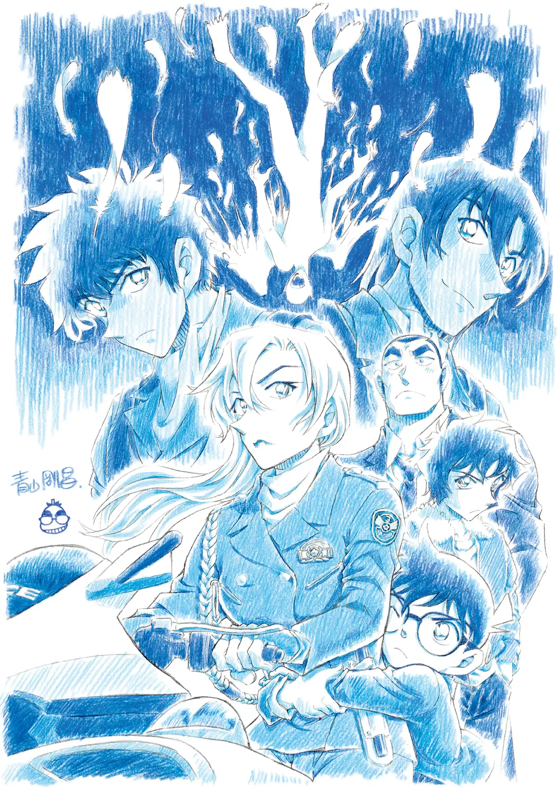
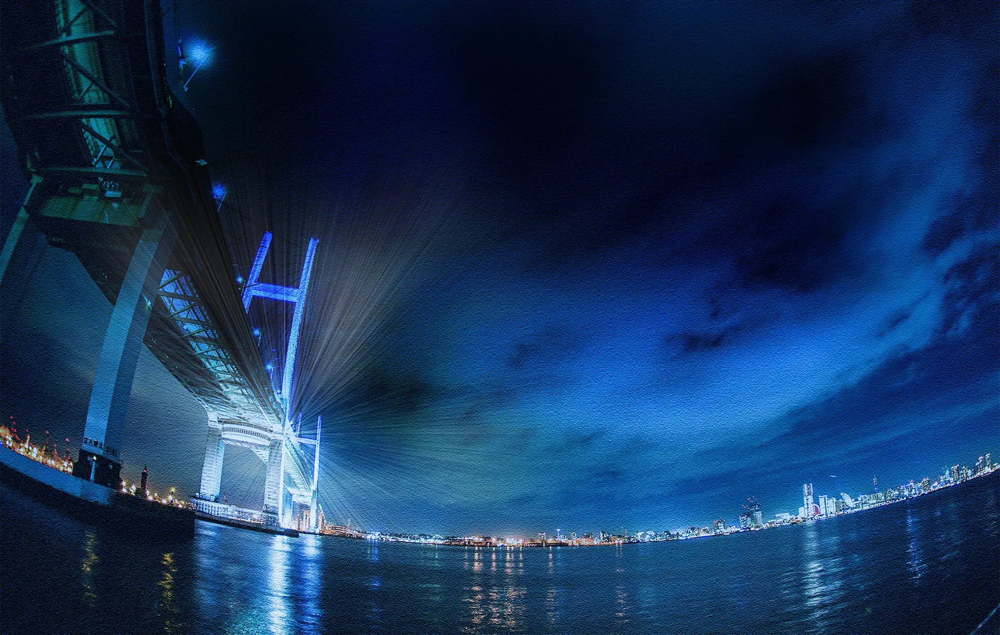
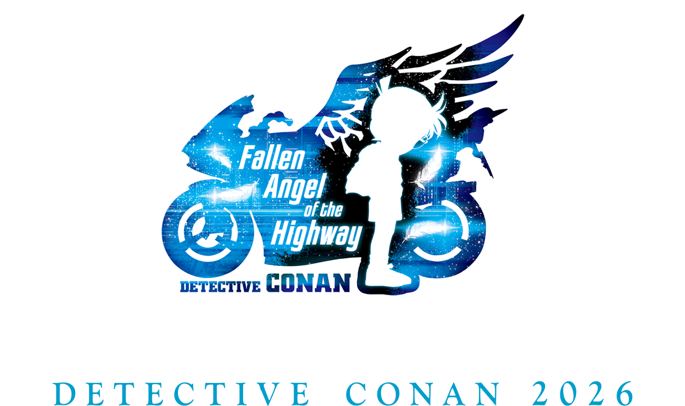

# 名侦探柯南：高速公路的堕天使将于 2026 年 4 月 10 日星期五上映！

**《名侦探柯南：高速公路的堕天使》（日语：名探偵コナン ハイウェイの堕天使）**，是2026年日本动画电影，改编自日本漫画家青山刚昌漫画系列《名侦探柯南》的第29部剧场版，由莲井隆弘执导，大仓崇裕编剧，2026年4月10日在日本上映。

<!-- truncate -->

## 🎬 资料表

| 类别 | 项目 | 内容 |
| :--- | :--- | :--- |
| **基本资料** | 导演 | 莲井隆弘 |
| | 编剧 | 大仓崇裕 |
| | 原著 | 《名侦探柯南》青山刚昌作品 |
| | 主演 | 高山南 |
| | | 山崎和佳奈 |
| | | 小山力也 |
| | | 泽城美雪 |
| | | 神奈延年 |
| | | 三木真一郎 |
| | 配乐 | 菅野祐悟 |
| | 制片商 | TMS／第一工作室 |
| | 产地 | 日本 |
| | 语言 | 日语 |
| **上映及发行** | 上映日期 | 2026年4月10日 (日本) |
| | 发行商 | 东宝 (日本) |
| **前作与续作** | 前作 | 独眼的残像 |

## 青山刚昌绘制的预告视觉图已发布！

预告片的画面以柯南和萩原千速骑着警用摩托车为中心。

这将是萩原千速首次在电影中登场，她是神奈川县警察交通机动队的摩托车警员，小兰在与她初次见面时就称她为“风之女神”。

在他们身后，是高中生侦探世良真纯，他与萩原千速初次见面，却因共同的爱好——骑摩托车而结缘；还有神奈川县搜查一课的警官横沟重悟，他总是受制于千早。此外，还有千早的弟弟萩原研二和他的挚友松田阵平，这两位都已因公殉职……

此外，描绘萩原千速和柯南乘坐警用摩托车的【天使视觉图】也已公开！

## 登场角色

### 原作角色

<table>
  <thead>
    <tr>
      <th rowspan="2">角色</th>
      <th colspan="4">配音员</th>
      <th rowspan="2">简介</th>
    </tr>
    <tr>
      <th> 日本</th>
      <th> 台湾</th>
      <th> 香港</th>
      <th> 中国大陆</th>
    </tr>
  </thead>
  <tbody>
    <tr>
      <th colspan="6">主要人物</th>
    </tr>
    <tr>
      <td>江户川柯南</td>
      <td>高山南</td>
      <td>曾允凡</td>
      <td></td>
      <td>李世荣</td>
      <td rowspan="2">本作品男主角，原高中生名侦探工藤新一，被黑暗组织的成员琴酒灌下毒药而缩小变成孩童的模样，后化名为江户川柯南，寄住在毛利家中并暗中调查黑暗组织并且找寻解药。</td>
    </tr>
    <tr>
      <td>工藤新一</td>
      <td>山口胜平</td>
      <td>刘杰</td>
      <td></td>
      <td>阿杰</td>
    </tr>
    <tr>
      <td>毛利兰</td>
      <td>山崎和佳奈</td>
      <td>魏晶琦</td>
      <td></td>
      <td>季冠霖</td>
      <td>新一的青梅竹马兼女朋友，运动神经发达，擅长空手道，曾获得全国高中空手道关东大赛的冠军。</td>
    </tr>
    <tr>
      <td>毛利小五郎</td>
      <td>小山力也</td>
      <td>曹冀鲁</td>
      <td></td>
      <td>张遥函</td>
      <td>小兰的父亲，英理的丈夫，私家侦探，外号沉睡小五郎，原刑警，辞职后在家开设毛利侦探事务所。</td>
    </tr>
    <tr>
      <td>萩原千速</td>
      <td>泽城美雪</td>
      <td>魏晶琦</td>
      <td></td>
      <td>蔺婵婵</td>
      <td>本作剧场版"关键人物"之一。31岁，神奈川县警察交通部第三交通机动队小队长（警部补），萩原研二的姐姐。</td>
    </tr>
    <tr>
      <td>横沟重悟</td>
      <td>大冢明夫</td>
      <td>刘杰</td>
      <td></td>
      <td>傅晨阳</td>
      <td>本作剧场版"关键人物"之一。35岁，神奈川县警察刑事部捜查一课刑警（警部）。横沟参悟的双胞胎弟弟。</td>
    </tr>
    <tr>
      <td>世良真纯</td>
      <td>日高法子</td>
      <td>傅其慧</td>
      <td></td>
      <td>常蓉珊</td>
      <td>本作剧场版"关键人物"之一。小兰的同学，从英国返回日本的女高中生侦探。知道柯南的身份，同时也是他的同伴之一。</td>
    </tr>
    <tr>
      <td>萩原研二</td>
      <td>三木真一郎</td>
      <td>刘杰</td>
      <td></td>
      <td>杨天翔</td>
      <td>本作剧场版"关键人物"之一。原警视厅爆炸物处理班成员，松田阵平的警校同期同学之一，千速的弟弟。在"百货大楼爆炸事件"中殉职。</td>
    </tr>
    <tr>
      <td>松田阵平</td>
      <td>神奈延年</td>
      <td>李世扬</td>
      <td></td>
      <td>边江</td>
      <td>本作剧场版"关键人物"之一。原警视厅搜查一课刑警及爆炸物处理班成员。在"摩天轮爆炸事件"当中殉职。</td>
    </tr>
    <tr>
      <th colspan="6">朋友相关人物</th>
    </tr>
    <tr>
      <td>灰原哀</td>
      <td>林原惠</td>
      <td>魏晶琦</td>
      <td></td>
      <td>阎萌萌</td>
      <td>柯南的搭档兼好友，本名宫野志保，原黑暗组织科学家雪莉。为了脱离组织决定吃下毒药自尽却让自己缩小成孩童的模样，逃离组织不久就寄住在阿笠家中并化名灰原哀但有点喜欢上柯南的样子。</td>
    </tr>
    <tr>
      <td>阿笠博士</td>
      <td>绪方贤一</td>
      <td>吴文民</td>
      <td></td>
      <td>郭政建</td>
      <td>工藤家的邻居兼好友，科学家兼发明家，会发明出一些道具让柯南在案件中使用，在灰原哀逃离黑暗组织后收留她。</td>
    </tr>
    <tr>
      <th colspan="6">警视厅相关人物</th>
    </tr>
    <tr>
      <td>宫本由美</td>
      <td>杉本优</td>
      <td>杨凯凯</td>
      <td></td>
      <td>闫夜桥</td>
      <td>警视厅交通课的女警，羽田秀吉的女友。</td>
    </tr>
    <tr>
      <td>三池苗子</td>
      <td>田中理惠</td>
      <td>曾允凡</td>
      <td></td>
      <td>徐佳琦</td>
      <td>警视厅交通课的女警，千叶警官的女友。</td>
    </tr>
  </tbody>
</table>

## 制作

### 制作人员

- 原作：青山刚昌
- 动画制作：TMS／第一工作室
- 制作：名侦探柯南制作委员会（小学馆、读卖电视台、日本电视台、ShoPro、东宝、TMS娱乐）
- 发行：东宝

## 宣传与推广

2025年4月18日，《名侦探柯南：独眼的残像》放映结束后出现毛利兰的台词“风之女神”、横沟重悟的台词“不是女神，是女海贼”以及萩原千速的台词“吵死了”的制作预告，并定档于2026年黄金周。

8月31日，公开40秒超特报影片，确认萩原千速的新任声优为泽城美雪。

9月15日，原作者青山刚昌透过任天堂发行的《集合啦！动物森友会》公开本作剧场版的片名格式为“◯イ◯o◯の◯゛◯ン◯”，并陆续公开每个将于2026年剧场版登场的角色。

## 其他资源

官方2026剧场版logo图

官方网站背景图

官方网站加载图

## 官网

- [官方网站 （日语）](https://www.conan-movie.jp/2026/index.html)
- [警視庁の名探偵コナン百科](https://mpd.zyhorg.cn/)
