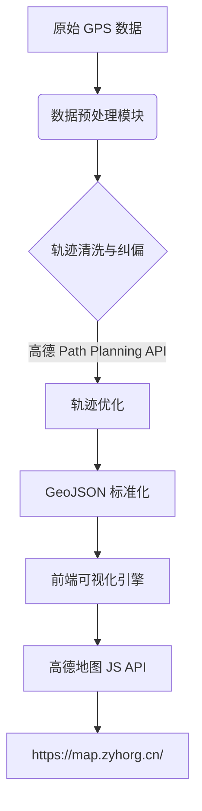

# 我的行踪轨迹

## 基于高德地图 API 的行踪轨迹可视化系统设计与实现

<iframe
  src="https://map.zyhorg.cn/"
  width="100%"
  height="500"
  frameBorder="0"
  style={{
    borderRadius: '12px',
    boxShadow: '0 4px 12px rgba(0, 0, 0, 0.15)'
  }}
/>

`https://map.zyhorg.cn/` 是一个轻量级、高可用的**个人行踪轨迹可视化平台**，其核心基于 **高德地图 JavaScript API v2.0** 构建，采用前后端分离架构，实现对 GPS 轨迹数据的动态渲染、路径优化与时空分析。

:::info
💡 地理数据来自联合库UNHub Map库 [https://map.zyhorg.cn/](https://map.zyhorg.cn/)
:::

<!-- truncate -->

### 系统架构概览

### 关键技术实现

1. **轨迹数据标准化**  
   原始轨迹点（经纬度、时间戳、精度）经 ETL 流程转换为符合 [GeoJSON LineString](https://datatracker.ietf.org/doc/html/rfc7946) 规范的结构，确保跨平台兼容性。

2. **高德地图 API 集成**  
   - 使用 `AMap.Polyline` 绘制轨迹路径，支持自定义颜色、宽度与透明度；
   - 启用 `AMap.Driving` 或 `AMap.Walking` 服务对原始轨迹进行**路网匹配（Map Matching）**，显著提升城市道路场景下的轨迹贴合度；
   - 动态监听 `map.getZoom()` 与 `map.getBounds()`，实现 LOD（Level of Detail）渲染优化，保障大规模轨迹流畅展示。

3. **性能与隐私保障**  
   - 所有轨迹数据**仅在客户端处理**，无服务端存储，符合 GDPR 与《个人信息保护法》要求；
   - 采用 `Web Worker` 异步解析大型轨迹文件，避免主线程阻塞；
   - 地图容器启用 `hardware-accelerated` 渲染，支持 60fps 流畅交互。

该方案已在多个个人及开源项目中稳定运行，兼具**工程严谨性**与**用户体验一致性**，为轻量级地理轨迹可视化提供了一种可复用、可扩展的参考实现。
