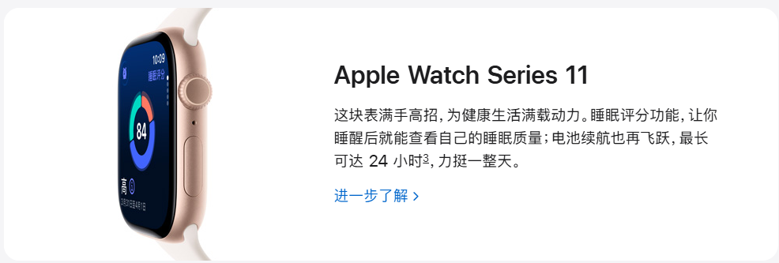

# Apple 2025 特别活动新品全景深度解析  
## —— 全新 iPhone 三剑客、AirPods Pro 3 与 Apple Watch Series 11 齐发，开启“轻薄·智能·健康”新时代

**文档版本：** v1.0  
**最后更新：** 2025年9月24日  
**文章来源：** Apple 中国官网（apple.com.cn）公开页面内容  
**文章官网：** https://www.apple.com.cn/  
**适用对象：** 科技媒体从业者、消费电子行业分析师、Apple 产品用户、企业 IT 采购负责人、开发者、零售渠道合作伙伴、数码爱好者

---

## 一、活动总览：一场定义未来体验的硬件盛宴

2025 年 Apple 特别活动（Apple Special Event）于 6 月初正式举行，标志着 Apple 在智能手机、可穿戴音频与健康设备三大核心品类上迎来**战略级产品迭代**。本次活动并非传统意义上的 WWDC（全球开发者大会），而是一场聚焦**硬件创新与用户体验升级**的独立发布会，核心信息高度凝练于 Apple 官网活动标语：

> **“见见新一代 iPhone，有 iPhone 17 Pro、iPhone 17 和全新亮相的 iPhone Air；听听全新 AirPods Pro 3，入耳式主动降噪开启新声代；还有 Apple Watch 系列新品，事关健康的各种洞察，让你了解得更深入。”**

此次活动不仅延续了 Apple 对**性能、影像、设计**的极致追求，更首次推出 **iPhone Air** 全新子系列，重新定义“轻薄旗舰”市场边界；同时，通过 **AirPods Pro 第三代** 与 **Apple Watch Series 11** 的协同升级，进一步强化“**个人健康中枢 + 沉浸音频体验**”的生态闭环。

---

## 二、iPhone 产品线：三箭齐发，覆盖全场景用户需求

Apple 首次在同一世代推出**三款定位清晰、功能互补**的 iPhone 机型，形成覆盖专业性能、全能均衡与轻薄创新的完整产品矩阵。

### 2.1 iPhone 17 Pro：硬核性能旗舰，为创作者与玩家而生

#### 核心亮点
- **A19 Pro 芯片**：采用第三代 3nm 工艺，GPU 性能较 A18 Pro **最高提升 30%**，并首次引入 **硬件加速光线追踪（Hardware-accelerated Ray Tracing）**，显著提升游戏与 AR 应用的图形真实感。
- **热锻铝金属一体成型机身**：在保持高强度的同时实现轻量化，提供 **银色、星宇橙、深蓝** 三种配色，彰显专业质感。
- **革命性前置摄像头系统**：
  - **无需旋转手机**即可在横竖屏间无缝切换取景；
  - 多人入镜时**自动扩大视野**，智能构图更自然；
  - 支持高帧率视频录制，满足 Vlog 与直播需求。
- **游戏性能实证**：官方演示《异人之下》等高负载 3A 级手游，画面流畅、光影逼真，确立移动游戏新标杆。

#### 目标用户画像
- 移动游戏玩家（尤其是 3A 手游爱好者）
- 专业视频创作者与摄影师
- 追求极致性能与前沿技术的科技先锋

---

### 2.2 iPhone 17：全能影像升级，日常拍摄更出彩

#### 影像系统全面进化

| 功能 | 技术说明 | 用户价值 |
|------|--------|--------|
| **“珠光”摄影风格** | 通过 AI 算法为人像肤色增添自然柔和亮色 | 肤色更明媚通透，呈现“由内而外光彩夺目”效果 |
| **2 倍长焦** | 光学级变焦能力，拉近推远皆清晰 | 主体细节丰富，人像/特写构图更灵活 |
| **低光/夜间模式** | 多帧合成 + 噪点抑制算法优化 | 昏暗环境下画面明亮、色彩鲜活、细节锐利 |
| **微距拍摄** | 超近对焦距离，解析力惊人 | 花卉、昆虫、纹理等微观世界清晰呈现 |
| **专业视频** | 支持 4K 60fps、电影效果模式、**人声混音调节** | 视频更具电影感，人声与环境音可独立控制 |

#### 配色与设计
提供 **黑色、白色、鼠尾草绿、青雾蓝、薰衣草紫** 五种时尚配色，延续融合式摄像头设计语言。

---

### 2.3 iPhone Air：全新品类，定义“超薄旗舰”新标准

> **“超薄，极轻，强悍到震撼。”**

iPhone Air 是 Apple 历史上**首款以“Air”命名的 iPhone**，填补了市场对“极致轻薄 + 旗舰性能”设备的空白。

#### 核心参数与创新

| 维度 | 规格/特性 |
|------|----------|
| **设计** | 史上最薄 iPhone，重量极轻，提供 **天蓝、浅金、云白、深空黑** 四色 |
| **芯片** | **A19 Pro**（与 iPhone 17 Pro 同款），性能无妥协 |
| **续航** | **全天候电池续航**，满足重度使用需求 |
| **主摄** | **4800 万像素融合式主摄**，默认输出高分辨率图像，细节丰富 |
| **前摄** | **Center Stage 智能居中技术**，自拍/视频通话自动追踪人脸，多人入镜更从容 |
| **系统** | 预装 **iOS 26**，界面采用 **Liquid Glass** 设计语言，视觉更灵动 |
| **AI 准备** | **为 Apple 智能（Apple Intelligence）预留支持**（上线时间依监管部门审批而定） |

#### 产品战略意义
- **品类创新**：开辟“轻薄旗舰”细分市场，吸引注重便携性与设计感的高端用户；
- **性能无损**：证明轻薄与高性能可兼得，打破行业传统认知；
- **生态协同**：与 AirPods Pro 3、Watch Series 11 形成“轻薄健康智能”组合。

---

## 三、可穿戴新品：音频与健康双线升级

### 3.1 AirPods Pro（第 3 代）—— 沉浸音频新标杆

#### 升级重点
- **入耳式主动降噪（ANC）全面增强**：降噪深度与自适应能力进一步提升，隔绝外界干扰更彻底；
- **空间音频体验优化**：动态头部追踪算法更精准，营造身临其境的环绕声场；
- **续航能力提升**：单次使用时间延长，配合充电盒可满足全天候使用；
- **无缝生态协同**：与 iPhone、iPad、Mac、Apple Watch 深度联动，自动切换设备、共享状态。

> **官方宣传语**：**“入耳式主动降噪，入主新声代。”**

---

### 3.2 Apple Watch Series 11 —— 健康洞察再进化

#### 核心升级方向
- **健康传感器全面升级**：心率、血氧、睡眠、体温等监测精度提升；
- **新增健康洞察功能**：基于长期数据趋势，提供个性化健康建议与风险预警；
- **表壳材质与显示优化**：屏幕更亮、边框更窄、佩戴更舒适，提升全天候佩戴体验。

> **官方定位**：**“事关健康的各种洞察，让你了解得更深入。”**

Apple Watch Series 11 进一步巩固其作为 **“个人健康守护者”** 的地位，成为用户健康管理不可或缺的智能终端。

---

## 四、生态协同与用户服务：打造无缝体验闭环

### 4.1 购机激励与服务计划

| 计划名称 | 核心内容 | 适用机型 |
|--------|--------|--------|
| **Apple Trade In 换购** | iPhone 13 或后续机型换购，折抵 **¥1,100 – ¥6,550** | 全系 iPhone |
| **分期付款** | 多种免息分期方案，降低购机门槛 | 全系产品 |
| **iPhone 年年焕新** | 购机+AppleCare+，3–15 个月内可享 ≥50% 折抵升级新机 | 指定新款 iPhone |
| **个人设置辅导** | Specialist 专家一对一在线指导，快速上手新功能 | 全系产品 |
| **免费送货/到店取货** | 全国范围免费配送或 Apple Store 自提 | 全系产品 |

### 4.2 Apple 智能（Apple Intelligence）前瞻布局

- **全系新品（iPhone 17 Pro / 17 / Air）均预装 iOS 26，并为 Apple 智能功能预留硬件与软件支持**；
- 功能涵盖：AI 写作辅助、智能摘要、图像生成、语音交互、情境感知等；
- **正式上线时间将取决于中国等主要市场的监管部门审批进度**。

---

## 五、产品生态全景图

---

## 六、总结与行业影响

Apple 2025 特别活动不仅是产品更新，更是一次**战略级产品矩阵重构**：

1. **品类创新**：iPhone Air 的推出，标志着 Apple 主动开辟“轻薄旗舰”新赛道，应对市场细分与用户多元化需求；
2. **性能下放**：A19 Pro 芯片覆盖至 iPhone Air，体现“旗舰技术普惠化”趋势；
3. **AI 布局前置**：全系新品为 Apple Intelligence 铺路，展现“硬件为 AI 服务”的未来方向；
4. **健康与音频深化**：Watch 与 AirPods 成为健康监测与沉浸体验的关键入口；
5. **服务生态强化**：换购、分期、辅导等服务提升用户全生命周期体验与品牌粘性。

> 🔮 **未来展望**：随着 Apple Intelligence 正式落地，iPhone 将从“智能设备”迈向“**个人智能代理（Personal Intelligence Agent）**”，开启下一代人机交互范式。而 iPhone Air 的成功与否，将决定 Apple 能否在高端市场之外，开辟第二增长曲线。

---

## 附录：官方产品页面索引

| 产品 | 官网链接 |
|------|--------|
| Apple 主页 | https://www.apple.com.cn/ |
| iPhone 17 Pro | https://www.apple.com.cn/iphone-17-pro/ |
| iPhone 17 | https://www.apple.com.cn/iphone-17/ |
| iPhone Air | https://www.apple.com.cn/iphone-air/ |
| AirPods Pro | https://www.apple.com.cn/airpods-pro/ |
| Apple Watch Series 11 | https://www.apple.com.cn/apple-watch-series-11/ |
| 特别活动汇总 | https://www.apple.com.cn/apple-events/ |

---

> ✍️ **免责声明**：本文档基于 Apple 中国官网截至 2025 年 9 月 24 日公开信息整理，内容力求准确详实。产品规格、上市时间、功能细节及 Apple Intelligence 上线安排，均以 Apple 官方最终发布为准。本文不构成任何购买建议。