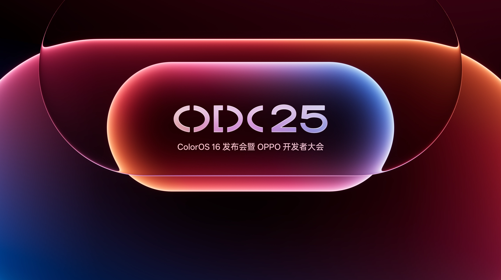
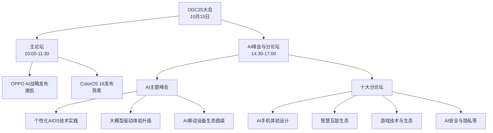

# OPPO开发者大会ODC25与ColorOS 16发布：全面开启AI生态新纪元

**文档版本** ： 1.0    
**最后更新** ： 2025年9月24日  
**文章来源** ： OPPO官方公告、科技媒体报道、开发者文档  
**文章官网** ： https://odc25.oppomobile.com/   
**适用对象** ： 科技行业从业者、OPPO开发者、ColorOS用户、移动生态合作伙伴、技术爱好者   

---

## 1 大会概述

### 1.1 活动背景
OPPO开发者大会（ODC）作为OPPO年度最重要的软件与生态盛会，是展示其技术战略和生态建设成果的关键平台。**2025年OPPO开发者大会（ODC25）** 定于10月15日在深圳国际会展中心20号馆举行，以"流畅本色，AI出色"为主题，全面展现OPPO在AI时代的技术布局和生态愿景。

本次大会的核心焦点将围绕**OPPO AI战略深化**和**ColorOS 16系统发布**两大主线展开，标志着OPPO从硬件制造向"软硬服一体化"生态转型的战略升级。大会将面向全球开发者、合作伙伴及用户，展示OPPO在移动生态领域的最新突破。

### 1.2 时间地点安排
以下是ODC25大会主要活动的时间安排详情：

会议地点设在**深圳国际会展中心20号馆**，线上线下同步进行，全球开发者可通过官网预约观看直播。官方报名通道已于9月22日开启，截止时间为2025年10月13日上午10:00。

## 2 核心内容亮点

### 2.1 ColorOS 16系统革新

#### 2.1.1 液态玻璃设计语言
ColorOS 16引入了全新的"**Liquid Glass UI**"（液态玻璃）设计语言，这一设计理念通过半透明玻璃质感叠层元素和动态流畅动画，创造出富有深度感和未来感的视觉效果。与传统界面设计相比，液态玻璃设计在视觉统一性和交互自然度上有显著提升，为用户带来更加沉浸式的体验。

具体设计特征包括：
- **半透明叠层效果**：应用界面采用类似玻璃的半透明质感，增强视觉层次感
- **动态流畅动画**：系统动效模拟液体流动特性，使交互更加自然连贯
- **统一视觉语言**：在整个系统中贯彻一致的玻璃质感元素，降低用户学习成本

#### 2.1.2 三大核心技术突破
ColorOS 16从底层技术架构进行了重构，通过三大引擎技术攻克安卓系统长期存在的流畅性瓶颈：

**1. 极光引擎**
- 首创安卓无缝架构，打通多模块渲染壁垒
- 实现负一屏、全局搜索等场景的动效无缝衔接
- 将系统级动画能力开放给第三方应用，提升整体交互一致性

**2. 潮汐引擎**
- 行业首发芯片级动态追帧技术，通过软硬芯协同精准调度算力
- 预测渲染压力并动态提升性能，实测重载场景流畅稳定性提升37%，功耗降低13%
- 支持系统久用6年流畅，延长设备生命周期

**3. 繁星编译器**
- 解决安卓代码效率问题，搭建Java与硬件的编译链
- 实现跨级融合编译，使安卓Java核心接口性能提升26%
- 让非顶配机型也能拥有"六个0"流畅体验，推动流畅从旗舰普及至大众机型

### 2.2 AI战略升级

#### 2.2.1 个性化AI系统
OPPO软件工程事业部总裁**唐凯**将在主论坛阐述OPPO的AI战略布局，重点展示如何通过大模型技术打造个性化的AI操作系统。AI功能的升级将体现在多个方面：

- **小布助手记忆能力大幅提升**，实现"断代领先"的记忆体验
- **一键闪记功能**：快速捕捉和整理信息，提高用户效率
- **场景智能感知**：根据用户使用习惯和环境变化，主动提供智能服务

#### 2.2.2 开发者生态赋能
OPPO将AI能力全面向开发者开放，通过一系列措施构建繁荣的AI应用生态：

- **API开放**：提供丰富的AI能力接口，降低开发门槛
- **开发工具支持**：完善配套工具链，提升开发效率
- **竞赛激励**：举办开发者竞赛，鼓励创新应用孵化

### 2.3 首批搭载机型
ColorOS 16将率先在以下旗舰设备上推送：

*表：ColorOS 16首批搭载机型名单*

| **产品系列** | **具体型号** | **预计更新时间** | **特色功能适配** |
|------------|------------|---------------|---------------|
| Find X9系列 | Find X9、Find X9 Pro | 首发搭载 | 全功能AI体验 |
| 一加系列 | 一加15、一加Ace 6 | 首批更新 | 游戏性能优化 |
| OPPO平板 | OPPO Pad 5 | 首批更新 | 跨设备互联 |

## 3 大会参与指南

### 3.1 参会方式
ODC25大会采用线上线下结合形式，为不同需求的参与者提供多种参与途径：

- **线下参与**：深圳国际会展中心20号馆现场参会，与技术专家面对面交流
- **线上直播**：通过官方网站观看实时直播，在线互动提问
- **分论坛预约**：根据专业领域选择参与AI峰会、技术分论坛等专项会议

全球开发者可通过登录"2025 OPPO开发者大会"官网（https://odc25.oppomobile.com）预约参会。

### 3.2 展区与互动体验
大会现场设置**六大展区**和**灵感街区**，全面展示OPPO的技术成果和生态应用：

1. **AI技术展区**：体验最新的AI手机应用场景
2. **ColorOS 16体验区**：亲手感受新系统的流畅特性
3. **游戏生态区**：展示HyperBoost稳帧技术等游戏优化成果
4. **智慧互联区**：演示OPPO设备间的无缝协作体验
5. **开发者成果展**：展示优秀开发者应用的创新案例
6. **灵感街区**：提供与OPPO技术专家交流的开放空间

## 4 生态影响与行业意义

### 4.1 技术趋势引领
ODC25的召开不仅展示了OPPO的技术实力，也反映了整个移动生态系统的发展方向。随着AI技术的成熟，移动操作系统正朝着**更智能、更个性化**的方向演进。ColorOS 16的"液态玻璃"设计理念和三大流畅技术引擎，有望重新定义安卓系统的用户体验标准。

### 4.2 开发者生态价值
在AI时代，开发者生态的重要性日益凸显。ODC25为开发者提供了**关键的交流平台**和**技术赋能机会**，通过深度合作共同构建更具创新力的应用生态。只有建立强大的开发者生态系统，才能更好地推动AI技术在移动设备上的创新应用。

### 4.3 市场前景展望
随着ColorOS 16的发布和AI战略的深化，OPPO有望在2025年下半年进一步提升其市场竞争力。首批搭载ColorOS 16的Find X9系列等旗舰产品，将直接与业界主流旗舰机型竞争，尤其是在**影像体验、AI功能和系统流畅度**等关键领域。

## 总结

OPPO开发者大会ODC25是OPPO在AI时代的重要战略发布会，标志着其从手机制造商向"软硬服一体化"生态企业的转型迈出关键一步。通过ColorOS 16的系统级创新和AI生态的全面开放，OPPO正构建一个更加开放、共生、共荣的移动生态系统。此次大会不仅为开发者提供了技术交流和合作的机会，也为最终用户带来了更智能、更流畅的数字生活体验愿景。

对于全球开发者和技术爱好者而言，ODC25是了解移动生态未来趋势的重要窗口，值得密切关注大会期间发布的技术细节和生态政策。