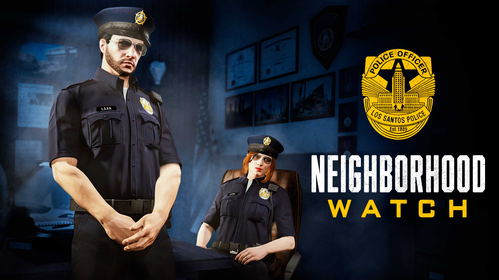
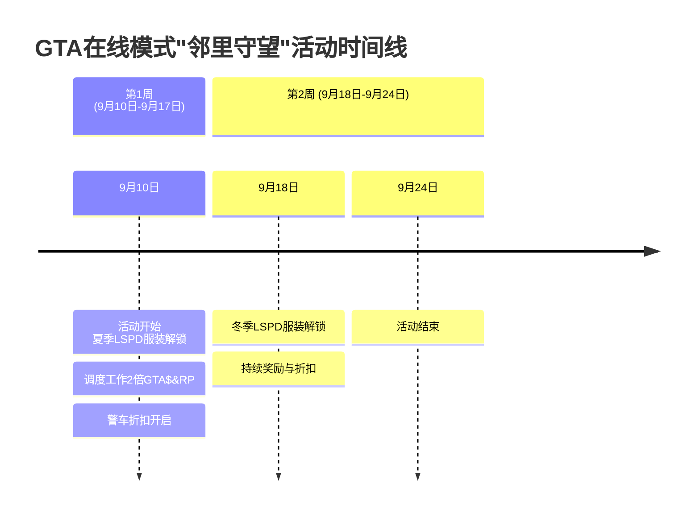

# GTA在线模式"邻里守望"活动完整指南

## 1 活动概述

"邻里守望"是GTA在线模式于2025年9月推出的一项**限时特别活动**，为期两周（9月10日至9月24日）。该活动以**执法角色体验**为主题，为玩家提供了独特的机会，可以暂时脱离犯罪生涯，扮演洛圣都的执法者，维护城市治安。活动名称"邻里守望"源自现实社区中居民共同协作预防犯罪的概念，在GTA在线模式中则演变为一项让玩家参与虚拟执法行动的趣味企划。

本次活动是Rockstar Games为丰富GTA在线模式游戏体验而设计的**主题周活动**之一，延续了游戏定期更新的一贯传统。活动围绕与文森特·埃芬伯格特工合作完成的"调度工作"任务展开，玩家通过参与这些执法行动，可以解锁专属的警察服装和丰厚游戏奖励。这种临时性的角色转换为GTA在线模式的开放世界体验增添了新的维度，让玩家能够从不同视角探索洛圣都。

与GTA在线模式传统的犯罪导向活动不同，"邻里守望"活动鼓励玩家**维护法律而非破坏法律**，提供了新鲜的游戏体验。活动设计充分考虑了多样性和可玩性，既有限定服装奖励，也有双倍游戏币和RP奖励，以及专属载具折扣，吸引了新老玩家积极参与。这种主题性强的限时活动有助于保持游戏的新鲜感和玩家社区的活跃度。

*"邻里守望"是GTA在线模式于2025年9月推出的一项限时特别活动，为期两周（9月10日至9月24日）。*

## 2 活动内容与玩法

### 2.1 核心任务：调度工作

"邻里守望"活动的核心内容是完成**调度工作**任务。这些任务是执法导向的合作任务，需要玩家与Cluckin' Bell农场突袭任务中的特工文森特·埃芬伯格合作完成。调度工作任务模拟了警察日常巡逻中可能遇到的各种突发事件，为玩家提供了沉浸式的执法体验。

参与调度工作任务需要满足以下前提条件：

- **完成前置任务**：必须首先完成"Slush Fund"设置任务（Cluckin' Bell农场突袭的一部分）
- **拥有警用载具**：需要拥有一辆警车，可通过Warstock Cache & Carry购买执法载具
- **身份要求**：在任务期间不能担任CEO、VIP或摩托帮首领身份

*表：调度工作任务基本信息*

| **任务类型** | **任务目标** | **难度级别** | **大致完成时间** |
|------------|------------|------------|---------------|
| 巡逻响应 | 响应呼叫、处理突发事件 | 中等 | 10-15分钟 |
| 追捕行动 | 追捕嫌疑车辆、制服嫌疑人 | 高 | 15-20分钟 |
| 现场处置 | 保护现场、收集证据 | 低-中等 | 8-12分钟 |

### 2.2 活动时间线与进度系统

"邻里守望"活动采用**分周进度系统**，为期两周的活动期间各有不同的重点奖励和内容。以下是活动的时间线概览：

活动采用**周常挑战**模式，玩家需要在每周完成特定数量的调度工作任务来解锁当周的主要奖励。第一周需要完成三个调度工作任务来解锁夏季LSPD警官服装；第二周则只需登录游戏即可获得冬季公园管理员服装（领带版）。这种设计既为硬核玩家提供了挑战目标，也为休闲玩家提供了易于获取的奖励。

### 2.3 额外活动内容

除了核心的调度工作任务外，"邻里守望"活动还包含多项**额外活动内容**，为玩家提供更多获得奖励的机会：

- **双倍奖励**：活动期间，完成调度工作和野生动物摄影任务可获得双倍GTA游戏币和RP奖励，GTA+会员更可享受四倍奖励
- **特别玩法**："The Vespucci Job (Remix)"和"Community Combat Series"也提供双倍GTA游戏币和RP奖励
- **顶级抢劫案**：活动期间的顶级抢劫案是"帮派抢劫"，需要玩家穿上NOOSE服装潜入Mission Row警察局，与活动主题高度契合

## 3 活动奖励详解

### 3.1 独家服装奖励

"邻里守望"活动的主要亮点是一系列**独家执法主题服装**，这些服装通常无法通过常规游戏方式获得，具有很高的收藏价值。服装奖励分为几个类别，每种都有独特的获取方式：

**LSPD警官服装**是活动的核心奖励，包括：
- **夏季LSPD警官服装**：通过完成第一周三个调度工作任务解锁
- **冬季LSPD警官服装**：通过第二周登录游戏自动解锁（9月18日-24日）

**专业执法服装**则需通过特定方式获取：
- **夏季公园管理员服装**：通过购买绝致公园巡警车辆解锁
- **夏季公路巡逻队服装**：通过购买西部警用摩托车解锁
- **冬季公园管理员服装（领带版）**：在活动第二周登录游戏即可获得

这些服装设计精细，还原了洛圣都各类执法人员的真实着装，满足了玩家角色扮演的需求。服装一旦解锁，将永久添加到玩家的衣柜中，可以在任何场合穿着。

### 3.2 载具折扣与优惠

活动期间，Warstock Cache & Carry提供了多款**执法载具折扣**，让玩家能够以优惠价格扩充自己的警用载具收藏。折扣幅度从15%到35%不等，涵盖了从基础巡逻车到专业拦截车的多种车型。

*表：邻里守望活动载具折扣详情*

| **载具名称** | **原价（GTA$）** | **折扣后价格（GTA$）** | **折扣幅度** | **类别** |
|------------|----------------|---------------------|------------|---------|
| 布拉瓦多多拉多巡洋舰 | 5,005,000 | 3,253,250 | 35% | 巡逻车 |
| 布拉瓦多角斗士拦截者 | 5,420,000 | 3,523,000 | 35% | 拦截车 |
| 绝致公园巡警 | 2,980,000 | 1,937,000 | 35% | 特种车辆 |
| 威皮统治者FX拦截器 | 4,950,000 | 3,217,500 | 35% | 拦截车 |
| 边境巡逻犬 | 5,125,000 | 3,843,750 | 25% | 多功能车 |
| Invetero Coquette D10追逐赛 | 5,620,000 | 4,215,000 | 25% | 高性能拦截车 |
| 西部警用自行车 | 4,960,000 | 4,216,000 | 15% | 摩托车 |

此外，普通玩家可以以折扣价购买Canis Terminus Patrol，而GTA+会员则可以通过Vinewood汽车俱乐部展厅免费获得这款车辆。这些载具折扣不仅与活动主题相契合，也为玩家提供了实用的执法工具，增强了活动体验的真实感。

### 3.3 游戏币与RP奖励

除了实物奖励外，活动还提供丰富的**虚拟资源奖励**：

- **完成奖励**：成功完成三个调度工作任务即可获得100,000 GTA游戏币的一次性奖励
- **持续收益**：活动期间所有调度工作任务提供双倍GTA游戏币和RP奖励（GTA+会员享受四倍奖励）
- **附加收益**：野生动物摄影任务同样享受双倍GTA游戏币和RP奖励

这些奖励机制确保了玩家在参与活动的同时能够获得实质性的游戏进展，无论是经济收益还是角色等级提升。

## 4 活动参与指南

### 4.1 参与前提与准备

要参与"邻里守望"活动并获取全部奖励，玩家需要满足一定的**前置条件**并做好相应准备：

**任务解锁要求**：
- 完成Cluckin' Bell农场突袭的"Slush Fund"设置任务
- 解锁与特工文森特·埃芬伯格的合作权限

**载具准备**：
- 通过Warstock Cache &购买至少一辆执法载具（活动期间有折扣）
- 建议根据预算选择适合的警用车辆，如绝致公园巡警（折扣后1,937,000 GTA$）

**身份状态调整**：
- 在开始调度工作前，确保不处于CEO、VIP或摩托帮首领状态
- 建议邀请好友组成团队，以提高任务完成效率和趣味性

### 4.2 任务流程与技巧

完成调度工作任务需要一定的**策略和技巧**，以下是一些实用建议：

**任务接取与执行**：
1. 拥有警用载具后，文森特会主动联系玩家提供调度工作任务
2. 接到任务后，前往地图标记的目的地开始任务
3. 根据任务类型采取相应策略：追捕任务强调驾驶技术，现场处置任务则需要谨慎接近

**效率优化技巧**：
- 组建4人团队可以更高效地完成多数调度工作任务
- 优先购买性能优秀的警用载具（如威皮统治者FX拦截器）以应对高速追捕
- 利用活动期间的双倍RP奖励快速提升角色等级

**常见问题解决**：
- 若文森特未来电，尝试切换战局或重新启动游戏
- 如遇奖励未发放问题，检查Rockstar支持页面或等待系统自动修复（Rockstar已确认会向合格玩家补发奖励）

### 4.3 最大化收益策略

要充分利用"邻里守望"活动**最大化个人收益**，可以考虑以下策略：

- **优先完成周常挑战**：在活动第一周尽快完成三个调度工作任务，确保解锁夏季LSPD服装
- **结合多项奖励**：在享受载具折扣的同时，利用双倍游戏币和RP奖励快速收回成本
- **规划购买顺序**：先购买必需的警用载具，再利用任务收益扩展收藏
- **利用GTA+特权**：如果已是GTA+会员，充分利用四倍奖励和独家福利如免费载具

## 5 活动总结

GTA在线模式的"邻里守望"活动成功为玩家提供了**新鲜的执法体验**，暂时摆脱了传统的犯罪角色，从维护法律的角度探索洛圣都。活动设计体现了Rockstar Games对游戏内容多样性的承诺，通过限定奖励和丰厚回报保持了玩家社区的高度参与。

活动的主要亮点包括：

- **主题新颖**：执法者角色为GTA在线模式带来了全新的游戏视角
- **奖励丰富**：多种独家服装、载具折扣和双倍奖励提供了充足的参与动力
- **可玩性高**：调度工作任务设计巧妙，与活动主题高度契合
- **包容性强**：既有面向硬核玩家的挑战，也有适合休闲玩家的简单登录奖励

对于尚未参与活动的玩家，建议抓紧活动最后时间（截至9月24日）完成至少三个调度工作任务，以解锁夏季LSPD警官服装这一独家奖励。同时，不妨利用载具折扣扩充自己的收藏，即使活动结束后这些载具仍能用于日常游戏。

而对于已经参与活动的玩家，建议完整体验所有类型的调度工作任务，并充分利用双倍奖励期积累游戏资源和财富。即使活动结束后，获得的警用服装和载具也将成为玩家GTA在线模式角色衣柜和车库中的永久收藏，为未来的游戏体验增添更多角色扮演可能性。

"邻里守望"活动再次证明了GTA在线模式作为**持续演进的开放在线世界**的活力，通过定期主题更新保持游戏的新鲜感和吸引力。这种限时活动模式不仅丰富了游戏内容，也为玩家提供了持续回归洛圣都的充分理由。