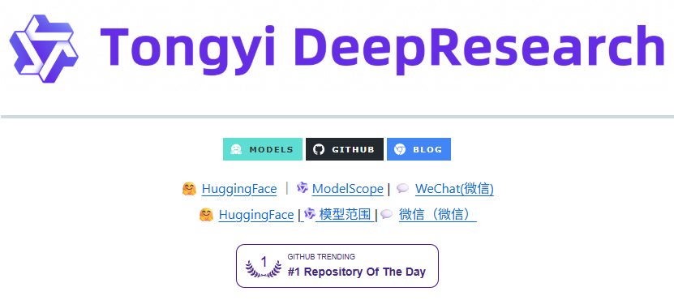
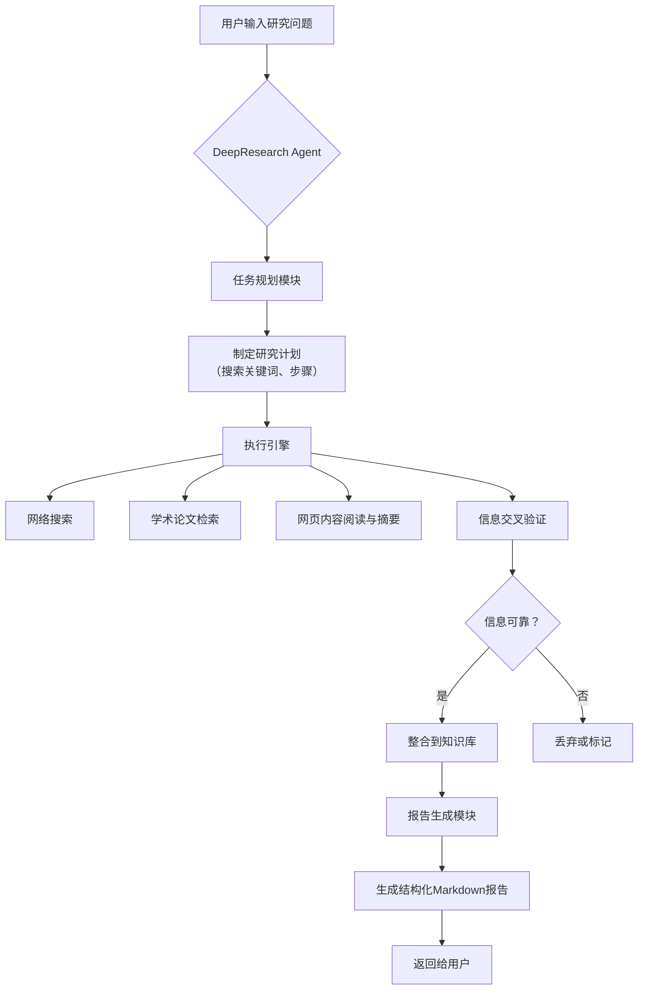

# Tongyi DeepResearch - 阿里巴巴通义实验室下一代AI搜索与研究智能体

**文档版本**：1.0  
**最后更新**：2025年9月23日  
**项目来源**：[Alibaba-NLP/DeepResearch](https://github.com/Alibaba-NLP/DeepResearch)  
**Tongyi技术博客**：[introducing-tongyi-deep-research](https://tongyi-agent.github.io/blog/introducing-tongyi-deep-research/)  
**适用对象**：AI研究员、大模型工程师、产品经理、技术决策者

---


*DeepResearch*

## 一、系统概述

Tongyi DeepResearch 是由阿里巴巴通义实验室（Tongyi Lab）推出的一个开源项目，旨在构建下一代AI驱动的**研究智能体（Research Agent）**。它不仅仅是一个信息检索工具，更是一个能够**自主规划、执行多步研究、批判性评估信息并生成结构化报告**的智能系统。

其核心目标是解决当前大模型在复杂、开放式研究任务中面临的挑战，如幻觉（Hallucination）、信息过时、缺乏深度推理和批判性思维等。

### 1.1 核心价值与定位

*   **超越传统搜索**：从“关键词匹配”升级为“意图理解与任务规划”。
*   **深度研究能力**：能够像人类研究员一样，通过多轮搜索、阅读、分析、验证来构建知识。
*   **报告生成专家**：最终输出结构清晰、引用规范、内容可靠的Markdown报告。
*   **开源可复用**：提供模块化设计和API，便于社区二次开发和集成。

### 1.2 系统架构与工作流



---

## 二、核心功能与特性详解

### 2.1 智能任务规划 (Intelligent Planning)

DeepResearch 的核心突破在于其**规划能力**。它不会立即开始搜索，而是先“思考”如何解决用户的问题。

```python  showLineNumbers=true
# 伪代码示例：规划模块的核心逻辑
def plan_research(query: str) -> List[ResearchStep]:
    """
    根据用户查询，生成一个研究步骤列表。
    """
    # Step 1: 理解问题，分解子任务
    decomposition_prompt = f"""
    You are a research assistant. Break down the following question into a series of concrete, actionable research steps.
    Question: {query}
    Output format: A numbered list of steps.
    """

    plan_text = llm.generate(decomposition_prompt)
    steps = parse_steps(plan_text) # 解析成结构化步骤

    # Step 2: 为每个步骤生成具体的搜索查询
    for step in steps:
        search_query_prompt = f"""
        Given this research step: "{step.description}"
        Generate 1-3 precise search queries to find the most relevant information.
        """
        step.search_queries = llm.generate(search_query_prompt).split('\n')

    return steps
```

**代码切片分析**：
*   该伪代码展示了规划模块的两阶段过程。
*   首先，通过大模型（`llm.generate`）将一个宽泛的问题分解为具体的、可执行的步骤（`ResearchStep`）。
*   然后，再为每个步骤生成精确的搜索关键词，确保后续的搜索行动是目标明确的。
*   这种“先规划，后执行”的模式是DeepResearch区别于普通AI搜索的关键。

### 2.2 多源信息检索与批判性阅读

系统能够从**通用网络**和**学术论文库**等多个来源获取信息，并对信息进行批判性评估。

#### 2.2.1 信息检索来源

| 来源类型 | 描述 | 适用场景 |
| :--- | :--- | :--- |
| **通用网络搜索** | 通过搜索引擎API获取最新、广泛的网页信息。 | 时事、公司动态、产品信息、非学术观点。 |
| **学术论文检索** | 集成如arXiv, Semantic Scholar等API，获取高质量、经过同行评审的研究论文。 | 科学研究、技术原理、理论基础、历史数据。 |
| **内部知识库** (可选) | 可接入企业或私有知识库。 | 专有信息、内部报告、敏感数据。 |

#### 2.2.2 批判性阅读与验证

```python  showLineNumbers=true
# 伪代码示例：信息验证模块
def verify_claim(claim: str, sources: List[Document]) -> VerificationResult:
    """
    对一个声明进行验证，判断其可靠性。
    """
    verification_prompt = f"""
    Claim: {claim}
    Supporting Sources:
    {format_sources(sources)}

    Task: Critically evaluate the claim based on the provided sources.
    - Is the claim directly supported by the sources?
    - Are the sources reliable and authoritative?
    - Are there any contradictions between sources?
    Output: A JSON object with keys: "is_supported", "confidence_score", "reasoning".
    """

    result_json = llm.generate(verification_prompt, json_mode=True)
    return VerificationResult(**result_json)
```

**代码切片分析**：
*   该模块接收一个具体的“声明”（`claim`）和一组支持它的文档（`sources`）。
*   通过向大模型发送一个结构化的提示（`verification_prompt`），要求其进行批判性评估。
*   输出是一个结构化的JSON对象，包含该声明是否被支持、置信度分数和推理理由。
*   这个过程有效减少了AI幻觉，确保最终报告中的每一个事实都有据可查。

### 2.3 结构化报告生成

DeepResearch 的最终输出不是零散的信息碎片，而是一份**高质量的Markdown报告**，其结构通常包括：

*   **摘要 (Abstract)**：对研究问题和核心发现的简要总结。
*   **背景 (Background)**：问题的上下文和相关基础知识。
*   **方法与过程 (Methodology)**：系统执行了哪些研究步骤。
*   **核心发现 (Key Findings)**：分点列出最重要的发现，并附上信息来源。
*   **结论 (Conclusion)**：对研究问题的最终回答和未来展望。
*   **参考文献 (References)**：所有引用的网页和论文链接。

---

## 三、快速入门与部署

### 3.1 环境准备

在开始使用前，请确保您的环境满足以下要求：

| 依赖项 | 版本要求 | 安装命令 |
| :--- | :--- | :--- |
| **Python** | >= 3.9 | [官网下载](https://www.python.org/downloads/) |
| **Git** | 最新版 | [官网下载](https://git-scm.com/downloads) |
| **OpenAI API Key** 或 **通义千问 API Key** | - | 从对应平台获取 |

### 3.2 安装与运行

1.  **克隆仓库**：
    ```bash  showLineNumbers=true
    git clone https://github.com/Alibaba-NLP/DeepResearch.git
    cd DeepResearch
    ```

2.  **安装依赖**：
    ```bash  showLineNumbers=true
    pip install -r requirements.txt
    ```

3.  **配置API密钥**：
    创建一个 `.env` 文件，并填入您的API密钥。
    ```bash  showLineNumbers=true
    # .env 文件内容
    OPENAI_API_KEY=your_openai_key_here
    # 或者
    DASHSCOPE_API_KEY=your_tongyi_qianwen_key_here
    ```

4.  **运行示例**：
    项目通常会提供一个简单的命令行接口（CLI）。
    ```bash  showLineNumbers=true
    python main.py --query "请比较 Llama 3 和 Qwen 2.5 的主要技术差异和性能表现。"
    ```

### 3.3 API 集成

DeepResearch 设计为模块化，可以轻松集成到您的应用中。

```python  showLineNumbers=true
from deepresearch.agent import DeepResearchAgent

# 初始化Agent
agent = DeepResearchAgent(
    llm_provider="openai", # 或 "dashscope"
    model_name="gpt-4-turbo" # 或 "qwen-max"
)

# 执行研究
report = agent.run("特斯拉最新的自动驾驶技术FSD V12有哪些突破？")

# 输出报告
print(report.markdown)
# 保存报告
with open("research_report.md", "w") as f:
    f.write(report.markdown)
```

---

## 四、应用场景与案例

DeepResearch 的能力使其在多个领域具有广阔的应用前景：

### 4.1 学术研究

*   **文献综述**：自动收集、阅读、总结某一领域的最新研究进展。
*   **假设验证**：帮助研究人员快速验证一个新想法的可行性和已有研究基础。

### 4.2 商业分析

*   **竞品分析**：深入研究竞争对手的产品、市场策略和财务表现。
*   **市场调研**：分析特定市场的规模、趋势、用户画像和潜在机会。

### 4.3 技术决策

*   **技术选型**：比较不同技术栈（如框架、数据库、云服务）的优缺点。
*   **风险评估**：评估采用某项新技术可能带来的安全、合规或性能风险。

---

## 五、总结与未来展望

DeepResearch 代表了AI搜索和研究领域的一个重要里程碑。它通过将**大模型的推理能力**与**互联网的海量信息**相结合，创造了一个能够进行深度、可靠、自动化研究的智能体。

**未来发展方向**可能包括：

*   **多模态研究**：支持分析图像、视频、图表等非文本信息。
*   **实时数据接入**：集成股票、天气、新闻等实时数据流。
*   **个性化研究**：根据用户的偏好和历史研究记录，提供定制化的研究路径。
*   **协作研究**：允许多个AI Agent或人类与AI协作，共同完成复杂研究项目。

通过开源，DeepResearch 不仅为个人和企业提供了强大的研究工具，也为整个AI社区探索“AI for Science”和“AI for Business”的边界提供了宝贵的基础设施。