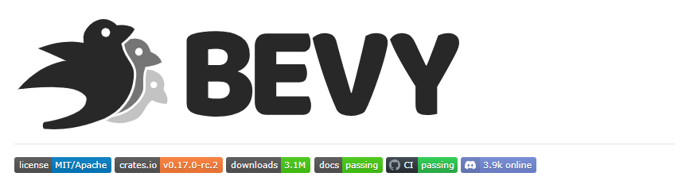
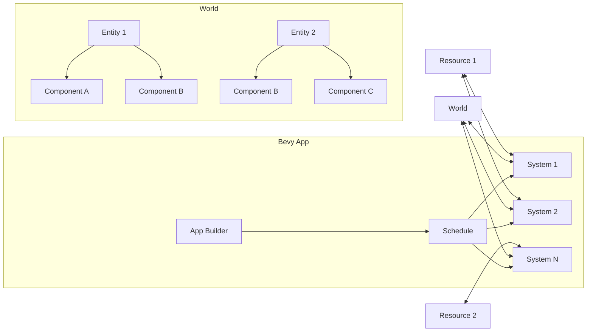

# Bevy Engine 一个用 Rust 构建的令人耳目一新的简单数据驱动游戏引擎

**文档版本**：1.0  
**最后更新**：2025年9月23日  
**项目来源**：[bevyengine/bevy](https://github.com/bevyengine/bevy)  
**适用对象**：游戏开发者、Rust工程师、技术美术、引擎架构师、独立游戏制作人

---


*bevy*

## 一、系统概述

Bevy 是一个用 **Rust 语言**编写的**免费、开源、现代化的游戏引擎**。它以“数据驱动”为核心设计理念，采用 **ECS（实体-组件-系统）架构**，旨在为开发者提供高性能、模块化、易于学习和使用的开发体验。Bevy 的目标是成为一款“全能型”引擎，适用于从 2D 移动游戏到 3D AAA 大作的广泛场景。

### 1.1 核心价值与设计理念

*   **数据驱动 (Data-Driven)**：游戏逻辑围绕数据（组件）而非对象行为构建，提高代码的可组合性和可维护性。
*   **性能优先 (Performance First)**：利用 Rust 的零成本抽象和 ECS 的数据局部性，实现接近原生的运行效率。
*   **模块化设计 (Modular)**：引擎由松散耦合的 Crate（Rust 包）组成，开发者可自由选择所需模块，避免臃肿。
*   **易学易用 (Accessible)**：提供清晰的 API 和详尽的文档，降低学习曲线，尤其适合 Rust 新手。
*   **社区驱动 (Community Driven)**：拥有活跃的开源社区，持续贡献新功能、插件和教程。

### 1.2 系统架构图



**图解说明**：
*   **`App`**: 应用程序的入口点，用于注册系统、资源和插件。
*   **`Schedule`**: 调度器，负责按顺序或并行执行注册的系统（Systems）。
*   **`System`**: 包含具体游戏逻辑的函数，它们从 `World` 中读取或写入数据。
*   **`World`**: 包含所有游戏数据的核心容器。
*   **`Entity`**: 一个唯一的、空的标识符，代表游戏中的一个“东西”（如玩家、敌人、子弹）。
*   **`Component`**: 附加到 `Entity` 上的数据片段（如 `Position`, `Velocity`, `Sprite`）。
*   **`Resource`**: 全局单例数据，可供所有系统访问（如 `Time`, `Input`, `AssetServer`）。

---

## 二、核心概念与功能详解

### 2.1 实体-组件-系统 (ECS)

ECS 是 Bevy 的灵魂。它将游戏对象解构为三个独立的部分：

#### 2.1.1 核心概念定义

| 概念 | 定义 | 特点 |
| :--- | :--- | :--- |
| **实体 (Entity)** | 一个唯一的、轻量级的ID。它本身不包含任何数据或行为。 | 是组件的容器。 |
| **组件 (Component)** | 一个普通的 Rust 数据结构 (`struct`)，用于存储特定类型的数据。 | 通过 `#[derive(Component)]` 标记。 |
| **系统 (System)** | 一个普通的 Rust 函数，它接收对 `World` 中数据（组件、资源）的引用，并执行逻辑。 | 通过 `App.add_systems()` 注册。 |

#### 2.1.2 ECS 代码切片分析

```rust  showLineNumbers=true
use bevy::prelude::*;

// 定义组件
#[derive(Component)]
struct Position {
    x: f32,
    y: f32,
}

#[derive(Component)]
struct Velocity {
    x: f32,
    y: f32,
}

// 定义一个系统：移动系统
fn movement_system(
    time: Res<Time>, // 从World中获取全局资源 `Time`
    mut query: Query<(&mut Position, &Velocity)>, // 查询所有同时拥有 `Position` 和 `Velocity` 组件的实体
) {
    for (mut pos, vel) in &mut query {
        // 更新位置 = 速度 * 时间
        pos.x += vel.x * time.delta_seconds();
        pos.y += vel.y * time.delta_seconds();
    }
}

// 在App中注册系统
fn main() {
    App::new()
        .add_plugins(DefaultPlugins) // 添加默认插件集（窗口、渲染、输入等）
        .add_systems(Update, movement_system) // 在 `Update` 阶段运行移动系统
        .run();
}
```

**代码切片分析**：
1.  **组件定义**：`Position` 和 `Velocity` 是简单的数据结构，仅存储坐标和速度值。
2.  **系统定义**：`movement_system` 是一个函数，它通过参数声明了它需要的数据：
    *   `Res<Time>`：只读访问全局的 `Time` 资源。
    *   `Query<(&mut Position, &Velocity)>`：查询所有同时拥有 `Position`（可写）和 `Velocity`（只读）组件的实体。
3.  **系统执行**：在 `for` 循环中，系统遍历所有匹配的实体，并根据其速度和经过的时间更新其位置。
4.  **App 注册**：在 `main` 函数中，通过 `App.add_systems(Update, movement_system)` 将系统注册到引擎的 `Update` 阶段。

这种设计使得逻辑（系统）与数据（组件）完全分离，系统可以高效地批量处理具有相同组件组合的实体，从而获得极高的性能。

### 2.2 插件系统 (Plugins)

Bevy 的功能通过插件进行组织和扩展。插件是一个实现了 `Plugin` trait 的结构体，它可以向 `App` 中添加系统、资源、事件等。

#### 2.2.1 插件代码切片分析

```rust  showLineNumbers=true
use bevy::prelude::*;

// 定义一个自定义插件
struct MyGamePlugin;

impl Plugin for MyGamePlugin {
    fn build(&self, app: &mut App) {
        // 在插件中注册资源、系统、事件等
        app
            .init_resource::<MyGameState>() // 初始化一个自定义资源
            .add_systems(Startup, setup) // 在启动时运行 `setup` 系统
            .add_systems(Update, gameplay_system); // 在更新时运行 `gameplay_system`
    }
}

// 使用插件
fn main() {
    App::new()
        .add_plugins(DefaultPlugins) // 添加Bevy默认插件
        .add_plugins(MyGamePlugin) // 添加我们自己的插件
        .run();
}
```

**代码切片分析**：
*   通过实现 `Plugin` trait 的 `build` 方法，开发者可以在一个地方集中管理一组相关的功能。
*   `DefaultPlugins` 是一个预定义的插件组，包含了构建一个完整游戏所需的核心功能（渲染、输入、窗口等）。
*   这种模块化设计允许开发者按需加载功能，保持项目的轻量化。

### 2.3 资源与事件 (Resources & Events)

除了组件，Bevy 还提供了两种重要的全局数据管理方式。

#### 2.3.1 资源 (Resources)

资源是全局唯一的单例数据。任何系统都可以访问或修改它。

```rust  showLineNumbers=true
// 定义一个资源
#[derive(Resource, Default)]
struct Score {
    value: u32,
}

// 在系统中使用资源
fn score_system(
    mut score: ResMut<Score>, // 可变访问
    query: Query<&PlayerTag>, // 假设有一个查询玩家的系统
) {
    for _ in &query {
        score.value += 1; // 为每个玩家加分
    }
}
```

#### 2.3.2 事件 (Events)

事件用于在系统之间进行松耦合的通信。一个系统可以发送事件，另一个或多个系统可以接收并处理该事件。

```rust  showLineNumbers=true
// 定义一个事件
#[derive(Event)]
struct PlayerDiedEvent {
    player_id: Entity,
}

// 发送事件的系统
fn combat_system(
    mut events: EventWriter<PlayerDiedEvent>, // 事件写入器
    // ... 战斗逻辑 ...
) {
    // 当玩家死亡时
    events.send(PlayerDiedEvent { player_id: some_entity });
}

// 接收事件的系统
fn death_handler_system(
    mut events: EventReader<PlayerDiedEvent>, // 事件读取器
) {
    for event in events.read() {
        println!("Player {:?} has died!", event.player_id);
        // 处理玩家死亡，如播放音效、显示UI等
    }
}
```

---

## 三、快速入门与项目结构

### 3.1 环境准备

在开始前，请确保您的开发环境已配置好：

| 依赖项 | 版本要求 | 安装命令/说明 |
| :--- | :--- | :--- |
| **Rust Toolchain** | 最新版 | `curl --proto '=https' --tlsv1.2 -sSf https://sh.rustup.rs | sh` |
| **Cargo** | (随Rust安装) | Rust 的包管理器和构建工具。 |
| **Git** | 最新版 | 用于克隆项目和管理依赖。 |

### 3.2 创建第一个 Bevy 项目

1.  **创建新项目**：
    ```bash  showLineNumbers=true
    cargo new my_bevy_game
    cd my_bevy_game
    ```

2.  **添加 Bevy 依赖**：
    编辑 `Cargo.toml` 文件，添加 Bevy 依赖。
    ```toml
    [dependencies]
    bevy = "0.14" # 请替换为最新稳定版
    ```

3.  **编写 Hello World**：
    替换 `src/main.rs` 的内容。
    ```rust  showLineNumbers=true
    use bevy::prelude::*;

    fn main() {
        App::new()
            .add_plugins(DefaultPlugins)
            .add_systems(Startup, setup)
            .run();
    }

    fn setup(mut commands: Commands) {
        // 生成一个带有相机和精灵的实体
        commands.spawn((
            SpriteBundle {
                sprite: Sprite {
                    color: Color::rgb(0.25, 0.25, 0.75),
                    custom_size: Some(Vec2::new(100.0, 100.0)),
                    ..default()
                },
                ..default()
            },
        ));
        commands.spawn(Camera2dBundle::default());
    }
    ```

4.  **运行项目**：
    ```bash  showLineNumbers=true
    cargo run
    ```
    您将看到一个显示蓝色方块的窗口。

### 3.3 典型项目结构

一个成熟的 Bevy 项目通常会采用模块化组织：

``` showLineNumbers=true
my_bevy_game/
├── Cargo.toml
├── src/
│   ├── main.rs          # 应用入口
│   ├── components.rs     # 所有组件定义
│   ├── systems/         # 所有系统
│   │   ├── player.rs
│   │   ├── enemy.rs
│   │   └── physics.rs
│   ├── resources.rs     # 所有资源定义
│   └── plugins/         # 自定义插件
│       ├── player_plugin.rs
│       └── audio_plugin.rs
└── assets/              # 游戏资源（图片、音频、场景等）
    ├── sprites/
    └── sounds/
```

---

## 四、应用场景与生态

### 4.1 适用场景

Bevy 凭借其灵活性和性能，适用于多种游戏类型：

*   **2D 游戏**：平台跳跃、RPG、策略、休闲游戏。
*   **3D 游戏**：第一/第三人称射击、模拟、冒险游戏。
*   **模拟与可视化**：数据可视化、物理模拟、教育软件。
*   **原型开发**：快速验证游戏玩法和概念。

### 4.2 生态系统与插件

Bevy 拥有一个蓬勃发展的插件生态系统，极大地扩展了引擎的功能：

| 插件名称 | 功能描述 | 仓库链接 |
| :--- | :--- | :--- |
| **bevy_ecs_tilemap** | 高性能 2D 瓦片地图渲染。 | [GitHub](https://github.com/StarArawn/bevy_ecs_tilemap) |
| **bevy_rapier** | 集成 Rapier 物理引擎，提供 2D/3D 刚体动力学。 | [GitHub](https://github.com/dimforge/bevy_rapier) |
| **bevy_mod_picking** | 提供鼠标拾取（点击、悬停）3D/2D 对象的功能。 | [GitHub](https://github.com/aevyrie/bevy_mod_picking) |
| **bevy-inspector-egui** | 在游戏中集成一个强大的调试和数据检查器。 | [GitHub](https://github.com/jakobhellermann/bevy-inspector-egui) |

---

## 五、总结与未来展望

Bevy Engine 代表了游戏引擎设计的新范式。它将 Rust 语言的安全性和性能优势与 ECS 架构的灵活性和高效性完美结合，为现代游戏开发提供了一个强大而优雅的解决方案。

**未来发展方向**：
*   **完善编辑器**：官方正在积极开发 Bevy Editor，将提供可视化场景编辑、资源管理等功能。
*   **提升性能**：持续优化 ECS 调度器、渲染管线和内存管理。
*   **增强功能**：增加对 VR/AR、网络多人游戏、更高级动画系统的原生支持。
*   **扩大社区**：吸引更多开发者和艺术家加入，共同构建更丰富的生态。

对于寻求高性能、现代化工作流和强大社区支持的开发者来说，Bevy 是一个极具吸引力的选择。它不仅是一个游戏引擎，更是一个充满活力和创新的技术平台。