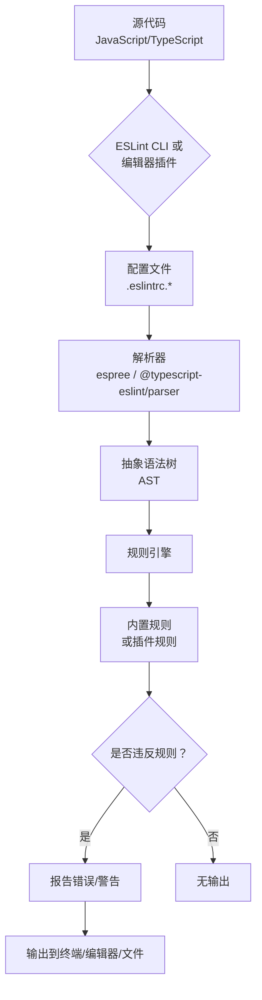

# ESLint — 可插拔的 JavaScript 与 TypeScript 代码检查工具

**文档版本**：1.0  
**最后更新**：2025年9月23日  
**项目来源**：[eslint/eslint](https://github.com/eslint/eslint)  
**官方网站**：[https://eslint.org/](https://eslint.org/)  
**适用对象**：前端工程师、全栈开发者、JavaScript/TypeScript 工程师、DevOps、技术主管

---

## 一、系统概述

ESLint 是一个**开源的、可插拔的静态代码分析工具**，主要用于识别和报告 JavaScript 和 TypeScript 代码中的模式，其核心目标是**保证代码的一致性和避免错误**。它不是强制性的代码风格工具，而是一个高度可配置的平台，允许团队根据自身需求定义和执行代码规范。

### 1.1 核心价值与设计理念

*   **可插拔 (Pluggable)**：ESLint 的核心非常轻量，所有规则都是插件。您可以禁用任何内置规则，并通过插件引入无数社区规则。
*   **可配置 (Configurable)**：提供细粒度的配置，可以针对项目、文件甚至代码行进行规则的启用、禁用或调整。
*   **现代化 (Modern)**：原生支持最新的 ECMAScript 标准（如 ES2025）和 JSX 语法，并通过 `@typescript-eslint/parser` 完美支持 TypeScript。
*   **集成友好 (Integratable)**：深度集成到所有主流编辑器（VS Code, WebStorm, Sublime 等）和构建工具（Webpack, Vite, Gulp 等），并可作为 CI/CD 流水线的一部分。
*   **社区驱动 (Community-Driven)**：拥有庞大的生态系统，包含数千条规则和数百个插件，满足各种框架（React, Vue, Angular）和库的需求。

### 1.2 系统架构与工作流



**图解说明**：
1.  **输入**：ESLint 接收 JavaScript 或 TypeScript 源代码文件作为输入。
2.  **配置**：读取项目根目录下的配置文件（如 `.eslintrc.js`），确定使用哪些规则、解析器和插件。
3.  **解析**：使用配置的解析器（默认为 `espree`）将源代码转换为抽象语法树（AST）。
4.  **检查**：规则引擎遍历 AST，应用所有启用的规则进行检查。
5.  **输出**：将发现的任何问题（错误或警告）以人类可读的格式输出到控制台、编辑器界面或文件中。

---

## 二、核心功能与配置详解

### 2.1 安装与初始化

ESLint 通常作为项目的开发依赖进行安装。

#### 2.1.1 安装步骤

```bash showLineNumbers=true
# 1. 初始化项目 (如果尚未初始化)
npm init -y

# 2. 安装 ESLint
npm install --save-dev eslint

# 3. 初始化配置文件 (交互式向导)
npx eslint --init
```

运行 `npx eslint --init` 后，ESLint 会通过一系列问题引导您生成一个基础配置文件。

#### 2.1.2 基础配置文件示例 (`.eslintrc.js`)

```javascript showLineNumbers=true
// .eslintrc.js
module.exports = {
    // 指定环境，定义预定义的全局变量
    env: {
        browser: true, // 浏览器环境
        es2021: true,  // ECMAScript 2021
        node: true,    // Node.js 环境
    },
    // 继承推荐的规则集
    extends: [
        'eslint:recommended', // ESLint 官方推荐规则
        'plugin:@typescript-eslint/recommended', // TypeScript 推荐规则 (需安装相应插件)
    ],
    // 指定解析器
    parser: '@typescript-eslint/parser',
    // 解析器选项
    parserOptions: {
        ecmaVersion: 'latest', // 使用最新的 ECMAScript 版本
        sourceType: 'module',  // 代码是 ES 模块
    },
    // 定义项目特定的全局变量
    globals: {
        React: 'readonly', // 声明 React 为只读全局变量
    },
    // 启用的插件
    plugins: [
        '@typescript-eslint', // TypeScript 插件
    ],
    // 自定义规则
    rules: {
        // 强制使用分号
        'semi': ['error', 'always'],
        // 禁止使用 console
        'no-console': 'warn',
        // 强制使用单引号
        'quotes': ['error', 'single'],
        // 自定义 TypeScript 规则
        '@typescript-eslint/no-explicit-any': 'error',
    },
};
```

### 2.2 核心概念：规则 (Rules)

ESLint 的威力来自于其庞大的规则库。每条规则都是一个独立的模块，可以被单独配置。

#### 2.2.1 规则配置语法

规则的配置值可以是以下几种：

| 配置值 | 说明 |
| :--- | :--- |
| `"off"` 或 `0` | 关闭该规则。 |
| `"warn"` 或 `1` | 将该规则的违反视为警告（不影响退出码）。 |
| `"error"` 或 `2` | 将该规则的违反视为错误（会导致 `eslint` 命令以非零退出码结束，常用于 CI/CD）。 |

对于更复杂的规则，可以传递一个数组，第一个元素是错误级别，后续元素是该规则的选项。

#### 2.2.2 代码切片分析：自定义规则逻辑

虽然我们通常使用现有规则，但理解其内部逻辑有助于更好地配置和调试。以下是一个简化版的内置规则 `no-console` 的伪代码实现：

```javascript showLineNumbers=true
// 伪代码：ESLint 规则 `no-console` 的核心逻辑
module.exports = {
    meta: {
        type: "suggestion", // 规则类型
        docs: {
            description: "Disallow the use of console",
            category: "Best Practices",
        },
        schema: [], // 该规则无配置选项
    },

    create(context) {
        return {
            // 监听 AST 中的 `MemberExpression` 节点
            MemberExpression(node) {
                // 检查该节点是否为 `console.xxx` 形式
                if (
                    node.object.name === 'console' &&
                    node.property // 确保有属性（如 log, error, warn）
                ) {
                    // 报告错误：在代码位置 `node.loc` 处发现违规
                    context.report({
                        node,
                        message: "Unexpected console statement.", // 错误信息
                    });
                }
            },
        };
    },
};
```

**代码切片分析**：
*   `create` 函数返回一个对象，该对象的键是 AST 节点类型（如 `MemberExpression`），值是一个回调函数。
*   当 ESLint 遍历到一个 `MemberExpression` 节点时，会调用此回调。
*   回调函数检查该节点是否代表 `console.xxx`（例如 `console.log`）。
*   如果是，则通过 `context.report()` 方法报告一个错误，该错误会显示在用户的编辑器或终端中。

### 2.3 高级功能：插件 (Plugins) 与共享配置 (Shareable Configs)

ESLint 的生态系统通过插件和共享配置得以无限扩展。

#### 2.3.1 插件 (Plugins)

插件是一个 npm 包，它提供一组自定义规则、环境、配置或处理器。例如，`eslint-plugin-react` 为 React 项目提供规则。

```bash showLineNumbers=true
# 安装 React 插件
npm install --save-dev eslint-plugin-react
```

然后在 `.eslintrc.js` 中启用插件和规则：

```javascript showLineNumbers=true
// .eslintrc.js
module.exports = {
    plugins: [
        'react', // 启用 eslint-plugin-react
    ],
    rules: {
        'react/prop-types': 'error', // 启用该插件的一条规则
    },
};
```

#### 2.3.2 共享配置 (Shareable Configs)

共享配置是一个导出 ESLint 配置对象的 npm 包。它允许您一键应用一整套经过社区验证的规则。最著名的例子是 Airbnb 和 Standard 的配置。

```bash showLineNumbers=true
# 安装 Airbnb 的共享配置
npm install --save-dev eslint-config-airbnb-base eslint-plugin-import
```

然后在配置文件中继承它：

```javascript showLineNumbers=true
// .eslintrc.js
module.exports = {
    extends: [
        'airbnb-base', // 继承 Airbnb 的基础配置
    ],
    // 可以在此覆盖或添加自己的规则
    rules: {
        'no-console': 'off', // 覆盖 Airbnb 禁用 console 的规则
    },
};
```

---

## 三、集成与工作流

### 3.1 编辑器集成

ESLint 与所有主流编辑器深度集成，可以在您编码时实时显示错误和警告。

#### 3.1.1 VS Code 集成步骤

1.  在 VS Code 扩展市场中安装 **ESLint** 官方插件。
2.  在项目根目录下确保已正确配置 `.eslintrc.*` 文件。
3.  重启 VS Code。现在，任何违反 ESLint 规则的代码行下方都会出现波浪线，并在问题面板中列出详细信息。

### 3.2 构建工具与 CI/CD 集成

将 ESLint 集成到构建流程和持续集成中，可以确保团队提交的代码都符合规范。

#### 3.2.1 在 `package.json` 中添加脚本

```json showLineNumbers=true
{
  "scripts": {
    "lint": "eslint .", // 检查当前目录下所有文件
    "lint:fix": "eslint . --fix" // 自动修复可修复的问题
  }
}
```

#### 3.2.2 在 CI/CD 中运行 (例如 GitHub Actions)

```yaml showLineNumbers=true
# .github/workflows/lint.yml
name: Lint
on: [push, pull_request]
jobs:
  eslint:
    runs-on: ubuntu-latest
    steps:
      - uses: actions/checkout@v4
      - uses: actions/setup-node@v4
        with:
          node-version: '20'
      - run: npm ci
      - run: npm run lint # 运行 lint 脚本
```

如果 `npm run lint` 发现任何被标记为 `"error"` 的问题，该步骤将失败，从而阻止不符合规范的代码被合并。

---

## 四、总结与最佳实践

ESLint 是现代 JavaScript/TypeScript 开发中不可或缺的工具。它通过自动化的方式强制执行代码规范，极大地提升了代码质量和团队协作效率。

**推荐的最佳实践**：

1.  **尽早引入**：在项目创建之初就配置好 ESLint。
2.  **使用共享配置**：从 `eslint:recommended` 或流行的社区配置（如 Airbnb, Standard）开始，再根据团队需求进行微调。
3.  **集成到编辑器**：确保所有开发者都在编辑器中启用了 ESLint，以便实时获得反馈。
4.  **集成到 CI/CD**：将 `eslint` 命令作为 CI 流水线的必要步骤，保证主分支代码质量。
5.  **善用 `--fix`**：定期运行 `eslint --fix` 自动修复格式化问题，让开发者专注于逻辑而非格式。
6.  **团队共识**：规则的制定应由团队共同讨论决定，确保规则服务于项目而非制造障碍。

通过合理配置和使用 ESLint，您的项目将拥有更健壮、更易读、更易维护的代码库。