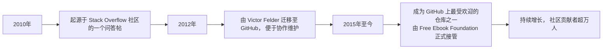

# Free Programming Books — 全球最大的免费开源编程学习资源库

**文档版本**：1.0  
**最后更新**：2025年9月23日  
**项目来源**：[EbookFoundation/free-programming-books](https://github.com/EbookFoundation/free-programming-books)  
**在线浏览**：[https://ebookfoundation.github.io/free-programming-books/](https://ebookfoundation.github.io/free-programming-books/)  
**适用对象**：自学者、编程初学者、教育工作者、开源社区贡献者、终身学习者

---

## 一、项目总览

`Free Programming Books` 是一个由 **Free Ebook Foundation** 维护的、托管在 GitHub 上的**开源项目**。它汇集了全球互联网上合法、免费的编程书籍、教程、课程和播客资源，是目前世界上**规模最大、最全面、最活跃**的免费编程学习资源索引库。

该项目不仅仅是一个简单的链接列表，更是一个由全球开发者社区共同维护的“知识圣殿”，其目标是**打破知识壁垒，让编程教育对所有人免费开放**。

### 1.1 项目核心价值

*   **完全免费 (Completely Free)**：所有列出的资源均合法免费，无需付费或订阅。
*   **社区驱动 (Community-Driven)**：由全球数千名志愿者贡献、审核和更新，确保内容的时效性和准确性。
*   **高度结构化 (Highly Structured)**：资源按编程语言、主题、操作系统、数学、非技术类等精细分类，便于查找。
*   **多语言支持 (Multilingual)**：不仅包含英文资源，还收录了数十种语言（包括中文）的编程书籍。
*   **开放协作 (Open Collaboration)**：任何人都可以通过提交 Pull Request 来贡献新资源或修正错误。

### 1.2 项目发展历程



---

## 二、项目内容与结构详解

项目的核心内容是一个庞大的、结构化的资源列表，主要以 Markdown 文件的形式组织。

### 2.1 核心内容分类

项目将资源分为多个大类，每个大类下又按具体主题或语言细分。

#### 2.1.1 主要资源大类

| 分类名称 | 内容描述 | 文件示例 |
| :--- | :--- | :--- |
| **By Programming Language** | 按编程语言分类，如 Python, Java, C++, JavaScript 等。 | `free-programming-books.md`, `free-cpp-books.md` |
| **By Topic** | 按技术主题分类，如 算法、人工智能、数据库、网络安全、DevOps 等。 | `free-ai-ml-books.md`, `free-database-books.md` |
| **By Operating System** | 按操作系统分类，如 Linux, Windows, macOS, Android, iOS。 | `free-linux-books.md`, `free-android-books.md` |
| **Mathematics & Science** | 数学、物理、统计学等与编程相关的基础科学书籍。 | `free-maths-books.md`, `free-physics-books.md` |
| **Non-Technical** | 非技术类书籍，如 项目管理、团队协作、职业发展、设计思维。 | `free-non-tech-books.md` |
| **By Language** | **按书籍语言分类**，这是项目最强大的功能之一，包含中文、日文、法文、德文等数十种语言。 | `free-programming-books-zh.md` (中文), `free-programming-books-ja.md` (日文) |

#### 2.1.2 中文资源 (`free-programming-books-zh.md`) 示例

该项目对中文开发者极为友好，专门维护了一个中文资源列表文件。其内容结构如下：

```markdown showLineNumbers=true
<!-- 文件: free-programming-books-zh.md -->
## 目录

- [人工智能](#人工智能)
- [Web开发](#web开发)
- [移动开发](#移动开发)
- [编程语言](#编程语言)
    - [C/C++](#cc)
    - [Go](#go)
    - [Java](#java)
    - [Python](#python)
    - [Rust](#rust)
- [操作系统](#操作系统)
- [数据库](#数据库)
- [数学](#数学)
```

每个子分类下，会列出具体的书籍名称、作者和**永久有效的下载链接**。

### 2.2 项目仓库结构

除了核心的书籍列表，项目仓库还包含其他重要文件，共同支撑其运作。

#### 2.2.1 关键文件说明

| 文件/目录 | 作用 | 重要性 |
| :--- | :--- | :--- |
| `README.md` | 项目总览、贡献指南、行为准则。 | ⭐⭐⭐⭐⭐ |
| `CONTRIBUTING.md` | 详细说明如何为项目贡献新资源或修改。 | ⭐⭐⭐⭐⭐ |
| `free-programming-books.md` | 英文编程书籍主列表。 | ⭐⭐⭐⭐ |
| `free-programming-books-zh.md` | 中文编程书籍列表。 | ⭐⭐⭐⭐ |
| `CODE_OF_CONDUCT.md` | 社区行为准则，确保协作环境健康友好。 | ⭐⭐⭐ |
| `.github/` | 包含 Issue 和 Pull Request 的模板文件。 | ⭐⭐ |

---

## 三、在线网站与用户体验

除了在 GitHub 上浏览，项目还提供了一个独立的、用户体验更佳的官方网站：[https://ebookfoundation.github.io/free-programming-books/](https://ebookfoundation.github.io/free-programming-books/)。

### 3.1 网站功能亮点

#### 3.1.1 核心功能模块

```mermaid
graph LR
    A[用户访问网站] --> B[首页]
    B --> C[搜索框]
    B --> D[按语言浏览]
    B --> E[按主题浏览]
    C --> F[输入关键词， 如 "Python" 或 "算法"]
    D --> G[选择 "中文" 或 "English" 等]
    E --> H[选择 "人工智能" 或 "Web开发" 等]
    F --> I[显示搜索结果]
    G --> J[显示该语言下的所有书籍]
    H --> K[显示该主题下的所有书籍]
```

#### 3.1.2 用户体验优势

1.  **强大的搜索功能**：网站提供了一个独立的搜索页面 ([https://ebookfoundation.github.io/free-programming-books-search/](https://ebookfoundation.github.io/free-programming-books-search/))，可以快速定位到特定的书籍或主题，这是 GitHub 原生界面所不具备的。
2.  **响应式设计**：网站适配各种设备，在手机、平板和电脑上都能获得良好的阅读体验。
3.  **简洁清晰的界面**：没有广告和干扰元素，用户可以专注于查找和学习。
4.  **一键直达**：每个书籍条目都提供直接链接，点击即可下载或在线阅读。

---

## 四、社区贡献与项目治理

`Free Programming Books` 的成功，完全依赖于其庞大而活跃的全球社区。

### 4.1 贡献流程

任何人都可以为项目做出贡献，流程简单透明：

1.  **Fork 仓库**：在 GitHub 上 Fork 项目到自己的账户。
2.  **修改文件**：在自己的 Fork 中，编辑相应的 Markdown 文件（如 `free-programming-books-zh.md`），添加新书或修正链接。
3.  **提交 Pull Request (PR)**：向主仓库提交 PR，描述你的修改内容。
4.  **社区审核**：项目维护者和其他社区成员会审核 PR，确保链接有效、分类正确。
5.  **合并上线**：审核通过后，PR 被合并，新资源将出现在网站和仓库中。

### 4.2 项目治理

项目由 **Free Ebook Foundation**（一个非营利组织）负责管理。该组织致力于：

*   **推广免费电子书**：在全球范围内倡导知识的自由传播。
*   **维护项目可持续性**：确保项目长期稳定运行。
*   **接受捐赠**：在美国，向该基金会的捐赠可以抵税，用于支持项目的服务器和运营成本。

---

## 五、总结与影响力

`Free Programming Books` 项目是开源精神和知识共享理念的完美体现。它证明了：

*   **社区的力量是无穷的**：数以万计的志愿者共同构建了一个无价的知识宝库。
*   **教育可以是免费的**：高质量的编程教育资源不应被高昂的价格所垄断。
*   **技术可以赋能教育**：通过 GitHub 和静态网站技术，构建了一个高效、可扩展、全球可达的学习平台。

对于任何希望学习编程的人来说，`Free Programming Books` 都是一个**必须收藏的起点**。它不仅提供资源，更提供了一个参与开源、回馈社区的机会，让每个人都能成为知识海洋的建设者。