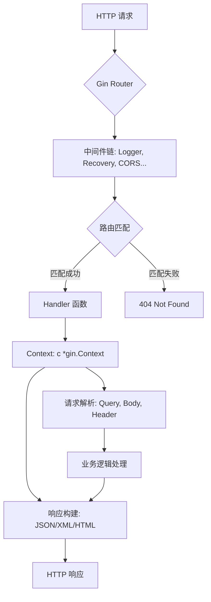

# 用 Go 编写的高性能 HTTP Web 框架 —— Gin

**文档版本：** 1.0  
**最后更新：** 2025年9月24日  
**项目来源：** GitHub 开源项目 `gin-gonic/gin`  
**项目官网：** https://github.com/gin-gonic/gin  
**适用对象：** Go 后端开发者、微服务架构师、REST API 工程师、DevOps 工程师、技术决策者

---

## 一、项目概述

Gin 是一个用 Go（Golang）语言编写的高性能 HTTP Web 框架，专为构建 **高吞吐量 RESTful API、微服务和 Web 应用** 而设计。其核心基于 [httprouter](https://github.com/julienschmidt/httprouter) 路由引擎，实现了 **零内存分配（zero allocation）** 的路由匹配机制，在性能上显著优于同类 Go 框架（部分场景快达 40 倍）。

Gin 以 **简洁的 API 设计**（类似 Express.js）与 **极致的运行效率** 著称，已成为 Go 生态中最流行的 Web 框架之一，被广泛应用于高并发、低延迟的生产环境。

> ✅ **核心优势**：高性能、低内存开销、中间件生态丰富、错误恢复机制完善、JSON 绑定/验证原生支持。

---

## 二、技术特性与架构

### 2.1 核心特性一览

| 特性类别         | 功能说明                                                                 |
|------------------|--------------------------------------------------------------------------|
| **高性能路由**   | 基于 httprouter，支持动态路径参数（如 `/user/:id`），零堆内存分配         |
| **中间件系统**   | 支持全局、路由组、单路由中间件，可插拔扩展（日志、CORS、鉴权、限流等）     |
| **自动恢复**     | 内置 `Recovery` 中间件，防止 panic 导致服务崩溃                          |
| **JSON 绑定**    | 自动将请求体 JSON 解析为结构体，并支持字段校验（如 `binding:"required"`） |
| **路由分组**     | 支持按功能/版本分组路由，统一应用中间件和前缀                            |
| **多格式渲染**   | 原生支持 JSON、XML、YAML、HTML 模板、文件下载等响应格式                  |
| **错误管理**     | 提供集中式错误收集与处理机制                                             |
| **生态扩展**     | 官方与社区提供大量中间件（JWT、Gzip、Prometheus、Session 等）            |

### 2.2 技术架构图



---

## 三、环境要求与安装

### 3.1 系统要求

| 项目             | 要求                                  |
|------------------|---------------------------------------|
| Go 版本          | ≥ 1.23（推荐使用最新稳定版）          |
| 操作系统         | Windows / Linux / macOS               |
| 网络环境         | 可访问 GitHub（用于 go mod 下载依赖） |

### 3.2 安装方式

Gin 使用 Go Modules 管理依赖，无需单独安装，只需在代码中导入：

```go showLineNumbers=true
import "github.com/gin-gonic/gin"
```

首次构建时，Go 会自动下载并缓存依赖：

```bash showLineNumbers=true
go mod init my-gin-app
go get github.com/gin-gonic/gin
```

---

## 四、快速入门示例

### 4.1 最小可运行程序

```go showLineNumbers=true
// main.go
package main

import (
  "net/http"
  "github.com/gin-gonic/gin"
)

func main() {
  // 创建带默认中间件（Logger + Recovery）的路由引擎
  r := gin.Default()

  // 定义 GET /ping 路由
  r.GET("/ping", func(c *gin.Context) {
    c.JSON(http.StatusOK, gin.H{
      "message": "pong",
    })
  })

  // 启动 HTTP 服务，默认监听 :8080
  r.Run() // 等价于 r.Run(":8080")
}
```

**运行命令：**
```bash showLineNumbers=true
go run main.go
```

**验证：**
```bash showLineNumbers=true
curl http://localhost:8080/ping
# 输出: {"message":"pong"}
```

### 4.2 代码切片分析

| 代码片段 | 说明 |
|--------|------|
| `gin.Default()` | 返回一个预配置了 `Logger()` 和 `Recovery()` 中间件的 `*gin.Engine` 实例 |
| `r.GET("/ping", handler)` | 注册 GET 方法路由，路径为 `/ping`，处理函数为匿名函数 |
| `c.JSON(200, gin.H{...})` | 使用 `Context` 对象返回 JSON 响应，`gin.H` 是 `map[string]interface{}` 的别名 |
| `r.Run()` | 启动 HTTP 服务器，监听所有接口的 8080 端口 |

---

## 五、核心功能详解

### 5.1 路由与参数绑定

#### 路径参数（Path Param）
```go showLineNumbers=true
r.GET("/user/:id", func(c *gin.Context) {
  id := c.Param("id") // 获取 :id 的值
  c.JSON(200, gin.H{"user_id": id})
})
```

#### 查询参数（Query Param）
```go showLineNumbers=true
r.GET("/search", func(c *gin.Context) {
  keyword := c.DefaultQuery("q", "default") // 默认值
  page, _ := c.GetQuery("page")             // 安全获取
})
```

#### 请求体绑定（JSON）
```go showLineNumbers=true
type LoginRequest struct {
  Username string `json:"username" binding:"required"`
  Password string `json:"password" binding:"required,min=6"`
}

r.POST("/login", func(c *gin.Context) {
  var req LoginRequest
  if err := c.ShouldBindJSON(&req); err != nil {
    c.JSON(400, gin.H{"error": err.Error()})
    return
  }
  // 处理登录逻辑
})
```

### 5.2 中间件机制

#### 全局中间件
```go showLineNumbers=true
r := gin.New()
r.Use(gin.Logger(), gin.Recovery()) // 手动添加
```

#### 路由组中间件
```go showLineNumbers=true
auth := r.Group("/api/v1", AuthMiddleware())
{
  auth.GET("/profile", getProfile)
  auth.POST("/logout", logout)
}
```

#### 自定义中间件示例
```go showLineNumbers=true
func AuthMiddleware() gin.HandlerFunc {
  return func(c *gin.Context) {
    token := c.GetHeader("Authorization")
    if token != "secret" {
      c.AbortWithStatusJSON(401, gin.H{"error": "unauthorized"})
      return
    }
    c.Next() // 继续执行后续 handler
  }
}
```

### 5.3 错误处理与日志

Gin 提供 `c.Error()` 收集错误，并可通过中间件统一处理：

```go showLineNumbers=true
r.Use(func(c *gin.Context) {
  c.Next()
  for _, err := range c.Errors {
    log.Printf("Error: %v", err)
  }
})
```

---

## 六、性能基准对比

### 6.1 GitHub API 路由基准测试（官方数据）

| 框架                | 每次操作耗时 (ns/op) | 堆内存 (B/op) | 分配次数 (allocs/op) |
|---------------------|----------------------|---------------|-----------------------|
| **Gin**             | 27,364               | 0             | 0                     |
| HttpRouter (底层)   | 21,360               | 0             | 0                     |
| Echo                | 38,479               | 0             | 0                     |
| Chi                 | 238,331              | 87,696        | 609                   |
| Gorilla Mux         | 3,384,987            | 251,650       | 1,994                 |
| Martini             | 3,444,706            | 226,551       | 2,325                 |

> 📊 **结论**：Gin 在保持高开发效率的同时，性能接近底层路由库 httprouter，远超传统框架。

---

## 七、生产环境最佳实践

### 7.1 部署配置建议

| 项目               | 推荐配置                                  |
|--------------------|-------------------------------------------|
| 日志               | 使用结构化日志（如 zap + ginlog）         |
| 监控               | 集成 Prometheus + Grafana                 |
| 安全               | 启用 HTTPS、设置安全头（CSP、HSTS）       |
| 限流               | 使用 `gin-contrib/limiter`                |
| 健康检查           | 添加 `/healthz` 端点                      |
| 构建优化           | 使用 `CGO_ENABLED=0 GOOS=linux go build`  |

### 7.2 项目结构示例

```
my-gin-app/
├── cmd/
│   └── server/
│       └── main.go
├── internal/
│   ├── handler/     # 路由处理函数
│   ├── middleware/  # 自定义中间件
│   └── model/       # 数据模型
├── pkg/             # 可复用公共包
├── go.mod
└── go.sum
```

---

## 八、典型应用场景

- **高并发 API 网关**（如 Lura、Krakend）
- **实时推送服务**（如 Gorush）
- **个人云相册**（如 PhotoPrism）
- **分布式任务调度**（如 Dkron）
- **Serverless 函数后端**

---

## 九、总结

Gin 凭借其 **极简 API、极致性能、丰富生态**，已成为 Go Web 开发的事实标准。无论是快速原型开发，还是构建百万级 QPS 的生产系统，Gin 都能提供卓越的开发体验与运行效率。

> 📌 **建议**：新项目优先考虑 Gin；已有项目若性能成为瓶颈，可评估迁移至 Gin。

---

## 附录 A：官方资源

| 资源类型       | 链接 |
|----------------|------|
| GitHub 仓库    | https://github.com/gin-gonic/gin |
| 官方文档（多语言） | https://gin-gonic.com/ |
| API 参考       | https://pkg.go.dev/github.com/gin-gonic/gin |
| 示例代码库     | https://github.com/gin-gonic/examples |
| 中间件集合     | https://github.com/gin-contrib |

## 附录 B：常见中间件列表

| 功能         | 包名                          |
|--------------|-------------------------------|
| CORS         | `github.com/gin-contrib/cors` |
| JWT 鉴权     | `github.com/appleboy/gin-jwt` |
| Gzip 压缩    | `github.com/gin-contrib/gzip` |
| Prometheus   | `github.com/zsais/go-gin-prometheus` |
| 请求限流     | `github.com/gin-contrib/limiter` |
| 静态文件服务 | `gin.Static()`（内置）        |

--- 

> ✍️ 本文档可作为 Gin 框架的标准化技术参考，适用于团队内部培训、架构设计文档、DevOps 部署手册等场景。