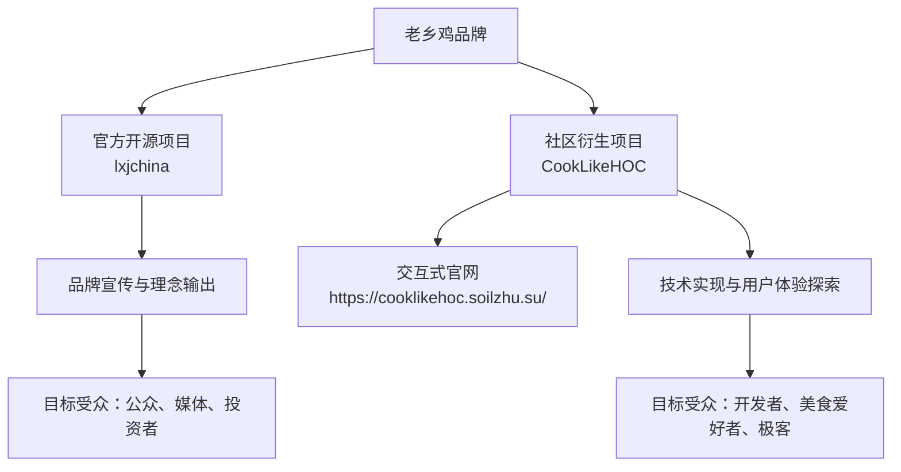
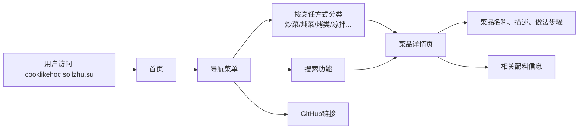

# 老乡鸡开源GitHub项目生态全景分析 —— 官方仓库与社区衍生项目

**文档版本**：1.0  
**最后更新**：2025年9月23日  
**适用对象**：开源爱好者、餐饮行业数字化研究者、前端开发者、品牌营销分析师

---

*老乡鸡*

## 一、项目总览

本报告旨在对两个与“老乡鸡”品牌相关的开源项目进行专业、详尽的介绍与对比分析。这两个项目分别是：

1.  **`lxjchina`**：由 **GuihongWang** 创建，被广泛认为是“老乡鸡官方开源项目”。
2.  **`CookLikeHOC`**：由 **Gar-b-age** 创建，是一个**非官方的社区衍生项目**，并配套建设了独立的交互式官网 `https://cooklikehoc.soilzhu.su/`。

尽管两者都以“老乡鸡”为名，但其定位、目标和实现方式截然不同，共同构成了一个有趣的品牌开源生态。

### 1.1 项目关系图谱

---

## 二、官方项目：`lxjchina` 深度解析

### 2.1 项目定位与核心价值

`lxjchina` 项目（仓库地址：[https://github.com/GuihongWang/lxjchina](https://github.com/GuihongWang/lxjchina)）并非一个传统意义上的技术项目，而是一个**极具创意的品牌公关和开源营销案例**。

其核心价值在于：
*   **理念输出**：通过开源的形式，向公众透明地展示老乡鸡“干净卫生”、“现炒现做”的品牌理念和后厨操作规范。
*   **信任建立**：将“菜品溯源报告”等内部文档开源，主动接受公众监督，建立品牌信任。
*   **文化塑造**：塑造一个开放、透明、有社会责任感的企业形象，与年轻、懂技术的互联网用户群体产生共鸣。

### 2.2 项目内容与结构

该项目的内容非常纯粹，主要包含一系列 **Markdown (`.md`) 格式的文档**。

#### 2.2.1 主要文档内容

| 文件名 | 内容概要 | 目标 |
| :--- | :--- | :--- |
| `README.md` | 项目介绍，阐述开源理念和目的。 | 建立项目第一印象，传达品牌价值观。 |
| `菜品溯源报告.md` | 详细列出各种菜品的原料来源、供应商信息、检测报告等。 | 证明食材安全、供应链透明。 |
| `后厨操作规范.md` | 描述厨房的卫生标准、操作流程、员工行为准则等。 | 展示“干净卫生”并非空话，有章可循。 |
| `食品安全承诺书.md` | 公司对食品安全的正式承诺。 | 强化品牌责任感和公信力。 |

#### 2.2.2 项目特点

*   **非技术性**：项目不包含任何可执行代码，纯文档驱动。
*   **高传播性**：其独特的“开源餐饮”概念在社交媒体上引发了病毒式传播，成为现象级营销事件。
*   **开创性**：为传统餐饮行业如何拥抱互联网和开源文化提供了全新思路。

---

## 三、社区项目：`CookLikeHOC` 与交互式官网

### 3.1 项目定位与核心价值

`CookLikeHOC` 项目（仓库地址：[https://github.com/Gar-b-age/CookLikeHOC](https://github.com/Gar-b-age/CookLikeHOC)）是一个由社区开发者 **Gar-b-age** 发起的**非官方技术项目**。它并非老乡鸡公司官方行为，而是开发者对 `lxjchina` 项目内容的**二次创作和技术实现**。

其核心价值在于：
*   **技术转化**：将 `lxjchina` 中的静态文本信息，转化为一个**结构化、可交互、用户体验友好的Web应用**。
*   **功能增强**：提供分类浏览、搜索等 `lxjchina` 原始仓库所不具备的功能。
*   **社区活力体现**：展示了开源社区的强大创造力，一个优秀的创意可以激发无数开发者的参与和贡献。

### 3.2 项目架构与技术栈

该项目是一个标准的现代前端Web应用。

#### 3.2.1 技术栈概览

| 层级 | 技术/工具 | 说明 |
| :--- | :--- | :--- |
| **前端框架** | Astro | 一个现代化的静态站点生成器，以“少用JavaScript”为核心理念，追求极致性能。 |
| **UI组件库** | 未知 (可能为自研或Tailwind CSS) | 从官网风格看，UI简洁清新，符合内容调性。 |
| **部署平台** | Vercel / Netlify (推测) | 官网域名 `soilzhu.su` 通常与这些平台关联。 |
| **数据源** | `lxjchina` 仓库的Markdown文件 | 项目的核心数据完全来源于对官方仓库的解析和再组织。 |

### 3.3 交互式官网 (`https://cooklikehoc.soilzhu.su/`) 功能详解

官网是 `CookLikeHOC` 项目的灵魂，它将枯燥的Markdown文档变成了一个充满乐趣的“在线菜谱”。

#### 3.3.1 核心功能模块

#### 3.3.2 用户体验亮点

1.  **清晰的分类导航**：用户可以通过“炒菜”、“炖菜”、“凉拌”等烹饪方式快速找到感兴趣的菜谱，体验远超在GitHub仓库中翻找Markdown文件。
2.  **简洁美观的UI**：网站设计风格清新，排版舒适，大量留白，营造出一种“干净厨房”的视觉感受，与老乡鸡的品牌调性高度契合。
3.  **沉浸式阅读体验**：每个菜品的详情页都经过精心排版，步骤清晰，让用户仿佛在阅读一本精美的电子食谱。
4.  **一键直达GitHub**：网站底部提供指向原始 `lxjchina` 仓库和 `CookLikeHOC` 项目本身的GitHub链接，体现了开源精神，方便用户追溯源头或参与贡献。

---

## 四、项目对比与生态总结

### 4.1 核心对比表

| 对比维度 | `lxjchina` (官方) | `CookLikeHOC` (社区) |
| :--- | :--- | :--- |
| **项目性质** | 品牌营销、理念输出 | 技术实现、用户体验优化 |
| **内容主体** | 原始Markdown文档（溯源报告、操作规范） | 基于官方文档构建的结构化菜谱数据库 |
| **技术复杂度** | 低（纯文档） | 中高（前端Web应用） |
| **主要受众** | 公众、媒体、投资者 | 开发者、美食爱好者、极客 |
| **核心价值** | 建立品牌信任与透明度 | 提供便捷、愉悦的信息获取体验 |
| **是否官方** | 是 | 否 |

### 4.2 生态协同效应

`lxjchina` 和 `CookLikeHOC` 并非竞争关系，而是形成了完美的**上下游协同**：

1.  **官方播种**：`lxjchina` 以开源的形式释放了高质量、有话题性的原始数据，如同播下了一颗种子。
2.  **社区灌溉**：`CookLikeHOC` 等社区项目利用这些数据，开发出各种工具和应用，如同为种子浇水施肥，使其开花结果。
3.  **品牌受益**：最终，老乡鸡品牌获得了远超预期的曝光度和美誉度，形成了一个多赢的局面。

这种模式为其他传统行业拥抱开源和社区提供了宝贵的参考：**企业只需开放数据和理念，社区自会创造出你想象不到的价值**。