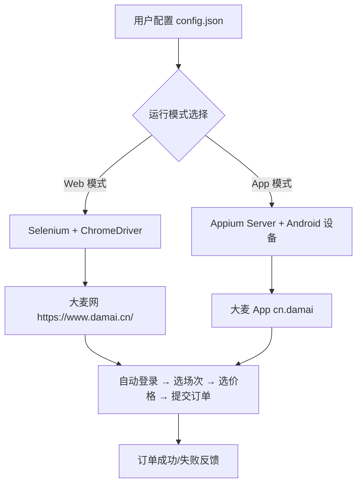

# 大麦抢票自动化脚本技术文档

**文档版本：** 1.1  
**最后更新：** 2025年9月24日  
**项目来源：** GitHub 开源项目 `WECENG/ticket-purchase`  
**项目官网：** https://github.com/WECENG/ticket-purchase  
**适用对象：** 自动化测试工程师、Python 开发者、票务系统研究者、逆向工程学习者、移动端自动化开发者

---

## 一、项目概述

本项目是一个基于 **Selenium**（Web 端）与 **Appium**（App 端）实现的大麦网（damai.cn）自动化抢票工具，支持用户在开票瞬间自动完成登录、选场次、选价格、选观演人、提交订单等全流程操作，显著提升抢票成功率。

项目包含两个核心模块：
- **Web 抢票脚本（`damai.py`）**：通过浏览器自动化操作大麦官网
- **App 抢票脚本（`damai_appium.py`）**：通过 Appium 控制 Android 设备上的大麦 App

> ⚠️ **法律与合规提示**：  
> 本项目仅用于技术学习与研究目的。大麦网《用户协议》明确禁止使用自动化脚本抢票。实际使用可能触发风控、账号封禁或法律风险，请谨慎评估。

---

## 二、技术架构

### 2.1 整体架构图



### 2.2 技术栈对比

| 维度             | Web 模式（Selenium）              | App 模式（Appium）                     |
|------------------|----------------------------------|----------------------------------------|
| 自动化框架       | Selenium                         | Appium + UiAutomator2                  |
| 控制对象         | Chrome 浏览器                    | Android 设备上的大麦 App               |
| 依赖环境         | Python, Chrome, ChromeDriver     | Python, Node.js, Android SDK, Appium   |
| 稳定性           | 中（易受网页结构变动影响）       | 高（更贴近真实用户行为）               |
| 反爬风险         | 较高（易被识别为机器人）         | 相对较低（模拟真实设备操作）           |
| 配置复杂度       | 低                               | 高（需配置移动端环境）                 |

---

## 三、环境配置指南

### 3.1 公共依赖（Web & App）

#### Python 环境
- 版本要求：Python ≥ 3.9
- 安装方式：
  ```bash showLineNumbers=true
  # Windows
  # 从 https://www.python.org/downloads/ 下载并勾选 "Add to PATH"

  # macOS
  /bin/bash -c "$(curl -fsSL https://raw.githubusercontent.com/Homebrew/install/HEAD/install.sh)"
  brew install python@3
  ```

### 3.2 Web 模式依赖

| 组件             | 安装命令                          | 说明                     |
|------------------|-----------------------------------|--------------------------|
| Selenium         | `pip3 install selenium`           | 浏览器自动化库           |
| Google Chrome    | [官网下载](https://www.google.cn/chrome/) | 必须安装最新版           |
| ChromeDriver     | 自动匹配或手动下载                | 与 Chrome 版本严格对应   |

> 💡 提示：建议使用 `webdriver-manager` 自动管理驱动：
> ```python showLineNumbers=true
> from selenium import webdriver
> from webdriver_manager.chrome import ChromeDriverManager
> driver = webdriver.Chrome(ChromeDriverManager().install())
> ```

### 3.3 App 模式依赖

#### Node.js 与 Appium
```bash showLineNumbers=true
# 安装 Node.js (v18+)
# macOS
brew install node@18

# 安装 Appium Server
npm install -g appium

# 安装 UiAutomator2 驱动（需跳过 Chromedriver 安装）
export APPIUM_SKIP_CHROMEDRIVER_INSTALL=true
npm install -g appium-uiautomator2-driver
```

#### Android 环境
- 安装 Android SDK（推荐通过 Android Studio）
- 配置 `ANDROID_HOME` 环境变量
- 开启手机“开发者选项”与“USB 调试”

#### Python 客户端
```bash showLineNumbers=true
pip3 install appium-python-client
```

---

## 四、配置文件详解

### 4.1 `config.json` 结构

```json showLineNumbers=true
{
  "index_url": "https://www.damai.cn/",
  "login_url": "https://passport.damai.cn/login?ru=https%3A%2F%2Fwww.damai.cn%2F",
  "target_url": "https://detail.damai.cn/item.htm?id=740680932762",
  "users": ["张三", "李四"],
  "city": "广州",
  "date": "2023-10-28",
  "price": "1039",
  "if_listen": true,
  "if_commit_order": true
}
```

### 4.2 字段说明表

| 字段名             | 类型       | 是否必填 | 说明                                                                 |
|--------------------|------------|----------|----------------------------------------------------------------------|
| `index_url`        | string     | 否       | 大麦首页，固定值，无需修改                                           |
| `login_url`        | string     | 否       | 登录页 URL，固定值                                                   |
| `target_url`       | string     | **是**   | 目标演出详情页 URL（含 `id=` 参数）                                  |
| `users`            | string[]   | **是**   | 观演人姓名列表，需提前在大麦 App 中添加                              |
| `city`             | string     | 否       | 若演出需选城市（如多城巡演），填城市名；否则留空或删除               |
| `date`             | string     | **是**   | 场次日期，格式 `YYYY-MM-DD`                                          |
| `price`            | string     | **是**   | 票档价格（字符串），如 `"1039"`                                      |
| `if_listen`        | boolean    | 是       | 是否启用“回流票监听”（持续轮询库存）                                 |
| `if_commit_order`  | boolean    | 是       | 是否自动提交订单（设为 `false` 可用于调试）                          |

---

## 五、核心代码分析

### 5.1 Web 模式关键流程（`damai.py`）

#### 登录与跳转
```python showLineNumbers=true
# 伪代码示意
driver.get(config['login_url'])
# 等待用户手动扫码登录（安全考虑，未自动填账号密码）
WebDriverWait(driver, 300).until(
    EC.url_contains("www.damai.cn")
)
driver.get(config['target_url'])
```

> 🔍 **设计分析**：  
> 项目采用“半自动登录”策略，避免账号密码硬编码，提升安全性，但牺牲了完全无人值守能力。

#### 选票逻辑
```python showLineNumbers=true
# 选择日期
date_btn = driver.find_element(By.XPATH, f"//div[text()='{config['date']}']")
date_btn.click()

# 选择价格
price_btn = driver.find_element(By.XPATH, f"//span[contains(text(), '{config['price']}')]/..")
price_btn.click()
```

> ⚠️ **脆弱点**：  
> XPath 依赖页面文本内容，若大麦改版（如价格显示为“¥1039”而非“1039”），脚本将失效。

### 5.2 App 模式关键代码（`damai_appium.py`）

#### Appium 驱动初始化
```python showLineNumbers=true
from appium import webdriver
from appium.options.common.base import AppiumOptions

options = AppiumOptions()
options.set_capability('platformName', 'Android')
options.set_capability('deviceName', 'YourDevice')  # adb devices 获取
options.set_capability('appPackage', 'cn.damai')
options.set_capability('appActivity', '.launcher.splash.SplashMainActivity')
options.set_capability('automationName', 'UiAutomator2')

driver = webdriver.Remote('http://127.0.0.1:4723', options=options)
```

#### 元素定位策略
```python showLineNumbers=true
# 通过 resourceId 定位（更稳定）
confirm_btn = driver.find_element(
    AppiumBy.ID, "cn.damai:id/buy_button"
)
confirm_btn.click()
```

> ✅ **优势**：  
> 使用 Android `resource-id` 定位比 Web 的 XPath 更稳定，不易受 UI 文案变动影响。

---

## 六、运行与调试

### 6.1 Web 模式运行

```bash showLineNumbers=true
cd damai
python3 damai.py
```

### 6.2 App 模式运行

1. 启动 Appium Server：
   ```bash showLineNumbers=true
   appium --use-plugins uiautomator2
   ```
2. 运行脚本：
   ```bash showLineNumbers=true
   cd damai_appium
   python3 damai_appium.py
   ```

### 6.3 调试建议

| 问题现象                     | 解决方案                                     |
|------------------------------|----------------------------------------------|
| 页面元素找不到               | 使用浏览器开发者工具检查 XPath 是否变化      |
| App 启动失败                 | 检查 `appActivity` 是否正确（可用 `adb logcat`） |
| 抢票速度慢                   | 关闭浏览器图片/JS 加载，或使用无头模式       |
| 被识别为机器人               | 添加随机等待、模拟鼠标轨迹、使用代理 IP      |

---

## 七、风险与局限性

### 7.1 技术局限

- **无验证码自动处理**：登录或下单时若出现滑块/图形验证码，需人工介入
- **依赖页面结构稳定**：大麦前端改版将导致脚本失效
- **无并发支持**：单实例运行，无法多账号同时抢票

### 7.2 安全与法律风险

| 风险类型       | 说明                                                                 |
|----------------|----------------------------------------------------------------------|
| 账号封禁       | 大麦风控系统可识别自动化行为，导致账号永久冻结                       |
| 法律责任       | 违反《网络安全法》及平台协议，可能面临民事或刑事责任                 |
| 数据泄露       | 若配置文件包含敏感信息（如账号），存在泄露风险                       |

---

## 八、总结与建议

本项目展示了 Selenium 与 Appium 在复杂业务场景下的实战应用，具备较高的技术参考价值。建议开发者：

- **仅用于学习**：理解自动化测试、元素定位、流程控制等核心概念
- **增强健壮性**：加入异常重试、日志记录、邮件通知等机制
- **探索替代方案**：研究官方 API（如有）、WebSocket 监听库存变化等更高效方式

> 📌 **重要提醒**：切勿用于商业抢票或大规模部署，尊重平台规则与市场公平。

---

## 附录 A：项目目录结构

```
ticket-purchase/
├── damai/
│   ├── damai.py          # Web 抢票主程序
│   └── config.json       # 配置文件
├── damai_appium/
│   ├── damai_appium.py   # App 抢票主程序
│   └── README.md
└── GitHubMD.txt          # 原始说明文档
```

## 附录 B：参考链接

- [Selenium 官方文档](https://www.selenium.dev/documentation/)
- [Appium 官方文档](https://appium.io/docs/en/about-appium/intro/)
- [大麦网开发者协议](https://www.damai.cn/about/agreement)（请务必阅读）