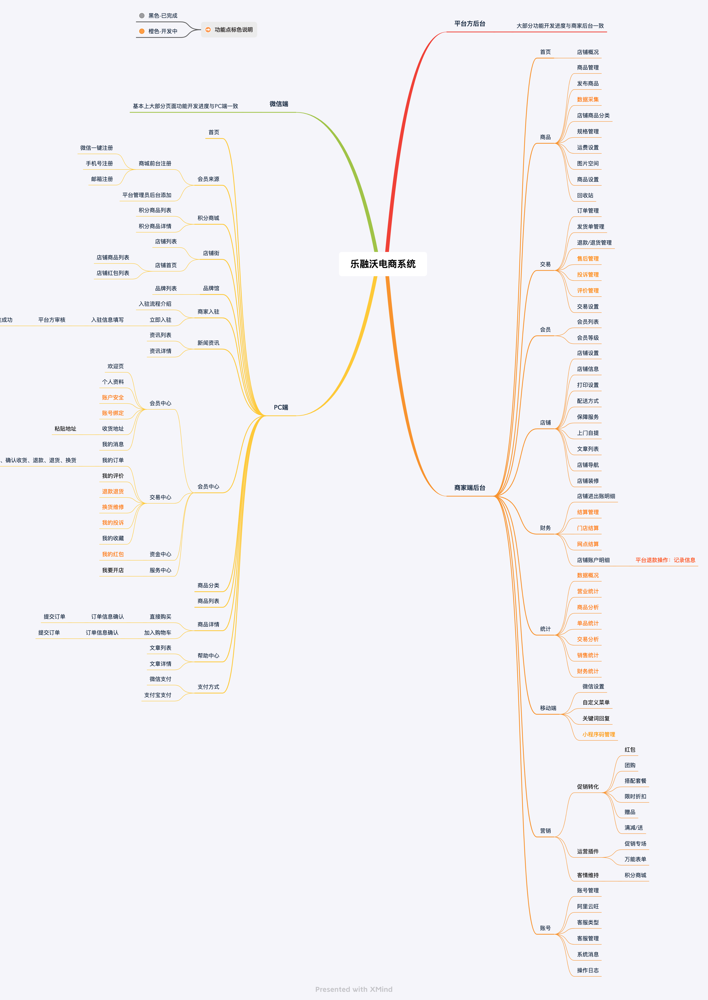
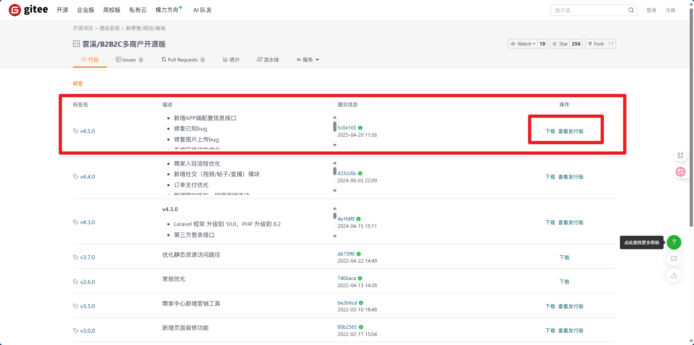

# 乐融沃B2B2C商城开源版部署技术文档

**文档版本：** 1.1  
**文档最后更新：** 2025年10月26日  
**项目最后更新：** 2025年5月30日 v4.5.0  
**项目来源：** Gitee 开源项目 `laravelmall/laravelvip-b2b2c`  
**项目地址：** https://gitee.com/laravelmall/laravelvip-b2b2c  
**开源遵循：** Apache License 2.0

---

## 项目介绍

乐融沃b2b2c多商户开源版是一款轻量级、高性能的电商系统，支持H5和公众号。该系统完全开源，前后端源码100%开放，可自由二次开发，快速搭建个性化独立商城。技术架构采用PHP8.2和Laravel10，专注于轻量、可持续和稳定的高可用系统，适用于学习和商业用途。

## 技术特点

- 采用PHP 8.2 (强类型严格模式)
- Laravel 10.*（优雅的PHP开发框架）
- 支持octane整站加速（利用swoole或roadrunner）
- 支持自适应APP或小程序端接口（使用Laravel官方的插件sanctum实现api接口开发）
- 前端首页支持丰富的模版自定义装修
- 丰富的营销工具助力商城的有效运营及客户转化
- 用户端采用 uniapp 多端合一技术（安卓、iOS、微信小程序、公众号H5等。注：uniapp已停止更新了，不建议直接使用！）

## 系统功能列表



## 环境要求

- Windows 10+ & Ubuntu 22+ & CentOS 7.0+
- Nginx 1.20+
- PHP 8.2+
- MySQL 8.0+
- Redis 7.0+

## 部署步骤

项目官方推荐无论Linux还是Windows均通过**宝塔面板**安装，本教程则不采用宝塔安装模式，而是通过与**docker**容器配合安装nginx、PHP等环境来部署项目。

如果没有docker操作经验推荐通过以下方法部署项目

[宝塔面板部署教程（web界面一键安装，适用于无编程基础的用户）](https://gitee.com/laravelmall/laravelvip-b2b2c/blob/master/md/%E5%AE%9D%E5%A1%94%E9%9D%A2%E6%9D%BF%E9%83%A8%E7%BD%B2%E6%95%99%E7%A8%8B.md)    
[手动命令行部署教程（命令行模式安装，适用于有一定编程基础的开发人员）](https://gitee.com/laravelmall/laravelvip-b2b2c/blob/master/md/%E6%89%8B%E5%8A%A8%E5%91%BD%E4%BB%A4%E8%A1%8C%E9%83%A8%E7%BD%B2%E6%95%99%E7%A8%8B.md)  
[哔哩哔哩：乐融沃商城系统宝塔面板部署教程](https://gitee.com/link?target=https%3A%2F%2Fwww.bilibili.com%2Fvideo%2FBV13w4m1m7RQ%2F)  

:::danger
本教程不采用上面的方法部署。
:::

## 一、前期准备：项目解压与目录结构



### 下载最新发行版项目解压

访问项目 [代码标签](https://gitee.com/laravelmall/laravelvip-b2b2c/tags) 找到最新版项目下载。下载 tar.gz 格式源代码文件后上传到服务器 `www` 下通过命令源代码。

在 Ubuntu 系统中，解压 `.tar.gz` 文件的标准命令是：

```bash showLineNumbers=true
tar -xzvf laravelvip-b2b2c-v4.5.0.tar.gz
```

各选项含义如下：

- `x`：解压（extract）  
- `z`：通过 gzip 解压缩（因为是 `.gz` 格式）  
- `v`：显示解压过程（verbose）  
- `f`：指定文件名（file）

该命令会将压缩包解压到当前目录。如果你希望解压到指定目录（例如 `mall`），可以加上 `-C` 参数：

```bash showLineNumbers=true
cd /home/www/wwwroot
sudo mkdir -p mall
tar -xzvf laravelvip-b2b2c-v4.5.0.tar.gz -C mall
```

:::tip
解压后，/home/www/wwwroot/mall 包含完整的 Laravel 目录结构，包括 public/frontend/web 和 public/backend/web（这是 Laravel B2B2C 的典型双入口设计）。
:::


### 目录结构

```bash
/home/
├── www/
│   └── wwwroot/
│       └── mall/                 # Laravel B2B2C 项目根目录
└── tools/
    ├── docker-compose.yml
    ├── php-fpm/
    │   ├── Dockerfile
    │   └── custom.ini
    └── nginx/
        └── conf/
            ├── nginx.conf
            ├── http/
            │   ├── default.conf      # HTTP 重定向 + ACME 挑战
            │   ├── mall.conf         # 前端商城（ypzpp.asia）
            │   └── mall-admin.conf   # 后台管理（admin.ypzpp.asia）
            └── stream/               # 未使用
```

## 二、构建自定义 PHP-FPM 镜像（含扩展）

编写了 `/home/tools/php-fpm/Dockerfile`，目标是：

- 使用 **PHP 8.3-fpm-alpine**
- 替换 Alpine 源为 **阿里云镜像**（加速构建）
- 编译安装 GD、PDO_MySQL、Swoole、Redis 等扩展
- 安装 Composer
- 修改 `www.conf` 使 PHP-FPM 监听 `9000`（非 127.0.0.1），以便 Nginx 容器访问
- 设置工作目录为 `/var/www/html`

同时准备了 `custom.ini`（路径：`/home/tools/php-fpm/custom.ini`），用于覆盖 PHP 配置。

```ini showLineNumbers=true
注意需要修改此处
disable_functions = passthru, system, popen
```

然后构建镜像：

```bash showLineNumbers=true
cd /home/tools/php-fpm
docker build -t php-fpm:8.3 .
```

:::warning
虽然 `custom.ini` 尚未在 Dockerfile 中 COPY，但计划通过 volume 挂载（见下一步）。
:::

---

## 三、配置 Nginx（支持 HTTPS + 多子域名）

使用了一个**私有 Nginx 镜像**：  
`172.21.52.42:5000/nginx-with-acme:1.29.2`  
通过已搭建内网 Harbor 或 registry，并集成了 **ACME 自动证书申请**（如 certbot 或 acme.sh）。

### 关键配置文件：

#### 1. `/home/tools/nginx/conf/nginx.conf`
- 定义 `upstream php-fpm { server php-fpm:9000; }`（Docker 服务名解析）
- 引入 `http.d/*.conf`

#### 2. `/home/tools/nginx/conf/http/default.conf`
- 监听 80 端口
- 所有请求 **301 重定向到 HTTPS**
- 暴露 `/.well-known/acme-challenge/` 路径用于 Let's Encrypt 验证
- 支持微信/百度等平台的验证文件（`MP_verify_*.txt` 等）

#### 3. `/home/tools/nginx/conf/http/mall.conf`
- 绑定域名：`ypzpp.asia` 和 `www.ypzpp.asia`
- 强制 `www` 跳转到非 `www`
- 根目录：`/var/www/html/public/frontend/web`
- 启用 HTTPS，证书路径：`/etc/nginx/ssl/live/ypzpp.asia/...`
- 使用 `sub_filter` 替换静态资源域名（将 `image.laravelvip.com` → `laravelvip.zyhorg.ac.cn`）

#### 4. `/home/tools/nginx/conf/http/mall-admin.conf`
- 绑定域名：`admin.ypzpp.asia`
- 根目录：`/var/www/html/public/backend/web`
- 同样启用 HTTPS 和 `sub_filter`

:::info
申请 **Let's Encrypt 通配符证书**（或单域名证书）并存放在宿主机 `/etc/letsencrypt/live/ypzpp.asia/`，并通过 volume 挂载到 Nginx 容器。
:::

---

## 四、配置 Laravel 环境（.env）与启动服务

你编辑了 `/home/www/wwwroot/mall/.env`，关键配置包括：

- `APP_ENV=production`
- `APP_URL=https://ypzpp.asia`
- **远程 MySQL 数据库**（阿里云 RDS）：
  ```env showLineNumbers=true
  DB_HOST=XXXXXXX.aliyuncs.com
  DB_DATABASE=数据库名
  DB_USERNAME=数据库用户名
  DB_PASSWORD='数据库密钥'
  ```
- 多子域名配置：
  ```env showLineNumbers=true
  ROOT_DOMAIN=ypzpp.asia
  BACKEND_DOMAIN=admin.ypzpp.asia
  SELLER_DOMAIN=seller.ypzpp.asia
  STORE_DOMAIN=store.ypzpp.asia
  FRONTEND_DOMAIN=ypzpp.asia
  MOBILE_DOMAIN=m.ypzpp.asia
  ```
- 使用 **阿里云 OSS** 存储文件（`FILESYSTEM_DRIVER=oss`）
- 会话域设置为 `.ypzpp.asia`（实现跨子域名登录）

:::note
没有启用队列、Redis 缓存或 Elasticsearch，使用默认文件驱动，符合“简化部署”需求。
:::

---

### 启动服务（docker-compose）

你在 `/home/tools/` 目录下执行：

```bash showLineNumbers=true
cd /home/tools
docker compose up -d
```

### 容器行为

#### `php-fpm` 容器：
- 使用构建的 `php-fpm:8.3` 镜像
- 挂载项目目录：`../www/wwwroot/mall → /var/www/html`
- 环境变量：`TZ=Asia/Shanghai`, `APP_ENV=production`

#### `nginx` 容器：
- 使用私有镜像 `172.21.52.42:5000/nginx-with-acme:1.29.2`
- 暴露 80/443 端口
- 挂载：
  - Nginx 主配置和站点配置
  - 项目目录（与 PHP 容器共享）
  - Let's Encrypt 证书（`/etc/letsencrypt → /etc/nginx/ssl`）
  - Certbot ACME 挑战目录（`./nginx/certbot → /usr/share/nginx/certbot`）

:::info
两个容器通过 Docker 默认网络通信，Nginx 通过 `php-fpm:9000` 访问 PHP-FPM。
:::

---


### 防火墙与端口的开放与关闭


```bash showLineNumbers=true
# 关闭 UFW 防火墙（或仅开放端口）
sudo ufw disable
# 或
sudo ufw allow 80/tcp
sudo ufw allow 443/tcp
sudo ufw allow 22/tcp
sudo ufw enable
```

:::info
同时在 **阿里云安全组** 中放行 80/443 入方向流量。
:::

---

## 五、基础部署架构已完成

| 组件 | 说明 |
|------|------|
| **Web 服务器** | Nginx 1.29.2（私有镜像，含 ACME） |
| **PHP 版本** | 8.3-fpm-alpine（自定义扩展：Swoole/Redis/GD/PDO） |
| **项目** | Laravel B2B2C v4.5.0（双入口：frontend/backend） |
| **数据库** | 阿里云 RDS MySQL（远程连接） |
| **存储** | 阿里云 OSS（通过 `.env` 配置） |
| **HTTPS** | Let's Encrypt 证书（自动续期，通过 ACME） |
| **域名** | `ypzpp.asia` 及多个子域名（admin/seller/store/m 等） |
| **部署方式** | Docker Compose（无宝塔，纯命令行） |

---

## 六、数据库表的导入

通过 **navicat** 打开新建的数据库，找到路径在 `/home/www/wwwroot/mall/public/frontend/web/install/data` 下面的一个叫 **structure.sql** 的文件，可以下载到电脑本地直接拖进数据库导入也可以直接复制查询语句在数据库里面生成表，两种方法均可。

## 七、进入 docker 容器

进入正在运行的 Docker 容器的常用命令如下：

### 1. **进入容器并启动一个交互式 shell（推荐）**

```bash showLineNumbers=true
docker exec -it <容器名或容器ID> /bin/sh
```

或（如果容器内有 bash）：

```bash showLineNumbers=true
docker exec -it <容器名或容器ID> /bin/bash
```

> 💡 说明：
> - `-i`：保持 STDIN 打开（交互）
> - `-t`：分配一个伪终端（TTY）
> - `/bin/sh`：Alpine 镜像默认只有 `sh`，无 `bash`
> - `/bin/bash`：Debian/Ubuntu 镜像通常有 `bash`

---

### 2. **查看你的容器名**

根据之前的配置，有两个容器：

- `php-fpm`
- `nginx`

所以你可以这样进入：

```bash showLineNumbers=true
# 进入 PHP 容器（Alpine 系统，用 sh）
docker exec -it php-fpm /bin/sh

# 进入 Nginx 容器（也是 Alpine，用 sh）
docker exec -it nginx /bin/sh
```

---

### 3. **如果你不知道容器名，先列出所有运行中的容器**

```bash showLineNumbers=true
docker ps
```

输出示例：
```
CONTAINER ID   IMAGE                        COMMAND                  NAMES
a1b2c3d4e5f6   php-fpm:8.3                  "docker-php-entrypoi…"   php-fpm
9f8e7d6c5b4a   172.21.52.XX:5000/nginx...   "/docker-entrypoint.…"   nginx
```

然后用 `NAMES` 列的值（如 `php-fpm`）或 `CONTAINER ID`（如 `a1b2c3d4e5f6`）进入。

---

### ⚠️ 注意

- 如果容器已经停止（`docker ps -a` 可见但不在运行），需先启动：  
  ```bash showLineNumbers=true
  docker start php-fpm
  ```
- Alpine 镜像（如你的 `php:8.3-fpm-alpine`）**没有 `bash`**，只能用 `/bin/sh`


## 八、在docker容器中安装依赖和执行 Laravel 命令

### 1、安装composer依赖

```bash showLineNumbers=true
composer install
```

### 2. `php artisan key:generate`

#### ✅ 作用：
**生成一个新的 `APP_KEY` 并写入 `.env` 文件**，用于加密用户会话（Session）、Cookie、队列等敏感数据。

#### 🔍 详细说明：
- Laravel 要求 `APP_KEY` 是一个 32 字节的随机字符串（Base64 编码后为 44 位）。
- 如果 `.env` 中 `APP_KEY` 为空或无效，Laravel 会报错：`No application encryption key has been specified.`。
- 你当前的 `.env` 已有有效密钥：
  ```env
  APP_KEY=base64:X+pF6EDaemXD2yxVBO1e8oNsnaMNgTxAApnMYCzJLHs=
  ```
  所以**不需要再执行**此命令，除非你想**轮换密钥**（注意：轮换后所有用户会话将失效，需重新登录）。

#### 🚫 风险提示：
- **不要在生产环境随意执行**，会导致所有用户“被登出”。
- 如果你刚部署新项目且 `.env` 是从 `.env.example` 复制而来（`APP_KEY=` 为空），则**必须执行一次**。

---

### 3. `php artisan storage:link`

#### ✅ 作用：
**在 `public/storage` 目录下创建一个符号链接（symlink），指向 `storage/app/public`**。

#### 🔍 为什么需要？
- Laravel 默认将用户上传的公开文件（如商品图片、头像）存放在 `storage/app/public/`。
- 但 Web 服务器（Nginx）只能访问 `public/` 目录下的内容。
- 通过这个软链接，访问 `https://ypzpp.asia/storage/xxx.jpg` 实际读取的是 `storage/app/public/xxx.jpg`。

#### 📁 执行后效果：
```bash showLineNumbers=true
# 在项目根目录下
ls -l public/storage
# 输出类似：
# public/storage -> /var/www/html/storage/app/public
```

#### ⚠️ 你的情况：
- 你使用的是 **阿里云 OSS**（`FILESYSTEM_DRIVER=oss`），**可能不需要本地存储链接**。
- 但如果某些功能（如后台上传 Logo、临时文件）仍依赖本地 `public/storage`，**建议执行一次**，避免 404 错误。

#### 💡 补充：
- 如果你使用 Docker，需确保 `public/` 目录可写（你已挂载宿主机目录，权限应正常）。
- 若已存在链接，再次执行会提示：`The "public/storage" directory already exists.`

---

## 九、项目权限设置

要将 `/home/www/wwwroot/mall/` 目录及其**所有子目录和文件**递归设置为**完全可读、可写、可执行（即开放所有权限）**，可以使用以下命令：

```bash showLineNumbers=true
sudo chmod -R 777 /home/www/wwwroot/mall/
```

### 🔍 说明：
- `chmod`：修改文件/目录权限。
- `-R`：递归处理，作用于目录及其所有子项。
- `777`：表示 **所有用户（属主、组、其他）** 都拥有 **读（4）+ 写（2）+ 执行（1） = 7** 的权限。
  - 对**文件**：可读、可写、可执行（注意：普通 PHP/HTML 文件不需要执行权限，但 777 包含了它）。
  - 对**目录**：可读（列出内容）、可写（创建/删除文件）、可进入（执行权限）。

---


## 十、安装

### 访问链接安装

根据之前在 `.env` 中设置的域名内容，访问链接 `http://www.lrw.test/install/seeder?username=admin&password=111111&app_key=` 即可。

:::tip
链接中填充数据，域名换成你的PC端域名 FRONTEND_DOMAIN ， admin 和 password 是总后台的账号密码。
:::

成功后，项目安装完毕。

### 网站站点地址

#### PC用户端
- 域名：www.域名.com & 域名.com
- 根目录：/www/wwwroot/mall/public/frontend/web
- PHP版本：PHP-82

#### 微信端
- 域名：m.域名.com
- 根目录：/www/wwwroot/mall/public/frontend/web_mobile
- PHP版本：PHP-82

#### APP用户端
- 域名：api.域名.com
- 根目录：/www/wwwroot/mall/public/frontend/web
- PHP版本：PHP-82

#### 平台方后台
- 域名：admin.域名.com
- 根目录：/www/wwwroot/mall/public/backend/web
- PHP版本：PHP-82
- 账号：admin （由安装链接决定账号密码是什么）
- 密码：123456

#### 商家方后台
- 域名：seller.域名.com
- 根目录：/www/wwwroot/mall/public/seller/web
- PHP版本：PHP-82


## 十一、第三方接口配置


### 支付宝支付
- 登录支付宝开放平台获取相关配置信息（支付宝帐号、合作者身份ID、支付宝分配的 app_id、应用私钥、应用公钥证书、支付宝公钥证书、支付宝根证书）
- 将应用公钥证书、支付宝公钥证书、支付宝根证书 上传到项目目录：storage/app/certs/pay
- 登录商城平台方后台-系统-接口-支付设置-支付宝-配置参数

### 微信支付
- 登录微信商户平台获取相关配置信息（商户id、API v3 密钥、API证书）
- 登录微信开放平台获取相关配置信息（app的appid、appsecret）
- 登录微信公众平台获取相关配置信息（小程序、公众号的appid）
- 登录商城平台方后台-系统-接口-支付设置-微信支付-配置参数

### 微信登录
- APP端：登录微信开放平台获取相关配置信息（appid、appsecret）
- 微商城：登录微信公众平台获取相关配置信息（appid、appsecret）
- 登录商城平台方后台-系统-接口-第三方登录-PC微信登录/微商城微信登录-配置参数