# 基于 Cloudflare Workers 与 Pages 边缘计算服务搭建私人VPN代理节点

**作者**：杖雍皓  
**联系方式**：info@zyhorg.cn  
**发布日期**：2025年10月7日

---

## 摘要

本文详细阐述了一种基于 Cloudflare Workers 与 Pages 边缘计算服务搭建轻量级私人代理节点（类 VPN）的技术方案。该方案利用 Cloudflare 全球边缘网络的高可用性与低延迟特性，结合开源项目 `edgetunnel`，实现无需自建服务器即可部署的私有代理服务。

文章从账户准备、项目部署、环境变量配置、自定义域名绑定，到客户端（Windows / Android / iOS）配置全流程进行系统化说明，并辅以 Mermaid 图表清晰展示架构流程，为开发者与高级用户提供可复现、低成本、高隐私的网络代理解决方案。

---

## 1. 技术背景与架构概述

传统 VPN 服务依赖中心化服务器，存在部署成本高、IP 易被封禁、延迟波动大等问题。而 Cloudflare Workers 是基于 V8 引擎的无服务器（Serverless）边缘计算平台，支持在离用户最近的节点执行 JavaScript 代码；Pages 则是其静态站点托管服务，二者结合可实现“边缘代理”能力。

本方案采用开源项目 **edgetunnel**（一种基于 WebSocket + TLS 的轻量级反向代理隧道），通过 Pages 托管前端资源，Workers 处理代理逻辑，实现类似 V2Ray over Cloudflare 的通信模型。

整体架构如下：

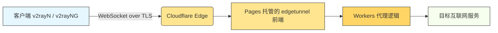

:::tip
实际通信中，所有流量经由 Cloudflare 全球 300+ 边缘节点中转，具备天然的 CDN 加速与抗封锁能力。
:::

---

## 2. 前置条件

在开始部署前，请确保满足以下条件：

- 一个有效的 **Cloudflare 账户**（免费版即可）
- 一个已接入 Cloudflare DNS 管理的 **自定义域名**（如 `zyhorg.cn`）
- 本地已下载开源项目压缩包：`edgetunnel-main.zip`
- 客户端设备（Windows / Android / iOS）可安装 V2Ray 客户端（如 v2rayN）

---

## 3. 部署流程详解

### 3.1 创建 Cloudflare Pages 项目

1. 登录 [Cloudflare Dashboard](https://dash.cloudflare.com)

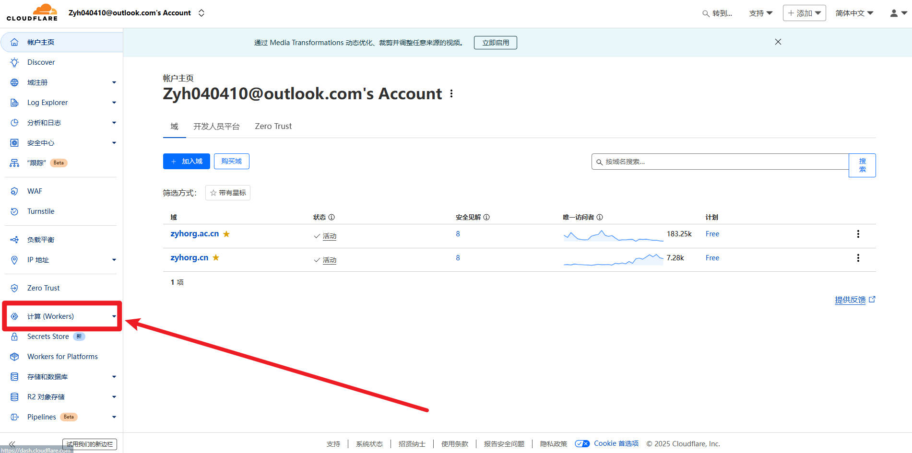

2. 进入 **Workers 和 Pages** → 点击 **创建应用程序** → 选择 **Pages**

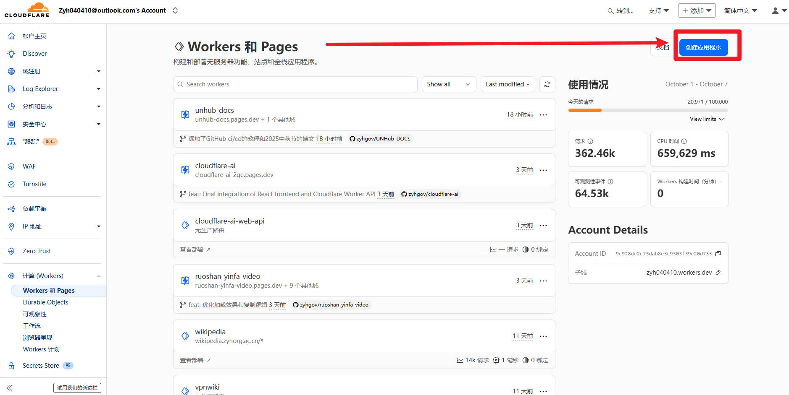

3. 选择 **导入现有 Git 存储库** 或 **拖放文件**。本文采用后者：
   - 选择 **拖放文件**
   - 将本地 `edgetunnel-main.zip` 直接上传，无需解压
   - [**点击下载 edgetunnel-main.zip** ](file/edgetunnel-main.zip)

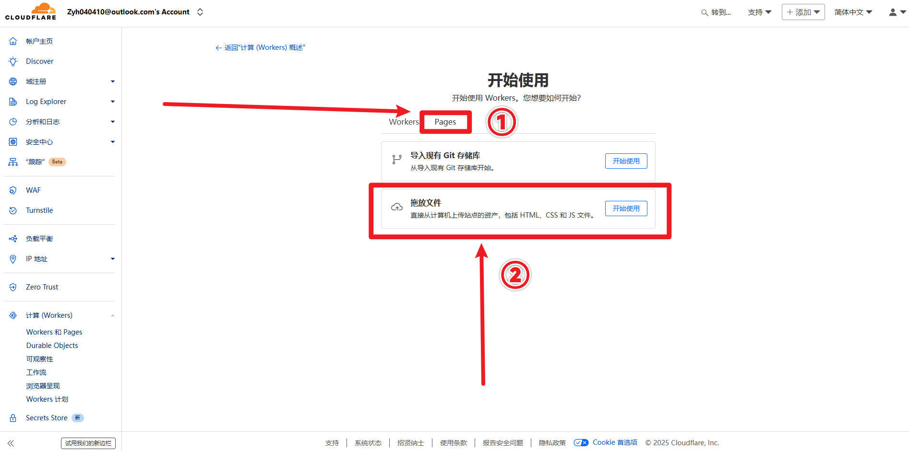

4. 项目名称建议设为 `vpn-edge`，点击 **Deploy**

:::warning
首次部署完成后，系统将分配一个临时域名，如 `https://vpn-edge.pages.dev`
:::

### 3.2 配置环境变量（UUID）

为确保代理服务的安全性与唯一性，需设置一个 UUID 作为访问凭证：

1. 访问 [https://1024tools.com/uuid](https://1024tools.com/uuid)
2. 点击 **生成**，复制生成的 UUID（如 `a1b2c3d4-e5f6-7890-g1h2-i3j4k5l6m7n8`）

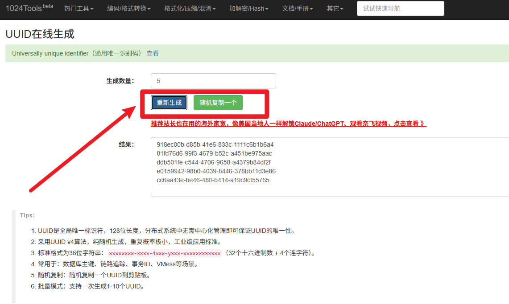

3. 返回 Pages 项目 → **设置** → **变量和机密**
4. 点击 **添加**
   - 添加 **变量和机密**
   - **Name**: `UUID`
   - **Value**: 粘贴刚生成的 UUID
   - **Type**: `Plain text`
5. 点击 **Save**

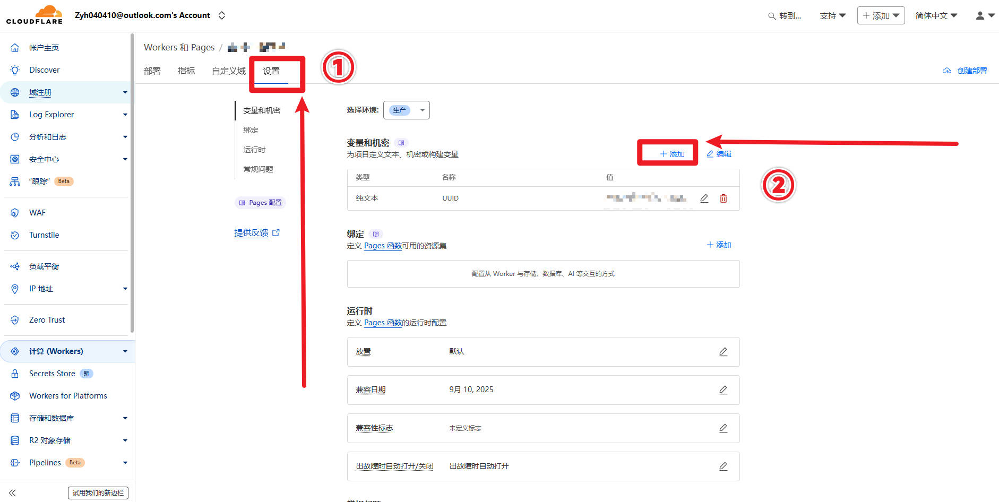

:::danger
此 UUID 将作为后续客户端连接的唯一身份标识，切勿泄露。
:::

### 3.3 绑定自定义域名

1. 在 Pages 项目中，进入 **自定义域**
2. 输入你拥有的子域名，如 `vpn.zyhorg.cn`
3. 按提示在 Cloudflare DNS 中添加 CNAME 记录（通常自动完成）
4. 等待 SSL/TLS 状态变为 **Active**（通常 1–5 分钟）

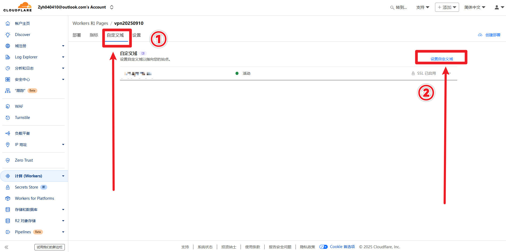

5. 返回 **部署** 页面，点击 **创建部署** 以确保新域名生效

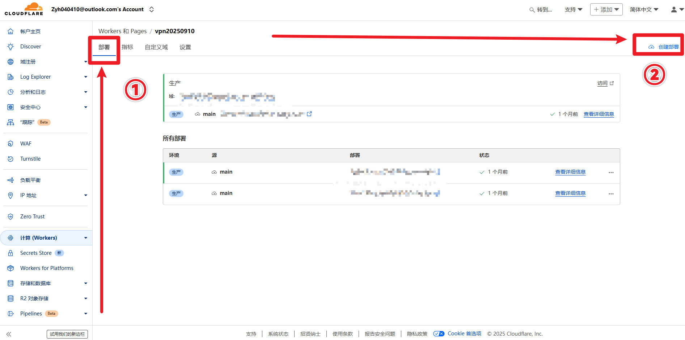

:::info
部署成功后，可通过 `https://vpn.zyhorg.cn/<UUID>` 访问服务端点。
:::

---

## 4. 客户端配置（以 Windows v2rayN 为例）

### 4.1 下载与安装

- 下载地址：`v2rayN-windows-64-desktop.zip`
- 解压后以 **管理员身份运行** `v2rayN.exe`
- [**点击下载 v2rayN-windows-64-desktop.zip** ](file/v2rayN-windows-64-desktop.zip)

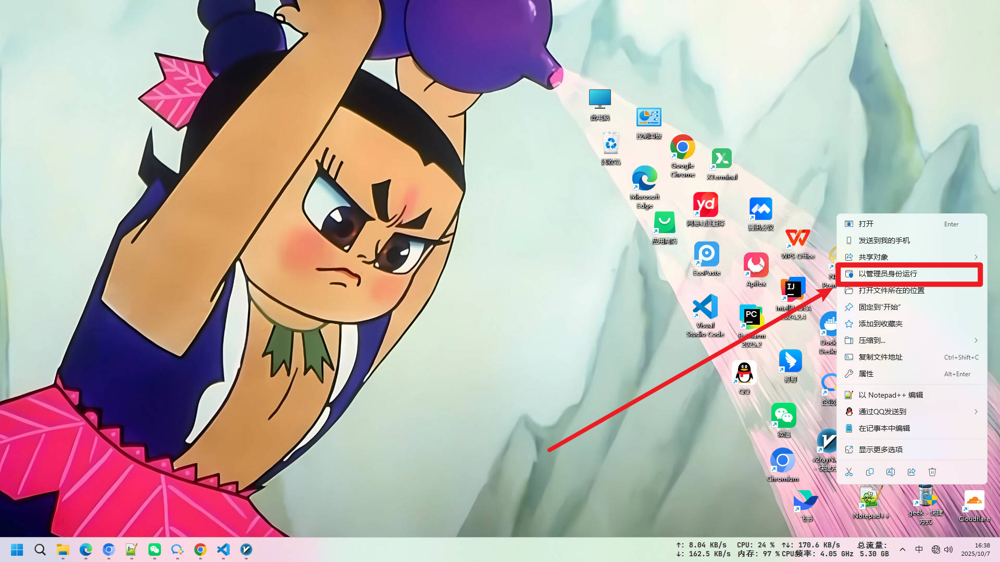

### 4.2 添加订阅

1. 点击左上角 **订阅分组** → **订阅分组设置**

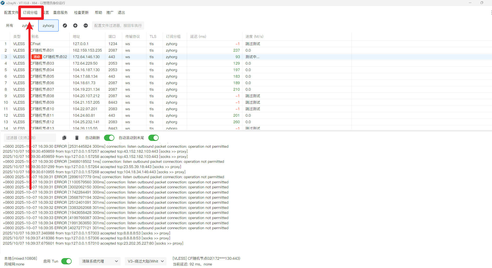

1. 点击 **添加**
   - **别名**：建议英文，如 `CF-Edge-VPN`
   - **可选地址（Url）**：填写 `https://vpn.zyhorg.cn/a1b2c3d4-e5f6-7890-g1h2-i3j4k5l6m7n8`（替换为你的实际 UUID）
2. 点击 **确定**

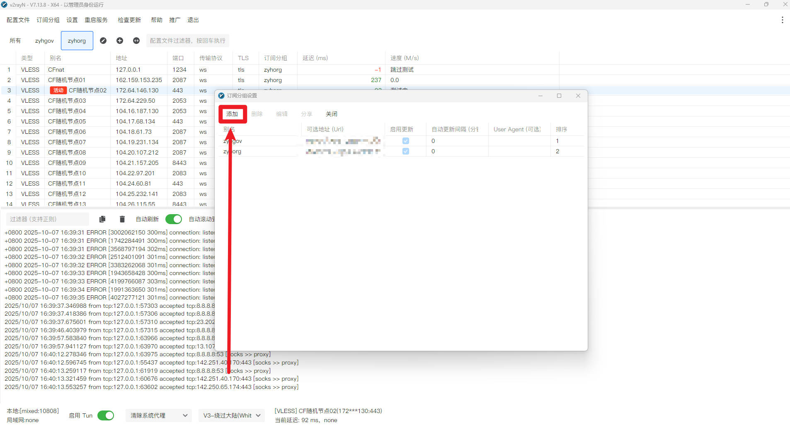
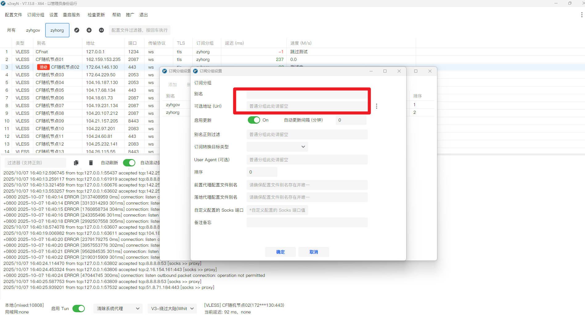

### 4.3 更新与测试节点

1. 返回主界面，点击 **订阅分组** → **更新全部订阅（不通过代理）**
2. 等待节点列表加载完成
3. 按 `Ctrl + A` 全选节点 → 右键 → **一键多线程测试延迟和速度（Ctrl+E）**
   - **绿色**：延迟正常，可用
   - **红色（-1）**：连接失败，不可用
4. 选择一条绿色节点 → 右键 → **设为活动配置文件（Enter）**

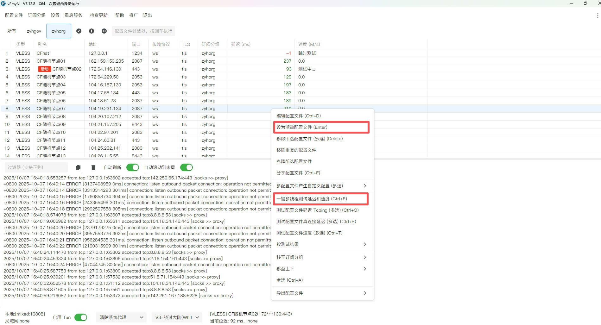

### 4.4 启用 Tun 模式（解决国内网站访问问题）

若启用代理后无法访问百度等国内网站：

- 在 v2rayN 主界面左下角勾选 **启用 Tun 模式**
- 此模式通过系统级路由实现智能分流

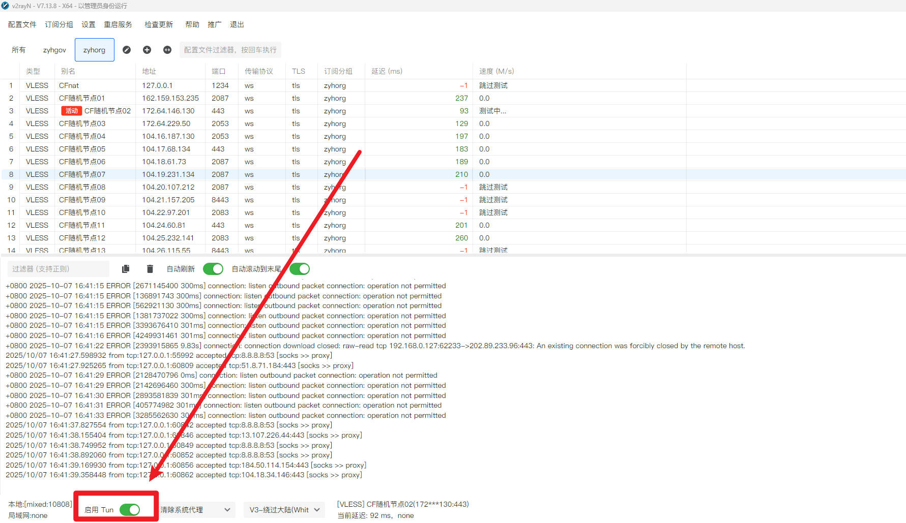

:::tip
**TUN模式**是一种**网络隧道技术**，主要用于**VPN（虚拟专用网络）**中的数据包传输。它专注于IP数据包的隧道化，与**TAP模式**不同，后者处理的是数据链路层的数据帧。TUN模式能够处理包括TCP和UDP在内的所有协议的流量，适用于需要全局代理的场景，如VPN。此外，TUN模式在Android和iOS系统中也得到了支持，使得代理客户端能够接收所有应用的网络请求，达到类似于VPN的效果。
:::

---

## 5. 安全性与注意事项

- **UUID 保密性**：UUID 相当于访问密钥，泄露将导致他人滥用你的边缘节点。
- **免费额度限制**：Cloudflare Workers 免费计划为每日 10 万次请求，Pages 为无限流量但有构建次数限制，个人使用通常足够。
- **非传统 VPN**：本方案本质为 WebSocket 代理，不提供完整网络层隧道，不适用于需要 UDP 或特定协议的场景。
- **合规性提醒**：请确保使用符合当地法律法规，仅用于合法合规的网络访问需求。

---

## 6. 总结

本文提供了一套基于 Cloudflare 边缘计算生态的轻量级私人代理部署方案。通过 Pages 托管静态资源、Workers 执行代理逻辑，并结合 UUID 认证机制，实现了零服务器成本、高可用、低延迟的代理服务。该方案特别适合开发者、技术爱好者用于测试、跨境访问或隐私保护场景。

未来可进一步集成自动 UUID 轮换、访问日志监控、速率限制等功能，提升安全性与可维护性。

---

:::info
欢迎通过邮箱 info@zyhorg.cn 交流技术问题。  
本文所涉开源项目 `edgetunnel` 遵循 MIT 许可证，Cloudflare 为注册商标，V2Ray 为社区驱动项目，本文不构成任何商业推广。
:::