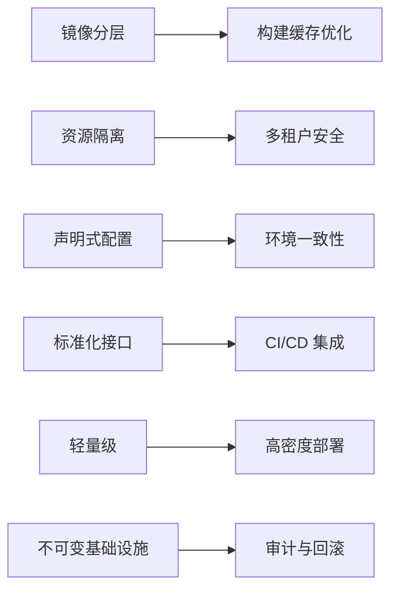
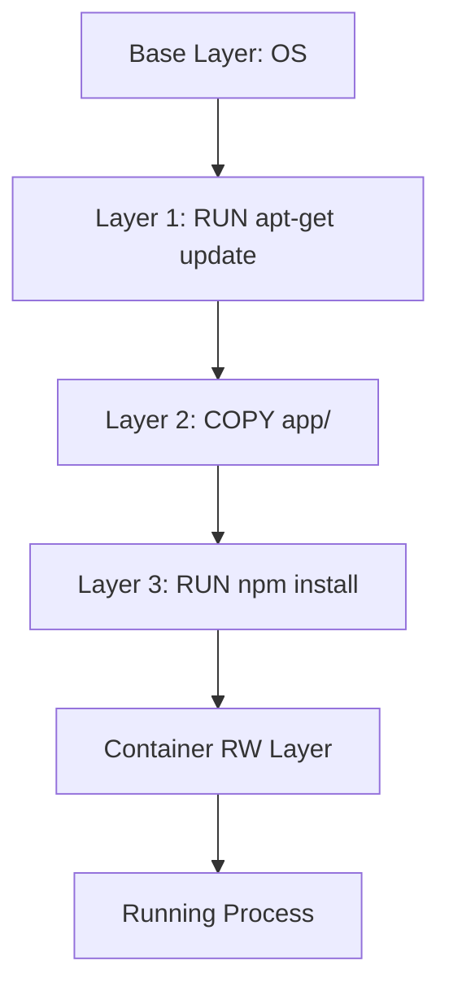
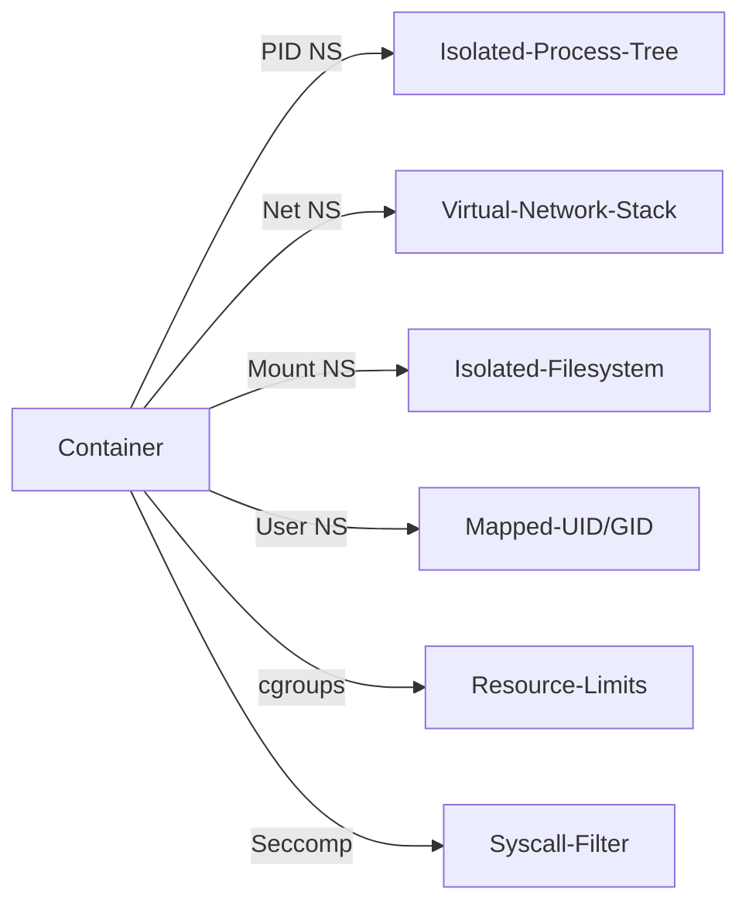
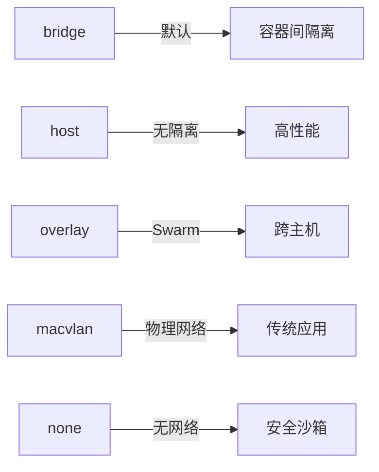
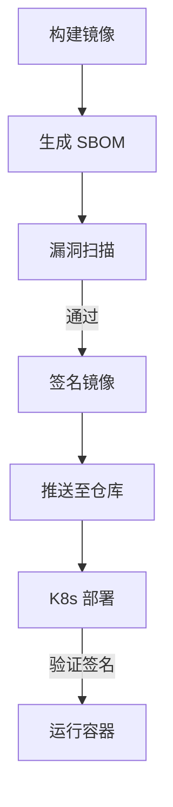
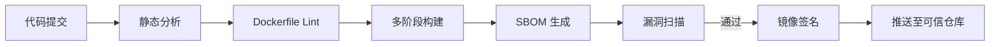
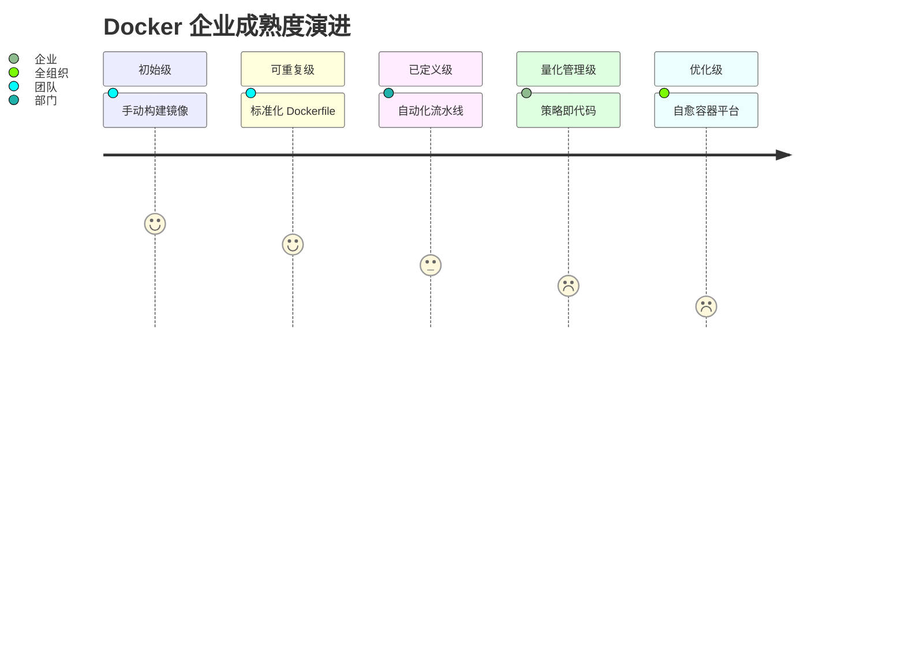

# Docker 企业级容器化开发与运维标准指南

> **版本**：2.1  
> **最后更新**：2025年4月  
> **编写**：杖雍皓  
> **适用对象**：DevOps 工程师、SRE、平台架构师、安全合规官  
> **目标**：掌握 Docker 核心原理、企业级镜像构建规范、安全策略与生产运维实践  
> **遵循标准**：OCI Runtime & Image Specification 1.1、CIS Docker Benchmark v2.0、NIST SP 800-190

---

## 1. 引言：Docker 在云原生基础设施中的战略地位

Docker 作为容器化技术的事实标准，通过**操作系统级虚拟化**实现了应用的**环境一致性、资源隔离与快速交付**。在企业环境中，Docker 不仅是开发测试工具，更是**微服务架构的运行时载体、CI/CD 流水线的标准化单元、安全合规的执行边界**。

截至 2024 年，全球 **78% 的企业**在生产环境中使用容器技术（CNCF Survey 2023），其中 Docker（含兼容实现）占据主导地位。然而，不当使用 Docker 会导致**镜像膨胀、安全漏洞、资源争抢**等严重问题。企业级实践必须超越“能跑就行”的容器思维，建立**全生命周期治理模型**。

### 1.1 Docker 企业价值维度



### 1.2 本指南覆盖范围

- **核心原理**：镜像分层、联合文件系统、命名空间与 cgroups
- **镜像构建**：Dockerfile 最佳实践、多阶段构建、SBOM 生成
- **运行时安全**：最小权限、Seccomp、AppArmor、只读文件系统
- **网络与存储**：CNI 兼容网络、持久化卷策略
- **生产运维**：日志管理、健康检查、资源限制
- **治理与合规**：镜像扫描、签名验证、策略即代码

---

## 2. Docker 核心架构原理

### 2.1 镜像与容器模型

Docker 采用**分层镜像 + 写时复制（CoW）** 模型：



- **镜像层（Image Layer）**：只读、内容寻址（SHA256）
- **容器层（Container Layer）**：可写、存储运行时变更
- **联合挂载（Union Mount）**：OverlayFS/AUFS 将多层合并为单一视图

> **企业意义**：  
> - 分层实现**构建缓存复用**，加速 CI/CD  
> - CoW 保证**镜像不可变性**，符合安全审计要求

### 2.2 隔离机制

Docker 依赖 Linux 内核特性实现隔离：

| 隔离维度 | 内核机制 | 企业配置 |
|----------|----------|----------|
| **进程** | PID Namespace | `--pid=host`（慎用）|
| **网络** | Network Namespace | 自定义 CNI 网络 |
| **文件系统** | Mount Namespace | 只读根文件系统 |
| **用户** | User Namespace | 非 root 用户运行 |
| **资源** | cgroups v2 | CPU/Memory 限制 |
| **系统调用** | Seccomp | 默认过滤器 |



---

## 3. 企业级 Dockerfile 编写规范

### 3.1 基础原则

- **最小化镜像**：仅包含运行必需组件
- **不可变性**：避免运行时安装软件
- **可重现性**：固定依赖版本
- **安全性**：非 root 用户运行

### 3.2 标准化 Dockerfile 模板

```dockerfile showLineNumbers=true
# Stage 1: 构建阶段
FROM golang:1.22-alpine AS builder
WORKDIR /app
COPY go.mod go.sum ./
RUN go mod download
COPY . .
RUN CGO_ENABLED=0 GOOS=linux go build -o main .

# Stage 2: 运行阶段
FROM gcr.io/distroless/static:nonroot
WORKDIR /
COPY --from=builder /app/main .
USER nonroot:nonroot
EXPOSE 8080
HEALTHCHECK --interval=30s --timeout=3s --start-period=5s --retries=3 \
    CMD ["/main", "--health"]
ENTRYPOINT ["/main"]
```

> **关键实践**：  
> - 使用 **多阶段构建** 分离构建与运行环境  
> - 基于 **Distroless** 或 **Scratch** 镜像  
> - 显式声明 **HEALTHCHECK**  
> - 使用 **非 root 用户**

### 3.3 安全加固指令

| 指令 | 说明 | 企业规范 |
|------|------|----------|
| `USER nonroot` | 切换非 root 用户 | **必须** |
| `COPY --chown=nonroot:nonroot` | 设置文件属主 | |
| `RUN chmod 600 secrets` | 限制敏感文件权限 | |
| `VOLUME ["/data"]` | 声明持久化目录 | |
| `LABEL org.opencontainers.image.source` | 添加元数据 | SBOM 生成 |

> **禁止行为**：  
> - `RUN chmod 777`  
> - 硬编码密钥（`ENV SECRET=xxx`）  
> - 使用 `latest` 标签

---

## 4. 运行时安全策略

### 4.1 最小权限原则

```bash showLineNumbers=true
# 以非 root 用户运行
docker run --user 1000:1000 app

# 只读根文件系统
docker run --read-only app

# 临时文件系统
docker run --tmpfs /tmp:rw,noexec,nosuid app
```

### 4.2 系统调用过滤（Seccomp）

Docker 默认启用 Seccomp 过滤器，企业可定制：

```json
{
  "defaultAction": "SCMP_ACT_ERRNO",
  "syscalls": [
    {
      "name": "clone",
      "action": "SCMP_ACT_ALLOW",
      "args": []
    }
  ]
}
```

```bash showLineNumbers=true
docker run --security-opt seccomp=profile.json app
```

### 4.3 强制访问控制（AppArmor/SELinux）

```bash showLineNumbers=true
# AppArmor（Ubuntu）
docker run --security-opt apparmor=my-profile app

# SELinux（RHEL）
docker run --security-opt label=type:container_t app
```

### 4.4 能力限制（Capabilities）

```bash showLineNumbers=true
# 仅保留必要能力
docker run --cap-drop ALL --cap-add NET_BIND_SERVICE app
```

> **默认能力集**：  
> Docker 默认保留约 14 个能力（如 `NET_BIND_SERVICE`, `CHOWN`），企业应进一步缩减。

---

## 5. 网络与存储策略

### 5.1 网络模型

Docker 支持多种网络驱动：



> **企业推荐**：  
> - 开发环境：`bridge`  
> - 生产环境：**CNI 插件**（Calico, Cilium）替代原生网络

### 5.2 持久化存储

| 类型 | 适用场景 | 企业规范 |
|------|----------|----------|
| **Bind Mounts** | 配置文件 | 仅限只读 |
| **Volumes** | 数据库 | 使用命名卷 |
| **tmpfs** | 临时数据 | 内存存储 |

```bash showLineNumbers=true
# 安全卷挂载
docker run -v app-data:/var/lib/mysql:Z \
           -v /etc/app.conf:/etc/app.conf:ro \
           mysql
```

> **安全提示**：  
> - 避免挂载主机根目录（`-v /:/host`）  
> - 使用 `:Z` 或 `:z` 标签处理 SELinux 上下文

---

## 6. 生产运维最佳实践

### 6.1 资源限制

```bash showLineNumbers=true
# CPU 限制
docker run --cpus=1.5 --cpu-shares=512 app

# 内存限制
docker run --memory=512m --memory-swap=512m app

# PID 限制
docker run --pids-limit=100 app
```

> **cgroups v2 优势**：  
> - 统一资源控制器  
> - 更精确的内存压力监控

### 6.2 日志管理

```bash showLineNumbers=true
# JSON 文件日志（默认）
docker run --log-driver=json-file \
           --log-opt max-size=10m \
           --log-opt max-file=3 \
           app

# 远程日志（生产推荐）
docker run --log-driver=syslog \
           --log-opt syslog-address=tcp://log-server:514 \
           app
```

### 6.3 健康检查

```dockerfile showLineNumbers=true
HEALTHCHECK --interval=30s --timeout=3s --start-period=5s --retries=3 \
    CMD curl -f http://localhost:8080/health || exit 1
```

> **Kubernetes 集成**：  
> Docker HEALTHCHECK 会被 Kubernetes Liveness/Readiness 探针覆盖

---

## 7. 镜像治理与合规

### 7.1 镜像扫描

企业必须集成 CVE 扫描：

```bash showLineNumbers=true
# Trivy 扫描
trivy image --severity CRITICAL,HIGH my-app:1.0

# Anchore 扫描
anchore-cli image add my-app:1.0
```

### 7.2 镜像签名（Notary）

```bash showLineNumbers=true
# 签名镜像
docker trust sign my-registry/app:1.0

# 验证签名
docker pull my-registry/app:1.0  # 自动验证
```

### 7.3 软件物料清单（SBOM）

```bash showLineNumbers=true
# 生成 SBOM
syft my-app:1.0 -o spdx-json > sbom.json

# 上传至仓库
cosign attach sbom --sbom sbom.json my-app:1.0
```



---

## 8. 企业级 CI/CD 集成

### 8.1 安全构建流水线



### 8.2 关键检查点

| 阶段 | 工具 | 检查项 |
|------|------|--------|
| **代码** | Hadolint | Dockerfile 规范 |
| **构建** | BuildKit | 构建缓存、secret 管理 |
| **扫描** | Trivy/Clair | CVE 修复 |
| **签名** | Cosign | 镜像完整性 |
| **部署** | OPA/Gatekeeper | 策略合规 |

> **BuildKit 优势**：  
> - 并行构建  
> - Secret 安全注入（`--secret`）  
> - 原生 SBOM 支持

---

## 9. 总结：Docker 企业成熟度模型



**核心原则**：
1. **最小化攻击面**：Distroless 镜像 + 非 root 运行
2. **不可变基础设施**：镜像签名 + SBOM
3. **策略即代码**：OPA/Gatekeeper 强制合规
4. **可观测性优先**：结构化日志 + 健康检查

---

## 附录 A：企业级 Docker 命令速查表

### 镜像构建
```bash showLineNumbers=true
# 安全构建（BuildKit）
DOCKER_BUILDKIT=1 docker build --secret id=token,src=.token \
                               --tag my-app:1.0 .

# 多平台构建
docker buildx build --platform linux/amd64,linux/arm64 \
                    --push \
                    .
```

### 安全运行
```bash showLineNumbers=true
docker run --read-only \
           --tmpfs /tmp:rw,noexec,nosuid \
           --user 1000:1000 \
           --cap-drop ALL \
           --security-opt seccomp=profile.json \
           --memory=512m \
           my-app:1.0
```

### 合规检查
```bash showLineNumbers=true
# 扫描
trivy image --exit-code 1 --severity CRITICAL my-app:1.0

# 验证签名
cosign verify --key cosign.pub my-registry/my-app:1.0
```

---

**版权声明**：本文档依据 [Apache License 2.0](https://www.apache.org/licenses/LICENSE-2.0) 发布，企业内使用需保留署名。  
**合规声明**：本指南符合 OCI Image/ Runtime Specification 1.1、CIS Docker Benchmark v2.0、NIST SP 800-190《应用容器安全指南》及 ISO/IEC 27001 信息安全管理标准。  
**反馈渠道**：info@zyhorg.cn