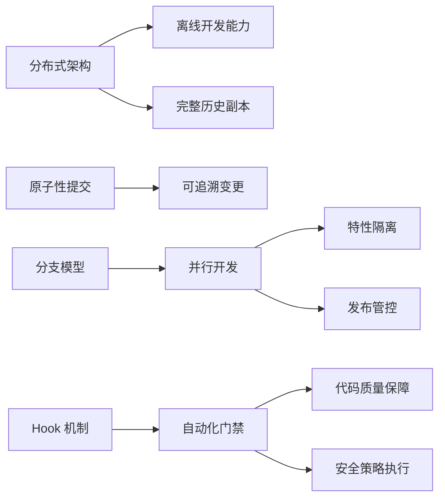
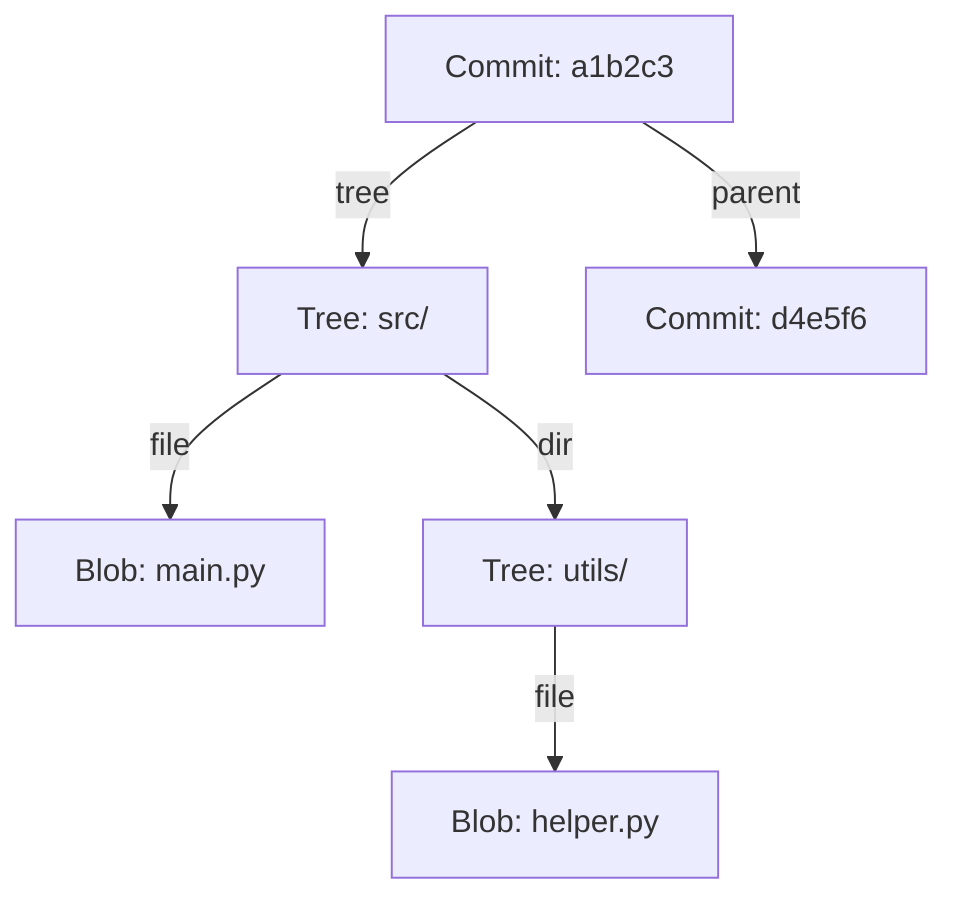
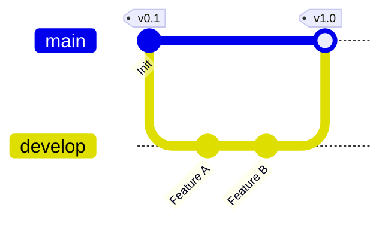
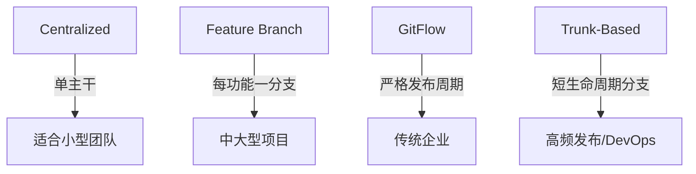
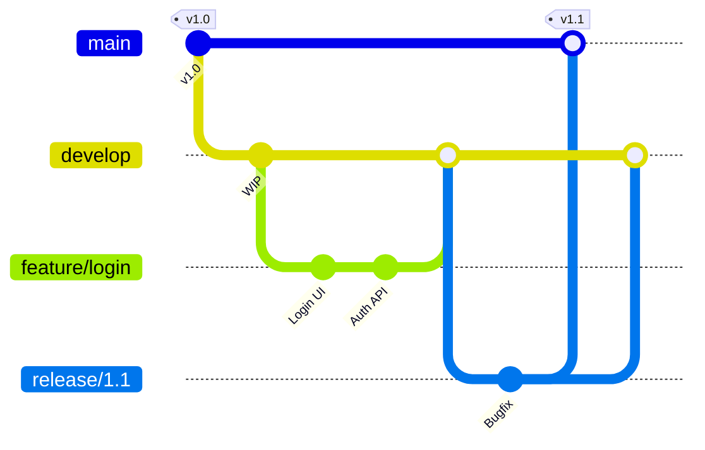
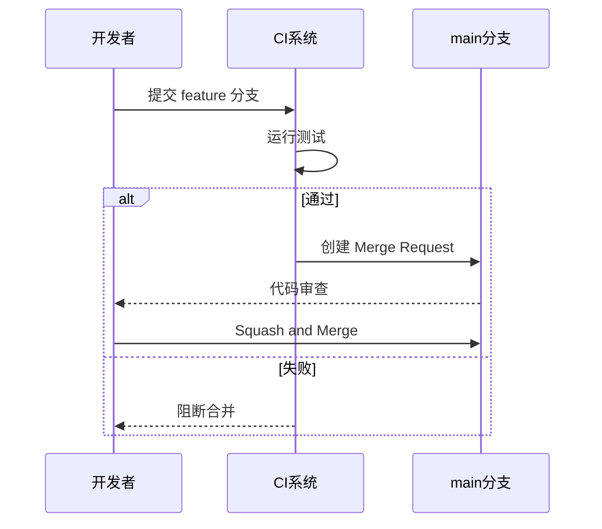
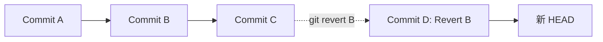
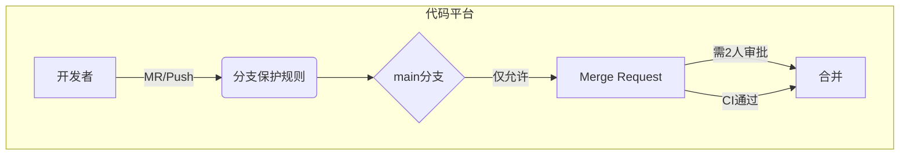
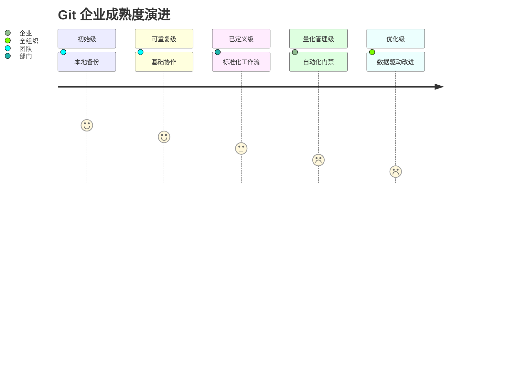

# Git 企业级开发工作流与版本控制标准指南

> **版本**：2.1  
> **最后更新**：2024年11月  
> **编写**：杖雍皓  
> **适用对象**：软件工程师、DevOps 工程师、技术负责人、代码审查员  
> **目标**：掌握 Git 核心原理、企业级协作规范、安全实践与高级工作流  
> **遵循标准**：Git 2.40+、GitFlow / Trunk-Based Development、Git Security Best Practices (CNCF)

---

## 1. 引言：Git 在现代软件工程中的战略地位

Git 作为分布式版本控制系统（DVCS），由 Linus Torvalds 于 2005 年为 Linux 内核开发而创建，已成为全球软件开发的事实标准。在企业环境中，Git 不仅是代码版本管理工具，更是**持续集成/持续交付（CI/CD）流水线的基石、协作治理的载体、安全合规的审计源**。

### 1.1 企业级 Git 的核心价值



### 1.2 本指南覆盖范围

- **核心原理**：对象模型、引用机制、三路合并
- **基础操作**：符合 POSIX 与企业安全规范
- **协作模型**：GitFlow、Trunk-Based Development（TBD）、Forking Workflow
- **工程实践**：Commit 规范、Rebasing 策略、历史重写边界
- **安全与治理**：签名验证、权限控制、审计日志

---

## 2. Git 核心原理：理解底层对象模型

企业级使用必须理解 Git 的内部机制，避免“黑盒操作”导致的历史污染或数据丢失。

### 2.1 四类核心对象

| 对象类型 | 作用 | 企业意义 |
|----------|------|----------|
| **Blob** | 存储文件内容（SHA-1 哈希） | 内容寻址，防篡改 |
| **Tree** | 目录结构（指向 Blob/Tree） | 版本快照构建 |
| **Commit** | 提交元数据（作者、时间、父提交） | 审计追踪基础 |
| **Tag** | 指向特定 Commit 的引用 | 发布版本锚点 |



> **关键特性**：  
> - 所有对象通过 SHA-1 哈希唯一标识（Git 2.40+ 支持 SHA-256 实验性切换）  
> - 对象不可变（Immutable），历史重写 = 创建新对象

### 2.2 引用（Refs）与 HEAD

- **分支（Branch）**：指向 Commit 的可移动指针（`refs/heads/feature`）
- **标签（Tag）**：指向 Commit 的静态指针（`refs/tags/v1.0.0`）
- **HEAD**：当前工作区所处的引用（通常为 `ref: refs/heads/main`）



> **企业规范**：  
> - 禁止直接操作 `.git/refs` 目录  
> - 使用 `git symbolic-ref` 管理 HEAD

---

## 3. 企业级基础操作规范

### 3.1 配置管理（`git config`）

**分层配置优先级**：  
`--system` < `--global` < `--local` < `--worktree`

```bash showLineNumbers=true
# 企业强制配置（通过脚本或 IT 策略部署）
git config --global user.name "Zhang Yonghao"
git config --global user.email "info@zyhorg.cn"
git config --global core.editor "code --wait"  # VS Code
git config --global init.defaultBranch main    # 符合行业标准
git config --global pull.rebase true           # 避免无意义 merge commit
```

> **安全要求**：  
> - 禁止在配置中硬编码凭证（使用 `credential.helper`）  
> - 启用 `transfer.fsckObjects true` 防止损坏对象推送

### 3.2 克隆与初始化

```bash showLineNumbers=true
# 深度克隆（默认）
git clone https://gitlab.company.com/project.git

# 浅克隆（CI/CD 场景优化）
git clone --depth 1 --branch main https://...

# 模板初始化（含企业预设 hooks）
git init --template=/etc/git-template project-name
```

### 3.3 暂存与提交（Staging & Committing）

```bash showLineNumbers=true
# 添加特定文件
git add src/main.py

# 交互式暂存（推荐）
git add -p  # 逐块审查变更

# 提交（必须含有意义信息）
git commit -m "feat(auth): add OAuth2 login support"
```

> **企业 Commit 规范（Conventional Commits）**：  
> ```
> <type>(<scope>): <short summary>
> 
> <optional body>
> 
> <optional footer>
> ```
> - **type**: `feat`, `fix`, `docs`, `style`, `refactor`, `perf`, `test`, `chore`  
> - **scope**: 模块名（如 `auth`, `payment`）  
> - **footer**: `BREAKING CHANGE: ...` 或 `Closes #123`

### 3.4 查看状态与差异

```bash showLineNumbers=true
# 工作区状态
git status --short  # 简洁输出

# 差异对比
git diff            # 工作区 vs 暂存区
git diff --staged   # 暂存区 vs HEAD
git diff main..feature  # 分支对比
```

---

## 4. 分支策略与企业协作模型

### 4.1 主流工作流对比



#### 4.1.1 GitFlow（适用于发布周期固定场景）



> **角色分支**：  
> - `main`：生产就绪代码（仅通过 release 合并）  
> - `develop`：集成分支  
> - `feature/*`：功能开发  
> - `release/*`：发布准备  
> - `hotfix/*`：紧急修复

#### 4.1.2 Trunk-Based Development（现代 DevOps 首选）

```mermaid
gitGraph
   commit id: "Init"
   branch main
   commit id: "Feature A"
   commit id: "Feature B"
   branch release/v1.2
   checkout release/v1.2
   commit id: "Cherry-pick fix"
   checkout main
   commit id: "Feature C"
```

> **核心原则**：  
> - 所有开发者直接向 `main` 提交（或通过短生命周期 PR）  
> - 功能开关（Feature Flags）控制未完成代码  
> - 发布分支仅用于紧急热修复

### 4.2 分支操作命令

```bash showLineNumbers=true
# 创建并切换分支
git checkout -b feature/payment

# 推送新分支（设置上游）
git push -u origin feature/payment

# 获取远程分支
git fetch origin
git checkout -t origin/hotfix/db

# 删除分支（本地/远程）
git branch -d feature/old      # 安全删除（已合并）
git push origin --delete feature/old
```

> **企业禁令**：  
> - 禁止 `git push --force`（使用 `--force-with-lease` 替代）  
> - 禁止直接向 `main`/`develop` 推送（必须通过 Merge Request / Pull Request）

---

## 5. 合并与集成策略

### 5.1 三种合并机制

| 策略 | 命令 | 适用场景 | 企业建议 |
|------|------|----------|----------|
| **Fast-forward** | `git merge` | 线性历史 | 允许（需配置） |
| **Merge Commit** | `git merge --no-ff` | 保留上下文 | GitFlow 推荐 |
| **Rebase** | `git rebase main` | 清理历史 | TBD 推荐 |



### 5.2 Rebase 的正确使用

**场景**：将特性分支变基到最新主干

```bash showLineNumbers=true
git checkout feature/payment
git fetch origin
git rebase origin/main   # 重放提交到 main 顶端
```

> **黄金法则**：  
> **Never rebase public history**  
> 仅对未推送的本地提交或个人特性分支使用 rebase

### 5.3 冲突解决流程

1. 执行合并/变基触发冲突
2. 编辑标记为 `<<<<<<<`, `=======`, `>>>>>>>` 的文件
3. `git add <resolved-file>`
4. `git rebase --continue` 或 `git merge --continue`

> **企业工具链**：  
> - 配置 `merge.tool`（如 VS Code, Beyond Compare）  
> - 使用 `git mergetool` 启动可视化工具

---

## 6. 高级操作与历史管理

### 6.1 重置与回退（Reset vs Revert）

| 命令 | 作用 | 安全性 | 企业场景 |
|------|------|--------|----------|
| `git reset --soft` | 移动 HEAD，保留暂存区 | 安全（本地） | 修改提交信息 |
| `git reset --hard` | 丢弃所有变更 | **危险** | 仅限本地分支 |
| `git revert <commit>` | 创建反向提交 | **安全** | 撤销已推送变更 |



> **强制策略**：  
> 生产分支禁止 `reset --hard`，必须使用 `revert`

### 6.2 拣选（Cherry-pick）

将特定提交应用到当前分支：

```bash showLineNumbers=true
git cherry-pick a1b2c3  # 拣选单个提交
git cherry-pick main~3..main  # 拣选范围
```

> **用途**：  
> - 热修复从 `main` 拣选到 `release` 分支  
> - 避免完整合并引入无关变更

### 6.3 Reflog 与灾难恢复

```bash showLineNumbers=true
git reflog  # 查看 HEAD 移动历史
git reset --hard HEAD@{2}  # 恢复到两步前状态
```

> **保留策略**：  
> 默认保留 90 天（`gc.reflogExpire`），企业可延长至 180 天

---

## 7. 企业级安全与治理

### 7.1 提交签名（GPG/SSH）

确保提交者身份真实性：

```bash showLineNumbers=true
# 配置 GPG 签名
git config --global commit.gpgsign true
git config --global user.signingkey YOUR_KEY_ID

# 验证签名
git log --show-signature
```

> **强制策略**：  
> 通过服务器端 hook（如 GitLab Protected Branches）要求签名

### 7.2 权限模型



**关键控制点**：
- **分支保护**：禁止 force push、要求 MR、要求 CI 通过
- **代码所有者（CODEOWNERS）**：自动请求特定团队审查
- **最小权限原则**：开发者无直接推送权限

### 7.3 审计与合规

- **完整历史不可变**：SHA-1 哈希保证内容完整性
- **审计日志**：平台记录谁在何时推送/合并
- **敏感信息扫描**：预提交 hook 拦截密钥（如 `git-secrets`）

---

## 8. 工程化最佳实践

### 8.1 .gitignore 企业模板

```gitignore
# 编译产物
*.class
*.o
build/
dist/

# IDE
.vscode/
.idea/

# 环境变量
.env
.env.local

# 日志
*.log

# 操作系统
.DS_Store
Thumbs.db
```

> **来源**：[github/gitignore](https://github.com/github/gitignore) 官方模板

### 8.2 Hook 自动化

**客户端 Hook（示例：pre-commit）**：
```bash showLineNumbers=true
#!/bin/sh
# .git/hooks/pre-commit
npm run lint
npm test
if [ $? -ne 0 ]; then
  echo "Pre-commit checks failed!"
  exit 1
fi
```

**服务端 Hook（示例：pre-receive）**：
- 验证签名
- 扫描敏感信息
- 强制 Commit 规范

> **企业推荐**：使用 [Husky](https://typicode.github.io/husky/) 管理客户端 hooks

### 8.3 大文件处理（Git LFS）

```bash showLineNumbers=true
git lfs install
git lfs track "*.psd" "*.zip"
git add .gitattributes
git add design.psd
```

> **适用场景**：  
> - 设计资源（PSD, AI）  
> - 机器学习模型  
> - 数据库转储

---

## 9. 总结：企业 Git 成熟度模型



**核心原则**：
1. **历史即契约**：提交历史是团队沟通的正式记录
2. **自动化优于人工**：通过工具链强制规范
3. **安全内建**：从提交源头保障完整性
4. **可审计性**：每行代码可追溯至责任人与上下文

---

## 附录 A：速查命令表

| 场景 | 命令 |
|------|------|
| 初始化 | `git init` / `git clone <url>` |
| 状态检查 | `git status` / `git log --oneline` |
| 提交变更 | `git add .` → `git commit -m "msg"` |
| 同步远程 | `git fetch` → `git rebase origin/main` |
| 创建分支 | `git checkout -b feature/x` |
| 提交签名 | `git commit -S -m "msg"` |
| 撤销本地提交 | `git reset --soft HEAD~1` |
| 撤销已推送 | `git revert <commit>` |
| 查看差异 | `git diff main..feature` |

---

**版权声明**：本文档依据 [Apache License 2.0](https://www.apache.org/licenses/LICENSE-2.0) 发布，企业内使用需保留署名。  
**合规声明**：本指南符合 ISO/IEC 27001 信息安全管理要求及 CNCF Git 安全最佳实践。  
**反馈渠道**：info@zyhorg.cn