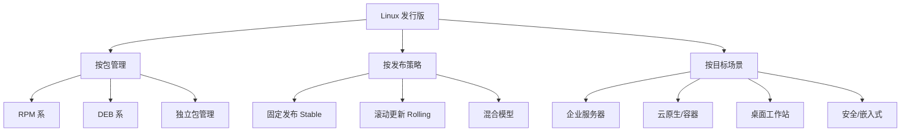
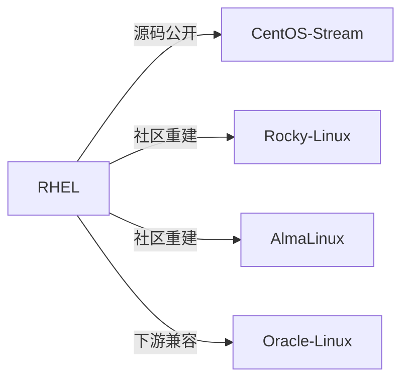
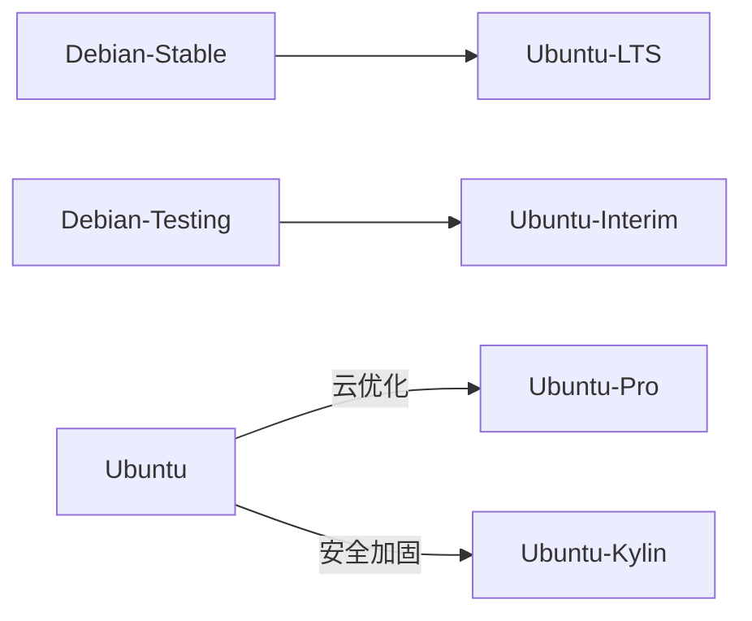
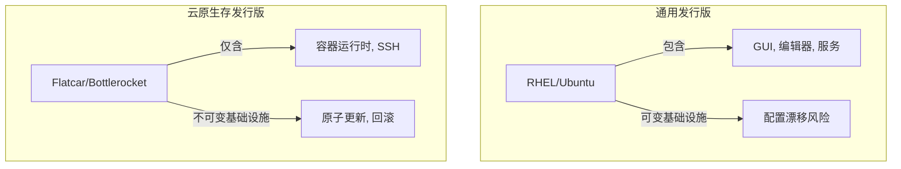
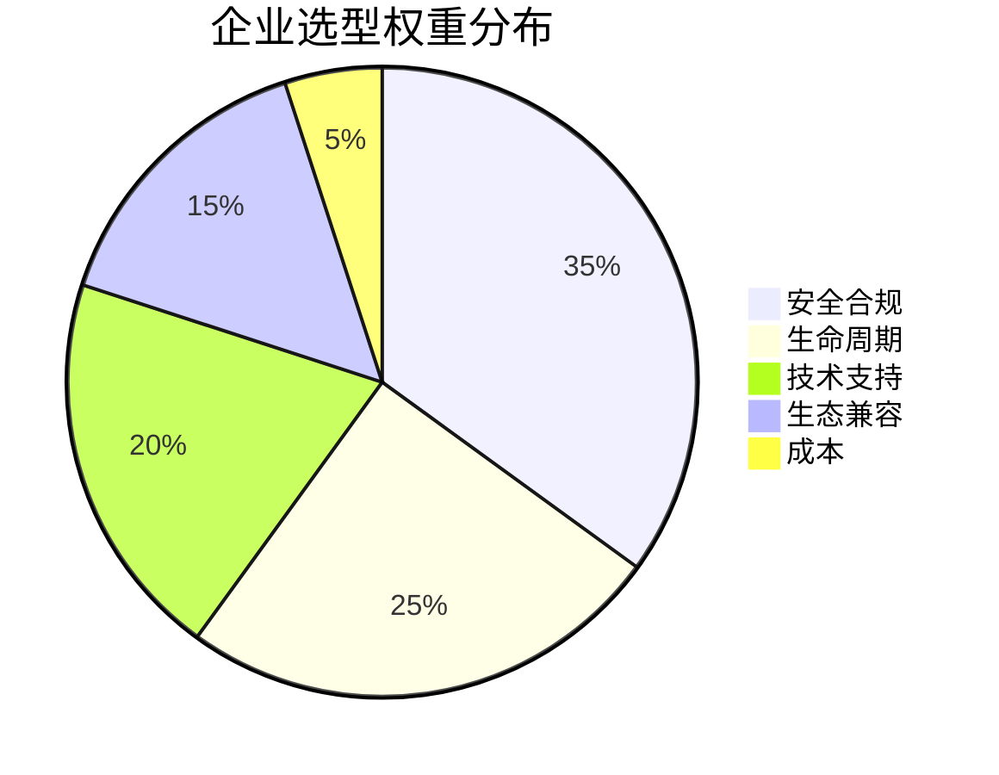
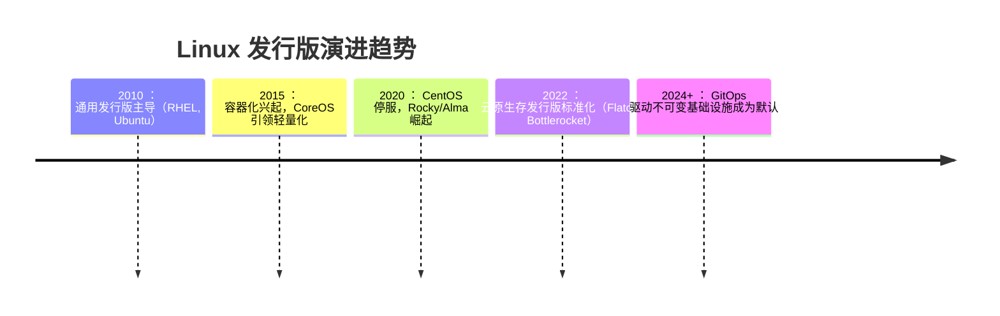

# Linux 发行版全景图谱：企业级选型指南与技术架构深度解析

> **版本**：2.1  
> **最后更新**：2024年2月  
> **编写**：杖雍皓  
> **适用对象**：系统架构师、DevOps 工程师、技术决策者、安全合规官  
> **目标**：全面掌握主流与新兴 Linux 发行版的技术特性、适用场景、生命周期策略及企业治理模型  
> **遵循标准**：LSB 5.0、FHS 3.0、NIST SP 800-123、ISO/IEC 27001、CNCF 基础设施兼容性指南

---

## 1. 引言：Linux 发行版的生态战略价值

Linux 本身仅为**内核**（由 Linus Torvalds 维护），而完整的操作系统需整合内核、GNU 工具链、库、包管理器及配置策略——这些组合构成 **Linux 发行版（Distribution）**。截至 2024 年，DistroWatch 收录的活跃发行版超过 **250 个**，形成覆盖**企业服务器、云原生、嵌入式、桌面、安全审计**等全场景的生态系统。

在企业环境中，发行版选择直接影响：
- **安全合规性**（CVE 修复速度、FIPS 认证）
- **运维成本**（生命周期、社区/商业支持）
- **技术栈兼容性**（Kubernetes、容器运行时、硬件驱动）
- **自动化治理能力**（不可变基础设施、声明式配置）

本文将系统性分类、解析并对比主流及关键利基发行版，为企业技术选型提供科学依据。

---

## 2. Linux 发行版分类模型

Linux 发行版可按**包管理模型**、**发布策略**和**目标场景**三维分类：

> **关键洞察**：  
> - **RPM/DEB 系**主导企业市场（>90% 服务器）  
> - **滚动更新**在开发者桌面流行，但企业服务器倾向**固定发布**  
> - **云原生专用发行版**正成为新范式（如 Flatcar, Bottlerocket）

---

## 3. 主流企业级发行版深度解析

### 3.1 Red Hat Enterprise Linux (RHEL) 及衍生系

#### 技术架构
- **包管理**：RPM + DNF/YUM
- **初始化系统**：systemd
- **安全框架**：SELinux（强制访问控制）
- **生命周期**：10 年（5 年全支持 + 5 年扩展生命周期）
- **认证**：FIPS 140-2, Common Criteria, PCI DSS

#### 衍生发行版对比

| 发行版 | 与 RHEL 关系 | 企业适用性 | 关键差异 |
|--------|--------------|------------|----------|
| **RHEL** | 商业发行版 | ★★★★★ | 需订阅，含官方支持、Satellite 管理 |
| **CentOS Stream** | RHEL 上游开发版 | ★★☆ | **非稳定版**，用于测试 RHEL 未来特性 |
| **Rocky Linux** | 社区重建（RHEL 下游） | ★★★★☆ | 100% 二进制兼容，免费，由 CentOS 创始人维护 |
| **AlmaLinux** | 社区重建（RHEL 下游） | ★★★★☆ | 免费，CloudLinux 背书，提供迁移工具 |
| **Oracle Linux** | RHEL 兼容 | ★★★☆ | 免费使用，UEK 内核优化，集成 Ksplice 热补丁 |

> **企业建议**：  
> - 生产环境首选 **RHEL**（合规要求高）或 **Rocky/AlmaLinux**（成本敏感）  
> - **避免 CentOS Stream 用于生产**（滚动预览版）

---

### 3.2 Debian 及衍生系

#### 技术架构
- **包管理**：DEB + APT
- **初始化系统**：systemd
- **安全框架**：AppArmor（默认），可选 SELinux
- **生命周期**：Debian Stable 约 2 年发布，5 年支持
- **哲学**：社区驱动、自由软件优先

#### 衍生发行版对比

| 发行版 | 基础 | 企业适用性 | 关键特性 |
|--------|------|------------|----------|
| **Debian Stable** | 纯社区 | ★★★★ | 极致稳定，包版本保守，适合关键基础设施 |
| **Ubuntu LTS** | Debian Unstable | ★★★★★ | 5 年 LTS 支持，Canonical 商业支持，云生态完善 |
| **Ubuntu Pro** | Ubuntu LTS | ★★★★★ | 免费安全补丁（含 FIPS/CIS），AWS/Azure 官方镜像 |
| **Linux Mint** | Ubuntu/Debian | ★★ | 桌面友好，非服务器场景 |

> **企业建议**：  
> - **Ubuntu LTS** 是云原生和 DevOps 首选（Docker、K8s 官方支持最佳）  
> - **Debian Stable** 适合对稳定性要求极高、无需最新软件的场景（如 DNS、防火墙）

---

### 3.3 滚动更新发行版：Arch Linux 与 openSUSE Tumbleweed

#### Arch Linux
- **包管理**：Pacman + AUR（用户仓库）
- **哲学**：KISS（Keep It Simple, Stupid），用户自主配置
- **适用性**：★★☆（**不推荐生产服务器**）
- **优势**：最新软件、高度定制
- **风险**：无官方支持，更新可能破坏系统

#### openSUSE
| 版本 | 模型 | 企业适用性 | 特性 |
|------|------|------------|------|
| **Leap** | 固定发布（与 SLE 共享内核） | ★★★★ | 企业级稳定，YaST 配置工具 |
| **Tumbleweed** | 滚动更新 | ★★ | 自动化测试（openQA），适合开发者 |

> **企业定位**：  
> - **openSUSE Leap** 是 SUSE Linux Enterprise (SLE) 的免费社区版，适合中型企业  
> - **Arch** 仅推荐用于个人开发机或实验环境

---

## 4. 云原生与容器专用发行版

传统通用发行版包含大量非必要组件，违背**最小化攻击面**原则。云原生时代催生专用发行版：

### 4.1 技术特征对比

### 4.2 主流云原生发行版

| 发行版 | 开发者 | 包管理 | 更新模型 | 企业适用性 |
|--------|--------|--------|----------|------------|
| **Flatcar Container Linux** | Kinvolk (现 AWS) | OSTree | 原子更新 | ★★★★☆ |
| **Bottlerocket** | AWS | 静态构建 | 原子更新 | ★★★★ |
| **RancherOS** | Rancher Labs | Docker | 容器化系统服务 | ★★（已归档） |
| **Kairos** | Kairos.io | Elemental Toolkit | GitOps 驱动 | ★★★ |

> **核心优势**：  
> - **不可变基础设施**：系统分区只读，配置通过 Ignition/cloud-init 声明  
> - **自动回滚**：更新失败自动恢复上一版本  
> - **极小攻击面**：无 shell（Bottlerocket 默认）、无包管理器

> **企业建议**：  
> - Kubernetes 节点首选 **Flatcar** 或 **Bottlerocket**  
> - 避免在通用发行版上手动部署容器运行时

---

## 5. 安全与嵌入式专用发行版

### 5.1 安全加固发行版

| 发行版 | 目标 | 关键技术 | 企业场景 |
|--------|------|----------|----------|
| **Kali Linux** | 渗透测试 | 预装 600+ 安全工具 | 红队/安全审计 |
| **Parrot OS** | 安全/隐私 | Tor 集成、匿名化 | 数字取证 |
| **Qubes OS** | 隔离安全 | Xen 虚拟化、安全域 | 高敏感操作（记者、活动家） |

> **注意**：**Kali 不可用于生产服务器**（默认弱密码、开放服务）

### 5.2 嵌入式与 IoT 发行版

| 发行版 | 基础 | 特性 | 适用场景 |
|--------|------|------|----------|
| **Yocto Project** | 构建框架 | 高度定制化 | 工业设备、路由器 |
| **Buildroot** | 构建系统 | 轻量（小于5MB） | 资源受限设备 |
| **OpenWrt** | Linux | 路由器专用 | 网络设备固件 |

---

## 6. 企业级选型决策矩阵

### 6.1 关键评估维度

### 6.2 发行版能力

### 主流发行版能力对比（5分制）

| 发行版         | 安全合规 | 生命周期 | 云生态 | 易用性 | 社区支持 |
|----------------|----------|----------|--------|--------|----------|
| **RHEL**       | 4.8      | 5.0      | 4.5    | 3.5    | 4.0      |
| **Ubuntu LTS** | 4.2      | 4.5      | 5.0    | 4.8    | 5.0      |
| **Rocky Linux**| 4.5      | 4.5      | 4.0    | 3.8    | 4.2      |
| **Flatcar**    | 4.7      | 4.0      | 4.8    | 2.0    | 3.5      |

### 6.3 场景化推荐

| 业务场景 | 推荐发行版 | 理由 |
|----------|------------|------|
| **金融核心系统** | RHEL / Rocky Linux | 长生命周期、FIPS 认证、强支持 |
| **公有云 Web 应用** | Ubuntu LTS / Ubuntu Pro | 云厂商深度集成、快速 CVE 修复 |
| **Kubernetes 节点** | Flatcar / Bottlerocket | 不可变基础设施、最小攻击面 |
| **CI/CD 构建节点** | Ubuntu LTS | 软件包最新、Docker 支持最佳 |
| **安全审计/渗透测试** | Kali Linux | 工具链完备 |
| **IoT 边缘设备** | Yocto / OpenWrt | 高度定制、资源占用低 |

---

## 7. 未来趋势与演进方向

### 7.1 技术演进

### 7.2 企业治理建议

1. **标准化**：全组织统一 1-2 个发行版，降低运维复杂度  
2. **生命周期对齐**：避免使用 EOL（End-of-Life）发行版  
3. **安全左移**：在 CI/CD 中集成发行版 CVE 扫描（如 Trivy, Clair）  
4. **不可变基础设施**：新项目优先采用 Flatcar/Bottlerocket  
5. **供应商锁定评估**：避免深度依赖单一商业发行版特性

---

## 8. 总结：构建企业 Linux 战略

Linux 发行版选择是**技术决策与风险管理的结合**。企业应基于业务需求、合规要求和运维能力，构建分层策略：

- **核心系统**：RHEL / Rocky Linux（稳定性优先）  
- **云原生应用**：Ubuntu LTS + Flatcar（敏捷性与安全平衡）  
- **特殊场景**：专用发行版（Kali, Yocto 等）

> **终极原则**：  
> **“没有最好的发行版，只有最合适的发行版。”**  
> 选择标准应服务于业务目标，而非技术偏好。

---

## 附录 A：主流发行版生命周期速查（2024）

| 发行版 | 当前版本 | 支持截止 | 备注 |
|--------|----------|----------|------|
| **RHEL** | 9.3 | 2032-05 | 需订阅 |
| **Rocky Linux** | 9.3 | 2027-05 | 免费 |
| **Ubuntu LTS** | 22.04 | 2027-04 | 免费；Pro 扩展至 2032 |
| **Debian** | 12 (Bookworm) | 2026-06 | 社区支持 |
| **openSUSE Leap** | 15.5 | 2024-12 | 与 SLE 15 SP5 同步 |
| **Flatcar** | LTS 3510.x | 滚动更新 | 每 2 周发布，LTS 支持 6 个月 |

---

**版权声明**：本文档依据 [Apache License 2.0](https://www.apache.org/licenses/LICENSE-2.0) 发布，企业内使用需保留署名。  
**合规声明**：本指南符合 NIST SP 800-123、ISO/IEC 27001 及 CNCF 基础设施安全最佳实践。  
**数据来源**：DistroWatch, 官方发行版文档, NIST National Vulnerability Database  
**反馈渠道**：info@zyhorg.cn