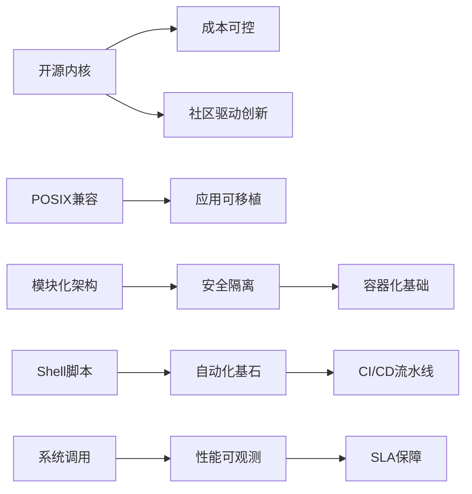
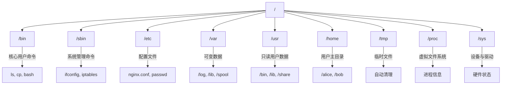
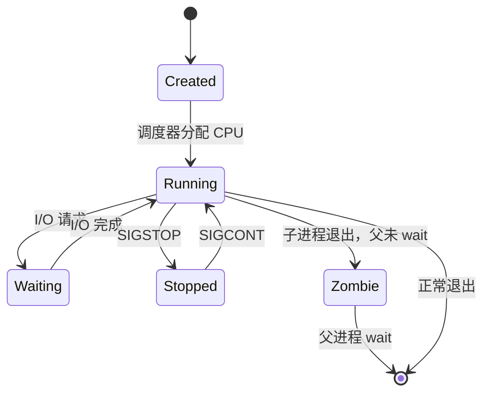
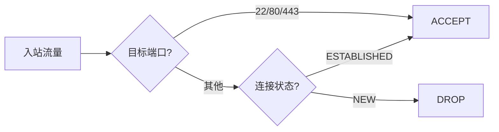
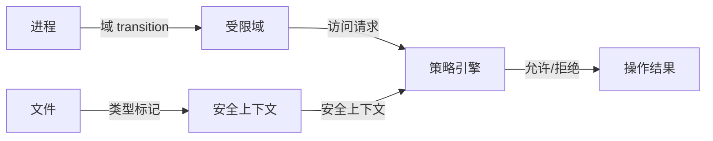
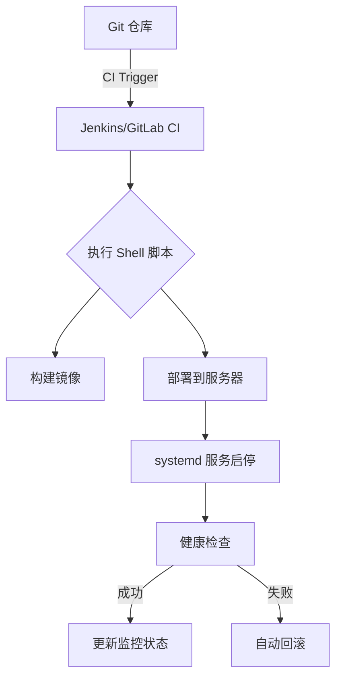
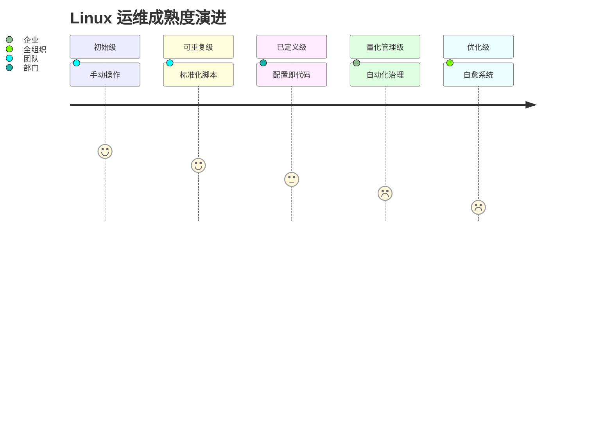

# Linux 系统操作与管理企业级教程：从基础语法到高可用架构

> **版本**：2.0  
> **最后更新**：2024年8月  
> **编写**：杖雍皓  
> **适用对象**：系统工程师、DevOps 工程师、SRE、安全审计员、云平台运维人员  
> **目标**：掌握 Linux 核心命令语法、系统架构原理、企业级运维规范与自动化实践  
> **遵循标准**：POSIX.1-2017、LSB 5.0、FHS 3.0、NIST SP 800-123 安全指南

---

## 1. 引言：Linux 在企业基础设施中的战略地位

Linux 作为开源、模块化、高度可定制的操作系统内核，支撑着全球 **90% 以上的公有云实例、100% 的 TOP500 超算、以及绝大多数关键业务系统**。在企业环境中，Linux 不仅是运行时环境，更是**安全边界、资源调度单元、可观测性数据源**和**自动化治理的执行载体**。

### 1.1 企业级 Linux 的核心价值维度



### 1.2 本教程覆盖范围

- **基础语法**：Shell 命令结构、通配符、重定向、管道
- **文件系统**：FHS 标准、权限模型、inode 机制
- **进程管理**：生命周期、调度、资源限制
- **网络配置**：IP 栈、防火墙、服务暴露
- **安全加固**：SELinux/AppArmor、审计日志、最小权限
- **工程实践**：脚本规范、日志管理、监控集成

---

## 2. Shell 基础语法：命令执行模型

### 2.1 命令结构解析

Linux 命令遵循统一语法范式：

```bash showLineNumbers=true
command [options] [arguments]
```

- **command**：可执行程序（二进制、脚本、内建命令）
- **options**：以 `-`（短选项）或 `--`（长选项）开头的修饰符
- **arguments**：命令操作的对象（文件、用户、服务等）

> **企业规范**：  
> - 优先使用长选项（`--help` 而非 `-h`）提升脚本可读性  
> - 避免依赖选项顺序（POSIX 不保证）

### 2.2 通配符与扩展

| 通配符 | 含义 | 企业示例 |
|--------|------|----------|
| `*` | 匹配任意字符（不含隐藏文件） | `rm *.log` |
| `?` | 匹配单个字符 | `ls file?.txt` |
| `[abc]` | 匹配括号内任一字符 | `ls [A-Z]*.conf` |
| `{1..5}` | 序列扩展（Bash） | `touch file{1..5}.txt` |
| `~` | 用户主目录 | `cd ~/projects` |

> **安全提示**：  
> 通配符由 Shell 展开，**非命令本身处理**。避免 `rm *` 误操作，建议先 `echo *` 预览。

### 2.3 重定向与管道

#### 重定向（Redirection）

| 操作符 | 作用 | 企业用途 |
|--------|------|----------|
| `>` | 覆盖写入标准输出 | `date > timestamp.log` |
| `>>` | 追加写入标准输出 | `echo "event" >> audit.log` |
| `2>` | 覆盖写入标准错误 | `command 2> error.log` |
| `&>` | 同时重定向 stdout 和 stderr | `script.sh &> run.log` |
| `<` | 从文件读取标准输入 | `mysql < schema.sql` |

#### 管道（Pipes）

```bash showLineNumbers=true
# 单管道：前一命令输出 → 后一命令输入
ps aux | grep nginx

# 多管道：链式处理
journalctl -u app.service | grep "ERROR" | awk '{print $5}' | sort | uniq -c
```


> **性能提示**：  
> 管道避免中间文件，减少 I/O 开销，适用于流式处理。

---

## 3. 文件系统与权限模型

### 3.1 FHS（Filesystem Hierarchy Standard）企业布局



> **企业规范**：  
> - 应用日志必须写入 `/var/log/<app>/`  
> - 自定义软件安装至 `/opt/<vendor>/`  
> - 禁止在 `/` 下创建非标准目录

### 3.2 权限模型：UGO + ACL + Capabilities

#### 传统权限（rwx）

```bash showLineNumbers=true
$ ls -l /etc/shadow
-r-------- 1 root root 1234 Jun 1 10:00 /etc/shadow
```

- **第一位**：文件类型（`-`=普通文件, `d`=目录, `l`=链接）
- **2-4位**：所有者（User）权限
- **5-7位**：所属组（Group）权限
- **8-10位**：其他用户（Other）权限

#### 修改权限

| 命令 | 说明 | 企业场景 |
|------|------|----------|
| `chmod 644 file` | 数字模式（r=4, w=2, x=1） | 配置文件 |
| `chmod u+x script.sh` | 符号模式 | 脚本执行 |
| `chown alice:dev team.txt` | 更改所有者与组 | 协作目录 |
| `chgrp ops /var/log/app` | 仅改组 | 日志轮转 |

#### 高级权限控制

- **ACL（Access Control List）**：  
  ```bash showLineNumbers=true
  setfacl -m u:backup:r /etc/secrets  # 授予 backup 用户读权限
  getfacl /etc/secrets                # 查看 ACL
  ```

- **Capabilities（能力）**：  
  ```bash showLineNumbers=true
  setcap cap_net_bind_service+ep /usr/bin/nginx  # 允许非 root 绑定 80 端口
  ```

> **安全原则**：  
> **最小权限原则（PoLP）** — 进程仅拥有完成任务所需的最小权限集。

---

## 4. 进程与资源管理

### 4.1 进程生命周期



### 4.2 进程查看与控制

| 命令 | 说明 | 企业用途 |
|------|------|----------|
| `ps aux` | 列出所有进程 | 故障排查 |
| `ps -ef --forest` | 树状显示父子进程 | 服务依赖分析 |
| `top` / `htop` | 实时资源监控 | 性能瓶颈定位 |
| `kill -9 <PID>` | 强制终止进程 | 紧急恢复 |
| `kill -TERM <PID>` | 优雅终止（默认） | 服务重启 |
| `pkill -f "nginx"` | 按名称终止 | 批量操作 |
| `nice -n 10 command` | 降低优先级 | 后台任务 |
| `renice -n -5 <PID>` | 动态调整优先级 | 关键进程提权 |

### 4.3 资源限制（cgroups v2）

企业级系统通过 cgroups 限制进程资源：

```bash showLineNumbers=true
# 创建资源组
mkdir /sys/fs/cgroup/app

# 限制内存为 512MB
echo "536870912" > /sys/fs/cgroup/app/memory.max

# 将进程加入组
echo $PID > /sys/fs/cgroup/app/cgroup.procs
```

> **云原生集成**：  
> Kubernetes Pod 资源限制底层即 cgroups。

---

## 5. 网络配置与服务管理

### 5.1 网络栈操作

| 命令 | 说明 | 企业规范 |
|------|------|----------|
| `ip addr show` | 查看 IP 地址（替代 ifconfig）| 标准命令 |
| `ip route show` | 查看路由表 | |
| `ss -tuln` | 查看监听端口（替代 netstat）| 高性能 |
| `ping -c 4 google.com` | 连通性测试 | 基础诊断 |
| `traceroute google.com` | 路径追踪 | 网络问题定位 |
| `dig example.com` | DNS 查询 | 替代 nslookup |

### 5.2 防火墙（nftables/iptables）

企业环境必须启用主机防火墙：

```bash showLineNumbers=true
# 允许 SSH 和 HTTP
nft add rule inet filter input tcp dport {22, 80, 443} accept
nft add rule inet filter input ct state established,related accept
nft add rule inet filter input drop
```



> **安全策略**：  
> 默认拒绝所有入站，显式放行必要端口。

### 5.3 服务管理（systemd）

现代 Linux 使用 systemd 管理服务：

| 命令 | 说明 |
|------|------|
| `systemctl start nginx` | 启动服务 |
| `systemctl enable nginx` | 开机自启 |
| `systemctl status nginx` | 查看状态 |
| `systemctl restart nginx` | 重启服务 |
| `journalctl -u nginx` | 查看服务日志 |
| `systemctl cat nginx` | 查看服务单元文件 |

> **企业实践**：  
> - 服务单元文件存放于 `/etc/systemd/system/`  
> - 使用 `systemd-analyze` 优化启动时间

---

## 6. 安全加固与审计

### 6.1 SELinux 策略模型



常用命令：
```bash showLineNumbers=true
sestatus                    # 查看 SELinux 状态
setenforce 0                # 临时禁用（仅调试）
semanage fcontext -a -t httpd_sys_content_t "/web(/.*)?"  # 永久标记目录
restorecon -R /web          # 应用新上下文
```

### 6.2 审计日志（auditd）

记录关键系统事件：

```bash showLineNumbers=true
# 监控 /etc/passwd 修改
auditctl -w /etc/passwd -p wa -k passwd_change

# 查询审计日志
ausearch -k passwd_change
```

> **合规要求**：  
> PCI DSS、HIPAA 等法规强制要求关键文件变更审计。

---

## 7. 企业级脚本与自动化

### 7.1 Bash 脚本规范

```bash showLineNumbers=true
#!/bin/bash
# 企业脚本头
# Script: deploy-app.sh
# Author: DevOps Team
# Description: Safely deploy application with rollback
# Usage: ./deploy-app.sh <version>

set -euo pipefail  # 严格模式：错误退出、未定义变量报错、管道失败

readonly APP_VERSION="${1:-}"
readonly LOG_FILE="/var/log/deploy-$(date +%Y%m%d).log"

log() {
    echo "[$(date +'%Y-%m-%d %H:%M:%S')] $*" | tee -a "$LOG_FILE"
}

main() {
    if [[ -z "$APP_VERSION" ]]; then
        echo "Error: Version required" >&2
        exit 1
    fi
    log "Starting deployment of v${APP_VERSION}"
    # ... 部署逻辑
}

main "$@"
```

> **企业要求**：  
> - 必须包含 `set -euo pipefail`  
> - 使用 `readonly` 保护常量  
> - 日志写入标准位置并轮转

### 7.2 自动化工具链集成



---

## 8. 总结：Linux 企业成熟度模型



**核心原则**：
1. **一切皆文件**：利用虚拟文件系统（/proc, /sys）实现统一接口
2. **组合优于集成**：通过管道与重定向构建复杂逻辑
3. **安全内建**：从权限模型到强制访问控制层层防护
4. **可观测性优先**：日志、指标、追踪三位一体

---

## 附录 A：企业级命令速查表

| 类别 | 命令 |
|------|------|
| **文件操作** | `ls -l`, `cp -a`, `mv`, `rm -i`, `find / -name "*.log"` |
| **权限管理** | `chmod 600 secrets`, `chown app:app /opt/app`, `setfacl -m u:backup:r file` |
| **进程监控** | `ps auxf`, `top`, `htop`, `kill -TERM <PID>` |
| **网络诊断** | `ip addr`, `ss -tuln`, `ping`, `dig`, `tcpdump -i eth0 port 80` |
| **服务管理** | `systemctl start nginx`, `journalctl -u app -f` |
| **安全审计** | `auditctl -w /etc/shadow -p wa`, `sestatus`, `getfacl file` |
| **系统信息** | `uname -a`, `df -h`, `free -m`, `lscpu`, `lsblk` |

---

**版权声明**：本文档依据 [Apache License 2.0](https://www.apache.org/licenses/LICENSE-2.0) 发布，企业内使用需保留署名。  
**合规声明**：本指南符合 NIST SP 800-123《服务器安全指南》、CIS Linux Benchmarks 及 ISO/IEC 27001 信息安全管理要求。  
**反馈渠道**：info@zyhorg.cn