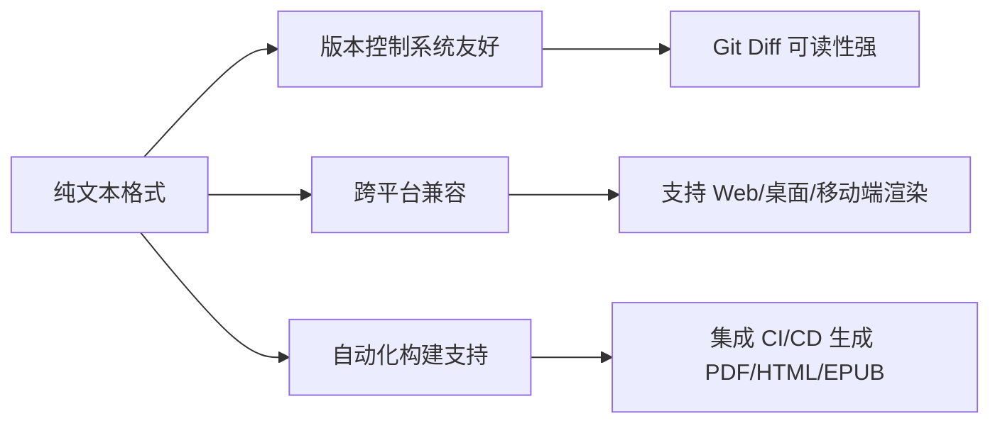
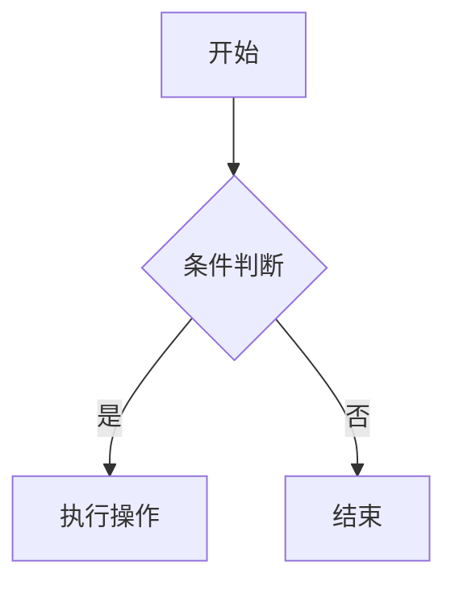
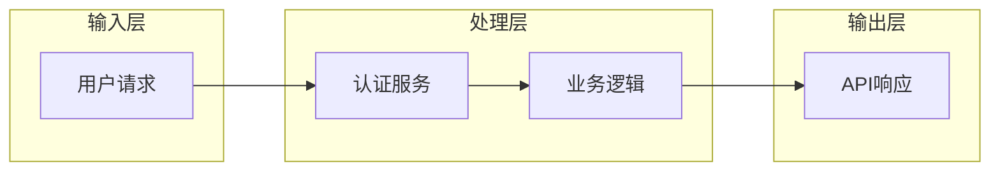
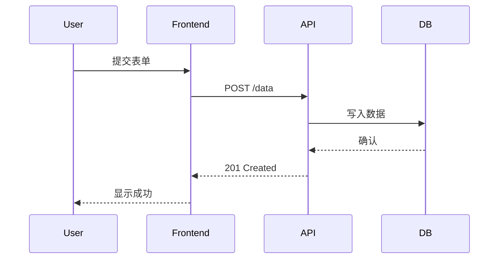
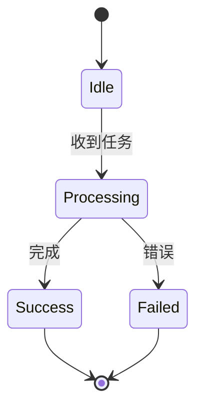
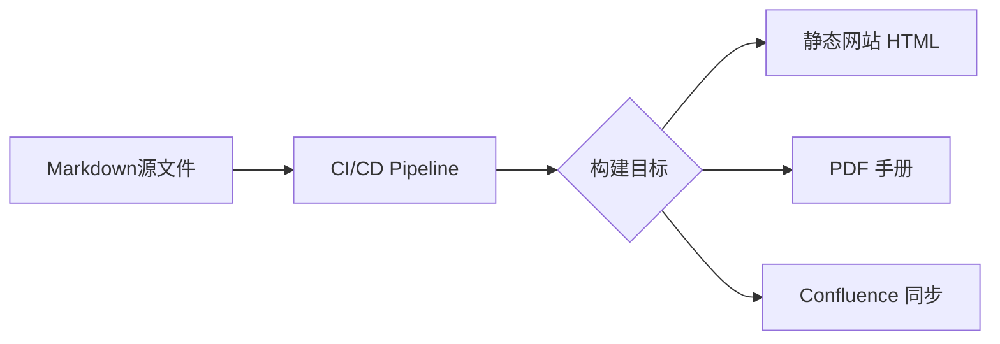

# Markdown 语法企业级教程：结构化文档编写标准与最佳实践

> **版本**：1.2  
> **最后更新**：2025年10月  
> **编写**：杖雍皓  
> **适用对象**：技术文档工程师、开发者、产品经理、知识管理者  
> **目标**：掌握 Markdown 核心语法、企业级扩展特性及工程化应用实践

---

## 1. 引言：Markdown 在企业环境中的战略价值

Markdown 是一种轻量级标记语言，由 John Gruber 于 2004 年创建，旨在以纯文本形式实现“可读性即最终输出”的写作体验。在企业级知识管理、技术文档、API 规范、内部 Wiki 和 CI/CD 自动化文档流水线中，Markdown 因其**平台无关性、版本友好性、低学习成本和高可维护性**成为事实标准。

### 1.1 企业级 Markdown 的核心优势



### 1.2 本教程覆盖范围

- **基础语法**：符合 CommonMark 规范（企业级互操作性基准）
- **扩展语法**：GitHub Flavored Markdown (GFM)、Mermaid 图表、任务列表等
- **工程实践**：目录结构、linting、自动化构建
- **安全与合规**：XSS 防护、内容策略

---

## 2. 基础语法规范（CommonMark 兼容）

企业级文档必须遵循 [CommonMark](https://commonmark.org/) 标准，确保跨解析器一致性。

### 2.1 标题（Headings）

使用 `#` 表示标题层级（1-6级），**禁止跳级**（如 H1 后直接 H3）。

```markdown showLineNumbers=true
# 一级标题（文档主标题）
## 二级标题（章节）
### 三级标题（子章节）
```

:::tip
 **企业规范**：  
 - 每个文档仅允许一个 H1  
 - 标题末尾不加标点  
 - 使用语义化标题（避免“点击这里”类描述）
:::

### 2.2 段落与换行

- 段落由一个或多个连续行组成，段间用**空行**分隔
- 行尾添加**两个或以上空格**实现硬换行（不推荐，优先用段落）

```markdown showLineNumbers=true
这是第一段。  
这是同一段内的换行（不推荐）。

这是新段落。
```

### 2.3 强调文本

| 语法 | 效果 | 企业使用场景 |
|------|------|--------------|
| `*斜体*` 或 `_斜体_` | *斜体* | 术语首次定义、强调 |
| `**粗体**` 或 `__粗体__` | **粗体** | 关键操作步骤、警告 |
| `***粗斜体***` | ***粗斜体*** | 高危操作警示 |

:::tip
 **安全提示**：避免在用户生成内容（UGC）中渲染原始 Markdown，防止 XSS（如 `**<script>alert()</script>**`）
:::

### 2.4 列表

#### 无序列表
```markdown showLineNumbers=true
- 项目一
- 项目二
  - 子项目（缩进2或4空格）
```

#### 有序列表
```markdown showLineNumbers=true
1. 第一步
2. 第二步
   1. 子步骤（缩进一致）
```

:::tip
 **企业规范**：  
 - 列表项末尾使用句号（完整句子）或无标点（短语）  
 - 嵌套层级不超过3级
:::

### 2.5 代码块

#### 行内代码
用反引号包裹： `` `console.log()` `` → `console.log()`

#### 代码块（推荐 fenced code block）

```markdown showLineNumbers=true
```python
def hello():
    print("企业级代码示例")


```

:::tip
 **企业实践**：  
 - **必须指定语言标识符**（如 `python`、`json`）  
 - 支持行号、高亮（依赖渲染器）  
 - 敏感信息（密钥、密码）需脱敏
:::

### 2.6 链接与图片

#### 链接
```markdown showLineNumbers=true
[超链接文本](https://example.com "可选标题")
```

#### 图片
```markdown showLineNumbers=true

```

:::tip
 **企业规范**：  
 - 外部链接添加 `rel="noopener noreferrer"`（安全）  
 - 图片必须提供有意义的 `alt` 文本（无障碍合规）  
 - 优先使用相对路径（文档可移植性）
:::

### 2.7 引用块

```markdown showLineNumbers=true
> 这是引用内容。
> 可跨多行。
```

:::tip
 **使用场景**：  
 - 引用标准文档条款  
 - 用户反馈摘录  
 - 第三方声明
:::

### 2.8 水平线

```markdown showLineNumbers=true
---
或
***
```

> **用途**：章节分隔（谨慎使用，避免视觉碎片化）

---

## 3. 企业级扩展语法（GFM 与 Mermaid）

### 3.1 表格（GitHub Flavored Markdown）

```markdown showLineNumbers=true
| 功能         | 支持 | 企业备注               |
|--------------|------|------------------------|
| 对齐         | ✅   | `:---` 左对齐          |
|              |      | `:---:` 居中           |
|              |      | `---:` 右对齐          |
| 复杂单元格   | ⚠️   | 避免换行，用HTML替代   |
```

> **渲染效果**：

| 功能         | 支持 | 企业备注               |
|--------------|------|------------------------|
| 对齐         | ✅   | `:---` 左对齐          |
|              |      | `:---:` 居中           |
|              |      | `---:` 右对齐          |
| 复杂单元格   | ⚠️   | 避免换行，用HTML替代   |

### 3.2 任务列表（Task Lists）

```markdown showLineNumbers=true
- [x] 完成需求分析
- [ ] 编写技术方案
- [ ] 安全审计
```

> **应用场景**：  
> - 项目进度跟踪（集成 GitHub Issues）  
> - 检查清单（Checklist）

### 3.3 删除线

```markdown showLineNumbers=true
~~已弃用的API~~ → 使用新接口
```

### 3.4 自动链接

```markdown showLineNumbers=true
<https://example.com>  # 自动转为可点击链接
<user@example.com>     # 自动转为 mailto 链接
```

---

## 4. Mermaid 图表集成（企业可视化标准）

Mermaid 允许用代码生成流程图、序列图等，**避免维护外部图片**，实现文档即代码（Docs as Code）。

### 4.1 启用 Mermaid

在支持 Mermaid 的渲染器中（如 GitLab、Obsidian、Typora、VS Code 插件），使用 fenced code block：

````markdown showLineNumbers=true

````

### 4.2 企业常用图表类型

#### 4.2.1 流程图（Flowchart）



#### 4.2.2 序列图（Sequence Diagram）



#### 4.2.3 状态图（State Diagram）



> **企业实践**：  
> - 图表代码纳入版本控制  
> - 使用语义化节点命名（避免“节点1”）  
> - 复杂图表拆分为子图（subgraph）

---

## 5. 企业级工程化实践

### 5.1 目录结构规范

```bash
docs/
├── README.md               # 项目总览
├── architecture/           # 架构文档
│   ├── overview.md
│   └── diagrams/           # Mermaid 源文件（可选）
├── api/                    # API 文档
│   └── v1/
└── guidelines/             # 编写规范
    └── markdown-style.md
```

### 5.2 Linting 与格式化

使用 [markdownlint](https://github.com/DavidAnson/markdownlint) 确保一致性：

```yaml
# .markdownlint.yaml
MD013: false  # 禁用行长度限制（代码块可能超长）
MD024:        # 禁止重复标题
  allow_different_nesting: true
MD033: false  # 允许内联HTML（必要时）
```

### 5.3 自动化构建



工具链示例：
- **静态站点**：MkDocs, Docusaurus, Hugo
- **PDF 生成**：Pandoc + LaTeX
- **Confluence 同步**：markdown-to-confluence

### 5.4 安全与合规

| 风险                | 缓解措施                          |
|---------------------|-----------------------------------|
| XSS 攻击            | 渲染前过滤 HTML 标签              |
| 敏感信息泄露        | 预提交钩子扫描密钥（如 GitGuardian）|
| 无障碍不合规        | 强制 alt 文本、语义化标题         |

---

## 6. 最佳实践总结

1. **遵循 CommonMark**：确保跨平台一致性
2. **结构化优于样式**：用标题/列表表达逻辑，而非视觉 hack
3. **Mermaid 替代截图**：图表代码化，提升可维护性
4. **自动化质量门禁**：Linting + 构建测试
5. **安全左移**：在编写阶段嵌入安全检查

> **企业级 Markdown 不是“简单语法”，而是知识工程的基础设施。**

---

## 附录 A：速查表

| 元素       | 语法示例                     |
|------------|------------------------------|
| 标题       | `# H1`                       |
| 粗体       | `**文本**`                   |
| 斜体       | `*文本*`                     |
| 链接       | `[文本](url)`                |
| 图片       | ``               |
| 代码块     | ```` ```lang\n代码\n``` ```` |
| 表格       | `\| A \| B \|\n\|---\|---\|` |
| Mermaid    | ```` ```mermaid\n图表代码\n``` ```` |

---

**版权声明**：本文档采用 [CC BY-SA 4.0](https://creativecommons.org/licenses/by-sa/4.0/) 许可，企业内使用需保留署名。  
**反馈渠道**：info@zyhorg.cn