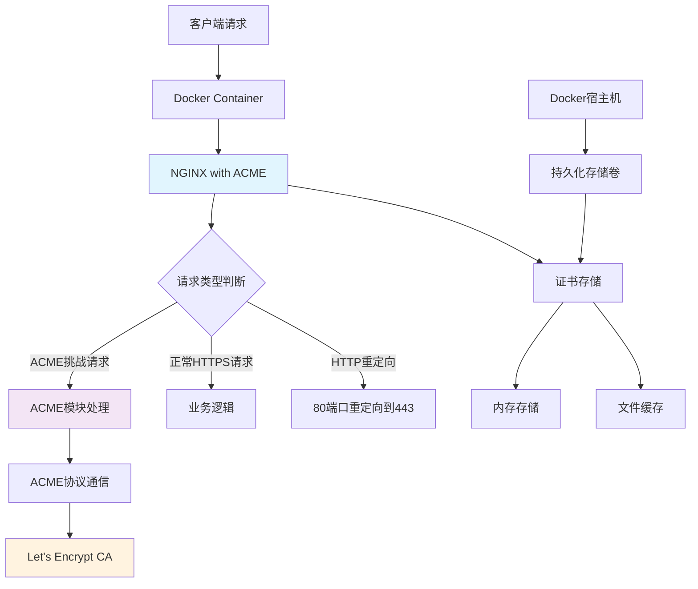
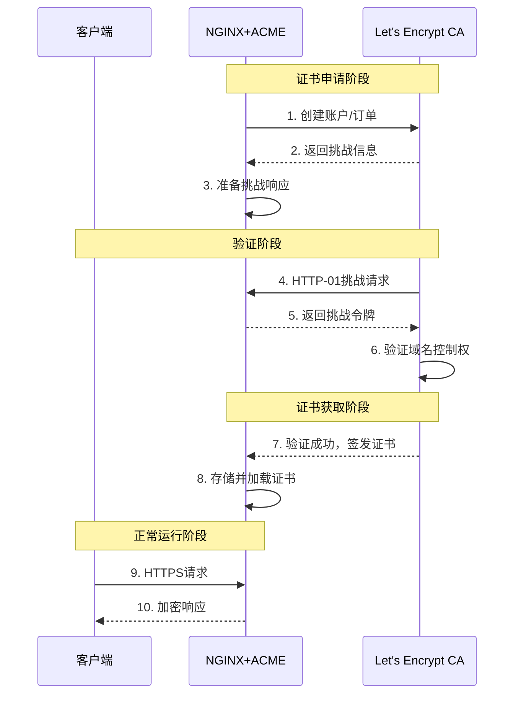
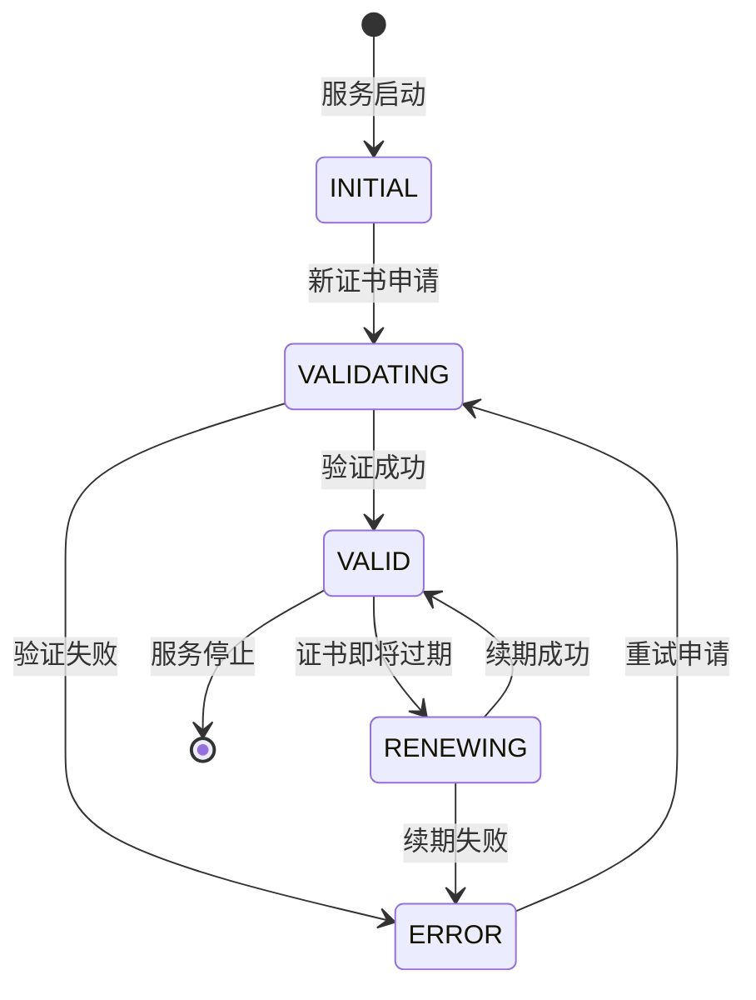

# NGINX 原生 ACME 支持：从根本上重塑 TLS 自动化部署

## 文档信息

> **文档版本** : v1.2   
> **最后更新** : 2025-10-30     
> **本文编写** : 杖雍皓     
> **项目来源** : NGINX 官方 、 杖雍皓       
> **项目官网** : https://nginx.org      
> **适用对象** : 运维工程师、DevOps工程师、SRE、系统管理员      

## 目录
1. [概述](#概述)
2. [架构设计](#架构设计)
3. [Docker环境部署](#docker环境部署)
4. [配置详解](#配置详解)
5. [工作机制分析](#工作机制分析)
6. [故障排查](#故障排查)
7. [最佳实践](#最佳实践)

## 概述

NGINX 原生 ACME 支持通过 `ngx_http_acme_module` 模块实现了 TLS 证书的自动化管理，从根本上改变了传统的证书管理范式。本技术文档针对 Docker 环境下的 Ubuntu 系统提供完整的部署和配置指南。

### 核心优势对比

| 特性 | 传统 Certbot 方案 | NGINX 原生 ACME |
|------|------------------|-----------------|
| **架构集成** | 外部依赖，独立进程 | 原生模块，深度集成 |
| **配置管理** | 分离配置，易出错 | 统一配置，IaC 友好 |
| **权限安全** | 需要高权限执行 | 标准工作进程权限 |
| **可靠性** | Cron 任务易静默失败 | 事件驱动，实时监控 |
| **维护复杂度** | 高，需维护运行时环境 | 低，NGINX 内置 |

## 架构设计

### 系统架构图



### ACME 协议时序图



## Docker环境部署

### 环境要求

| 组件 | 版本要求 | 说明 |
|------|----------|------|
| Docker | 20.10+ | 支持 BuildKit |
| NGINX | 1.25.1+ | 必须 1.25.1 以上 |
| 操作系统 | Ubuntu 20.04+ | 推荐 22.04 LTS |
| Rust工具链 | 1.70+ | 模块编译需要 |

### Dockerfile 构建

```dockerfile showLineNumbers=true
# 使用多阶段构建优化镜像大小
FROM ubuntu:22.04 as builder

# 设置环境变量
ENV NGINX_VERSION=1.28.0 \
    RUST_VERSION=stable \
    BUILD_DIR=/app/nginx-build

# 安装构建依赖
RUN apt-get update && \
    apt-get install -y \
    build-essential \
    libpcre3-dev \
    zlib1g-dev \
    libssl-dev \
    pkg-config \
    libclang-dev \
    git \
    wget \
    curl \
    ca-certificates && \
    rm -rf /var/lib/apt/lists/*

# 安装 Rust 工具链
RUN curl --proto '=https' --tlsv1.2 -sSf https://sh.rustup.rs | sh -s -- -y --default-toolchain $RUST_VERSION
ENV PATH="/root/.cargo/bin:${PATH}"

# 创建工作目录
RUN mkdir -pv $BUILD_DIR

# 下载 NGINX 和 ACME 模块源码
WORKDIR $BUILD_DIR
RUN wget https://nginx.org/download/nginx-${NGINX_VERSION}.tar.gz && \
    tar -zxf nginx-${NGINX_VERSION}.tar.gz && \
    git clone https://github.com/nginx/nginx-acme.git

# 编译 NGINX 和 ACME 模块
WORKDIR $BUILD_DIR/nginx-${NGINX_VERSION}
RUN ./configure \
    --prefix=/app/nginx \
    --error-log-path=/app/nginx/error.log \
    --http-log-path=/app/nginx/access.log \
    --pid-path=/app/nginx/nginx.pid \
    --lock-path=/app/nginx/nginx.lock \
    --http-client-body-temp-path=/app/nginx/cache/client_temp \
    --http-proxy-temp-path=/app/nginx/cache/proxy_temp \
    --http-fastcgi-temp-path=/app/nginx/cache/fastcgi_temp \
    --http-uwsgi-temp-path=/app/nginx/cache/uwsgi_temp \
    --http-scgi-temp-path=/app/nginx/cache/scgi_temp \
    --user=nginx \
    --group=nginx \
    --with-compat \
    --with-file-aio \
    --with-threads \
    --with-http_addition_module \
    --with-http_auth_request_module \
    --with-http_dav_module \
    --with-http_flv_module \
    --with-http_gunzip_module \
    --with-http_gzip_static_module \
    --with-http_mp4_module \
    --with-http_random_index_module \
    --with-http_realip_module \
    --with-http_secure_link_module \
    --with-http_slice_module \
    --with-http_ssl_module \
    --with-http_stub_status_module \
    --with-http_sub_module \
    --with-http_v2_module \
    --with-http_v3_module \
    --with-mail \
    --with-mail_ssl_module \
    --with-stream \
    --with-stream_realip_module \
    --with-stream_ssl_module \
    --with-stream_ssl_preread_module \
    --with-cc-opt='-g -O2 -ffile-prefix-map=/app/nginx-build/nginx-${NGINX_VERSION}=. -fstack-protector-strong -Wformat -Werror=format-security -Wp,-D_FORTIFY_SOURCE=2 -fPIC' \
    --with-ld-opt='-Wl,-z,relro -Wl,-z,now -Wl,--as-needed -pie' \
    --add-dynamic-module=$BUILD_DIR/nginx-acme

RUN make && make modules && make install

# 创建运行时镜像
FROM ubuntu:22.04

RUN apt-get update && \
    apt-get install -y \
    libssl3 \
    ca-certificates \
    runit && \
    rm -rf /var/lib/apt/lists/* && \
    useradd -r -s /bin/false nginx

# 从构建阶段复制文件
COPY --from=builder /app/nginx /app/nginx

# 创建必要的目录结构
RUN mkdir -pv /app/nginx/{logs,conf,cache,acme} && \
    chown -R nginx:nginx /app/nginx

# 复制配置文件
COPY nginx.conf /app/nginx/conf/nginx.conf

# 暴露端口
EXPOSE 80 443

# 健康检查
HEALTHCHECK --interval=30s --timeout=10s --start-period=5s --retries=3 \
    CMD /app/nginx/sbin/nginx -t || exit 1

# 启动命令
CMD ["/app/nginx/sbin/nginx", "-c", "/app/nginx/conf/nginx.conf", "-g", "daemon off;"]
```

### Docker Compose 配置

```yaml showLineNumbers=true
version: '3.8'

services:
  nginx-acme:
    build: .
    container_name: nginx-acme
    ports:
      - "80:80"
      - "443:443"
    volumes:
      - nginx_data:/app/nginx/acme
      - ./custom.conf:/app/nginx/conf/conf.d/custom.conf:ro
    environment:
      - TZ=UTC
    restart: unless-stopped
    networks:
      - nginx-network

  # 示例后端服务
  backend-app:
    image: your-backend-app:latest
    container_name: backend-app
    expose:
      - "8080"
    environment:
      - PORT=8080
    networks:
      - nginx-network

volumes:
  nginx_data:
    name: nginx_acme_data

networks:
  nginx-network:
    driver: bridge
```

### 自动化构建脚本

```bash showLineNumbers=true
#!/bin/bash
# build-nginx-acme.sh

set -e

NGINX_VERSION="${1:-1.28.0}"
IMAGE_NAME="nginx-acme"
IMAGE_TAG="${NGINX_VERSION}-$(date +%Y%m%d)"

echo "Building NGINX ACME image with NGINX ${NGINX_VERSION}"

# 构建 Docker 镜像
docker build \
    --build-arg NGINX_VERSION="${NGINX_VERSION}" \
    -t "${IMAGE_NAME}:${IMAGE_TAG}" \
    -t "${IMAGE_NAME}:latest" .

# 测试镜像
echo "Testing the image..."
docker run --rm "${IMAGE_NAME}:${IMAGE_TAG}" nginx -t

echo "Build completed: ${IMAGE_NAME}:${IMAGE_TAG}"
```

## 配置详解

### 核心配置模块

```nginx showLineNumbers=true
# /app/nginx/conf/nginx.conf

user nginx;
error_log  /app/nginx/logs/error.log  debug;
pid        /app/nginx/nginx.pid;

# 动态加载 ACME 模块
load_module modules/ngx_http_acme_module.so;

events {
    worker_connections  1024;
    multi_accept on;
    use epoll;
}

http {
    include       /app/nginx/conf/mime.types;
    default_type  application/octet-stream;
    
    # 日志格式
    log_format main '$remote_addr - $remote_user [$time_local] "$host" "$request" '
                    '$status $body_bytes_sent "$http_referer" '
                    '"$http_user_agent" "$http_x_forwarded_for" '
                    '"$acme_certificate_status"';
    
    access_log  /app/nginx/logs/access.log  main;
    
    sendfile        on;
    tcp_nopush      on;
    tcp_nodelay     on;
    charset utf-8;
    keepalive_timeout  65;
    gzip  on;
    
    # DNS 解析器配置（Docker 内部 DNS）
    resolver 127.0.0.11 valid=30s;
    
    # ACME 共享内存区域配置
    acme_shared_zone zone=acme_shared:2M;
    
    # ACME 颁发机构配置
    acme_issuer letsencrypt_prod {
        # Let's Encrypt 生产环境
        uri         https://acme-v02.api.letsencrypt.org/directory;
        contact     mailto:security@yourcompany.com;
        state_path  /app/nginx/acme/letsencrypt-prod;
        accept_terms_of_service;
    }
    
    acme_issuer letsencrypt_staging {
        # Let's Encrypt 测试环境
        uri         https://acme-staging-v02.api.letsencrypt.org/directory;
        contact     mailto:security@yourcompany.com;
        state_path  /app/nginx/acme/letsencrypt-staging;
        accept_terms_of_service;
    }
    
    # TLS 安全配置
    ssl_protocols TLSv1.2 TLSv1.3;
    ssl_ciphers ECDHE-ECDSA-AES128-GCM-SHA256:ECDHE-RSA-AES128-GCM-SHA256:ECDHE-ECDSA-AES256-GCM-SHA384:ECDHE-RSA-AES256-GCM-SHA384;
    ssl_prefer_server_ciphers off;
    ssl_session_cache shared:SSL:10m;
    ssl_session_timeout 1d;
    
    # 上游服务配置
    upstream backend {
        server backend-app:8080;
        keepalive 32;
    }
    
    # HTTPS 服务器配置
    server {
        listen 443 ssl http2;
        server_name example.com www.example.com;
        
        # ACME 证书声明
        acme_certificate letsencrypt_prod;
        
        # 使用 ACME 动态变量
        ssl_certificate     $acme_certificate;
        ssl_certificate_key $acme_certificate_key;
        ssl_certificate_cache max=2;
        
        # 安全头
        add_header Strict-Transport-Security "max-age=63072000; includeSubDomains; preload" always;
        add_header X-Content-Type-Options nosniff always;
        add_header X-Frame-Options DENY always;
        
        # 代理配置
        location / {
            proxy_pass http://backend;
            proxy_set_header Host $host;
            proxy_set_header X-Real-IP $remote_addr;
            proxy_set_header X-Forwarded-For $proxy_add_x_forwarded_for;
            proxy_set_header X-Forwarded-Proto $scheme;
            
            proxy_connect_timeout 30s;
            proxy_send_timeout 30s;
            proxy_read_timeout 30s;
        }
        
        # 健康检查端点
        location /health {
            access_log off;
            return 200 "healthy\n";
            add_header Content-Type text/plain;
        }
    }
    
    # HTTP 重定向服务器
    server {
        listen 80 default_server;
        server_name _;
        
        # ACME 挑战处理由模块自动完成
        # 其他所有请求重定向到 HTTPS
        location / {
            return 301 https://$host$request_uri;
        }
        
        # 自定义错误页面
        error_page 500 502 503 504 /50x.html;
        location = /50x.html {
            root /app/nginx/html;
        }
    }
}
```

### 配置指令详解

#### acme_shared_zone
```nginx showLineNumbers=true
acme_shared_zone zone=acme_shared:2M;
```

| 参数 | 说明 | 推荐值 |
|------|------|--------|
| zone | 共享内存区域名称 | acme_shared |
| size | 内存区域大小 | 1M-4M（根据域名数量） |

#### acme_issuer
```nginx showLineNumbers=true
acme_issuer <name> {
    uri <acme_directory_url>;
    contact <contact_email>;
    state_path <path>;
    accept_terms_of_service;
}
```

| 指令 | 必需 | 说明 |
|------|------|------|
| uri | 是 | ACME 目录服务 URL |
| contact | 是 | 联系邮箱 |
| state_path | 是 | 状态文件存储路径 |
| accept_terms_of_service | 是 | 接受服务条款 |

## 工作机制分析

### 代码切片分析

#### ACME 挑战处理核心逻辑

```rust showLineNumbers=true
// nginx-acme 模块核心处理逻辑（简化示意）
impl AcmeHandler {
    fn handle_challenge_request(&self, r: &mut ngx_http_request_t) -> ngx_int_t {
        // 1. 验证请求路径是否为 ACME 挑战
        if !self.is_acme_challenge_path(r) {
            return NGX_DECLINED;
        }
        
        // 2. 从共享内存获取挑战令牌
        let token = self.get_challenge_token_from_shared_memory(r);
        if token.is_empty() {
            return NGX_HTTP_NOT_FOUND;
        }
        
        // 3. 设置响应头
        self.set_response_headers(r);
        
        // 4. 返回挑战令牌
        self.send_challenge_response(r, &token);
        
        NGX_DONE
    }
    
    fn manage_certificate_lifecycle(&self) {
        // 证书过期前自动续期逻辑
        if self.certificate_near_expiry() {
            self.initiate_certificate_renewal();
        }
    }
}
```

#### 证书状态机



### 内存管理机制

NGINX ACME 模块采用多层存储策略：

1. **内存存储**：活跃证书和私钥
2. **共享内存**：ACME 状态和挑战数据  
3. **文件缓存**：持久化存储证书状态

## 故障排查

### 常见问题及解决方案

| 问题现象 | 可能原因 | 解决方案 |
|----------|----------|----------|
| 模块加载失败 | NGINX 版本不兼容 | 升级到 1.25.1+ |
| 证书申请失败 | 网络连接问题 | 检查 DNS 和防火墙 |
| 挑战验证失败 | 80端口未暴露 | 确保 Docker 映射 80 端口 |
| 内存不足 | 共享内存设置过小 | 增加 acme_shared_zone 大小 |
| 权限错误 | 文件权限不正确 | 检查 volumes 挂载权限 |

### 诊断命令

```bash showLineNumbers=true
# 检查容器状态
docker ps -a --filter name=nginx-acme

# 查看日志
docker logs nginx-acme

# 进入容器诊断
docker exec -it nginx-acme /bin/bash

# 检查证书状态
docker exec nginx-acme /app/nginx/sbin/nginx -T | grep acme

# 测试配置
docker exec nginx-acme /app/nginx/sbin/nginx -t
```

### 监控指标

在 NGINX 配置中添加状态监控：

```nginx showLineNumbers=true
server {
    listen 8080;
    server_name localhost;
    location /acme-status {
        acme_status;
        access_log off;
        allow 127.0.0.1;
        deny all;
    }
    
    location /nginx-status {
        stub_status;
        access_log off;
        allow 127.0.0.1;
        deny all;
    }
}
```

## 最佳实践

### 安全实践

1. **网络隔离**：使用 Docker 网络隔离后端服务
2. **权限控制**：以非 root 用户运行 NGINX
3. **证书轮换**：定期监控证书状态
4. **日志审计**：启用详细日志记录

### 性能优化

```nginx showLineNumbers=true
http {
    # 优化 SSL 性能
    ssl_session_cache shared:SSL:10m;
    ssl_session_timeout 1d;
    ssl_buffer_size 4k;
    
    # 优化 ACME 内存使用
    acme_shared_zone zone=acme_shared:4M;
    
    # 连接优化
    keepalive_timeout 75s;
    keepalive_requests 1000;
}
```

### 生产环境部署检查清单

- [ ] NGINX 版本 ≥ 1.25.1
- [ ] Docker 端口映射正确（80/443）
- [ ] 持久化存储卷配置
- [ ] 监控和告警设置
- [ ] 备份和恢复策略
- [ ] 安全扫描和更新策略

### 自动化运维脚本

```bash showLineNumbers=true
#!/bin/bash
# renew-monitor.sh

CONTAINER_NAME="nginx-acme"
LOG_FILE="/var/log/nginx-acme-monitor.log"

# 检查证书状态
check_cert_status() {
    docker exec $CONTAINER_NAME /app/nginx/sbin/nginx -T 2>/dev/null | \
    grep -q "acme_certificate_status.*valid"
    
    if [ $? -ne 0 ]; then
        echo "$(date): Certificate renewal may be needed" >> $LOG_FILE
        # 触发重载或通知
        docker exec $CONTAINER_NAME /app/nginx/sbin/nginx -s reload
    fi
}

# 监控循环
while true; do
    check_cert_status
    sleep 3600  # 每小时检查一次
done
```

本技术文档提供了在 Docker 环境下部署和运维 NGINX 原生 ACME 模块的完整指南，涵盖了从构建、配置到监控的全生命周期管理。