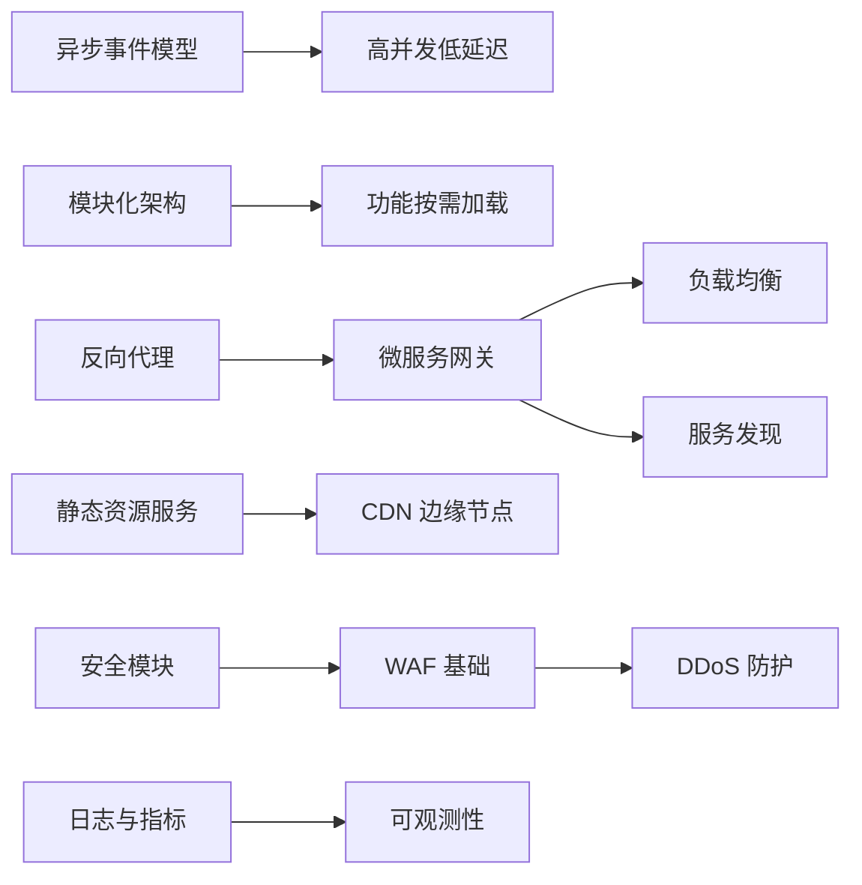
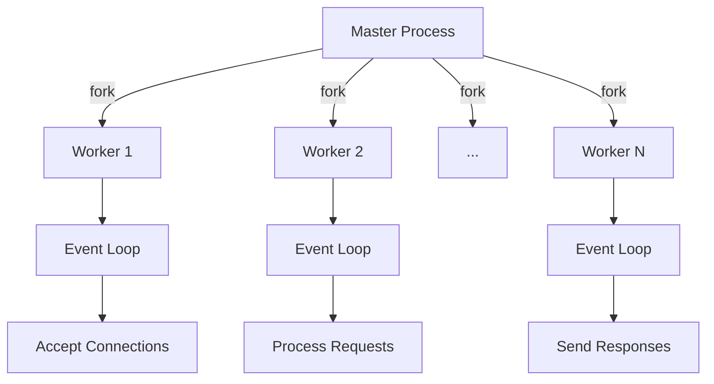
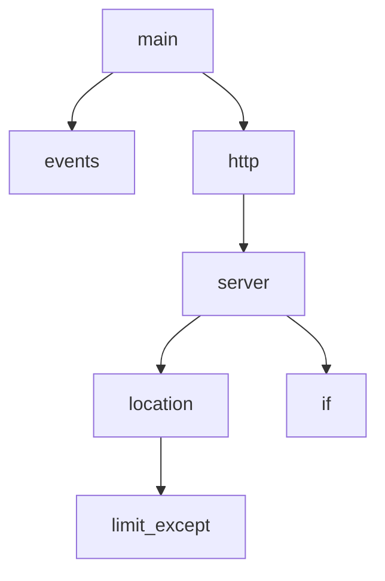
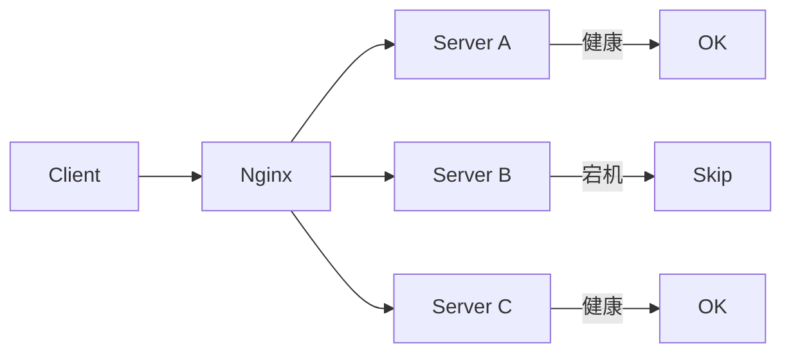
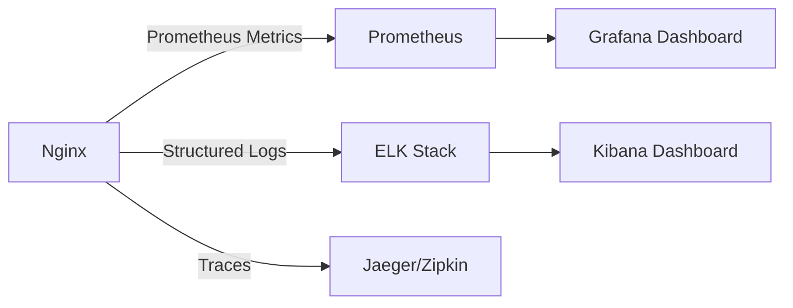
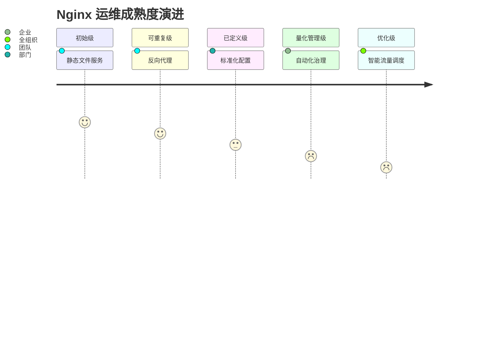

# Nginx 企业级配置与架构标准指南

> **版本**：2.1  
> **最后更新**：2025年9月  
> **编写**：杖雍皓  
> **适用对象**：SRE、平台工程师、安全架构师、DevOps 工程师  
> **目标**：掌握 Nginx 核心架构、企业级配置规范、高可用设计与安全加固策略  
> **遵循标准**：RFC 7230-7235（HTTP/1.1）、RFC 9113（HTTP/2）、NIST SP 800-52r2、OWASP ASVS 4.0

---

## 1. 引言：Nginx 在现代应用架构中的战略地位

Nginx 作为高性能异步事件驱动的 Web 服务器与反向代理，支撑着全球 **33% 的活跃网站**（W3Techs, 2024），包括 Netflix、Dropbox、GitHub 等超大规模平台。在企业环境中，Nginx 不仅是**流量入口**，更是**安全边界、可观测性数据源、服务治理执行点**。

企业级 Nginx 部署必须超越基础配置，构建**高可用、安全合规、可观测、自动化**的流量治理平台。

### 1.1 Nginx 企业价值维度



### 1.2 本指南覆盖范围

- **核心架构**：事件模型、进程模型、内存管理
- **配置语法**：上下文、指令、变量、表达式
- **高可用设计**：负载均衡、健康检查、故障转移
- **安全加固**：TLS 1.3、WAF、速率限制、安全头
- **可观测性**：结构化日志、指标暴露、追踪集成
- **工程实践**：配置即代码、自动化测试、灰度发布

---

## 2. Nginx 核心架构原理

### 2.1 进程模型

Nginx 采用 **Master-Worker 多进程模型**，实现高可靠与资源隔离：



- **Master 进程**：读取配置、绑定端口、管理 Worker 生命周期
- **Worker 进程**：处理网络事件（单线程异步非阻塞）
- **优势**：
  - 无锁设计，避免线程竞争
  - Worker 独立崩溃不影响整体服务
  - 平滑升级（`nginx -s reload`）

### 2.2 事件处理模型

Nginx 使用操作系统提供的**高效 I/O 多路复用机制**：

| 操作系统 | 事件机制 | 性能特点 |
|----------|----------|----------|
| Linux | epoll | O(1) 复杂度，百万级连接 |
| FreeBSD | kqueue | 高效事件通知 |
| Windows | IOCP | 异步 I/O 完成端口 |

> **企业意义**：  
> 单 Worker 可处理 **10,000+ 并发连接**，资源消耗远低于 Apache prefork 模型。

---

## 3. 配置语法基础

### 3.1 配置结构

Nginx 配置由**上下文（Context）** 和**指令（Directive）** 组成：

```nginx showLineNumbers=true
# 全局上下文
user nginx;
worker_processes auto;
error_log /var/log/nginx/error.log warn;
pid /run/nginx.pid;

# 事件上下文
events {
    worker_connections 1024;
    use epoll;
}

# HTTP 上下文
http {
    include /etc/nginx/mime.types;
    default_type application/octet-stream;

    # 服务器块（虚拟主机）
    server {
        listen 80;
        server_name example.com;

        location / {
            root /usr/share/nginx/html;
            index index.html;
        }
    }
}
```

### 3.2 上下文层级



> **关键规则**：  
> - 指令仅在允许的上下文中有效（如 `root` 不能在 `events` 中）
> - 子上下文继承父上下文指令（可覆盖）

### 3.3 变量与表达式

Nginx 内置 **200+ 变量**，支持条件判断：

```nginx showLineNumbers=true
# 内置变量
location / {
    # $host: 请求头 Host
    # $request_uri: 完整 URI
    # $http_user_agent: User-Agent 头
}

# 条件判断（谨慎使用）
if ($http_user_agent ~* "badbot") {
    return 403;
}

# Map 模块（推荐替代 if）
map $http_user_agent $is_bad_bot {
    default 0;
    "~*badbot" 1;
}
```

> **性能警告**：  
> `if` 在 `location` 中可能导致**不可预期行为**，优先使用 `map` 或 `geo` 模块。

---

## 4. 企业级反向代理与负载均衡

### 4.1 基础反向代理

```nginx showLineNumbers=true
upstream backend {
    server 10.0.0.10:8080;
    server 10.0.0.11:8080;
}

server {
    listen 443 ssl http2;
    server_name api.example.com;

    ssl_certificate /etc/ssl/api.example.com.crt;
    ssl_certificate_key /etc/ssl/api.example.com.key;

    location / {
        proxy_pass http://backend;
        proxy_set_header Host $host;
        proxy_set_header X-Real-IP $remote_addr;
        proxy_set_header X-Forwarded-For $proxy_add_x_forwarded_for;
        proxy_set_header X-Forwarded-Proto $scheme;
    }
}
```

### 4.2 负载均衡策略

| 策略 | 配置 | 适用场景 |
|------|------|----------|
| **轮询（默认）** | `server a; server b;` | 均匀流量 |
| **加权轮询** | `server a weight=3;` | 异构服务器 |
| **IP Hash** | `ip_hash;` | 会话保持 |
| **最少连接** | `least_conn;` | 长连接场景 |
| **通用哈希** | `hash $request_uri consistent;` | 缓存友好 |



### 4.3 健康检查

```nginx showLineNumbers=true
upstream backend {
    zone backend 64k;
    server 10.0.0.10:8080 max_fails=3 fail_timeout=30s;
    server 10.0.0.11:8080;

    # 被动健康检查（默认）
    # 主动健康检查（需 Plus 或第三方模块）
}
```

> **企业实践**：  
> - 开源版仅支持**被动健康检查**（基于请求失败）  
> - 生产环境建议集成 **Consul/Etcd** 实现主动检查

---

## 5. 安全加固策略

### 5.1 TLS 1.3 与现代加密

```nginx showLineNumbers=true
ssl_protocols TLSv1.2 TLSv1.3;
ssl_ciphers ECDHE-ECDSA-AES128-GCM-SHA256:ECDHE-RSA-AES128-GCM-SHA256;
ssl_prefer_server_ciphers off;
ssl_session_cache shared:SSL:10m;
ssl_session_timeout 10m;
ssl_stapling on;
ssl_stapling_verify on;
resolver 8.8.8.8 valid=300s;
```

> **合规要求**：  
> - 禁用 SSLv3、TLSv1.0/1.1（PCI DSS）  
> - 优先使用 **ECC 证书**（性能优于 RSA）

### 5.2 安全头与防护

```nginx showLineNumbers=true
# 安全头
add_header Strict-Transport-Security "max-age=31536000; includeSubDomains" always;
add_header X-Content-Type-Options "nosniff" always;
add_header X-Frame-Options "DENY" always;
add_header Content-Security-Policy "default-src 'self';" always;
add_header Referrer-Policy "strict-origin-when-cross-origin" always;

# 速率限制
limit_req_zone $binary_remote_addr zone=api:10m rate=10r/s;
location /api/ {
    limit_req zone=api burst=20 nodelay;
    ...
}

# 文件访问控制
location ~ /\. {
    deny all;
    access_log off;
    log_not_found off;
}
```

### 5.3 WAF 基础规则

```nginx showLineNumbers=true
# 阻止 SQL 注入
if ($args ~* "(union|select|insert|drop|update|delete|cast|convert)") {
    return 403;
}

# 阻止 XSS
if ($args ~* "<script.*?>.*?</script>") {
    return 403;
}

# 限制请求体大小
client_max_body_size 10M;
```

> **企业建议**：  
> - 开源版 WAF 能力有限，生产环境应部署 **ModSecurity + CRS**  
> - 使用 **OpenResty** 扩展 Lua 脚本实现高级防护

---

## 6. 高可用与性能优化

### 6.1 缓存策略

```nginx showLineNumbers=true
proxy_cache_path /var/cache/nginx levels=1:2 keys_zone=STATIC:10m inactive=24h max_size=10g;

server {
    location /static/ {
        proxy_cache STATIC;
        proxy_cache_valid 200 10m;
        proxy_cache_use_stale error timeout updating http_500;
        proxy_cache_revalidate on;
        add_header X-Cache-Status $upstream_cache_status;
    }
}
```

### 6.2 Gzip 压缩

```nginx showLineNumbers=true
gzip on;
gzip_vary on;
gzip_min_length 1024;
gzip_types text/plain text/css application/json application/javascript;
gzip_comp_level 6;
```

### 6.3 连接优化

```nginx showLineNumbers=true
# Worker 优化
worker_processes auto;
worker_cpu_affinity auto;
worker_rlimit_nofile 65535;

# 连接优化
keepalive_timeout 65;
keepalive_requests 100;
reset_timedout_connection on;
client_body_timeout 10s;
client_header_timeout 10s;
send_timeout 10s;
```

---

## 7. 可观测性与日志

### 7.1 结构化日志

```nginx showLineNumbers=true
log_format json_combined escape=json
  '{'
    '"time_local":"$time_local",'
    '"remote_addr":"$remote_addr",'
    '"request":"$request",'
    '"status":$status,'
    '"body_bytes_sent":$body_bytes_sent,'
    '"http_referer":"$http_referer",'
    '"http_user_agent":"$http_user_agent",'
    '"request_time":$request_time,'
    '"upstream_response_time":"$upstream_response_time"'
  '}';

access_log /var/log/nginx/access.log json_combined;
```

### 7.2 指标暴露（Prometheus）

```nginx showLineNumbers=true
# 需 nginx-module-vts 或 stub_status
location /metrics {
    vhost_traffic_status_display;
    vhost_traffic_status_display_format prometheus;
}
```



---

## 8. 工程化实践

### 8.1 配置即代码

目录结构：
```bash
/etc/nginx/
├── nginx.conf          # 主配置
├── conf.d/             # 环境无关配置
│   └── default.conf
├── sites-available/    # 虚拟主机定义
├── sites-enabled/      # 符号链接
└── snippets/           # 可复用片段
    ├── ssl.conf
    └── security.conf
```

### 8.2 自动化测试

- **语法检查**：`nginx -t`
- **配置测试**：`nginx -T`（输出完整配置）
- **集成测试**：使用 `nginx-test` 或 `bats` 验证行为

### 8.3 灰度发布

```nginx showLineNumbers=true
# 基于 Cookie 灰度
map $cookie_canary $backend {
    default backend_stable;
    "true" backend_canary;
}

upstream backend_stable { server 10.0.0.10; }
upstream backend_canary { server 10.0.0.11; }

location / {
    proxy_pass http://$backend;
}
```

---

## 9. 总结：Nginx 企业成熟度模型



**核心原则**：
1. **安全内建**：TLS 1.3 + 安全头 + WAF
2. **可观测性优先**：结构化日志 + 指标 + 追踪
3. **配置即代码**：版本控制 + 自动化测试
4. **高可用设计**：健康检查 + 故障转移 + 缓存

---

## 附录 A：企业级配置模板

```nginx showLineNumbers=true
# /etc/nginx/snippets/security.conf
add_header Strict-Transport-Security "max-age=31536000; includeSubDomains" always;
add_header X-Content-Type-Options "nosniff" always;
add_header X-Frame-Options "DENY" always;
add_header Content-Security-Policy "default-src 'self';" always;

# /etc/nginx/sites-available/api.example.com
server {
    listen 443 ssl http2;
    server_name api.example.com;

    ssl_certificate /etc/ssl/api.example.com.crt;
    ssl_certificate_key /etc/ssl/api.example.com.key;
    include /etc/nginx/snippets/ssl.conf;
    include /etc/nginx/snippets/security.conf;

    client_max_body_size 10M;
    limit_req_zone $binary_remote_addr zone=api:10m rate=10r/s;

    location / {
        limit_req zone=api burst=20 nodelay;
        proxy_pass http://backend;
        proxy_set_header Host $host;
        proxy_set_header X-Real-IP $remote_addr;
        proxy_set_header X-Forwarded-For $proxy_add_x_forwarded_for;
        proxy_set_header X-Forwarded-Proto $scheme;
    }
}
```

---

**版权声明**：本文档依据 [Apache License 2.0](https://www.apache.org/licenses/LICENSE-2.0) 发布，企业内使用需保留署名。  
**合规声明**：本指南符合 NIST SP 800-52r2《TLS 配置指南》、OWASP ASVS 4.0 及 ISO/IEC 27001 信息安全管理标准。  
**反馈渠道**：info@zyhorg.cn