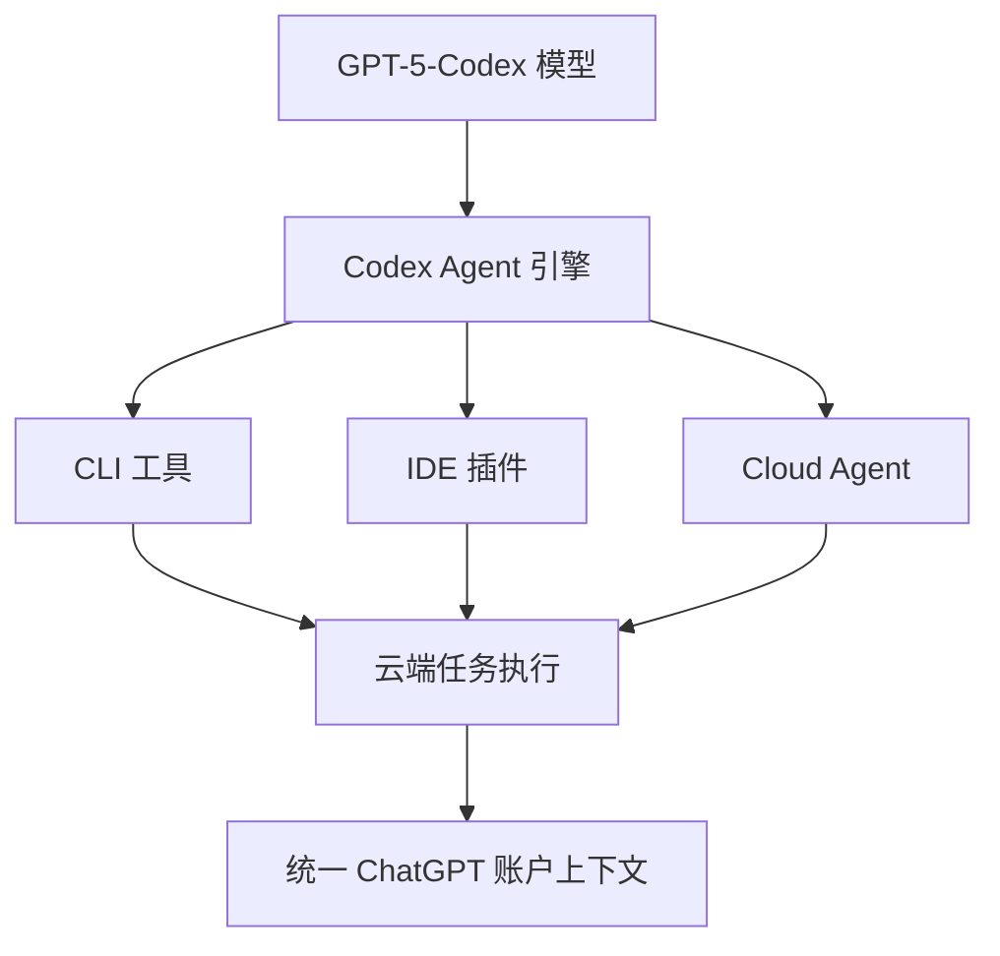
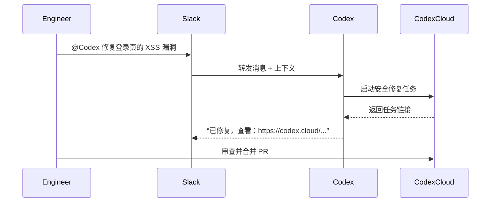
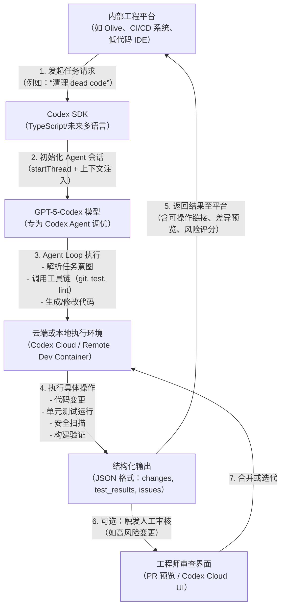
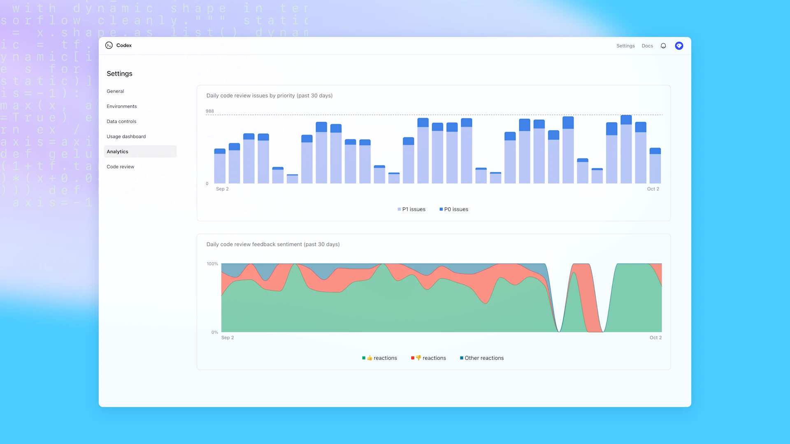

# OpenAI Codex 现已全面可用   
**作者：OpenAI**  
**二创：杖雍皓**    
**邮箱：info@zyhorg.cn**  
**发布日期：2025年10月8日**

---

## 工程智能的新范式

2025年10月，OpenAI 正式宣布 **Codex** 进入**全面可用（Generally Available）** 阶段。作为基于 **GPT‑5-Codex** 构建的智能编码代理（Agent），Codex 不再只是一个辅助工具，而是成为现代软件工程流程中的核心协作者。

Codex 的发布标志着工程智能（Engineering Intelligence）从“辅助建议”迈向“端到端任务执行”的关键跃迁。本文将从架构、集成、治理与企业实践四个维度，系统性解析 Codex 的技术能力与落地路径，并辅以 **Mermaid 图表** 展示其工作流、集成拓扑与效能指标，为企业技术决策者与工程团队提供可操作、可扩展的参考框架。

---

## 一、Codex 核心能力架构

Codex 的核心是一个**状态感知、工具集成、上下文连续**的智能代理系统，其架构可抽象为三层：



### 关键特性：
- **模型专训**：GPT‑5-Codex 专为 Codex Agent 的提示结构、工具定义与代理循环（agent loop）进行调优，无需额外微调即可实现高精度任务执行。
- **上下文连续性**：通过 `startThread()` 与 `run()` 接口，支持多轮对话状态保持，适用于复杂任务拆解。
- **多端协同**：编辑器、终端、云端三端数据打通，统一由 ChatGPT 账户管理身份与权限。

---

## 二、三大企业级新特性详解

### 2.1 Slack 集成：将 Codex 引入团队协作流

通过在 Slack 中 `@Codex`，团队可直接委托编码任务。Codex 会自动：
- 解析对话上下文
- 选择匹配的开发环境
- 执行任务并返回云端链接



:::info
 **企业价值**：将编码任务无缝嵌入沟通平台，降低上下文切换成本，提升响应速度。
:::

---

### 2.2 Codex SDK：嵌入自有工程系统

Codex SDK 允许企业将 Codex Agent 深度集成至内部工具链（如 CI/CD、低代码平台、内部 IDE）。

#### TypeScript 示例：
```ts showLineNumbers=true
import { Codex } from "@openai/codex-sdk";

const agent = new Codex({});
const thread = await agent.startThread();

const result = await thread.run("Explore this repo");
console.log(result);

// 恢复会话，继续任务
const result2 = await thread.run("Propose changes");
console.log(result2);
```

#### 集成场景：
- 自动化技术债清理（如 Instacart 的 Olive 平台）
- CI 流水线中的自动修复（通过 GitHub Action）
- 内部 DevOps 机器人



:::tip
 **优势**：SDK 提供**结构化输出**与**内置上下文管理**，确保集成稳定性与可解析性。
:::

---

### 2.3 管理员控制台：规模化治理与可观测性

面向 **Business/Edu/Enterprise** 计划，OpenAI 新增三大治理能力：

| 功能 | 说明 |
|------|------|
| **环境控制** | 编辑/删除云端环境，清除敏感数据 |
| **策略强制** | 通过托管配置（managed config）覆盖本地 CLI/IDE 默认行为 |
| **分析仪表盘** | 跟踪 CLI、IDE、Web 端使用量与代码审查质量 |



:::tip
 **治理价值**：实现“安全默认（safe-by-default）”策略，防止配置漂移与数据泄露，同时量化 Codex 对工程效能的贡献。
:::

---

## 三、企业实践案例

### 3.1 Cisco：代码审查效率提升 50%

- **挑战**：复杂 PR 审查耗时长，人工易遗漏边缘情况。
- **方案**：Codex 自动审查人类与自身生成的代码。
- **成果**：
  - 审查时间 ↓50%
  - 关键问题拦截率 ↑
  - 工程师聚焦高价值设计工作

### 3.2 Instacart：技术债自动化清理

- **平台**：集成 Codex SDK 至内部 Olive 代理平台。
- **能力**：
  - 一键启动远程开发环境
  - 自动删除死代码、过期实验
  - 执行重复性变更（如依赖升级）
- **成效**：
  - 工程 backlog ↓
  - 代码库延迟 ↓
  - 工程速度显著提升

---

## 四、部署与定价策略

### 可用性矩阵（截至 2025年10月）

| 功能 | Plus/Pro | Business/Edu/Enterprise |
|------|--------|------------------------|
| Slack 集成 | ✅ | ✅ |
| Codex SDK | ✅ | ✅ |
| 管理员控制台 | ❌ | ✅ |

### 定价更新
- **自 2025年10月20日起**，所有 Codex Cloud 任务将计入用量配额。
- 各计划配额与计费详情见 [官方定价页](https://openai.com/pricing/codex)。

---

## 五、总结与展望

Codex 的 GA 发布不仅是产品里程碑，更是**工程生产力范式的重构**。它将 LLM 从“被动响应”推向“主动执行”，并通过 SDK 与治理工具实现企业级可控性。

> **未来方向**：
> - 多语言 SDK 支持（当前仅 TypeScript）
> - 与更多 DevOps 工具链原生集成（如 Jenkins、GitLab）
> - 基于反馈闭环的自我优化代理

对于企业而言，现在是评估并试点 Codex 的最佳时机。通过合理集成与治理，Codex 有望成为下一代工程基础设施的“智能中枢”。

---


:::note
本文基于 OpenAI 官方发布内容整理与深度解读，所有图表与分析均为原创。转载请注明出处。    
原文链接来自 [**Codex is now generally available**](https://openai.com/index/codex-now-generally-available/)
:::