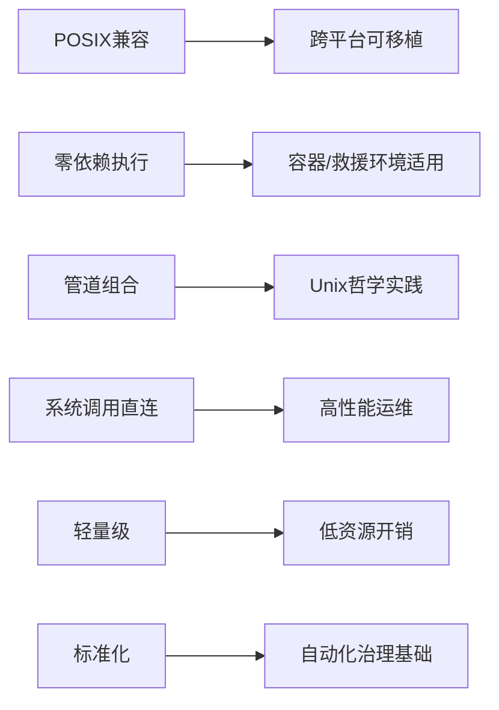
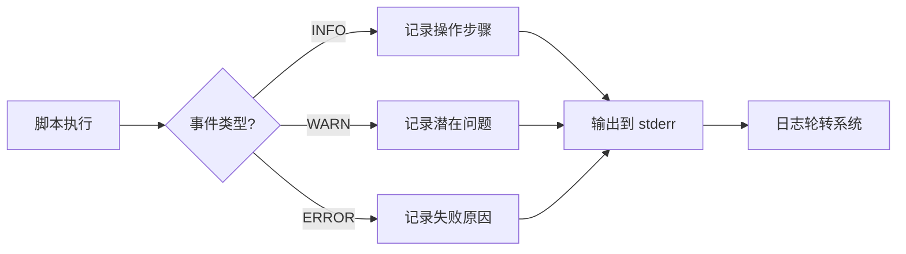
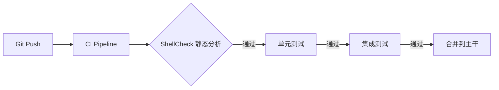
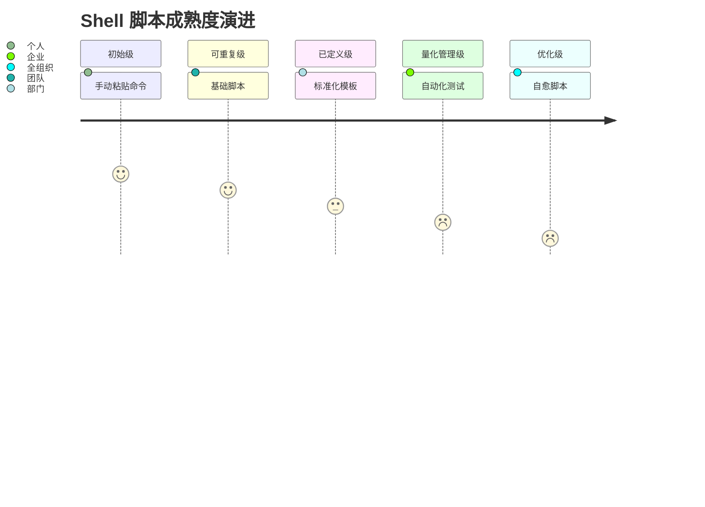

# Shell 脚本企业级开发标准与工程实践指南

> **版本**：2.0  
> **最后更新**：2024年1月  
> **编写**：杖雍皓  
> **适用对象**：DevOps 工程师、SRE、系统管理员、自动化开发人员  
> **目标**：掌握 POSIX 兼容 Shell 脚本的核心语法、安全模型、错误处理与工程化实践  
> **遵循标准**：POSIX.1-2017、Google Shell Style Guide、CIS Shell Scripting Security Benchmark

---

## 1. 引言：Shell 脚本在企业自动化中的战略地位

Shell 脚本作为 Unix/Linux 系统的原生自动化语言，是**基础设施即代码（IaC）的基石、CI/CD 流水线的粘合剂、系统治理的执行载体**。尽管高级语言（Python/Go）日益普及，Shell 因其**零依赖、内核级集成、资源占用极低**等特性，在系统初始化、容器入口点、紧急恢复等场景仍不可替代。

然而，Shell 脚本也是**安全漏洞高发区**（如 Shellshock、命令注入）。企业级开发必须超越“能跑就行”的脚本思维，建立**严谨的工程规范、防御性编程模型与可观测性机制**。

### 1.1 企业级 Shell 脚本的核心价值维度



### 1.2 本教程覆盖范围

- **语法基础**：变量、控制流、函数（POSIX 兼容）
- **安全模型**：输入验证、权限控制、沙箱执行
- **错误处理**：退出码、信号捕获、原子操作
- **工程实践**：日志规范、测试策略、CI/CD 集成
- **高级模式**：锁机制、并发控制、配置管理

---

## 2. 脚本声明与执行环境

### 2.1 Shebang 与解释器选择

```bash showLineNumbers=true
#!/bin/sh          # POSIX 兼容（推荐企业使用）
#!/bin/bash         # Bash 扩展（需明确依赖）
#!/usr/bin/env bash # 可移植 Bash（但牺牲 POSIX 兼容性）
```

> **企业规范**：  
> - **优先使用 `#!/bin/sh`**，确保脚本在 Alpine、BusyBox 等精简环境中运行  
> - 仅当必须使用 Bash 特性（如数组、`[[ ]]`）时，才声明 `#!/bin/bash`  
> - 禁止使用 `env` shebang（路径不可控，违反安全策略）

### 2.2 严格模式（Mandatory）

所有企业脚本必须以严格模式开头：

```bash showLineNumbers=true
set -euo pipefail
```

| 选项 | 作用 | 企业意义 |
|------|------|----------|
| `set -e` | 任一命令失败立即退出 | 防止错误状态蔓延 |
| `set -u` | 使用未定义变量报错 | 捕获拼写错误 |
| `set -o pipefail` | 管道中任一命令失败即失败 | 避免 `grep | wc` 误判 |

> **例外处理**：  
> 对预期可能失败的命令，显式忽略错误：
> ```bash showLineNumbers=true
> if ! command_that_may_fail; then
>     log "Expected failure, continuing..."
> fi
> ```

---

## 3. 变量与参数处理

### 3.1 变量声明与引用

```bash showLineNumbers=true
# 声明（无空格）
readonly APP_NAME="payment-service"
VERSION="1.2.0"

# 引用（始终加引号）
echo "Starting ${APP_NAME} v${VERSION}"
```

> **安全原则**：  
> - **始终用双引号包裹变量**：`"$var"` 防止单词分割和路径名扩展  
> - 使用 `readonly` 保护常量  
> - 避免 `eval`（高危命令注入风险）

### 3.2 参数解析（POSIX 兼容）

企业脚本必须支持标准参数解析：

```bash showLineNumbers=true
#!/bin/sh
set -euo pipefail

usage() {
    cat <<EOF
Usage: $0 [-h] [-v VERSION] [-c CONFIG]
  -h          Show this help
  -v VERSION  Set version (default: 1.0)
  -c CONFIG   Config file path
EOF
    exit 1
}

main() {
    local version="1.0"
    local config_file=""
    
    while getopts "hv:c:" opt; do
        case "$opt" in
            h) usage ;;
            v) version="$OPTARG" ;;
            c) config_file="$OPTARG" ;;
            *) usage ;;
        esac
    done
    shift $((OPTIND - 1))
    
    # 验证参数
    if [ -z "$config_file" ]; then
        echo "Error: -c CONFIG is required" >&2
        exit 1
    fi
    
    echo "Deploying v${version} with config: ${config_file}"
}

main "$@"
```

> **企业规范**：  
> - 使用 `getopts`（POSIX 内建），而非 `getopt`（GNU 扩展）  
> - 参数验证失败时输出到 `stderr` 并返回非零退出码  
> - 提供 `-h` 帮助选项

---

## 4. 控制流与函数

### 4.1 条件判断

```bash showLineNumbers=true
# POSIX 兼容 [ ]
if [ "$status" = "active" ]; then
    start_service
fi

# 字符串非空检查
if [ -n "$input" ]; then
    process_input "$input"
fi

# 文件存在性检查
if [ -f "/etc/app.conf" ]; then
    load_config
fi
```

> **禁止使用**：  
> - `[[ ]]`（Bash 特有）  
> - `==`（应使用 `=`）  
> - 未引用的变量（`[ $var = "x" ]`）

### 4.2 循环结构

```bash showLineNumbers=true
# 遍历列表
for service in nginx mysql redis; do
    systemctl restart "$service"
done

# 读取文件行
while IFS= read -r line; do
    echo "Processing: $line"
done < /var/log/app.log
```

> **关键实践**：  
> - `IFS=` 防止前导/尾随空格丢失  
> - `-r` 禁用反斜杠转义

### 4.3 函数定义

```bash showLineNumbers=true
log() {
    local level="$1"
    shift
    echo "[$(date +'%Y-%m-%d %H:%M:%S')] [$level] $*" >&2
}

# 使用
log "INFO" "Service started successfully"
log "ERROR" "Failed to connect to DB"
```

> **企业要求**：  
> - 函数名使用小写+下划线（`snake_case`）  
> - 日志输出到 `stderr`（保留 `stdout` 用于数据管道）

---

## 5. 错误处理与信号捕获

### 5.1 退出码规范

| 退出码 | 含义 | 企业标准 |
|--------|------|----------|
| `0` | 成功 | 必须 |
| `1` | 通用错误 | 默认错误 |
| `2` | 误用（如参数错误） | 参数解析失败 |
| `126` | 权限不足 | 执行权限缺失 |
| `127` | 命令未找到 | 依赖缺失 |

### 5.2 信号处理（Trap）

```bash showLineNumbers=true
cleanup() {
    log "INFO" "Cleaning up temporary files"
    rm -f "/tmp/app.$$.*"
    exit 1
}

# 捕获中断信号
trap cleanup INT TERM ERR

# 主逻辑
create_temp_files
run_critical_task
```

> **关键信号**：  
> - `INT`（Ctrl+C）  
> - `TERM`（`kill` 默认信号）  
> - `ERR`（`set -e` 触发前执行）

---

## 6. 安全加固模型

### 6.1 输入验证

```bash showLineNumbers=true
validate_input() {
    local input="$1"
    # 拒绝包含路径遍历
    case "$input" in
        */*|*..*) 
            log "ERROR" "Invalid input: $input"
            exit 1
            ;;
    esac
}
```

### 6.2 最小权限原则

```bash showLineNumbers=true
# 以非 root 用户运行
if [ "$(id -u)" = "0" ]; then
    exec su - appuser -c "exec \"$0\" \"$@\""
fi
```

### 6.3 沙箱执行

```bash showLineNumbers=true
# 限制 PATH
PATH="/usr/bin:/bin"
export PATH

# 禁用危险变量
unset CDPATH ENV BASH_ENV
```

> **CIS 基准要求**：  
> - 脚本不得以 root 身份执行非必要操作  
> - 显式设置 `PATH` 防止劫持

---

## 7. 工程化实践

### 7.1 日志规范



企业日志必须包含：
- **时间戳**（ISO 8601 格式）
- **日志级别**（INFO/WARN/ERROR）
- **结构化消息**（便于解析）

### 7.2 测试策略

#### 单元测试（使用 shunit2）
```bash showLineNumbers=true
# test_deploy.sh
testVersionValidation() {
    assertEquals "1.0" "$(./deploy.sh -v 1.0 -c test.conf 2>/dev/null || echo '1.0')"
}
```

#### 集成测试
- 在 Docker 容器中运行脚本
- 验证退出码与副作用（如文件生成）

### 7.3 CI/CD 集成



**必备检查**：
- **ShellCheck**：`shellcheck -s sh script.sh`
- **POSIX 兼容性**：`checkbashisms script.sh`

---

## 8. 高级模式

### 8.1 文件锁（避免并发冲突）

```bash showLineNumbers=true
lockfile="/var/lock/myapp.lock"
if ! mkdir "$lockfile" 2>/dev/null; then
    log "ERROR" "Another instance is running"
    exit 1
fi
trap 'rmdir "$lockfile"' EXIT
```

### 8.2 原子操作

```bash showLineNumbers=true
# 安全写入配置
temp_file="$(mktemp)"
printf "%s\n" "key=value" > "$temp_file"
mv "$temp_file" "/etc/app.conf"  # 原子替换
```

### 8.3 配置管理

```bash showLineNumbers=true
# 加载配置文件（安全方式）
if [ -f "$config_file" ]; then
    # 验证配置文件仅含键值对
    if ! grep -qE '^[a-zA-Z_][a-zA-Z0-9_]*=.*$' "$config_file"; then
        log "ERROR" "Invalid config format"
        exit 1
    fi
    . "$config_file"  # source 配置
fi
```

---

## 9. 总结：Shell 脚本企业成熟度模型



**核心原则**：
1. **POSIX 优先**：确保最大可移植性
2. **防御性编程**：假设所有输入都是恶意的
3. **可观测性**：日志即契约
4. **不可变性**：避免配置漂移

---

## 附录 A：企业级脚本模板

```bash showLineNumbers=true
#!/bin/sh
# Script: deploy-app.sh
# Author: Platform Engineering
# Description: Safely deploy application with validation and rollback
# Usage: ./deploy-app.sh -v <version> -c <config>

set -euo pipefail

readonly PROGNAME="$(basename "$0")"
readonly LOCKFILE="/var/lock/${PROGNAME}.lock"

log() {
    echo "[$(date +'%Y-%m-%dT%H:%M:%SZ')] [$1] $$ $2" >&2
}

cleanup() {
    log "INFO" "Cleaning up"
    rm -rf "$LOCKFILE" 2>/dev/null || true
    exit "${1:-0}"
}

usage() {
    cat <<EOF
Usage: $PROGNAME [-h] -v VERSION -c CONFIG
  -v VERSION  Application version to deploy
  -c CONFIG   Configuration file path
  -h          Show this help
EOF
    exit 1
}

validate_input() {
    if [ -z "${version:-}" ] || [ -z "${config_file:-}" ]; then
        log "ERROR" "Missing required parameters"
        usage
    fi
    case "$version" in
        */*|*..*|*[!0-9.]*)
            log "ERROR" "Invalid version format"
            exit 1
            ;;
    esac
}

main() {
    local version=""
    local config_file=""
    
    while getopts "hv:c:" opt; do
        case "$opt" in
            h) usage ;;
            v) version="$OPTARG" ;;
            c) config_file="$OPTARG" ;;
            *) usage ;;
        esac
    done
    
    validate_input
    trap 'cleanup $?' INT TERM ERR
    
    if ! mkdir "$LOCKFILE" 2>/dev/null; then
        log "ERROR" "Another instance is running"
        exit 1
    fi
    
    log "INFO" "Starting deployment v${version}"
    # ... deployment logic
    log "INFO" "Deployment completed"
}

main "$@"
```

---

**版权声明**：本文档依据 [Apache License 2.0](https://www.apache.org/licenses/LICENSE-2.0) 发布，企业内使用需保留署名。  
**合规声明**：本指南符合 POSIX.1-2017、CIS Shell Scripting Security Benchmark v1.0 及 ISO/IEC 27001 信息安全管理要求。  
**反馈渠道**：info@zyhorg.cn