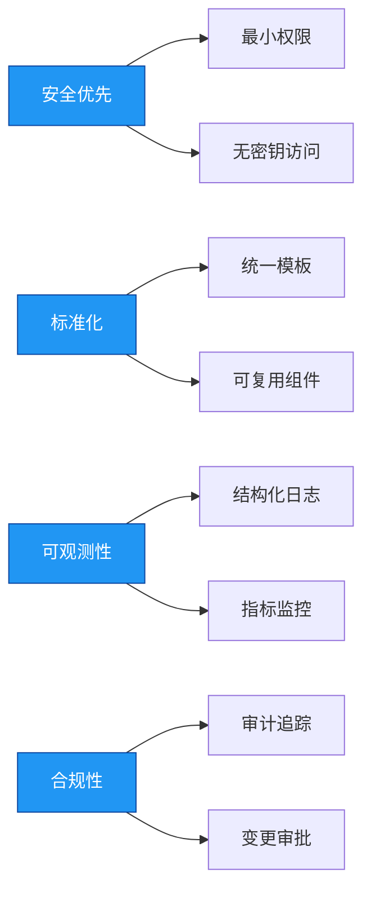

# 企业级 GitHub Actions CI/CD 操作手册  
**版本：1.0**  
**发布日期：2025年10月6日**  

> **作者**：杖雍皓  
> **GitHub**：[https://github.com/zyhgov](https://github.com/zyhgov)  
> **邮箱**：info@zyhorg.cn  
> **适用对象**：DevOps 工程师、平台工程师、SRE、技术负责人  
> **文档目标**：为中大型企业提供标准化、安全、可审计、高可用的 GitHub Actions CI/CD 实施指南  

---

## 1. 引言

### 1.1 文档目的

本手册旨在为企业提供一套 **可落地、可扩展、符合安全合规要求** 的 GitHub Actions CI/CD 实施规范。内容涵盖架构设计、权限控制、流水线模板、安全加固、审计监控及最佳实践，适用于金融、互联网、制造等对交付质量与安全有严格要求的行业。

### 1.2 适用范围

- 使用 GitHub 作为源代码托管平台的企业
- 已具备基础 DevOps 能力，计划或正在使用 GitHub Actions 构建自动化流水线
- 需满足 ISO 27001、SOC 2、GDPR 等合规性要求的组织

### 1.3 术语定义

| 术语 | 定义 |
|------|------|
| **Workflow** | 一个 YAML 文件，定义完整的自动化流程 |
| **Job** | 工作流中的独立执行单元，运行于指定 Runner |
| **Action** | 可复用的自动化单元，封装特定功能 |
| **Runner** | 执行 Job 的计算环境（GitHub 托管或自托管）|
| **Environment** | 部署目标环境（如 staging、production），可配置审批与保护规则 |
| **OIDC** | OpenID Connect，用于无密钥身份联合认证 |

---

## 2. 架构设计原则

企业级 CI/CD 流水线必须遵循以下核心原则：



### 2.1 安全优先（Security First）
- 所有敏感操作必须通过审批或环境保护
- 禁止在代码中硬编码凭证
- 启用依赖审查与漏洞扫描

### 2.2 标准化（Standardization）
- 统一工作流命名、结构与触发策略
- 建立内部 Action 与 Workflow 模板库
- 强制代码风格与测试覆盖率

### 2.3 可观测性（Observability）
- 所有步骤输出结构化日志
- 集成监控告警（如 Slack、PagerDuty）
- 记录关键指标：构建时长、失败率、部署频率

### 2.4 合规性（Compliance）
- 所有生产部署需人工审批
- 完整审计日志保留 ≥ 180 天
- 支持回滚与版本追溯

---

## 3. 工作流结构规范

### 3.1 文件组织

```
.github/
├── workflows/
│   ├── ci.yml                # 持续集成（测试、构建）
│   ├── cd-staging.yml        # 预发环境部署
│   ├── cd-production.yml     # 生产环境部署
│   └── security-scan.yml     # 安全扫描（SAST/SCA）
├── actions/
│   └── setup-node/
│       └── action.yml        # 自定义复合 Action
└── templates/
    └── reusable-ci.yml       # 可复用工作流模板
```

### 3.2 命名规范

| 类型 | 命名规则 | 示例 |
|------|--------|------|
| Workflow 文件 | `ci.yml`, `cd-{env}.yml` | `cd-production.yml` |
| Job | `{stage}-{platform}` | `test-ubuntu`, `build-docker` |
| Step | 动词 + 名词（清晰描述） | `Checkout source code`, `Run unit tests` |

---

## 4. 核心组件配置

### 4.1 触发策略（Trigger Strategy）

```yaml showLineNumbers=true
# ci.yml
on:
  push:
    branches: [ main, release/** ]
    paths-ignore:
      - '**/*.md'
      - 'docs/**'
  pull_request:
    branches: [ main ]
    types: [ opened, synchronize, reopened ]
  workflow_dispatch:  # 允许手动触发（用于调试）
```

> **企业要求**：  
> - `main` 分支仅允许通过 PR 合并，禁止直接推送  
> - 非代码文件变更不触发构建  
> - 定期扫描任务使用 `schedule` + `workflow_dispatch`

### 4.2 权限控制（Permissions）

```yaml showLineNumbers=true
permissions:
  contents: read          # 读取代码
  pull-requests: write    # 写入 PR 评论（如测试报告）
  id-token: write         # 启用 OIDC（用于云平台无密钥部署）
  # 禁止默认的 write 权限（安全加固）
```

### 4.3 环境与审批（Environments & Approvals）

在 **仓库 Settings > Environments** 中定义：

- **staging**：自动部署，无需审批
- **production**：
  - 需至少 2 名审批人
  - 部署窗口限制（如工作日 10:00–18:00）
  - 部署前运行冒烟测试

工作流中引用：

```yaml showLineNumbers=true
jobs:
  deploy-prod:
    environment: production  # 关联环境配置
    runs-on: ubuntu-latest
    steps:
      - run: ./deploy.sh
```

---

## 5. 安全加固指南

### 5.1 凭证管理

| 场景 | 推荐方案 |
|------|--------|
| 第三方 API 密钥 | 仓库 Secrets（`secrets.MY_KEY`）|
| 云平台部署 | OIDC 身份联合（无密钥）|
| 数据库密码 | 环境 Secrets + Vault 集成 |

**OIDC 示例（AWS）**：

```yaml showLineNumbers=true
- name: Configure AWS Credentials
  uses: aws-actions/configure-aws-credentials@v4
  with:
    role-to-assume: arn:aws:iam::123456789012:role/github-actions-prod
    aws-region: us-east-1
```

> 前提：在 AWS IAM 中配置信任策略，允许 GitHub OIDC Provider。

### 5.2 依赖安全

- 启用 **Dependency Graph** 与 **Dependabot**
- 在流水线中集成 **SAST/SCA** 工具：

```yaml showLineNumbers=true
- name: Run Snyk scan
  uses: snyk/actions/node@master
  env:
    SNYK_TOKEN: ${{ secrets.SNYK_TOKEN }}
  with:
    args: --fail-on-severity=high
```

### 5.3 Action 版本固定

**禁止**：

```yaml showLineNumbers=true
uses: actions/checkout@main  # 危险！
```

**推荐**：

```yaml showLineNumbers=true
uses: actions/checkout@v4
# 或使用 SHA（最安全）
uses: actions/checkout@8f4b7f84864484a7bf31766abe9204da3cbe65b3
```

> 企业应建立内部 Action 白名单，并定期审计。

---

## 6. 企业级流水线模板

### 6.1 持续集成（CI）模板

```yaml showLineNumbers=true
# .github/workflows/ci.yml
name: Enterprise CI

on:
  pull_request:
    branches: [ main ]

permissions:
  contents: read
  pull-requests: write

jobs:
  test:
    strategy:
      matrix:
        os: [ ubuntu-latest, windows-latest ]
        node: [ 18, 20 ]
    runs-on: ${{ matrix.os }}
    steps:
      - name: Checkout
        uses: actions/checkout@v4

      - name: Setup Node.js
        uses: actions/setup-node@v4
        with:
          node-version: ${{ matrix.node }}

      - name: Cache dependencies
        uses: actions/cache@v3
        with:
          path: ~/.npm
          key: ${{ runner.os }}-node-${{ matrix.node }}-${{ hashFiles('package-lock.json') }}

      - name: Install
        run: npm ci --prefer-offline

      - name: Lint
        run: npm run lint

      - name: Test
        run: npm test -- --coverage

      - name: Upload coverage
        uses: codecov/codecov-action@v3
        with:
          token: ${{ secrets.CODECOV_TOKEN }}
```

### 6.2 持续部署（CD）模板

```yaml showLineNumbers=true
# .github/workflows/cd-production.yml
name: Deploy to Production

on:
  push:
    branches: [ main ]

permissions:
  contents: read
  id-token: write  # for OIDC

jobs:
  deploy:
    environment: production
    runs-on: ubuntu-latest
    steps:
      - name: Checkout
        uses: actions/checkout@v4

      - name: Configure AWS Credentials
        uses: aws-actions/configure-aws-credentials@v4
        with:
          role-to-assume: arn:aws:iam::123456789012:role/github-actions-prod
          aws-region: us-east-1

      - name: Build & Push Docker Image
        uses: docker/build-push-action@v5
        with:
          context: .
          push: true
          tags: my-app:${{ github.sha }}

      - name: Deploy to ECS
        run: |
          aws ecs update-service \
            --cluster prod-cluster \
            --service my-app \
            --force-new-deployment

      - name: Notify Slack
        uses: slackapi/slack-github-action@v1
        with:
          channel-id: 'C012AB3CD'
          payload: '{"text":"✅ Production deployed: ${{ github.sha }}"}'
        env:
          SLACK_BOT_TOKEN: ${{ secrets.SLACK_BOT_TOKEN }}
```

---

## 7. 自托管 Runner 管理

### 7.1 适用场景

- 需要访问内网资源（如私有仓库、数据库）
- 对构建环境有特殊要求（如 GPU、特定 OS）
- 降低公共 Runner 成本（高并发场景）

### 7.2 安全要求

- Runner 必须运行在隔离的 VPC 中
- 禁止在 Runner 上存储持久化凭证
- 定期轮换 Runner 注册令牌
- 启用自动缩放（如使用 [actions-runner-controller](https://github.com/actions/actions-runner-controller)）

---

## 8. 审计与监控

### 8.1 审计日志

GitHub 提供以下审计能力：

- **Workflow 运行历史**：谁触发、何时运行、结果如何
- **Secrets 使用记录**：通过日志搜索 `***` 掩码确认使用
- **Runner 日志**：完整步骤输出（保留 90 天）

> 企业应将关键流水线日志导出至 SIEM 系统（如 Splunk、ELK）。

### 8.2 监控指标

| 指标 | 目标 | 工具 |
|------|------|------|
| 构建成功率 | ≥ 99% | GitHub Insights |
| 平均构建时长 | < 10 分钟 | 自定义脚本 + Prometheus |
| 部署频率 | 按需 | DORA 指标 |
| 安全漏洞数 | 0 高危 | Snyk / Trivy |

---

## 9. 附录

### 9.1 官方资源

- [GitHub Actions Documentation](https://docs.github.com/en/actions)
- [Security Hardening Guide](https://docs.github.com/en/actions/security-guides/security-hardening-for-github-actions)
- [OIDC Best Practices](https://docs.github.com/en/actions/deployment/security-hardening-your-deployments/about-security-hardening-with-openid-connect)

### 9.2 企业检查清单

✅ 所有 Secrets 通过环境或仓库管理  
✅ 生产部署需人工审批  
✅ 使用 OIDC 替代长期凭证  
✅ Action 版本固定至 SHA  
✅ 启用 Dependabot 自动更新  
✅ 关键流水线日志接入 SIEM  
✅ 自托管 Runner 隔离部署  

---

> **版权声明**：本文档由杖雍皓原创，遵循 CC BY-NC-ND 4.0 协议。企业内部使用请注明出处。  
> **反馈与更新**：欢迎通过邮箱 info@zyhorg.cn 提交建议。  
> **GitHub**：[https://github.com/zyhgov](https://github.com/zyhgov)