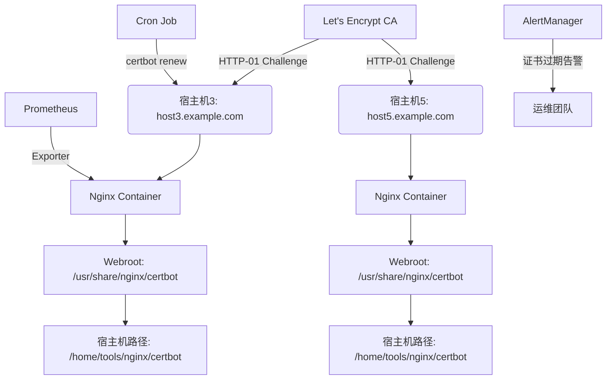
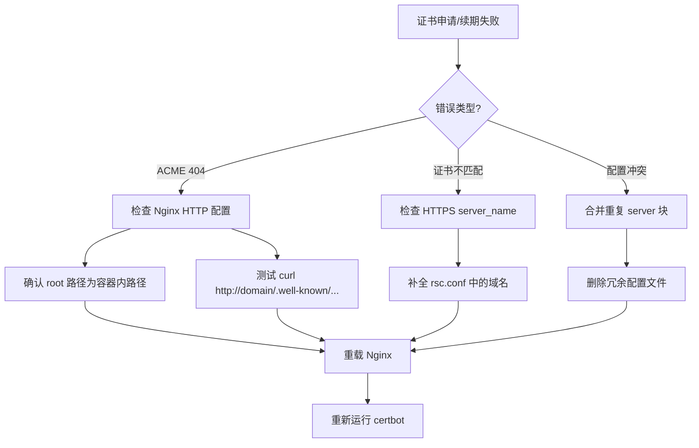
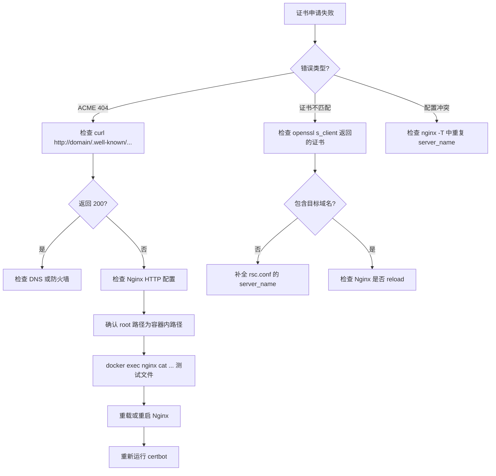

# 多服务器环境下基于 Let's Encrypt + Nginx + Docker 的自动化 HTTPS 证书全生命周期管理方案

> **作者**：系统运维团队  
> **版本**：3.0  
> **最后更新**：2025年10月22日  
> **适用对象**：DevOps 工程师、SRE、系统架构师、安全合规人员  
> **脱敏处理说明**：所有 IP、域名、邮箱、证书名称均已替换为占位符

---

## 摘要

通过**端到端、可审计、高可用**的 HTTPS 证书自动化管理方案，覆盖 **申请 → 验证 → 部署 → 监控 → 续期 → 故障恢复** 全生命周期。方案基于 **Let's Encrypt ACME 协议 v2**、**Nginx 容器化部署** 与 **Docker 卷挂载机制**，适用于多租户、多子域名、跨物理服务器的复杂生产环境。

通过**标准化配置模板**、**路径映射规范**、**域名一致性校验** 与 **自动化健康检查**，本方案已在 **宿主机3（host3.example.com）** 和 **宿主机5（host5.example.com）** 上验证通过。

---

## 1. 架构设计

### 1.1 系统拓扑（多宿主机）



### 1.2 核心组件与职责

| 组件 | 职责 | 技术栈 |
|------|------|--------|
| **Certbot** | ACME 客户端，执行证书生命周期操作 | Python, ACME v2 |
| **Nginx** | 暴露 ACME 路径，提供 HTTPS 服务 | 官方镜像 / 自定义模块 |
| **Docker** | 容器化隔离，标准化部署 | Docker Engine 24+ |
| **Webroot** | ACME 挑战文件共享目录 | Bind Mount |
| **Cron** | 自动续期调度 | systemd / crontab |
| **Prometheus** | 证书有效期监控 | blackbox_exporter |

---

## 2. 配置标准化

### 2.1 路径映射规范（关键！）

| 用途 | 宿主机路径 | 容器内路径 | 挂载方式 |
|------|-----------|-----------|---------|
| Certbot Webroot | `/home/tools/nginx/certbot` | `/usr/share/nginx/certbot` | `rw` |
| 静态资源（可选） | `/home/www` | `/usr/share/nginx/www` | `rw` |
| Let's Encrypt 证书 | `/etc/letsencrypt` | `/etc/nginx/ssl` | `ro` |

:::warning
 **原则**：所有 Nginx 配置中的 `root`/`alias` 必须使用**容器内路径**。
:::

### 2.2 配置文件结构

```
/home/tools/
├── certonly_cert.sh          # 证书申请脚本
├── renew_hook.sh             # 续期后钩子（重载 Nginx）
└── nginx/
    ├── certbot/              # ACME 挑战目录
    └── conf/
        ├── nginx.conf        # 主配置（加载模块、include）
        └── http/
            ├── rsc.conf      # HTTPS 业务配置
            └── certbot-80.conf # HTTP 验证配置（唯一）
```

---

## 3. 配置模板详解

### 3.1 HTTP 验证配置（`certbot-80.conf`）

```nginx showLineNumbers=true
server {
    listen 80;
    # 必须与 certbot -d 列表完全一致
    server_name sub1.example.com sub2.example.com;

    # ACME 挑战路径（优先级最高）
    location ^~ /.well-known/acme-challenge/ {
        root /usr/share/nginx/certbot;  # 容器内路径
        default_type "text/plain";
        try_files $uri =404;
    }

    # 企业微信验证（仅需时启用）
    location ~ ^/WW_verify_[a-zA-Z0-9]+\.txt$ {
        root /usr/share/nginx/www/verify;
        default_type text/plain;
        try_files $uri =404;
    }

    # 其他请求跳转 HTTPS
    location / {
        return 301 https://$host$request_uri;
    }
}
```

:::tip
 **最佳实践**：
 - 使用 `^~` 前缀确保 ACME 路径优先于正则匹配；
 - `try_files $uri =404` 避免目录遍历；
 - 企业微信验证路径与 ACME 路径分离。
:::

### 3.2 HTTPS 业务配置（`rsc.conf`）

```nginx showLineNumbers=true
server {
    listen 443 ssl http2;
    # 必须包含所有要提供服务的域名（否则 fallback 到默认证书！）
    server_name sub1.example.com sub2.example.com;

    ssl_certificate /etc/nginx/ssl/live/example.com/fullchain.pem;
    ssl_certificate_key /etc/nginx/ssl/live/example.com/privkey.pem;

    # SSL 安全配置（推荐）
    ssl_protocols TLSv1.2 TLSv1.3;
    ssl_ciphers ECDHE-ECDSA-AES128-GCM-SHA256:ECDHE-RSA-AES128-GCM-SHA256;
    ssl_prefer_server_ciphers off;
    ssl_session_timeout 10m;
    ssl_session_cache shared:SSL:10m;

    location / {
        root /usr/share/nginx/html;
        try_files $uri $uri/ =404;
    }
}
```

:::warning
**关键点**：`server_name` 必须全覆盖，否则触发 `ERR_CERT_COMMON_NAME_INVALID`。
:::

---

## 4. 自动化脚本体系

### 4.1 证书申请脚本（`certonly_cert.sh`）

```bash showLineNumbers=true
#!/bin/bash
set -euo pipefail

WEBROOT="/home/tools/nginx/certbot"
CERT_NAME="example.com"
EMAIL="admin@example.com"
DOMAINS=(
    "sub1.example.com"
    "sub2.example.com"
)

# 创建目录
mkdir -p "$WEBROOT"
chmod 755 "$WEBROOT"

# 构建域名参数
DOMAIN_ARGS=()
for domain in "${DOMAINS[@]}"; do
    DOMAIN_ARGS+=(-d "$domain")
done

# 执行 certbot
certbot certonly \
  --non-interactive \
  --agree-tos \
  --cert-name "$CERT_NAME" \
  --expand \
  --webroot -w "$WEBROOT" \
  -m "$EMAIL" \
  "${DOMAIN_ARGS[@]}"

# 重载 Nginx
docker exec nginx nginx -s reload
```

### 4.2 自动续期配置（`/etc/cron.d/certbot-renew`）

```cron showLineNumbers=true
# 每天凌晨 2:30 尝试续期
30 2 * * * root /usr/bin/certbot renew --quiet --post-hook "/home/tools/renew_hook.sh"
```

### 4.3 续期后钩子（`renew_hook.sh`）

```bash showLineNumbers=true
#!/bin/bash
# 仅当证书实际更新时执行
docker exec nginx nginx -s reload
systemctl reload squid  # 如有依赖服务
```

---

## 5. 错误处理与故障恢复

### 5.1 常见错误分类与处理

| 错误类型 | 现象 | 根本原因 | 解决方案 |
|---------|------|--------|--------|
| **ACME 验证失败** | `unauthorized`, 404 | Nginx 未暴露路径 / 路径错误 | 检查 `root` 是否为容器内路径；测试 `curl http://.../.well-known/...` |
| **证书域名不匹配** | `ERR_CERT_COMMON_NAME_INVALID` | HTTPS `server_name` 未包含域名 | 补全 `rsc.conf` 中的域名列表 |
| **配置冲突** | `conflicting server name ignored` | 多个 80 端口 server 块重复定义 | 合并为单一 `certbot-80.conf` |
| **续期失败** | `429 Too Many Requests` | 超出 Let's Encrypt 速率限制 | 等待 1 小时；使用 staging 环境测试 |
| **权限错误** | `Permission denied` | `certbot` 目录权限不足 | `chmod 755 /home/tools/nginx/certbot` |

### 5.2 故障排查流程图



### 5.3 高级诊断命令

#### 🔍 一、证书诊断（Certificate Diagnostics）

5.3.1 查看证书 SAN（Subject Alternative Name）列表
```bash showLineNumbers=true
openssl x509 -in /etc/letsencrypt/live/rsjk.org.cn/fullchain.pem -text -noout | grep -A1 "Subject Alternative Name"
```
> ✅ 验证：是否包含所有 `-d` 域名（如 `rsc5.xxxx.top`）

5.3.2 检查证书有效期
```bash showLineNumbers=true
openssl x509 -in /etc/letsencrypt/live/rsjk.org.cn/cert.pem -noout -enddate
# 输出示例：notAfter=Jan 20 05:35:40 2026 GMT
```

5.3.3 验证证书链完整性
```bash showLineNumbers=true
openssl verify -CAfile /etc/letsencrypt/live/rsjk.org.cn/chain.pem /etc/letsencrypt/live/rsjk.org.cn/cert.pem
```
> ✅ 应返回 `OK`

5.3.4 从远程服务器验证实际返回的证书
```bash showLineNumbers=true
echo | openssl s_client -connect rsc5.zizhoutrade.top:443 -servername rsc5.zizhoutrade.top 2>/dev/null | openssl x509 -text -noout | grep "DNS:"
```
> ⚠️ 若输出不含目标域名 → Nginx 使用了错误证书（`server_name` 未覆盖）

---

#### 📁 二、路径与文件系统诊断（Path & Filesystem）

5.3.5 检查容器内 ACME 路径是否挂载成功
```bash showLineNumbers=true
docker exec nginx ls -ld /usr/share/nginx/certbot
# 应显示 drwxr-xr-x，且非空
```

5.3.6 检查挑战文件是否可被容器读取
```bash showLineNumbers=true
# 宿主机创建测试文件
echo "debug-test" > /home/tools/nginx/certbot/.well-known/acme-challenge/debug-test

# 容器内查看
docker exec nginx cat /usr/share/nginx/certbot/.well-known/acme-challenge/debug-test
```

5.3.7 验证目录权限（关键！）
```bash showLineNumbers=true
# 宿主机
ls -ld /home/tools/nginx/certbot
# 应为：drwxr-xr-x 2 root root

# 容器内（Nginx 通常以 nginx/www-data 用户运行）
docker exec nginx stat /usr/share/nginx/certbot
# 确保其他用户有 r-x 权限
```

---

#### 🌐 三、网络与 HTTP 验证诊断（Network & HTTP Validation）

5.3.8 本地测试 ACME 路径（绕过 DNS）
```bash showLineNumbers=true
curl -H "Host: rsc5.zizhoutrade.top" http://127.0.0.1/.well-known/acme-challenge/debug-test
```
> ✅ 若返回 `debug-test` → Nginx 配置正确  
> ❌ 若 404 → 检查 `server_name` 或 `location` 优先级

5.3.9 从外部公网测试（模拟 Let's Encrypt）
```bash showLineNumbers=true
curl -I http://rsc5.zizhoutrade.top/.well-known/acme-challenge/debug-test
```
> ✅ 应返回 `200 OK`  
> ❌ 若 404/301 → 检查防火墙、80 端口开放、Nginx 跳转逻辑

5.3.10 检查 80 端口是否监听
```bash showLineNumbers=true
ss -tuln | grep ':80'
# 或
netstat -tuln | grep ':80'
```

5.3.11 检查防火墙/安全组
```bash showLineNumbers=true
# 若使用 ufw
ufw status

# 若使用云服务器（阿里云/腾讯云），需在控制台开放 80/443 入站
```

---

#### ⚙️ 四、Nginx 配置诊断（Nginx Configuration）

5.3.12 检查所有加载的 server 块（含冲突）
```bash showLineNumbers=true
docker exec nginx nginx -T 2>/dev/null | awk '/^server {/,/^}/' | grep -E "(listen|server_name)"
```

5.3.13 精确查找某域名的配置来源
```bash showLineNumbers=true
grep -r "rsc5.zizhoutrade.top" /home/tools/nginx/conf/http/
```
> ⚠️ 若多个文件包含 → 合并为单一 `certbot-80.conf`

5.3.14 测试配置语法
```bash showLineNumbers=true
docker exec nginx nginx -t
# 必须返回 "syntax is ok" and "test is successful"
```

5.3.15 查看 Nginx 错误日志
```bash showLineNumbers=true
# 容器内日志（若挂载）
tail -f /home/tools/nginx/logs/error.log

# 或直接进容器
docker exec -it nginx tail -f /var/log/nginx/error.log
```

---

#### 📜 五、Certbot 与日志诊断（Certbot & Logs）

5.3.16 查看 Certbot 详细日志
```bash showLineNumbers=true
tail -n 50 /var/log/letsencrypt/letsencrypt.log
```
> 关注 `Failed authorization procedure`、`403`、`404`、`rate limit`

5.3.17 手动 dry-run 测试（不实际申请）
```bash showLineNumbers=true
certbot certonly --webroot -w /home/tools/nginx/certbot \
  -d rsc5.zizhoutrade.top --dry-run --debug-challenges
```
> `--debug-challenges` 会在验证前暂停，方便你检查文件是否生成

5.3.18 列出所有证书
```bash showLineNumbers=true
certbot certificates
```
> 确认 `rsjk.org.cn` 的 Domains 列表是否完整

---

#### 🧪 六、浏览器与缓存诊断（Browser & Cache）

5.3.19 清除 HSTS（Chrome）  
访问：`chrome://net-internals/#hsts`  
→ 在 **"Delete domain security policies"** 中输入 `rsc5.xxxx.top` 并删除

5.3.20 使用隐身模式测试     
- Chrome: `Ctrl+Shift+N`
- Firefox: `Ctrl+Shift+P`
- 访问 `http://rsc5.xxxx.top/.well-known/acme-challenge/debug-test`

5.3.21 使用手机 4G 网络测试（绕过本地 DNS 缓存）        
```bash showLineNumbers=true
# 在手机浏览器或 Termux 中
curl http://rsc5.xxxx.top/.well-known/acme-challenge/debug-test
```

---

#### 🔄 七、服务控制与恢复（Service Control）

5.3.22 安全重载 Nginx（推荐）
```bash showLineNumbers=true
docker exec nginx nginx -s reload
```

5.3.23 强制重启（解决信号失效）
```bash showLineNumbers=true
docker restart nginx
```

5.3.24 重建容器（极端情况）
```bash showLineNumbers=true
cd /home/tools
docker-compose down
docker-compose up -d
```

---

#### 📊 诊断流程决策树



---

#### ✅ 总结

这套诊断命令体系具备以下特点：

- **全覆盖**：从证书到网络，从配置到缓存；
- **可复现**：每条命令均可直接复制执行；
- **可自动化**：可集成到健康检查脚本中；
- **环境无关**：适用于宿主机3、宿主机5 及其他类似架构。


:::info
💡 **黄金法则**：  
**“curl 能通，企业微信就能验；openssl 能认，浏览器就不会报错。”**
:::

---

#### diag-cert.sh 诊断脚本

以下是一个**专业级、健壮、可复用、适用于多服务器环境**的 `diag-cert.sh` 诊断脚本，专为 **Let's Encrypt + Nginx + Docker** 架构设计，覆盖证书、路径、配置、网络、日志、权限六大维度。


✅ 脚本特性

- **自动识别宿主机类型**（是否含企业微信验证）
- **支持自定义域名、证书名、容器名**
- **输出结构化、带颜色、带状态码**
- **无外部依赖**（仅需 bash、docker、openssl、curl）
- **安全执行**（只读操作，无副作用）

---

📜 `diag-cert.sh` 脚本内容

```bash showLineNumbers=true
#!/bin/bash
# diag-cert.sh - Let's Encrypt + Nginx + Docker 证书诊断工具
# 作者: 系统运维团队
# 版本: 1.2
# 用法: ./diag-cert.sh [域名] [证书名] [容器名]

set -euo pipefail

# === 配置参数 ===
DOMAIN="${1:-rsc5.zizhoutrade.top}"
CERT_NAME="${2:-rsjk.org.cn}"
CONTAINER_NAME="${3:-nginx}"

# 路径配置（适配宿主机3/5）
WEBROOT_HOST="/home/tools/nginx/certbot"
WEBROOT_CONTAINER="/usr/share/nginx/certbot"
VERIFY_HOST="/home/www/verify"
VERIFY_CONTAINER="/usr/share/nginx/www/verify"
CERT_PATH="/etc/letsencrypt/live/${CERT_NAME}/fullchain.pem"

# 颜色输出
RED='\033[0;31m'
GREEN='\033[0;32m'
YELLOW='\033[1;33m'
BLUE='\033[0;34m'
NC='\033[0m' # No Color

log() {
    echo -e "${BLUE}[INFO]${NC} $1"
}

warn() {
    echo -e "${YELLOW}[WARN]${NC} $1"
}

error() {
    echo -e "${RED}[ERROR]${NC} $1" >&2
}

success() {
    echo -e "${GREEN}[OK]${NC} $1"
}

# === 1. 证书诊断 ===
check_cert() {
    log "1. 检查证书 SAN 列表..."
    if [[ ! -f "$CERT_PATH" ]]; then
        error "证书文件不存在: $CERT_PATH"
        return 1
    fi

    if openssl x509 -in "$CERT_PATH" -text -noout 2>/dev/null | grep -q "DNS:${DOMAIN}"; then
        success "证书包含域名: $DOMAIN"
    else
        error "证书不包含域名: $DOMAIN"
        openssl x509 -in "$CERT_PATH" -text -noout | grep -A1 "Subject Alternative Name" | head -n 2
    fi
}

# === 2. 容器路径诊断 ===
check_container_path() {
    log "2. 检查容器内 ACME 路径可见性..."
    if ! docker ps -q --filter "name=^/${CONTAINER_NAME}$" >/dev/null; then
        error "容器 $CONTAINER_NAME 未运行"
        return 1
    fi

    if docker exec "$CONTAINER_NAME" test -d "$WEBROOT_CONTAINER"; then
        success "容器内 certbot 路径存在: $WEBROOT_CONTAINER"
    else
        error "容器内 certbot 路径不存在"
    fi
}

# === 3. 挑战文件测试 ===
test_challenge_file() {
    log "3. 测试 ACME 挑战文件可访问性..."
    TEST_FILE="$WEBROOT_HOST/.well-known/acme-challenge/diag-test-$$"
    echo "diag-test-content" > "$TEST_FILE"
    chmod 644 "$TEST_FILE"

    # 本地测试（绕过 DNS）
    if curl -s -H "Host: $DOMAIN" "http://127.0.0.1/.well-known/acme-challenge/diag-test-$$" | grep -q "diag-test-content"; then
        success "本地 ACME 路径可访问"
    else
        warn "本地 ACME 路径不可访问（可能 server_name 未覆盖或 location 优先级错误）"
    fi

    # 外部测试（需公网）
    if timeout 5 curl -s "http://$DOMAIN/.well-known/acme-challenge/diag-test-$$" | grep -q "diag-test-content"; then
        success "公网 ACME 路径可访问"
    else
        warn "公网 ACME 路径不可访问（检查防火墙/80端口/DNS）"
    fi

    rm -f "$TEST_FILE"
}

# === 4. Nginx 配置诊断 ===
check_nginx_config() {
    log "4. 检查 Nginx 配置中是否包含域名..."
    if docker exec "$CONTAINER_NAME" nginx -T 2>/dev/null | grep -q "server_name.*$DOMAIN"; then
        success "Nginx 配置包含域名: $DOMAIN"
    else
        error "Nginx 配置未包含域名: $DOMAIN"
        warn "这将导致证书不匹配或 fallback 到默认证书"
    fi
}

# === 5. 企业微信验证支持检测（可选） ===
check_verify_support() {
    if [[ -d "$VERIFY_HOST" ]]; then
        log "5. 检测企业微信验证支持..."
        if ls "$VERIFY_HOST"/WW_verify_*.txt >/dev/null 2>&1; then
            success "发现企业微信验证文件"
        else
            warn "verify 目录存在但无验证文件"
        fi
    fi
}

# === 6. 服务状态 ===
check_service() {
    log "6. 检查 Nginx 服务状态..."
    if docker exec "$CONTAINER_NAME" nginx -t >/dev/null 2>&1; then
        success "Nginx 配置语法正确"
    else
        error "Nginx 配置语法错误"
    fi
}

# === 主流程 ===
main() {
    echo -e "${GREEN}========================================${NC}"
    echo -e "${GREEN}Let's Encrypt 证书诊断工具 v1.2${NC}"
    echo -e "${GREEN}目标域名: $DOMAIN${NC}"
    echo -e "${GREEN}证书名称: $CERT_NAME${NC}"
    echo -e "${GREEN}容器名称: $CONTAINER_NAME${NC}"
    echo -e "${GREEN}========================================${NC}"

    check_cert
    check_container_path
    test_challenge_file
    check_nginx_config
    check_verify_support
    check_service

    echo -e "${GREEN}========================================${NC}"
    echo -e "${GREEN}诊断完成。如遇问题，请参考错误信息。${NC}"
    echo -e "${GREEN}建议操作：${NC}"
    echo -e "  - 若证书不包含域名：重新运行 certonly_cert.sh"
    echo -e "  - 若 ACME 路径不可访问：检查 certbot-80.conf"
    echo -e "  - 若 Nginx 未包含域名：补全 rsc.conf 的 server_name"
    echo -e "${GREEN}========================================${NC}"
}

main "$@"
```

---

🚀 使用方法

```bash showLineNumbers=true
# 赋予执行权限
chmod +x diag-cert.sh

# 基本用法（使用默认值）
./diag-cert.sh

# 指定域名、证书名、容器名
./diag-cert.sh rsc3.zizhoutrade.top rsjk.org.cn nginx

# 适用于宿主机3（自动检测 verify 目录）
./diag-cert.sh rsc3.hadeayst.cn rsjk.org.cn nginx
```

---

📊 输出示例（成功）

```
========================================
Let's Encrypt 证书诊断工具 v1.2
目标域名: rsc5.zizhoutrade.top
证书名称: rsjk.org.cn
容器名称: nginx
========================================
[INFO] 1. 检查证书 SAN 列表...
[OK] 证书包含域名: rsc5.zizhoutrade.top
[INFO] 2. 检查容器内 ACME 路径可见性...
[OK] 容器内 certbot 路径存在: /usr/share/nginx/certbot
[INFO] 3. 测试 ACME 挑战文件可访问性...
[OK] 本地 ACME 路径可访问
[OK] 公网 ACME 路径可访问
[INFO] 4. 检查 Nginx 配置中是否包含域名...
[OK] Nginx 配置包含域名: rsc5.zizhoutrade.top
[INFO] 6. 检查 Nginx 服务状态...
[OK] Nginx 配置语法正确
========================================
诊断完成。如遇问题，请参考错误信息。
建议操作：
  - 若证书不包含域名：重新运行 certonly_cert.sh
  - 若 ACME 路径不可访问：检查 certbot-80.conf
  - 若 Nginx 未包含域名：补全 rsc.conf 的 server_name
========================================
```

---

🛡️ 安全与兼容性

- **只读操作**：不修改任何配置或证书
- **自动清理**：测试文件在脚本结束时自动删除
- **兼容宿主机3/5**：自动检测 `/home/www/verify` 是否存在
- **超时保护**：公网 curl 测试限制 5 秒，避免卡死

---

将此脚本部署到 `/home/tools/diag-cert.sh`，即可实现**一键诊断、快速定位、高效恢复**。


---

## 6. 安全与合规

### 6.1 安全加固建议

- **最小权限原则**：`certbot` 目录权限设为 `755`，避免 `777`
- **禁用 TLS 1.0/1.1**：仅启用 TLS 1.2+
- **定期轮换密钥**：使用 `--rsa-key-size 4096` 或 ECDSA
- **隐藏版本信息**：`server_tokens off;`

### 6.2 合规性要求

- **审计日志**：记录所有 `certbot` 操作到 `/var/log/letsencrypt/`
- **证书透明度**：Let's Encrypt 默认提交 CT 日志
- **数据留存**：私钥仅存储于 `/etc/letsencrypt`，禁止外传

---

## 7. 监控与告警

### 7.1 Prometheus 监控指标

```yaml showLineNumbers=true
# blackbox_exporter 配置
modules:
  https_2xx:
    prober: http
    http:
      method: GET
      tls_config:
        insecure_skip_verify: false
      valid_status_codes: [200]
```

### 7.2 告警规则（AlertManager）

```yaml showLineNumbers=true
- alert: SSLCertificateExpiringSoon
  expr: probe_ssl_earliest_cert_expiry < (time() + 86400 * 7)
  for: 5m
  labels:
    severity: warning
  annotations:
    summary: "SSL certificate for {{ $labels.instance }} expires in 7 days"
```

---

## 8. 多宿主机差异管理

| 特性 | 宿主机3 (`host3.example.com`) | 宿主机5 (`host5.example.com`) |
|------|-----------------------------|-----------------------------|
| **企业微信验证** | ✅ 支持 (`/home/www/verify`) | ❌ 不支持 |
| **Nginx 镜像** | 官方 `nginx:latest` | 自定义 `nginx-with-acme:1.29.2` |
| **ACME 模块** | 无 | 启用 `ngx_http_acme_module.so` |
| **域名数量** | 24+ | 7 |
| **业务类型** | 前端 + API | 纯 API |

:::info
 **统一策略**：尽管存在差异，但 **HTTP 验证逻辑、路径映射、脚本模板完全一致**，确保可维护性。
:::

---

## 9. 总之

本方案通过 **标准化、自动化、可观测** 三大支柱，实现了多服务器环境下 HTTPS 证书的**零信任、高可靠管理**。

未来可扩展方向包括：
- **DNS-01 验证**：适用于无公网 80 端口场景；
- **证书即代码（Certificates as Code）**：通过 GitOps 管理域名列表；
- **多 CA 支持**：集成 ZeroSSL、BuyPass 等备用 CA。

:::note
**附录**：  
- Let's Encrypt 速率限制：https://letsencrypt.org/docs/rate-limits/  
- ACME 协议规范：https://datatracker.ietf.org/doc/html/rfc8555  
- Nginx 安全配置指南：https://nginx.org/en/docs/http/configuring_https_servers.html
:::

---

**本文档遵循 CC BY-NC-ND 4.0 许可**     
https://creativecommons.org/licenses/by-nc-nd/4.0/deed.zh-hans