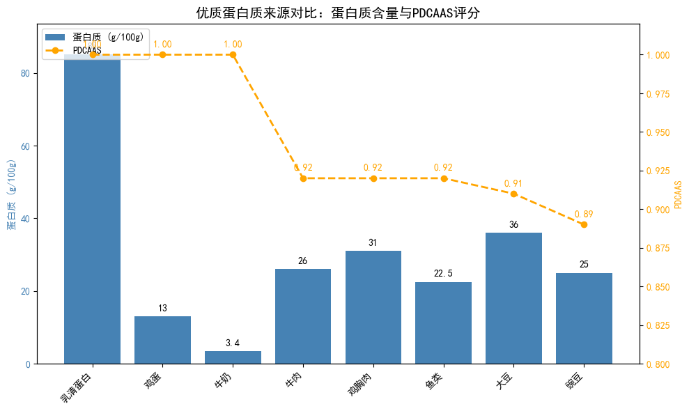
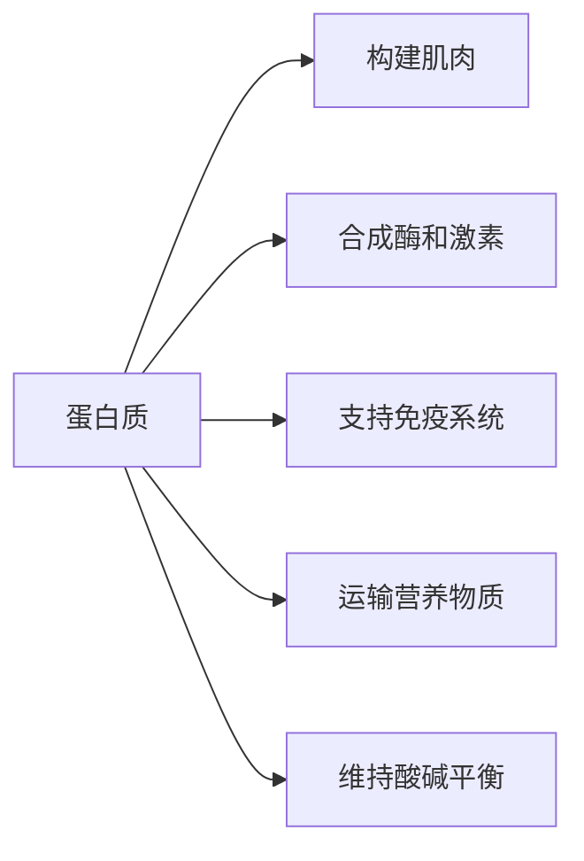

import ProteinCalculator from '@site/src/components/ProteinCalculator';

# 每日蛋白质摄入计算器

**蛋白质 (Protein)** 是人体必需的三大宏量营养素之一，对肌肉合成、免疫功能和身体恢复至关重要。

## 蛋白质需求参考值

| 人群 | 推荐摄入量 (g/kg体重/天) |
|------|------------------------|
| 久坐成人 | 0.8 - 1.0 |
| 普通运动者 | 1.2 - 1.5 |
| 力量训练 | 1.6 - 2.2 |
| 减脂期间 | 1.6 - 2.4 |
| 专业运动员 | 1.8 - 2.5 |
| 老年人 | 1.0 - 1.2 |

---

## 在线计算

<ProteinCalculator />

---

- **柱状图**：每100克食物中的蛋白质含量（克）  
- **折线图（带标记）**：PDCAAS（蛋白质消化率校正氨基酸评分），满分为1.00，反映蛋白质的氨基酸组成与人体需求的匹配程度

**关键观察：**

- **乳清蛋白**蛋白质含量极高（约85 g/100g）且PDCAAS为满分1.00，是高效的优质蛋白来源。
- **鸡蛋、牛奶**虽然蛋白质含量不高，但PDCAAS均为1.00，生物利用率极佳。
- **动物性蛋白**（牛肉、鸡胸肉、鱼类）蛋白质含量高（20–31 g/100g），PDCAAS接近满分（0.92）。
- **植物性蛋白**中，**大豆**表现最佳（36 g/100g，PDCAAS 0.91）；**豌豆**次之（25 g/100g，PDCAAS 0.89）。

## 蛋白质的生理功能

## 相关资源

- [BMI 体质指数计算器](/docs/Health-Action/bmi-calculator)
- [基础代谢率 (BMR) 计算器](/docs/Health-Action/bmr-calculator)
- [《成人肥胖食养指南（2024年版）》](/docs/Health-Action/obesity-guide)

---

:::caution 免责声明
本计算器仅供参考，不构成医疗或营养建议。肾功能不全者应在医生指导下控制蛋白质摄入。如需制定专业的饮食计划，请咨询注册营养师。
:::