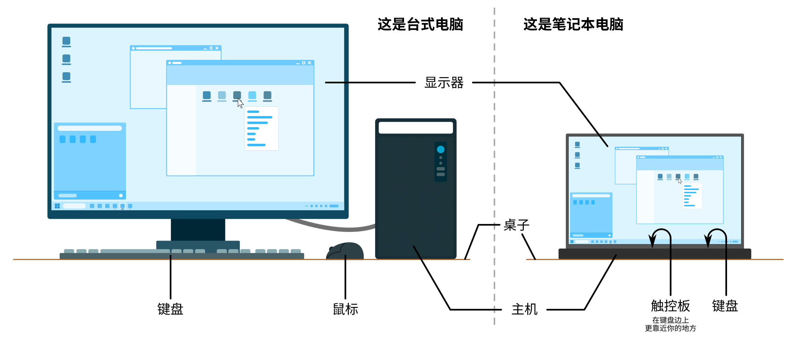
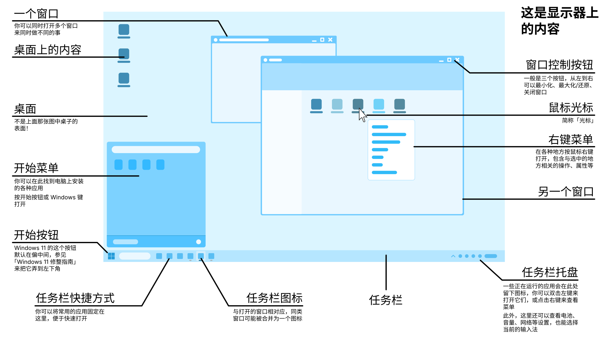

# 入门学前你要知道

:::tip
在这一部分，我们将介绍那些虽然基础但十分重要的电脑基本操作，从认识我们电脑的每个组成部分开始，学习文件管理的方法，尝试安装、卸载各种软件，并掌握基本的电脑维护知识。
:::

## 台式、笔记本电脑示意图

## 显示器窗口示意图

## 快捷键怎么按

如果你按快捷键（组合键）后，电脑并没有行使预想的功能，可能是你的按法不对。快捷键的按法并不是「同时按下所有的键」，而是「依展示次序按下各键不松手，最后一起松开」。例如，若要按快捷键「`Windows` + `Shift` + `S`」：

- 先按住 `Windows` 键不要松手（`Windows` 键上印有 Windows 徽标(四个方格)，一般来说这个键在 `Ctrl` 和 `Alt` 之间）；
- 再按住 `Shift` 键，同样不要松手；
- 接着按一下 `S` 键，然后松开全部按键。

:::tip
「`Windows` + `Shift` + `S`」 是截图功能。
:::