# Windows 系统升级与 RDP Wrapper 多用户远程桌面自动化配置

**文档版本：** v2.0  
**本文作者：** 杖雍皓  
**最后更新：** 2025年11月27日  
**适用对象：** 零基础用户 / IT管理员 / 多任务需求用户  
**难度等级：** ⭐⭐☆☆☆  
**操作所需时间：** 约 4 分钟（不包含系统升级重启时间）  

---

## 目录

1. [前言：这个工具能做什么？](#一前言这个工具能做什么)
2. [准备工作：检查你的 Windows 版本](#二准备工作检查你的-windows-版本)
3. [升级系统版本（家庭版用户必看）](#三升级系统版本家庭版用户必看)
4. [下载所需文件](#四下载所需文件)
5. [安装 RDP Wrapper](#五安装-rdp-wrapper)
6. [安装多用户管理系统](#六安装多用户管理系统)
7. [使用说明](#七使用说明)
8. [常见问题与解答](#八常见问题与解答)

---

## 一、前言：这个工具能做什么？

### 简单来说

这个工具可以让**一台电脑同时运行类似多台电脑**，每个窗口都有自己独立的桌面，互不干扰。

### 使用场景举例

- **企业微信多开**：一台电脑登录多个企业微信账号
- **软件多开**：需要同时运行多个相同软件的情况

### 工作原理图解

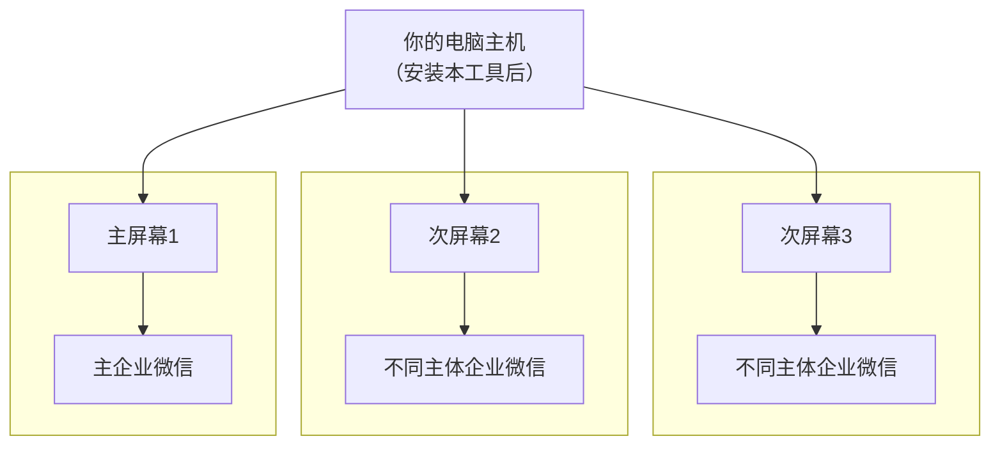

## 二、准备工作：检查你的 Windows 版本

在开始安装之前，我们需要先确认你的电脑系统版本。

### 步骤 1：打开"运行"窗口

同时按下键盘上的 **Windows 键** 和 **R 键**

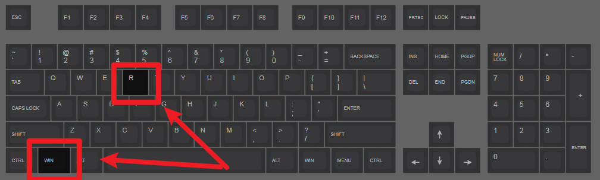

> **Windows 键**就是键盘左下角带有 Windows 图标（四个方块）的按键

### 步骤 2：输入命令查看版本

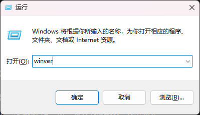

在弹出的窗口中输入：

```
winver
```

然后点击 **"确定"** 按钮

### 步骤 3：查看你的系统版本

会弹出一个"关于 Windows"的窗口，请注意查看以下信息：

#### Windows 系统版本支持

| Windows 10 家庭版 | Windows 10 企业版 |
|:---:|:---:|
| 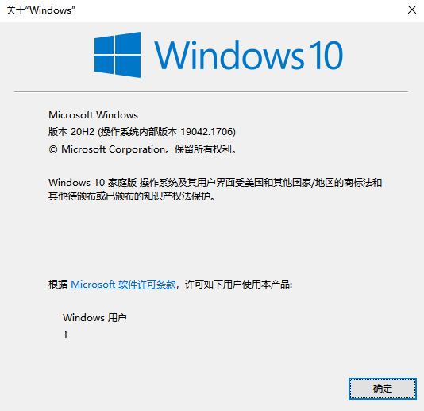 | 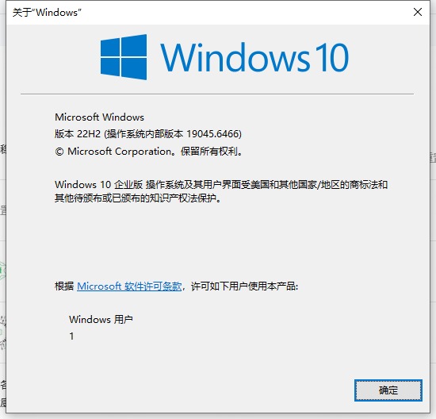 |

| Windows 11 家庭版 | Windows 11 专业工作站版 |
|:---:|:---:|
| 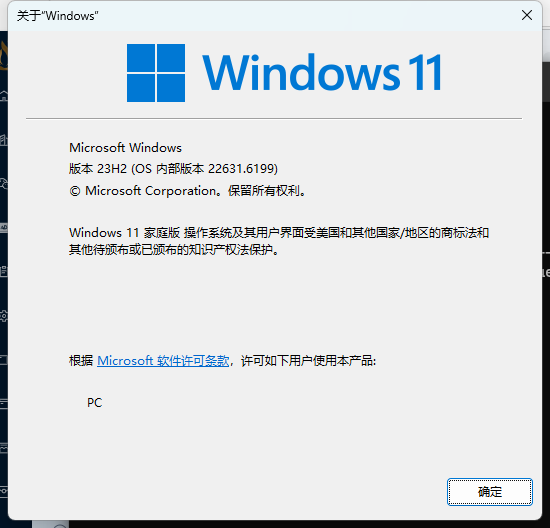 | 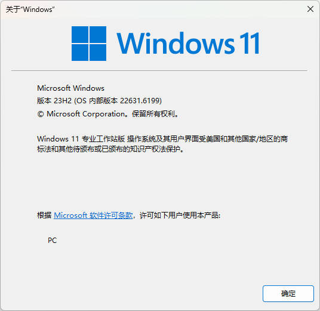 |

### 步骤 4：判断是否需要升级

请对照下表判断你的系统：

| 你看到的版本 | 是否可以直接使用 | 需要的操作 |
|-------------|----------------|-----------|
| Windows 10/11 **家庭版** | ❌ 不可以 | 需要升级系统（见第三章） |
| Windows 10/11 **家庭中文版** | ❌ 不可以 | 需要升级系统（见第三章） |
| Windows 10/11 **专业版** | ✅ 可以 | 跳到第四章继续 |
| Windows 10/11 **企业版** | ✅ 可以 | 跳到第四章继续 |
| Windows 10/11 **教育版** | ✅ 可以 | 跳到第四章继续 |
| Windows 10/11 **专业工作站版** | ✅ 可以 | 跳到第四章继续 |
| Windows Server（服务器版） | ✅ 可以 | 跳到第四章继续 |

:::warning
 **重要提示**：如果你是**家庭版**，必须先升级到专业版或以上版本，否则后续步骤将无法生效！
:::

---

## 三、升级系统版本（家庭版用户必看）

:::tip
如果你的系统已经是专业版或以上版本，请直接跳到 **第四章**。
:::

### 3.1 升级原理说明

Windows 家庭版可以通过输入**产品密钥**直接升级到专业版，无需重装系统。

### 3.2 进入密钥更换界面

根据你的系统选择对应的操作方法：

---

#### 【Windows 10 用户】

**方法一：通过设置进入**

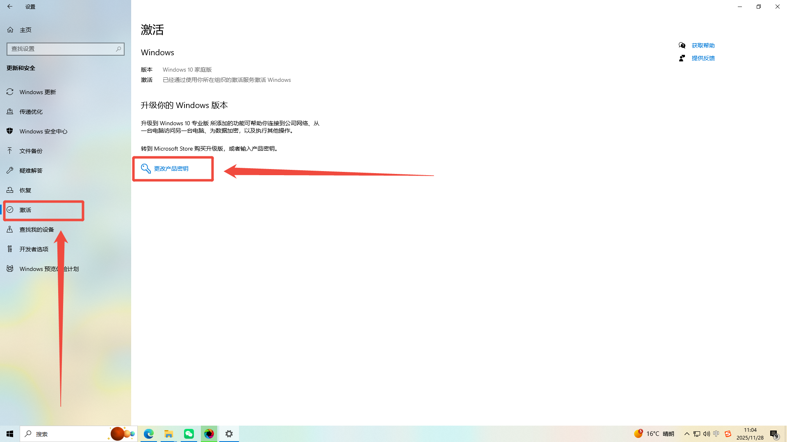

1. 点击屏幕左下角的 **"开始"** 按钮（Windows 图标）
2. 点击 **"设置"**（齿轮图标）
3. 点击 **"更新和安全"**
4. 在左侧菜单点击 **"激活"**
5. 点击 **"更改产品密钥"**

**方法二：快捷方式**

1. 按 **Windows + I** 打开设置
2. 点击 **"更新和安全"** → **"激活"** → **"更改产品密钥"**

**图示路径**：

```
开始 → 设置 → 更新和安全 → 激活 → 更改产品密钥
```

---

#### 【Windows 11 用户】

**方法一：通过设置进入**

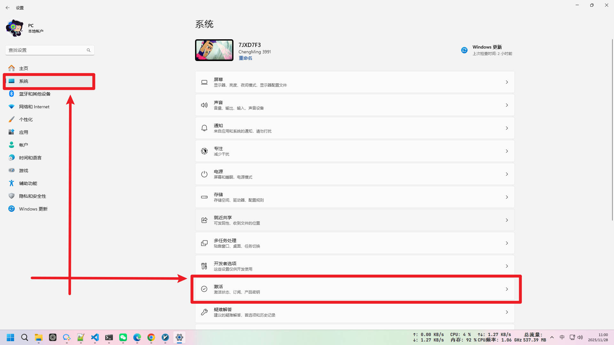

1. 点击屏幕下方任务栏的 **"开始"** 按钮
2. 点击 **"设置"**（齿轮图标）
3. 在左侧菜单点击 **"系统"**
4. 向下滚动，点击 **"激活"**
5. 展开 **"升级你的 Windows 版本"**
6. 点击 **"更改"**（在"更改产品密钥"旁边）

**方法二：快捷方式**

1. 按 **Windows + I** 打开设置
2. 点击 **"系统"** → **"激活"** → **"升级你的 Windows 版本"** → **"更改"**

**图示路径**：

```
开始 → 设置 → 系统 → 激活 → 升级你的 Windows 版本 → 更改
```

---

### 3.3 输入升级密钥

在弹出的窗口中输入以下密钥：

#### Windows 10/11 通用批量许可证密钥 (GVLK)

在下表中，可找到 Windows 每个版本的 GVLK。LTSC 是长期服务渠道，而 LTSB 是 Long-Term Servicing Branch。

Windows 11 和 Windows 10（半年频道）
有关受支持的版本和服务终止日期的信息，请参阅[ Windows 生命周期情况说明书](https://learn.microsoft.com/zh-cn/windows-server/get-started/kms-client-activation-keys)。

:::tip
推荐使用**专业版、企业版、专业工作站版**，不推荐使用教育版和其他带有N、G、G N的版本。
:::

| 支持的操作系统版本 | KMS 客户端产品密钥 | 版本说明 |
|:---|:---|:---|
| **Windows 11 专业版**<br/>Windows 10 专业版 | `W269N-WFGWX-YVC9B-4J6C9-T83GX` | **标准专业版**<br/>包含所有专业版功能，适合大多数用户 |
| **Windows 11 专业版 N**<br/>Windows 10 专业版 N | `MH37W-N47XK-V7XM9-C7227-GCQG9` | **欧洲版专业版**<br/>移除 Windows Media Player 等多媒体组件 |
| **Windows 11 专业工作站版**<br/>Windows 10 专业工作站版 | `NRG8B-VKK3Q-CXVCJ-9G2XF-6Q84J` | **工作站版**<br/>支持高级硬件、ReFS 文件系统等 |
| **Windows 11 专业工作站版 N**<br/>Windows 10 专业工作站版 N | `9FNHH-K3HBT-3W4TD-6383H-6XYWF` | **欧洲版工作站版**<br/>工作站功能但不含多媒体组件 |
| **Windows 11 专业教育版**<br/>Windows 10 专业教育版 | `6TP4R-GNPTD-KYYHQ-7B7DP-J447Y` | **专业教育版**<br/>专业版+教育相关功能 |
| **Windows 11 专业教育版 N**<br/>Windows 10 专业教育版 N | `YVWGF-BXNMC-HTQYQ-CPQ99-66QFC` | **欧洲版专业教育版**<br/>专业教育版但不含多媒体 |
| **Windows 11 教育版**<br/>Windows 10 教育版 | `NW6C2-QMPVW-D7KKK-3GKT6-VCFB2` | **标准教育版**<br/>专为教育机构设计 |
| **Windows 11 教育版 N**<br/>Windows 10 教育版 N | `2WH4N-8QGBV-H22JP-CT43Q-MDWWJ` | **欧洲版教育版**<br/>教育版但不含多媒体组件 |
| **Windows 11 企业版**<br/>Windows 10 企业版 | `NPPR9-FWDCX-D2C8J-H872K-2YT43` | **标准企业版**<br/>完整企业级功能，适合大型组织 |
| **Windows 11 企业版 N**<br/>Windows 10 企业版 N | `DPH2V-TTNVB-4X9Q3-TJR4H-KHJW4` | **欧洲版企业版**<br/>企业版功能但不含多媒体 |
| **Windows 11 企业版 G**<br/>Windows 10 企业版 G | `YYVX9-NTFWV-6MDM3-9PT4T-4M68B` | **中国政府版**<br/>包含中国特定安全要求 |
| **Windows 11 企业版 G N**<br/>Windows 10 企业版 G N | `44RPN-FTY23-9VTTB-MP9BX-T84FV` | **中国政府欧洲版**<br/>中国版+移除多媒体组件 |

### 使用说明
- 这些密钥仅适用于 KMS 激活
- 同一密钥适用于 Windows 11 和 Windows 10 的对应版本

:::tip
📝 **说明**：这是微软官方提供的升级密钥，仅用于将家庭版升级到专业版，升级后仍需要激活。
:::

### 3.4 完成升级

1. 输入密钥后点击 **"下一步"**
2. 系统会自动验证并开始升级
3. 等待升级完成（根据电脑性能不同通常可能需要几分钟到十几分钟）
4. 根据提示**重启电脑**

### 3.5 验证升级结果

重启后，再次按 **Windows + R**，输入 `winver`，确认显示为 **"专业版"**。

### 3.6 （可选非必须）KMS 激活步骤

:::info
**此步不是必须步骤。** 可直接点击跳转到[第四步](#四下载所需文件)进行操作。
:::

##### 第一步：测试 KMS 服务器连通性

以**管理员身份**打开命令提示符 (cmd)，逐个 ping 以下 KMS 服务器，找到可用的服务器：

```batch
ping zh.us.to
ping kms.03k.org
ping kms.chinancce.com
ping kms.shuax.com
ping kms.dwhd.org
ping kms.luody.info
ping kms.digiboy.ir
ping kms.lotro.cc
ping ss.yechiu.xin
ping www.zgbs.cc
ping cy2617.jios.org
```

**判断标准**：
- 如果显示 `来自 xxx.xxx.xxx.xxx 的回复` → 服务器可用 ✅
- 如果显示 `请求超时` 或 `无法访问目标主机` → 服务器不可用 ❌

记录下能够 ping 通的服务器地址。

##### 第二步：选择对应的产品密钥

从[通用批量许可证密钥 (GVLK)](#通用批量许可证密钥-gvlk)选择对应密钥。

##### 第三步：执行 KMS 激活命令

以**管理员身份**打开 PowerShell，按顺序执行以下命令：

###### 1. 安装产品密钥
```powershell
slmgr /ipk <你选择的密钥>
```
**示例**（如果是专业工作站版）：
```powershell
slmgr /ipk NRG8B-VKK3Q-CXVCJ-9G2XF-6Q84J
```

###### 2. 设置 KMS 服务器
```powershell
slmgr /skms <第一步中ping通的服务器地址>
```
**示例**（如果 `zh.us.to` 可用）：
```powershell
slmgr /skms zh.us.to
```

###### 3. 激活 Windows
```powershell
slmgr /ato
```

##### 第四步：验证激活状态

执行以下命令检查激活状态：
```powershell
slmgr /xpr
```
或者
```powershell
slmgr /dli
```

##### 注意事项

1. **必须使用管理员权限**运行所有命令
2. **确保网络畅通**，能够访问 KMS 服务器
3. **密钥必须匹配**你的 Windows 版本
4. 如果激活失败，可以尝试其他可用的 KMS 服务器
5. 某些网络环境可能需要配置防火墙规则

##### 常见问题解决

- **错误 0x80070005**：权限不足，请以管理员身份运行
- **错误 0xC004F074**：无法连接 KMS 服务器，请更换服务器
- **错误 0xC004E016**：密钥与系统版本不匹配，请检查密钥

按照以上步骤操作，即可成功激活 Windows 系统。

---

## 四、下载所需文件

### 4.1 需要下载的文件

我们需要下载两个压缩包：

| 文件 | 说明 | 下载链接 |
|------|------|---------|
| RDP-Wrapper.zip | RDP Wrapper 主程序 | [点击下载](https://cf-r2.zyhorg.ac.cn/archives/1763703074786-nmx983-RDP-Wrapper.zip) |
| RDP-Wrapper-Multi-User-Management-System.zip | 多用户管理系统 | [点击下载](https://cf-r2.zyhorg.ac.cn/archives/1764248844331-fkcqan-RDP-Wrapper-Multi-User-Management-System.zip) |

### 4.2 下载步骤

1. 点击上方的下载链接
2. 浏览器会自动开始下载（或弹出保存对话框）
3. 建议保存到 **"下载"** 文件夹或 **"桌面"**
4. 等待两个文件都下载完成

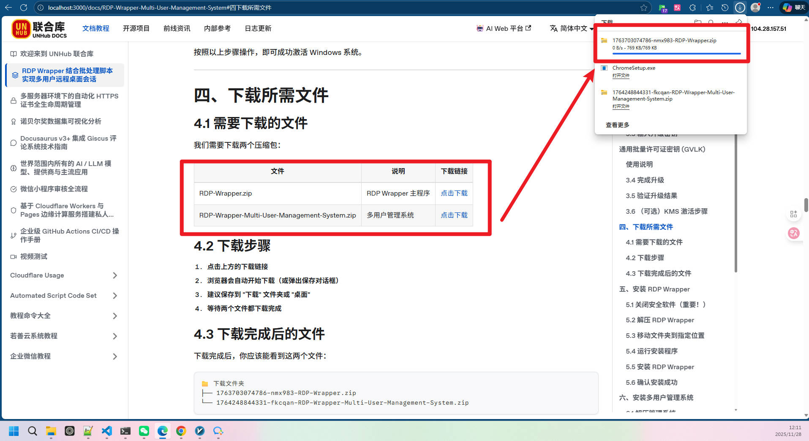

### 4.3 下载完成后的文件

下载完成后，你应该能看到这两个文件：

```
📁 下载文件夹
├── 1763703074786-nmx983-RDP-Wrapper.zip
└── 1764248844331-fkcqan-RDP-Wrapper-Multi-User-Management-System.zip
```

---

## 五、安装 RDP Wrapper

### 5.1 关闭安全软件（重要！）

在安装之前，请**暂时关闭**你电脑上的安全软件，否则可能会被拦截导致安装失败。

常见需要关闭的软件：

- **Windows Defender**（Windows 自带杀毒）
- **360 安全卫士 / 360 杀毒**
- **火绒安全**
- **腾讯电脑管家**
- **卡巴斯基**
- **其他杀毒软件**

#### 如何关闭 Windows Defender：

1. 按 **Windows + I** 打开设置
2. 点击 **"隐私和安全性"**（Windows 11）或 **"更新和安全"**（Windows 10）
3. 点击 **"Windows 安全中心"**
4. 点击 **"病毒和威胁防护"**
5. 点击 **"管理设置"**
6. 将 **"实时保护"** 关闭

> ⚠️ 安装完成后记得重新开启安全软件！

---

### 5.2 解压 RDP Wrapper

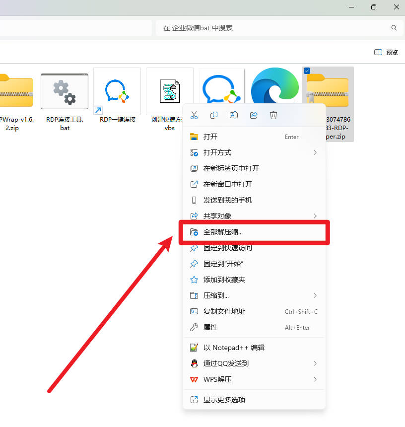

1. 找到下载的 `1763703074786-nmx983-RDP-Wrapper.zip` 文件
2. **右键点击**该文件
3. 选择 **"解压到当前文件夹"** 或 **"解压到..."**
4. 解压后会得到一个 **"RDP Wrapper"** 文件夹

---

### 5.3 移动文件夹到指定位置

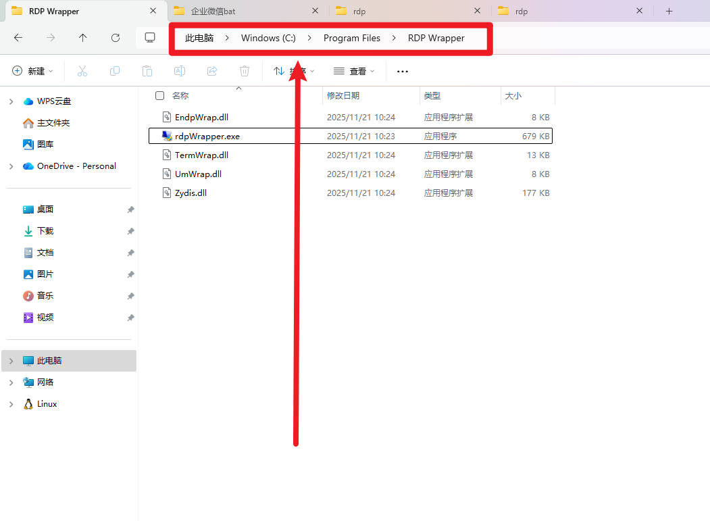

我们需要把解压出来的文件夹放到系统目录中：

**目标位置**：`C:\Program Files\RDP Wrapper`

#### 操作步骤：

1. 打开 **"此电脑"** 或 **"我的电脑"**
2. 双击进入 **"本地磁盘 (C:)"**
3. 找到并双击进入 **"Program Files"** 文件夹
4. 将解压出来的 **"RDP Wrapper"** 文件夹**复制**或**移动**到这里

**完成后的路径结构**：

```
C:\
└── Program Files\
    └── RDP Wrapper\
        ├── rdpWrapper.exe
        └── ... 其他文件
```

:::tip
💡 **提示**：如果提示需要管理员权限，请点击 **"继续"**。
:::

---

### 5.4 运行安装程序

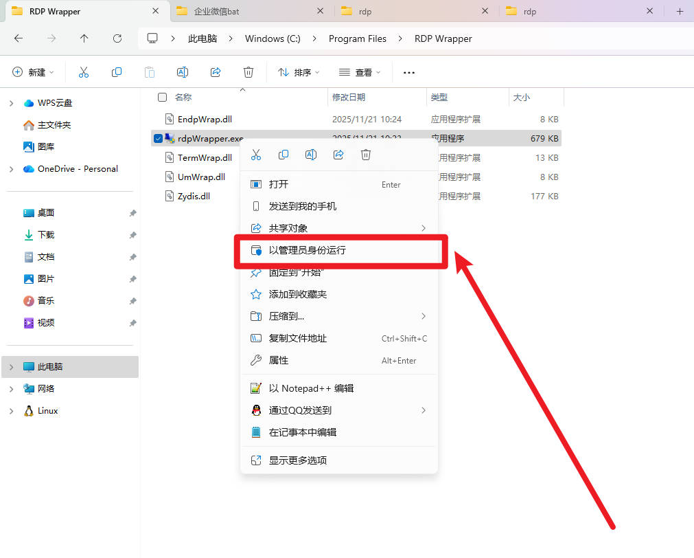

1. 进入 `C:\Program Files\RDP Wrapper` 文件夹
2. 找到 **"rdpWrapper.exe"** 文件
3. **右键点击**该文件
4. 选择 **"以管理员身份运行"**

:::warning
 **必须以管理员身份运行**，否则安装会失败！
:::

---

### 5.5 安装 RDP Wrapper

打开 rdpWrapper.exe 后，你会看到如下界面：

```
┌─────────────────────────────────────────────────────────┐
│                    RDP Wrapper Configuration            │
├─────────────────────────────────────────────────────────┤
│                                                         │
│  Wrapper state:    [not installed]  ← 显示未安装        │
│  Service state:    [stopped]                            │
│  Listener state:   [not listening]                      │
│                                                         │
│  ┌─────────┐  ┌─────────┐  ┌─────────┐                 │
│  │ Install │  │ Uninstall│ │ Update  │                 │
│  └─────────┘  └─────────┘  └─────────┘                 │
│                                                         │
└─────────────────────────────────────────────────────────┘
```

**点击 "Install" 按钮** 开始安装。Install按钮可能在界面右上角，以具体情况为准，遇到弹窗全选是或yes。

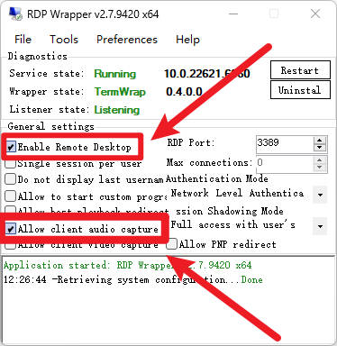

注意勾选这两个选项。

---

### 5.6 确认安装成功

安装完成后，界面上的状态应该**全部变成绿色**：

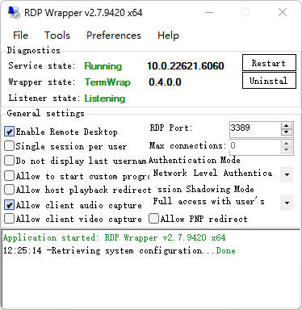

**检查清单**：

| 状态项 | 应该显示 | 颜色 |
|--------|---------|------|
| Wrapper state | installed | 🟢 绿色 |
| Service state | running | 🟢 绿色 |
| Listener state | listening | 🟢 绿色 |

> ✅ 如果全部是绿色，恭喜你，RDP Wrapper 安装成功！
>
> ❌ 如果有红色或黄色，请参考 **第八章 常见问题**。

---

## 六、安装多用户管理系统

### 6.1 解压管理系统

1. 找到下载的 `1764248844331-fkcqan-RDP-Wrapper-Multi-User-Management-System.zip` 文件
2. **右键点击**该文件
3. 选择 **"解压到当前文件夹"** 或 **"解压到..."**
4. 解压后会得到一个文件夹

:::tip
💡 **提示**：这个文件夹可以放在任何位置，比如桌面、D盘等都可以。
:::

---

### 6.2 文件夹内容说明

解压后，文件夹内应包含以下文件：

```
📁 RDP-Wrapper-Multi-User-Management-System\
├── RDP连接工具.bat          ← 主程序
├── 创建快捷方式.vbs         ← 用于创建快捷方式
├── icon.ico                 ← 图标文件
└── rdp_users.txt            ← 用户数据（首次运行后自动生成）
```

---

### 6.3 创建快捷方式

1. 进入解压后的文件夹
2. 找到 **"创建快捷方式.vbs"** 文件
3. **双击**运行它

运行后会弹出提示框：

```
┌────────────────────────────────────────┐
│              完成                       │
├────────────────────────────────────────┤
│                                        │
│  快捷方式已创建！                       │
│                                        │
│  1. 当前目录: ...\RDP企业微信多开.lnk      │
│  2. 桌面: ...\RDP企业微信多开.lnk          │
│                                        │
│  双击即可使用（会自动请求管理员权限）    │
│                                        │
│              [ 确定 ]                   │
└────────────────────────────────────────┘
```

点击 **"确定"**，快捷方式就创建好了！

---

### 6.4 创建完成

现在你可以在以下位置找到快捷方式：

- **桌面**：会看到 **"RDP企业微信多开"** 图标
- **原文件夹**：同样有 **"RDP企业微信多开"** 图标

以后只需要**双击这个图标**就可以打开管理系统了。

---

## 七、使用说明

### 7.1 启动管理系统

**双击**桌面上的 **"RDP一键连接"** 图标。

:::tip
💡 首次运行会弹出 **"用户账户控制"** 窗口，请点击 **"是"** 允许运行。
:::

---

### 7.2 主界面说明

启动后会看到如下界面：

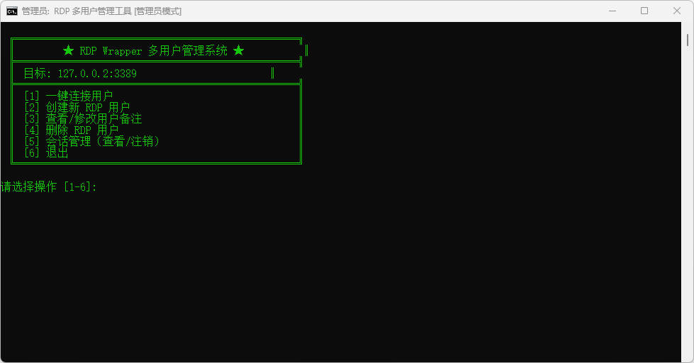

---

### 7.3 功能详解

#### 【功能 1】一键连接用户

**用途**：连接到已创建的远程桌面用户

**操作步骤**：
1. 输入 `1` 按回车
2. 选择要连接的用户（输入序号）
3. 选择窗口分辨率（推荐选 3）
4. 系统会自动打开远程桌面连接

**适用场景**：日常使用，快速打开多个桌面窗口

---

#### 【功能 2】创建新 RDP 用户

**用途**：创建一个新的远程桌面用户

**操作步骤**：
1. 输入 `2` 按回车
2. 输入新用户名（如：`user1`）
3. 输入密码
4. 再次确认密码
5. 输入备注（可选，比如：企业微信1号）

**示例**：

```
  用户名（0 返回）: weixin1
  密码: 123456
  确认密码: 123456
  备注: 企业微信1号

  [OK] 用户创建成功
  [OK] 已添加到远程桌面用户组
  [OK] 已保存记录

  是否立即连接？(Y/N): Y
```

:::tip
 💡 **命名建议**：使用有意义的名称，方便日后识别。比如：weixin1、weixin2 等。
:::

---

#### 【功能 3】查看/修改用户备注

**用途**：查看所有已创建的用户，或修改用户的备注信息

**操作步骤**：
1. 输入 `3` 按回车
2. 查看用户列表（包含用户名、密码、备注）
3. 如需修改备注，输入对应序号
4. 输入新的备注内容

**显示示例**：

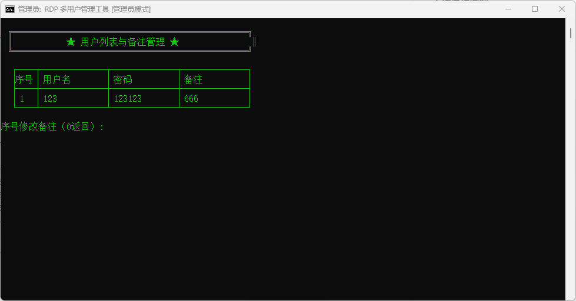

---

#### 【功能 4】删除 RDP 用户

**用途**：删除不再需要的用户

**操作步骤**：
1. 输入 `4` 按回车
2. 查看用户列表
3. 输入要删除的用户序号
4. 确认删除（输入 Y）

:::danger
**注意**：删除操作不可恢复，请谨慎操作！
:::

---

#### 【功能 5】会话管理（查看/注销）

**用途**：查看当前所有远程连接，注销断开的会话

**操作步骤**：
1. 输入 `5` 按回车
2. 查看当前会话列表
3. 选择操作：
   - `1`：注销指定会话（输入会话ID）
   - `2`：注销所有断开的会话
   - `3`：返回主菜单

**会话状态说明**：

| 状态 | 中文显示 | 英文显示 | 含义 |
|------|---------|---------|------|
| 活动中 | 运行中 | Active | 用户正在使用 |
| 已断开 | 断开 | Disc | 用户已断开但未注销（占用资源） |
| 监听中 | 侦听 | Listen | 正常状态 |

> 💡 **提示**：如果遇到"连接数已满"的错误，来这里注销断开的会话即可。

---

#### 【功能 6】退出

输入 `6` 按回车即可退出程序。

---

### 7.4 使用流程总结

```
首次使用：
    创建用户（功能2）→ 连接用户（功能1）→ 开始使用

日常使用：
    打开程序 → 一键连接（功能1）→ 选择用户 → 开始使用

遇到连接问题：
    会话管理（功能5）→ 注销断开的会话 → 重新连接
```

---

## 八、常见问题与解答

### Q1：安装 RDP Wrapper 后显示红色或黄色怎么办？

**问题表现**：RDPConf 界面中某些状态显示红色或黄色，而不是全绿。

**解决方案**：

1. 下载最新的配置文件：
   - 访问：https://github.com/sebaxakerhtc/rdpwrap.ini
   - 下载 `rdpwrap.ini` 文件

2. 替换配置文件：
   - 将下载的文件复制到 `C:\Program Files\RDP Wrapper\`
   - 覆盖原有的 `rdpwrap.ini`

3. 重启服务：
   - 按 **Windows + R**
   - 输入 `cmd`，按 **Ctrl + Shift + Enter**（以管理员身份打开）
   - 输入以下命令：
     ```
     net stop termservice /y
     net start termservice
     ```

4. 重新打开 rdpWrapper.exe 检查状态

---

### Q2：提示"连接数量有限，已使用所有连接"怎么办？

**问题原因**：有之前的会话没有正常注销，占用了连接数。

**解决方案**：

1. 打开 **RDP一键连接**
2. 选择 **[5] 会话管理**
3. 选择 **[2] 注销所有断开的会话**
4. 返回主菜单，重新连接

---

### Q3：被安全软件拦截怎么办？

**解决方案**：

1. 将 `C:\Program Files\RDP Wrapper` 文件夹添加到安全软件的**白名单**或**信任区**
2. 或者在安装时暂时关闭安全软件

**各软件添加白名单方法**：

- **360安全卫士**：设置 → 安全防护中心 → 信任列表 → 添加文件夹
- **火绒安全**：设置 → 安全设置 → 白名单 → 添加
- **Windows Defender**：设置 → 病毒防护 → 排除项 → 添加

---

### Q4：忘记创建的用户密码怎么办？

**解决方案**：

1. 打开 **RDP一键连接**
2. 选择 **[3] 查看/修改用户备注**
3. 可以看到所有用户的密码

---

### Q5：如何完全卸载？

**卸载步骤**：

1. 打开 `C:\Program Files\RDP Wrapper` 文件夹
2. 右键以管理员身份运行 `rdpWrapper.exe`
3. 点击 **"Uninstall"** 按钮
4. 删除 `C:\Program Files\RDP Wrapper` 文件夹
5. 删除桌面和其他位置的快捷方式

---

### Q6：升级 Windows 后密钥失效怎么办？

升级密钥只是用于升级系统版本，升级后需要单独激活 Windows。

可以使用以下方式激活：
- 购买正版密钥
- 使用数字权利激活
- 联系电脑销售商

---

## 附录：快捷键速查表

| 快捷键 | 功能 |
|--------|------|
| Windows + R | 打开"运行"窗口 |
| Windows + I | 打开"设置" |
| Windows + E | 打开"此电脑" |
| Ctrl + Shift + Enter | 以管理员身份运行 |

---

## 技术支持

如果按照本文档操作后仍有问题，请检查：

1. ✅ Windows 版本是否为专业版或以上
2. ✅ RDPConf 是否显示全绿
3. ✅ 安全软件是否已添加白名单
4. ✅ 是否以管理员身份运行

:::info
如果依旧有问题请联系系统运维技术支持人员。
:::

## 开放源代码

### RDP Wrapper

RDP Wrapper 来自 GitHub，开放源代码地址为[https://github.com/rdp-wrapper/rdpWrapper](https://github.com/rdp-wrapper/rdpWrapper)

此项目可以轻松设置多个RDP会话，可移植、基于UI、脱机工作、可对抗Windows更新。

### 创建快捷方式.vbs 脚本文件

VBS（Visual Basic Script）是一种基于Visual Basic的脚本语言，全称是Microsoft Visual Basic Script Edition。它由微软公司开发，主要用于Windows环境下的自动化任务和脚本编写。

```shell  showLineNumbers=true
Set WshShell = CreateObject("WScript.Shell")
Set fso = CreateObject("Scripting.FileSystemObject")

currentDir = fso.GetParentFolderName(WScript.ScriptFullName)
batPath = currentDir & "\RDP连接工具.bat"
iconPath = currentDir & "\icon.ico"

desktopPath = WshShell.SpecialFolders("Desktop")

shortcutPath1 = currentDir & "\RDP企业微信多开.lnk"
shortcutPath2 = desktopPath & "\RDP企业微信多开.lnk"

If fso.FileExists(iconPath) Then
    iconLocation = iconPath
Else
    iconLocation = "mstsc.exe,0"
End If

Set shortcut1 = WshShell.CreateShortcut(shortcutPath1)
shortcut1.TargetPath = batPath
shortcut1.WorkingDirectory = currentDir
shortcut1.WindowStyle = 1
shortcut1.Description = "RDP Wrapper 多用户管理工具"
shortcut1.IconLocation = iconLocation
shortcut1.Save

Set shortcut2 = WshShell.CreateShortcut(shortcutPath2)
shortcut2.TargetPath = batPath
shortcut2.WorkingDirectory = currentDir
shortcut2.WindowStyle = 1
shortcut2.Description = "RDP Wrapper 多用户管理工具"
shortcut2.IconLocation = iconLocation
shortcut2.Save

MsgBox "快捷方式已创建！" & vbCrLf & vbCrLf & "1. 当前目录: " & shortcutPath1 & vbCrLf & "2. 桌面: " & shortcutPath2 & vbCrLf & vbCrLf & "双击即可使用（会自动请求管理员权限）", vbInformation, "完成"
```

### RDP连接工具.bat 脚本文件

批处理文件，在DOS和Windows（任意）操作系统中，.BAT文件是可执行文件，由一系列命令构成，其中可以包含对其他程序的调用。这个文件的每一行都是一条DOS命令（大部分时候就好像我们在DOS提示符下执行的命令行一样），你可以使用DOS下的EDIT或者Windows的记事本（Notepad）等任何文本文件编辑工具创建和修改批处理文件。 

```shell  showLineNumbers=true
@echo off
:: ================================================================
:: 自动请求管理员权限
:: ================================================================
>nul 2>&1 "%SYSTEMROOT%\system32\cacls.exe" "%SYSTEMROOT%\system32\config\system"

if '%errorlevel%' NEQ '0' (
    echo 正在请求管理员权限...
    goto UACPrompt
) else ( goto gotAdmin )

:UACPrompt
    echo Set UAC = CreateObject^("Shell.Application"^) > "%temp%\getadmin.vbs"
    echo UAC.ShellExecute "%~s0", "", "", "runas", 1 >> "%temp%\getadmin.vbs"
    "%temp%\getadmin.vbs"
    exit /B

:gotAdmin
    if exist "%temp%\getadmin.vbs" ( del "%temp%\getadmin.vbs" )
    pushd "%CD%"
    CD /D "%~dp0"

:: ================================================================
setlocal enabledelayedexpansion

title RDP 多用户管理工具 [管理员模式]
color 0A

set "RDP_IP=127.0.0.2"
set "RDP_PORT=3389"
set "USER_DB=%~dp0rdp_users.txt"

if not exist "%USER_DB%" (
    echo # 用户名,密码,备注 > "%USER_DB%"
)

:: =============== 主菜单 ===============
:MAIN_MENU
cls
echo.
echo  ╔══════════════════════════════════════════════════╗
echo  ║         ★ RDP Wrapper 多用户管理系统 ★          ║
echo  ╠══════════════════════════════════════════════════╣
echo  ║  目标: %RDP_IP%:%RDP_PORT%                       ║
echo  ╠══════════════════════════════════════════════════╣
echo  ║  [1] 一键连接用户                                ║
echo  ║  [2] 创建新 RDP 用户                             ║
echo  ║  [3] 查看/修改用户备注                           ║
echo  ║  [4] 删除 RDP 用户                               ║
echo  ║  [5] 会话管理（查看/注销）                       ║
echo  ║  [6] 退出                                        ║
echo  ╚══════════════════════════════════════════════════╝
echo.

set "choice="
set /p "choice=  请选择操作 [1-6]: "

if "%choice%"=="1" goto CONNECT_MENU
if "%choice%"=="2" goto CREATE_USER
if "%choice%"=="3" goto SHOW_SAVED_USERS
if "%choice%"=="4" goto DELETE_USER
if "%choice%"=="5" goto SESSION_MANAGER
if "%choice%"=="6" exit

goto MAIN_MENU

:: =============== 会话管理 ===============
:SESSION_MANAGER
cls
echo.
echo  ╔══════════════════════════════════════════════════╗
echo  ║             ★ RDP 会话管理 ★                    ║
echo  ╚══════════════════════════════════════════════════╝
echo.
echo   当前系统会话列表：
echo   ════════════════════════════════════════════════
echo.

:: 显示会话列表
qwinsta 2>nul

echo.
echo   ════════════════════════════════════════════════
echo.
echo   状态说明：
echo   - Active = 活动中（正在使用）
echo   - Disc   = 已断开（占用连接数！）
echo   - Listen = 监听中（正常）
echo.
echo   ────────────────────────────────────────────────
echo.
echo   [1] 注销指定会话（释放连接）
echo   [2] 注销所有断开的会话
echo   [3] 返回主菜单
echo.

set "sess_choice="
set /p "sess_choice=  请选择 [1-3]: "

if "%sess_choice%"=="1" goto LOGOFF_SESSION
if "%sess_choice%"=="2" goto LOGOFF_ALL_DISC
if "%sess_choice%"=="3" goto MAIN_MENU

goto SESSION_MANAGER

:: =============== 注销指定会话 ===============
:LOGOFF_SESSION
echo.
echo   提示：输入要注销的会话ID（数字）
echo   注意：不要注销 console 会话（那是你当前的桌面）
echo.

set "sess_id="
set /p "sess_id=  会话ID（0返回）: "

if "%sess_id%"=="0" goto SESSION_MANAGER
if not defined sess_id goto SESSION_MANAGER

:: 验证是数字
set "valid=1"
for /f "delims=0123456789" %%i in ("%sess_id%") do set "valid=0"
if %valid% equ 0 (
    echo   [错误] 请输入数字
    timeout /t 2 >nul
    goto SESSION_MANAGER
)

echo.
echo   正在注销会话 %sess_id% ...
logoff %sess_id% 2>nul

if %errorlevel% equ 0 (
    echo   [OK] 会话已注销
) else (
    echo   [错误] 注销失败，可能会话不存在或无权限
)

timeout /t 2 >nul
goto SESSION_MANAGER

:: =============== 注销所有断开的会话 ===============
:LOGOFF_ALL_DISC
echo.
echo   正在查找并注销所有断开的会话...
echo.

set "found=0"
for /f "tokens=2,4" %%a in ('qwinsta 2^>nul ^| findstr /i "Disc"') do (
    set "found=1"
    echo   注销会话 %%a (状态: %%b)
    logoff %%a 2>nul
)

if %found% equ 0 (
    echo   [提示] 没有发现断开的会话
) else (
    echo.
    echo   [OK] 已注销所有断开的会话
)

timeout /t 2 >nul
goto SESSION_MANAGER

:: =============== 连接菜单 ===============
:CONNECT_MENU
cls
echo.
echo  ╔══════════════════════════════════════════════════╗
echo  ║                ★ 选择连接用户 ★                 ║
echo  ╚══════════════════════════════════════════════════╝
echo.

set "count=0"
for /f "usebackq eol=# tokens=1-3 delims=," %%a in ("%USER_DB%") do (
    set /a count+=1
    set "user[!count!]=%%a"
    set "pass[!count!]=%%b"
    set "remark[!count!]=%%c"
)

if %count% equ 0 (
    echo   [提示] 暂无用户记录，请先创建。
    echo.
    pause
    goto MAIN_MENU
)

echo   ┌────┬────────────────┬────────────────────┐
echo   │序号│ 用户名         │ 备注               │
echo   ├────┼────────────────┼────────────────────┤
for /l %%i in (1,1,%count%) do (
    set "u=!user[%%i]!               "
    set "u=!u:~0,14!"
    set "r=!remark[%%i]!                   "
    set "r=!r:~0,18!"
    echo   │ %%i  │ !u! │ !r! │
)
echo   └────┴────────────────┴────────────────────┘
echo.

set "pick="
set /p "pick=  请输入序号连接（0 返回）: "

if not defined pick goto CONNECT_MENU
if "%pick%"=="0" goto MAIN_MENU

set "valid=1"
for /f "delims=0123456789" %%i in ("%pick%") do set "valid=0"
if %valid% equ 0 (
    echo   [错误] 请输入有效数字。
    timeout /t 2 >nul
    goto CONNECT_MENU
)
if %pick% lss 1 goto CONNECT_MENU
if %pick% gtr %count% goto CONNECT_MENU

set "target_user=!user[%pick%]!"
set "target_pass=!pass[%pick%]!"

:: =============== 选择分辨率 ===============
:SELECT_RESOLUTION
cls
echo.
echo  ╔══════════════════════════════════════════════════╗
echo  ║              ★ 选择窗口分辨率 ★                 ║
echo  ╠══════════════════════════════════════════════════╣
echo  ║                                                  ║
echo  ║   [1] 1280 x 720   (小窗口)                      ║
echo  ║   [2] 1366 x 768   (笔记本常用)                  ║
echo  ║   [3] 1600 x 900   (中等窗口) [推荐]             ║
echo  ║   [4] 1920 x 1080  (大窗口)                      ║
echo  ║   [5] 全屏模式                                   ║
echo  ║   [6] 自定义分辨率                               ║
echo  ║                                                  ║
echo  ║   [0] 返回                                       ║
echo  ╚══════════════════════════════════════════════════╝
echo.
echo   当前用户: !target_user!
echo.

set "res="
set /p "res=  请选择分辨率 [0-6]: "

if "%res%"=="0" goto CONNECT_MENU

set "FULLSCREEN=0"
set "W=1600"
set "H=900"

if "%res%"=="1" (set "W=1280" & set "H=720")
if "%res%"=="2" (set "W=1366" & set "H=768")
if "%res%"=="3" (set "W=1600" & set "H=900")
if "%res%"=="4" (set "W=1920" & set "H=1080")
if "%res%"=="5" (set "FULLSCREEN=1")
if "%res%"=="6" (goto CUSTOM_RESOLUTION)

goto DO_CONNECT

:: =============== 自定义分辨率 ===============
:CUSTOM_RESOLUTION
cls
echo.
echo  ╔══════════════════════════════════════════════════╗
echo  ║              ★ 自定义分辨率 ★                   ║
echo  ╚══════════════════════════════════════════════════╝
echo.

set "custom_w="
set /p "custom_w=  宽度: "
if not defined custom_w goto SELECT_RESOLUTION

set "custom_h="
set /p "custom_h=  高度: "
if not defined custom_h goto SELECT_RESOLUTION

set "W=%custom_w%"
set "H=%custom_h%"
set "FULLSCREEN=0"

goto DO_CONNECT

:: =============== 执行连接 ===============
:DO_CONNECT
cls
echo.
echo  ╔══════════════════════════════════════════════════╗
echo  ║                ★ 正在连接... ★                  ║
echo  ╚══════════════════════════════════════════════════╝
echo.
echo   用户: !target_user!
echo   地址: %RDP_IP%:%RDP_PORT%
if %FULLSCREEN% equ 1 (
    echo   模式: 全屏
) else (
    echo   大小: %W% x %H%
)
echo.

cmdkey /delete:TERMSRV/%RDP_IP% >nul 2>&1
cmdkey /generic:TERMSRV/%RDP_IP% /user:!target_user! /pass:!target_pass! >nul

set /a "X2=100+%W%"
set /a "Y2=100+%H%"

set "RDP_FILE=%temp%\temp_connect.rdp"

if %FULLSCREEN% equ 1 (
    (
        echo full address:s:%RDP_IP%:%RDP_PORT%
        echo username:s:!target_user!
        echo screen mode id:i:2
        echo desktopwidth:i:1920
        echo desktopheight:i:1080
        echo session bpp:i:32
        echo allow font smoothing:i:1
        echo allow desktop composition:i:1
        echo redirectclipboard:i:1
        echo authentication level:i:2
        echo prompt for credentials:i:0
    ) > "!RDP_FILE!"
) else (
    (
        echo full address:s:%RDP_IP%:%RDP_PORT%
        echo username:s:!target_user!
        echo screen mode id:i:1
        echo desktopwidth:i:%W%
        echo desktopheight:i:%H%
        echo winposstr:s:0,1,100,100,%X2%,%Y2%
        echo smart sizing:i:1
        echo session bpp:i:32
        echo allow font smoothing:i:1
        echo allow desktop composition:i:1
        echo redirectclipboard:i:1
        echo authentication level:i:2
        echo prompt for credentials:i:0
    ) > "!RDP_FILE!"
)

echo   [OK] 启动连接...
echo.
echo   ────────────────────────────────────────────────
echo   如果提示"连接数量有限"，请：
echo   返回主菜单 - 选择 [5] 会话管理 - 注销断开的会话
echo   ────────────────────────────────────────────────

start "" mstsc "!RDP_FILE!"

timeout /t 3 >nul
goto MAIN_MENU

:: =============== 创建用户 ===============
:CREATE_USER
cls
echo.
echo  ╔══════════════════════════════════════════════════╗
echo  ║                ★ 创建新用户 ★                   ║
echo  ╚══════════════════════════════════════════════════╝
echo.

set "new_u="
set /p "new_u=  用户名（0 返回）: "

if not defined new_u goto MAIN_MENU
if "%new_u%"=="0" goto MAIN_MENU

net user "!new_u!" >nul 2>&1
if %errorlevel% equ 0 (
    echo.
    echo   [警告] 用户已存在
    set "add_exist="
    set /p "add_exist=  添加到RDP组？(Y/N): "
    if /i "!add_exist!"=="Y" goto ADD_EXISTING_USER
    goto CREATE_USER
)

set "new_p="
set /p "new_p=  密码: "
if not defined new_p goto CREATE_USER

set "new_p2="
set /p "new_p2=  确认密码: "
if not "!new_p!"=="!new_p2!" (
    echo   [错误] 密码不一致
    timeout /t 2 >nul
    goto CREATE_USER
)

set "new_r="
set /p "new_r=  备注: "

echo.
net user "!new_u!" "!new_p!" /add /active:yes /expires:never /passwordchg:no >nul 2>&1
if %errorlevel% neq 0 (
    echo   [错误] 创建失败
    pause
    goto CREATE_USER
)
echo   [OK] 用户创建成功

wmic useraccount where "name='!new_u!'" set PasswordExpires=false >nul 2>&1
net localgroup "Remote Desktop Users" "!new_u!" /add >nul 2>&1
net localgroup "远程桌面用户" "!new_u!" /add >nul 2>&1
echo   [OK] 已添加到远程桌面用户组

echo !new_u!,!new_p!,!new_r!>> "%USER_DB%"
echo   [OK] 已保存

echo.
set "conn_now="
set /p "conn_now=  立即连接？(Y/N): "
if /i "!conn_now!"=="Y" (
    set "target_user=!new_u!"
    set "target_pass=!new_p!"
    goto SELECT_RESOLUTION
)

goto MAIN_MENU

:ADD_EXISTING_USER
set "exist_p="
set /p "exist_p=  密码: "
if not defined exist_p goto CREATE_USER

set "exist_r="
set /p "exist_r=  备注: "

net localgroup "Remote Desktop Users" "!new_u!" /add >nul 2>&1
net localgroup "远程桌面用户" "!new_u!" /add >nul 2>&1

findstr /i /c:"!new_u!," "%USER_DB%" >nul 2>&1
if %errorlevel% neq 0 (
    echo !new_u!,!exist_p!,!exist_r!>> "%USER_DB%"
    echo   [OK] 已保存
)

pause
goto MAIN_MENU

:: =============== 查看/修改备注 ===============
:SHOW_SAVED_USERS
cls
echo.
echo  ╔══════════════════════════════════════════════════╗
echo  ║            ★ 用户列表与备注管理 ★               ║
echo  ╚══════════════════════════════════════════════════╝
echo.

set "count=0"
for /f "usebackq eol=# tokens=1-3 delims=," %%a in ("%USER_DB%") do (
    set /a count+=1
    set "show_user[!count!]=%%a"
    set "show_pass[!count!]=%%b"
    set "show_remark[!count!]=%%c"
)

if %count% equ 0 (
    echo   [提示] 暂无用户
    pause
    goto MAIN_MENU
)

echo   ┌────┬──────────────┬──────────────┬──────────────┐
echo   │序号│ 用户名       │ 密码         │ 备注         │
echo   ├────┼──────────────┼──────────────┼──────────────┤

for /l %%i in (1,1,%count%) do (
    set "u=!show_user[%%i]!            "
    set "u=!u:~0,12!"
    set "p=!show_pass[%%i]!            "
    set "p=!p:~0,12!"
    set "r=!show_remark[%%i]!            "
    set "r=!r:~0,12!"
    echo   │ %%i  │ !u! │ !p! │ !r! │
)

echo   └────┴──────────────┴──────────────┴──────────────┘
echo.

set "edit="
set /p "edit=  序号修改备注（0返回）: "

if not defined edit goto MAIN_MENU
if "%edit%"=="0" goto MAIN_MENU
if %edit% lss 1 goto SHOW_SAVED_USERS
if %edit% gtr %count% goto SHOW_SAVED_USERS

set "edit_user=!show_user[%edit%]!"
set "edit_pass=!show_pass[%edit%]!"
set "old_remark=!show_remark[%edit%]!"

set "new_remark="
set /p "new_remark=  新备注: "
if not defined new_remark set "new_remark=!old_remark!"

set "TEMP_DB=%~dp0rdp_users.tmp"
echo # 用户名,密码,备注 > "%TEMP_DB%"
for /f "usebackq eol=# tokens=1-3 delims=," %%a in ("%USER_DB%") do (
    if /i "%%a" equ "!edit_user!" (
        echo %%a,%%b,!new_remark!>> "%TEMP_DB%"
    ) else (
        echo %%a,%%b,%%c>> "%TEMP_DB%"
    )
)
move /y "%TEMP_DB%" "%USER_DB%" >nul

echo   [OK] 已更新
timeout /t 1 >nul
goto SHOW_SAVED_USERS

:: =============== 删除用户 ===============
:DELETE_USER
cls
echo.
echo  ╔══════════════════════════════════════════════════╗
echo  ║              ★ 删除 RDP 用户 ★                  ║
echo  ╚══════════════════════════════════════════════════╝
echo.

set "count=0"
for /f "usebackq eol=# tokens=1-3 delims=," %%a in ("%USER_DB%") do (
    set /a count+=1
    set "del_user[!count!]=%%a"
    set "del_remark[!count!]=%%c"
)

if %count% equ 0 (
    echo   [提示] 暂无用户
    pause
    goto MAIN_MENU
)

for /l %%i in (1,1,%count%) do (
    echo   [%%i] !del_user[%%i]!  !del_remark[%%i]!
)

echo.
set "pick="
set /p "pick=  序号删除（0返回）: "

if not defined pick goto DELETE_USER
if "%pick%"=="0" goto MAIN_MENU
if %pick% lss 1 goto DELETE_USER
if %pick% gtr %count% goto DELETE_USER

set "del_username=!del_user[%pick%]!"

choice /c YN /n /m "  确认删除 !del_username!？(Y/N): "
if errorlevel 2 goto DELETE_USER

net user "!del_username!" /delete >nul 2>&1
echo   [OK] 系统用户已删除

set "TEMP_DB=%~dp0rdp_users.tmp"
echo # 用户名,密码,备注 > "%TEMP_DB%"
for /f "usebackq eol=# tokens=1-3 delims=," %%a in ("%USER_DB%") do (
    if /i "%%a" neq "!del_username!" (
        echo %%a,%%b,%%c>> "%TEMP_DB%"
    )
)
move /y "%TEMP_DB%" "%USER_DB%" >nul

echo   [OK] 记录已清理
pause
goto MAIN_MENU
```

---

**文档结束**
