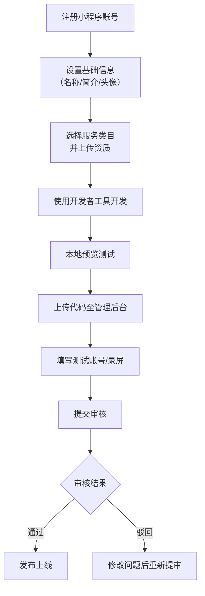
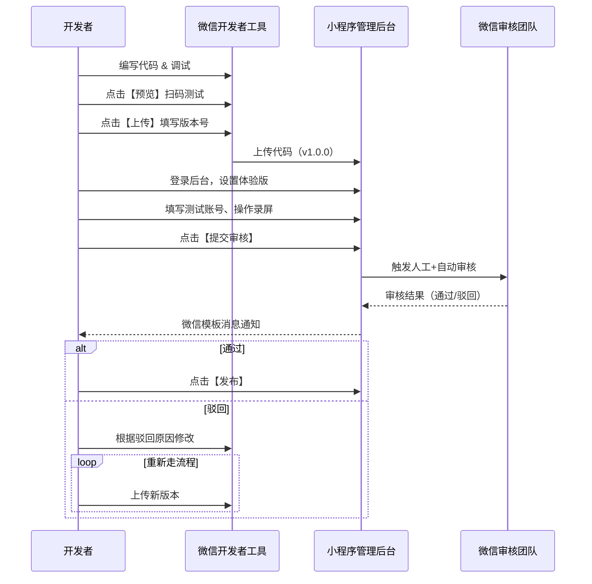

# 微信小程序审核全流程

**文档版本：** v2.6  
**最后更新日期：** 2025年10月1日  
**适用对象：** 微信小程序开发者、产品经理、测试工程师、项目负责人  
**微信官方文档开发指南：** [https://developers.weixin.qq.com/miniprogram/dev/framework/](https://developers.weixin.qq.com/miniprogram/dev/framework/)

---

## 文章参考

- [微信开发者工具官方文档](https://developers.weixin.qq.com/miniprogram/dev/devtools/devtools.html)  
- [小程序名称与基础信息审核规则](https://developers.weixin.qq.com/community/operate/doc/00002a6a0b8d98a965993666a51001?blockType=5)  
- [小程序类目开放范围说明](https://developers.weixin.qq.com/miniprogram/product/material/)  
- [小程序名称规范说明](https://developers.weixin.qq.com/community/operate/doc/00060288824708b8d588e4ae25bc01)  
- [小程序代码审核流程与注意事项](https://developers.weixin.qq.com/community/develop/doc/000c040e8204a8241a5b6b22556809)

---

## 1. 概述

微信小程序从注册到正式上线，需经历**基础信息设置 → 类目配置 → 开发与测试 → 代码上传 → 提交审核 → 审核通过 → 正式发布**等关键阶段。

本指南以**实操步骤**为核心，为开发者提供一套**可复用、标准化、全流程覆盖**的审核操作手册，帮助团队高效通过审核，避免因信息不规范、类目不符、功能缺失等问题导致审核失败或反复驳回。

---

## 2. 审核前准备阶段

### 2.1 设置小程序基础信息

:::tip
 **说明**：基础信息（名称、简介、头像）是用户对小程序的第一印象，也是平台审核重点。必须在提审前完成设置并确保合规。
:::

#### 步骤 1：登录微信公众平台
- 访问 [https://mp.weixin.qq.com](https://mp.weixin.qq.com)
- 使用注册小程序时绑定的管理员微信扫码登录

#### 步骤 2：进入“设置” > “基本设置”
- 在左侧菜单栏点击【设置】→【基本设置】

#### 步骤 3：填写小程序名称
- **命名原则**：
  - 优先使用**品牌名、商标或具有辨识度的短词**（如“印象笔记”）
  - **禁止**使用以下类型名称：
    - 功能性描述词（如“外卖”“记账”）
    - 地域+广义词（如“四川门窗”，政务类除外）
    - 营销词汇（如“免费抢购”“清仓特卖”）
    - 商品分类堆砌（如“女鞋男鞋女包批发”）
    - 热门关键词堆砌（如“外卖美食跑腿快递”）
- **注意**：名称提交后修改需重新审核，且30天内最多修改2次

#### 步骤 4：上传头像（Logo）
- 格式要求：PNG 或 JPG
- 分辨率：≥144×144 像素
- 内容要求：
  - 清晰、与小程序功能一致
  - **不得使用**微信、腾讯官方图标或未经授权的第三方标识

#### 步骤 5：填写简介
- 字数限制：4~120 字
- 内容要求：
  - 准确描述核心功能（如“提供在线预约挂号与报告查询服务”）
  - **不得模糊表述**（如“多功能服务平台”）
  - 必须与实际功能一致

:::warning
 ✅ 完成后点击【保存】，系统将自动校验名称合规性。
:::
---

### 2.2 选择并配置服务类目

:::info
 **说明**：类目决定小程序可提供的服务范围，必须与实际功能严格匹配。不同主体（个人/企业/境外）开放类目不同。
:::

#### 步骤 1：进入“设置” > “服务类目”
- 在左侧菜单栏点击【设置】→【服务类目】

#### 步骤 2：确认主体类型
- **个人主体**：仅开放工具、生活服务（部分）、教育（非学历）等类目
- **非个人主体（企业/组织）**：可申请全部类目，但需提供对应资质
- **境外主体**：开放跨境电商、本地生活、教育等特定类目

:::warning
 ⚠️ 若主体类型不符，将无法选择对应类目。
:::

#### 步骤 3：选择一级/二级/三级类目
- 例如：若提供“在线问诊”，应选择【医疗服务】→【互联网医院】
- 若提供“外卖配送”，应选择【餐饮服务】→【外卖平台】

#### 步骤 4：上传类目所需资质（如适用）
- 系统会根据所选类目自动提示所需资质文件
- 常见资质示例：
  - **食品销售**：《食品经营许可证》或《预包装食品备案》
  - **医疗问诊**：《医疗机构执业许可证》+互联网诊疗许可
  - **电商平台**：《增值电信业务经营许可证》（含“在线数据处理与交易处理”）
  - **网络小说**：《网络出版服务许可证》+内容审核机制

:::tip
 - 所有资质文件需清晰、在有效期内
 - 合作协议需加盖公章，明确合作范围
 - 部分类目（如时政、社交、微短剧）需额外报备网信办，建议**提前14天提交**
:::

#### 步骤 5：提交类目审核
- 点击【保存】后，系统将自动校验类目与资质匹配性
- 若信息完整，类目即刻生效；若需人工审核，通常1~3个工作日内完成

---

## 3. 开发与测试阶段

### 3.1 搭建开发环境

#### 步骤 1：下载并安装微信开发者工具
- 官方下载地址：[https://developers.weixin.qq.com/miniprogram/dev/devtools/download.html](https://developers.weixin.qq.com/miniprogram/dev/devtools/download.html)
- 支持 Windows / macOS

#### 步骤 2：登录开发者工具
- 使用小程序管理员或开发者微信扫码登录
- 确保账号已在【开发管理】中添加为“开发者”

#### 步骤 3：创建或导入项目
- 输入小程序 AppID（在【设置】→【基本设置】中查看）
- 选择本地项目目录
- 点击【确定】进入开发界面

---

### 3.2 功能开发与完整性验证

:::info
 **审核核心要求**：小程序必须功能完整、可运行、无占位内容。
:::

#### 步骤 1：确保所有页面可正常访问
- 无空白页、无“敬请期待”“测试中”等占位文案
- 所有按钮可点击，无报错

#### 步骤 2：填充真实运营内容
- 商品信息需为**真实商品**，不得使用“测试商品123”等字样
- 内容描述需完整（如商品名称、价格、图片、详情）

#### 步骤 3：处理登录限制场景
- 若功能需登录才能使用：
  - 在提审前准备**测试账号**（用户名+密码）
  - 录制**30秒内功能操作视频**（MP4格式）
  - 视频需展示从首页到核心功能的完整流程

---

### 3.3 预览与本地测试

#### 步骤 1：点击开发者工具顶部【预览】按钮

- 工具将自动打包代码并生成二维码

#### 步骤 2：使用开发者微信扫码
- 在真机上体验小程序实际效果
- 检查页面加载速度、交互流畅度、兼容性

#### 步骤 3：修复问题并迭代
- 若发现 Bug 或体验问题，返回编辑器修改
- 重复预览直至功能稳定

---

## 4. 代码提审阶段

### 4.1 上传代码

#### 步骤 1：点击开发者工具顶部【上传】按钮

- 填写**版本号**（建议使用语义化版本，如 `1.0.0`）
- 填写**项目备注**（如“修复登录页白屏问题”）
#### 步骤 2：等待上传完成
- 上传成功后，代码将出现在【小程序管理后台】→【版本管理】→【开发版本】

---

### 4.2 设置体验版（可选但推荐）

#### 步骤 1：登录小程序管理后台
- 进入【版本管理】→【开发版本】

#### 步骤 2：点击【设为体验版】
- 可添加体验者微信（最多50人）
- 体验者可提前测试，验证功能完整性

---

### 4.3 提交审核

#### 步骤 1：在【开发版本】列表中点击【提交审核】

#### 步骤 2：填写审核辅助信息
- **测试账号**：提供有效用户名和密码（如功能需登录）
- **操作录屏**：上传30秒内功能演示视频
- **备注说明**：简要说明本次版本核心功能或修改点

#### 步骤 3：确认并提交
- 系统将校验基础信息、类目、代码完整性
- 提交成功后，进入审核队列

:::tip
 ⏳ **审核时长**：
 - 普通类目：通常1~7个工作日
 - 需网信办二次审核类目（如时政、社交、直播）：额外7天左右
:::

---

## 5. 审核结果处理

### 5.1 审核通过
- 管理员微信将收到模板消息通知
- 登录【版本管理】→【审核版本】，点击【发布】即可上线

### 5.2 审核驳回
- 在【通知中心】查看驳回原因
- **处理流程**：
  1. 根据驳回意见修改代码或基础信息
  2. 重新上传新版本
  3. 再次提交审核

:::warning
 ⚠️ **注意**：频繁驳回可能延长后续审核时间，建议首次提审前严格自查。
:::

---

## 6. 发布上线

#### 步骤 1：审核通过后，进入【版本管理】→【审核版本】

#### 步骤 2：点击【发布】
- 系统将校验发布权限（仅管理员可操作）

#### 步骤 3：确认发布
- 发布后，小程序将对所有用户可见
- **发布不可撤回**，如需修改需重新提审新版本

---

## 7. 可视化流程图

### 7.1 审核全流程步骤图

### 7.2 开发者操作时序图

---

## 8. 附录

### 8.1 官方文档链接汇总

| 文档类型 | 链接 |
|--------|------|
| 开发者工具 | https://developers.weixin.qq.com/miniprogram/dev/devtools/devtools.html |
| 类目与资质 | https://developers.weixin.qq.com/miniprogram/product/material/ |
| 名称规范 | https://developers.weixin.qq.com/community/operate/doc/00060288824708b8d588e4ae25bc01 |
| 审核流程 | https://developers.weixin.qq.com/community/develop/doc/000c040e8204a8241a5b6b22556809 |
| 基础信息审核规则 | https://developers.weixin.qq.com/community/operate/doc/00002a6a0b8d98a965993666a51001?blockType=5 |

---

### 8.2 高频驳回原因自查表

| 问题类型 | 自查要点 |
|---------|--------|
| **名称问题** | 是否含“免费”“大全”“测试”？是否为品牌名？是否堆砌关键词？ |
| **类目不符** | 所选类目是否覆盖全部功能？是否漏选？是否上传对应资质？ |
| **功能不完整** | 是否有空白页？商品是否为真实内容？是否使用“测试商品”？ |
| **测试信息缺失** | 是否提供测试账号？是否上传操作录屏？ |
| **敏感类目未报备** | 是否涉及时政、社交、直播、微短剧？是否提前14天提交？ |
| **头像/简介不合规** | Logo是否清晰？是否使用微信官方图标？简介是否模糊？ |

---

### 8.3 常见问题（FAQ）

#### **一、基础信息类**

**Q1：小程序名称可以修改吗？能改几次？**  
A：可以修改，但需重新审核。**30天内最多修改2次**。名称一旦通过审核并上线，频繁修改会影响用户认知和搜索权重。

**Q2：名称中能包含“中国”“全国”“官方”等词吗？**  
A：**不能**，除非主体为政府机关、事业单位或持有国家相关部门授权文件（如“中国XX协会”需提供民政部注册证明）。

**Q3：头像可以用微信图标、腾讯Logo或苹果风格图标吗？**  
A：**严禁使用**。头像不得包含微信、腾讯、Apple、Android 等平台官方图标，也不得模仿其设计风格，否则将被驳回。

**Q4：简介写“多功能小程序”“一站式服务平台”可以吗？**  
A：**不可以**。简介必须**具体描述核心功能**，如“提供在线预约挂号、报告查询与健康档案管理服务”，避免模糊、泛化表述。

---

#### **二、主体与类目类**

**Q5：个人主体能做电商、外卖、医疗、金融类小程序吗？**  
A：**不能**。个人主体仅开放工具、生活服务（部分）、教育（非学历）、丽人、家政等非敏感类目。电商、医疗、金融、社交、时政等均需**企业/组织主体**。

**Q6：我做的是“宠物美容预约”，该选哪个类目？**  
A：若为单店服务，选【生活服务 - 丽人服务 - 其他】或【生活服务 - 宠物（非医院类）】；若为平台型（多家门店入驻），需选【生活服务 - 宠物医疗服务平台】并提供合作协议及资质。

**Q7：类目选错了，审核会被拒吗？**  
A：**会**。微信审核会严格比对**实际功能与所选类目是否一致**。例如：做了外卖但未选【餐饮服务 - 外卖平台】，即使功能完整也会被驳回。

**Q8：一个小程序可以选多个类目吗？**  
A：**可以**，且**强烈建议覆盖全部功能**。例如：既有外卖又有跑腿，需同时选择【外卖平台】+【跑腿】类目。

---

#### **三、资质与报备类**

**Q9：哪些类目需要提前14天报备网信办？**  
A：以下类目首次提审需**属地网信办二次审核**，建议**至少提前14天提交**：
- 【时政信息】
- 【社交】（含陌生人交友、社区论坛、笔记、直播、婚恋等）
- 【文娱 - 视频/电台/微短剧/网络小说】
- 【直播】
- 【UGC内容平台】

**Q10：报备审核要多久？能加急吗？**  
A：**7个自然日**（不含境外主体），**无加急通道**。若7天内未收到结果，系统会自动发“预上线通知”，可先发布，但后续仍可能被要求整改或下架。

**Q11：我没有《食品经营许可证》，能卖零食吗？**  
A：**不能**。只要涉及食品在线销售（含预包装零食、饮料、茶叶等），**必须提供**以下之一：
- 《食品经营许可证》
- 《食品生产许可证》
- 《预包装食品销售备案凭证》（仅限预包装）

**Q12：做“在线问诊”需要什么资质？**  
A：必须选择【医疗服务 - 互联网医院】，并提供以下之一：
- 医疗机构主体：《医疗机构执业许可证》+“互联网诊疗”经营范围
- 平台型：合作医院的许可证 + 合作协议 + 省级互联网医疗监管平台对接证明

---

#### **四、开发与提审类**

**Q13：测试账号必须提供吗？不提供会怎样？**  
A：**如果核心功能需登录才能使用，必须提供有效测试账号和30秒内操作录屏**。否则审核员无法验证功能，将直接驳回。

**Q14：商品页面写“测试商品123”“商品正在上架”可以吗？**  
A：**绝对不行**。审核要求**内容真实、完整、可运行**。所有商品、服务、内容必须为真实运营内容，禁止占位、测试、空白页。

**Q15：首页只有“扫码登录”按钮，没有其他内容，会被拒吗？**  
A：**会**。首页需有**明确功能引导或服务介绍**。若仅为登录页，需在简介中说明“本服务仅限内部员工使用”，并在提审备注中注明。

**Q16：小程序里有用户发帖、评论、上传图片功能，需要做什么？**  
A：**必须接入微信官方内容安全接口**：
- 文本：`msgSecCheck`
- 图片：`imgSecCheck`
- 音视频：`mediaCheckAsync`  
未接入将无法通过审核，且上线后出现违规内容会被处罚。

---

#### **五、审核与发布类**

**Q17：审核被拒后，多久可以重新提交？**  
A：**无时间限制**，修复问题后即可重新上传代码并提审。但**频繁驳回（如3次以上）可能导致后续审核周期延长**。

**Q18：审核通过后，还能修改代码吗？**  
A：**不能直接修改**。已发布版本不可更改。如需更新，必须：
1. 在开发者工具修改代码  
2. 重新上传新版本  
3. 再次提交审核  
4. 审核通过后发布新版本

**Q19：发布后发现严重Bug，能紧急回滚吗？**  
A：**不能回滚**，但可**紧急下架**：
- 进入【版本管理】→【线上版本】→【下架】
- 下架后用户无法访问
- 修复后重新提审发布新版本

**Q20：审核通知在哪里查看？**  
A：两种方式：
- **电脑端**：登录 [mp.weixin.qq.com](https://mp.weixin.qq.com) →【通知中心】
- **手机端**：管理员微信会收到**模板消息**（标题如“小程序审核结果通知”）

---

#### **六、特殊场景类**

**Q21：做“微短剧”小程序有什么特殊要求？**  
A：需满足：
1. 提交《微短剧“小程序”信息登记表》（含公章）
2. 持有《广播电视节目制作经营许可证》
3. 接入**小程序虚拟支付**（安卓端交易必须通过该通道）
4. 所有视频内容需经平台审核后才能播放（禁止直接播放未审链接）

**Q22：做“跨境电商”能卖保健品、奶粉、药品吗？**  
A：
- **奶粉、保健品**：可售，但需**内测申请**，提供商标授权、境内合作方协议等
- **处方药/医疗器械**：**禁止跨境销售**
- 所有商品必须在《跨境电子商务零售进口商品清单（2019年版）》范围内

**Q23：小程序里有“分享到朋友圈”按钮，合规吗？**  
A：**合规**，但不得诱导分享（如“分享后解锁功能”“分享得红包”）。诱导分享属于违规行为，会导致审核不通过或已上线小程序被处罚。

**Q24：能否在小程序内跳转到外部H5或App？**  
A：**有限支持**：
- 可跳转**已关联的公众号文章**
- 可跳转**已备案的H5页面**（需在后台配置业务域名）
- **禁止直接跳转到竞品App或未备案外部链接**

:::tip
💡 **建议**：每次提审前，对照本FAQ及【高频驳回原因自查表】逐项检查，可大幅提升首次审核通过率。
:::

---

:::note
 **结语**：本指南基于微信官方最新政策整理，适用于标准小程序发布场景。平台规则可能动态调整，请以[微信官方文档](https://developers.weixin.qq.com/miniprogram/dev/framework/)为准。建议团队建立内部审核 Checklist，确保每次提审前逐项核对，高效上线。
:::