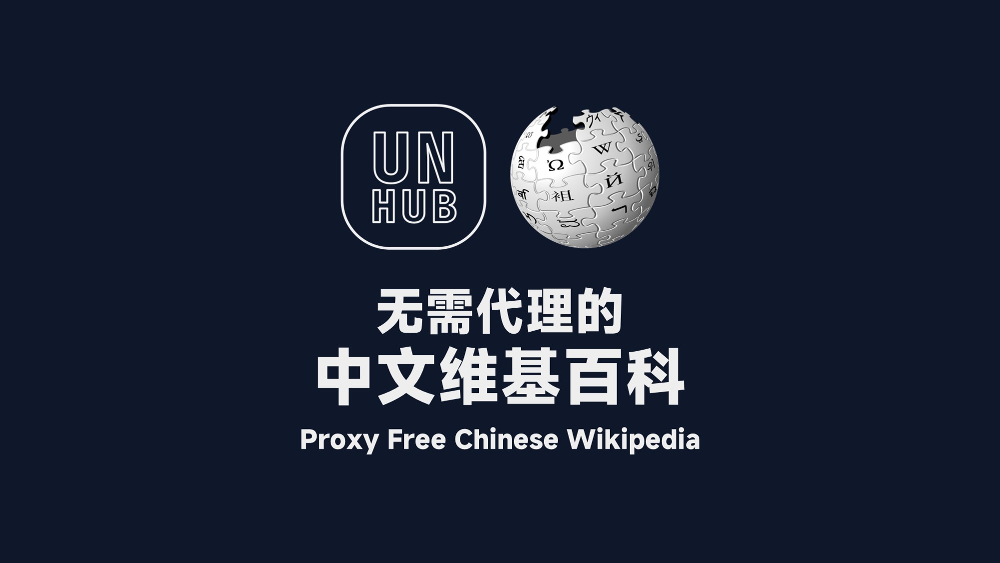
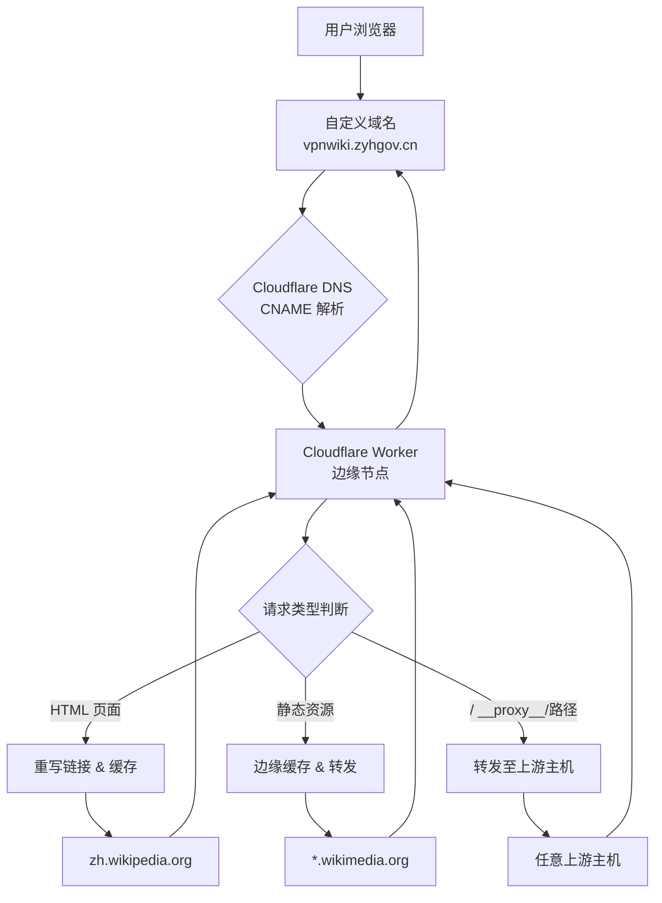
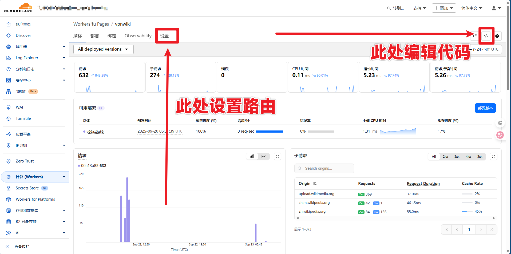
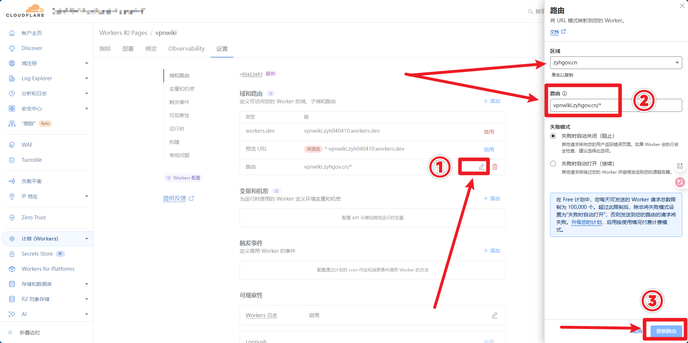

# 基于 Cloudflare Workers 的中文维基百科高性能反向代理系统

**文档版本**：1.0  
**最后更新**：2025年9月20日  
**作者**：杖雍皓 Tech Team  
**适用对象**：前端工程师、全栈开发者、DevOps工程师、网络技术爱好者

---


*无需代理的中文维基百科*


## 一、系统概述

本技术文档旨在详细阐述如何利用 **Cloudflare Workers** 和 **Cloudflare Pages/DNS** 服务，构建一个高性能、高可用、用户体验友好的中文维基百科（`zh.wikipedia.org`）反向代理系统。该系统不仅能绕过网络访问限制，还能通过智能缓存和HTML重写技术，显著提升页面加载速度和浏览体验。

### 1.1 核心价值

*   **无障碍访问**：为受限网络环境的用户提供稳定访问入口。
*   **性能优化**：利用Cloudflare全球边缘节点缓存静态资源，减少源站请求。
*   **无缝体验**：通过URL重写，使用户感觉在直接访问原站，所有站内链接和资源均正常工作。
*   **企业级健壮性**：内置错误回退、主机故障熔断、友好错误页等机制。

### 1.2 系统架构图



---

## 二、环境准备与前置条件

在开始部署前，请确保您已准备好以下资源。

### 2.1 必备资源清单

| 资源类型 | 说明 | 获取方式 |
| :--- | :--- | :--- |
| **Cloudflare 账户** | 用于管理Worker、DNS和路由。 | 在 [cloudflare.com](https://www.cloudflare.com/) 注册免费账户。 |
| **域名** | 作为代理服务的访问入口。 | 可以是您已有的域名，或注册一个新域名（如 `.cn`, `.com`）。 |
| **代码编辑器** | 用于查看和修改Worker代码。 | 任何文本编辑器均可，推荐 VS Code。 |

### 2.2 域名配置要求

您的域名必须在Cloudflare的DNS服务下进行管理，以便配置CNAME记录和开启代理（橙色云）。

---

## 三、部署与配置流程

部署过程分为五个清晰的步骤，按顺序操作即可。

### 3.1 步骤一：创建 Cloudflare Worker

1.  登录 Cloudflare 控制台。
2.  导航至 **Workers & Pages** > **Create application** > **Create Worker**。
3.  为Worker命名，例如 `wiki-proxy-advanced`，然后点击 **Deploy**。


*路由设置和编辑代码区域示意图*

### 3.2 步骤二：部署核心代码

在Worker的编辑界面，将以下核心代码片段粘贴并覆盖默认内容，然后点击 **Save and Deploy**。

```javascript  showLineNumbers=true
// 文件: worker.js
// 核心常量定义
const PROXY_HOST = 'vpnwiki.zyhgov.cn'; // 您的自定义域名
const DEFAULT_ORIGIN = 'zh.wikipedia.org'; // 默认代理的源站
const PROXY_PREFIX = '/__proxy__/'; // 代理路径前缀

// 缓存策略配置
const TTL_HTML = 60 * 15; // HTML缓存15分钟
const TTL_ASSET_LONG = 60 * 60 * 24 * 30; // 静态资源缓存30天

// 主事件监听器
addEventListener('fetch', event => {
  event.respondWith(mainHandler(event.request));
});

// 主处理函数
async function mainHandler(request) {
  const url = new URL(request.url);
  // 健康检查
  if (url.pathname === '/__wiki_proxy_ping') return new Response('ok');
  // 处理代理请求
  if (url.pathname.startsWith(PROXY_PREFIX)) {
    return await handleProxyUpstream(request, url);
  }
  // 处理常规站点请求
  return await handleSiteRequest(request, url);
}
```

> **代码切片分析**：`mainHandler` 是整个Worker的入口函数。它首先检查是否为健康检查请求，然后根据URL路径判断是处理代理请求 (`/__proxy__/`) 还是常规的站点页面请求，并分发给对应的处理函数。

### 3.3 步骤三：配置路由 (Routes)

1.  进入刚创建的Worker的 **Settings** 页面。
2.  找到 **Triggers** > **Routes**。
3.  点击 **Add Route**。
4.  在 **Route** 输入框中，填写您的自定义域名通配符，例如：`vpnwiki.zyhgov.cn/*`。
5.  点击 **Save**。


*路由设置示意图*

此步骤确保所有访问 `vpnwiki.zyhgov.cn` 的流量都被引导至该Worker进行处理。

### 3.4 步骤四：配置 DNS 记录

1.  在Cloudflare控制台，切换到 **DNS** 管理页面。
2.  为您的二级域名（如 `vpnwiki`）添加一条新的 **CNAME** 记录。
    *   **Name**: `vpnwiki`
    *   **Target**: `<your-worker-name>.<your-subdomain>.workers.dev` (例如：`wiki-proxy-advanced.yourname.workers.dev`)
    *   **Proxy status**: 确保为 **Proxied** (橙色云图标)。
3.  保存记录。

### 3.5 步骤五：验证部署

部署完成后，可通过以下方式验证系统是否正常工作：

1.  **访问首页**：在浏览器中打开 `https://vpnwiki.zyhgov.cn`。您应看到与 `https://zh.wikipedia.org` 首页内容一致的页面，且页面中的所有图片、CSS、JS资源均能正常加载。
2.  **健康检查**：访问 `https://vpnwiki.zyhgov.cn/__wiki_proxy_ping`，应返回简单的 `ok` 文本。
3.  **直接代理测试**：访问 `https://vpnwiki.zyhgov.cn/__proxy__/upload.wikimedia.org/wikipedia/commons/thumb/1/11/Bob_Katter.jpg/250px-Bob_Katter.jpg`，应能直接看到一张图片。

---

## 四、核心技术模块详解

本系统的核心在于其智能的请求处理和内容改写逻辑。以下是对关键模块的深入剖析。

### 4.1 智能URL重写引擎 (`makeProxyUrl`)

这是整个代理系统的核心大脑，负责将原始页面中的各种链接重写为代理链接或本地链接。

```javascript  showLineNumbers=true
function makeProxyUrl(orig) {
  const base = `https://${DEFAULT_ORIGIN}`;
  const u = new URL(orig, base);
  const host = u.hostname.toLowerCase();

  // 1. 处理维基媒体资源 (图片、CSS、JS)
  if (host.endsWith('.wikimedia.org')) {
    return `https://${PROXY_HOST}${PROXY_PREFIX}${host}${u.pathname}${u.search}`;
  }

  // 2. 处理默认源站 (zh.wikipedia.org)
  if (host === DEFAULT_ORIGIN) {
    // 2.1 如果是页面链接 (/wiki/...)，映射到本地路径
    if (u.pathname.startsWith('/wiki/')) {
      return `https://${PROXY_HOST}${u.pathname}${u.search}`;
    }
    // 2.2 其他路径，走代理
    return `https://${PROXY_HOST}${PROXY_PREFIX}${host}${u.pathname}${u.search}`;
  }

  // 3. 处理其他语言维基 (如 en.wikipedia.org)
  if (host.endsWith('.wikipedia.org')) {
    return `https://${PROXY_HOST}${PROXY_PREFIX}${host}${u.pathname}${u.search}`;
  }

  // 4. 保留第三方链接
  return orig;
}
```

**代码切片分析**：
*   该函数接收一个原始URL字符串 `orig`，它可以是绝对路径、相对路径或协议相对路径。
*   使用 `new URL(orig, base)` 将其解析为一个完整的URL对象，确保后续处理的准确性。
*   根据目标主机名 (`host`) 进行分情况处理：
    *   对于 `*.wikimedia.org` 的资源，统一重写为 `/__proxy__/` 格式。
    *   对于 `zh.wikipedia.org` 的页面链接 (`/wiki/...`)，重写为指向本地域名的路径，保证用户浏览不跳出代理站。
    *   对于其他语言的维基百科，也通过代理访问。
    *   第三方链接保持不变。

### 4.2 HTML流式重写器 (`HTMLRewriter`)

Cloudflare Workers 提供的 `HTMLRewriter` API 允许在响应流中实时修改HTML内容，而无需将整个页面加载到内存，效率极高。

```javascript  showLineNumbers=true
// 在 handleSiteRequest 函数中
const rewriter = new HTMLRewriter()
  .on('a', new AttrRewriter('href')) // 重写所有链接
  .on('img', new AttrRewriter('src')) // 重写图片源
  .on('img', new AttrRewriter('srcset')) // 重写响应式图片
  .on('link', new AttrRewriter('href')) // 重写CSS等资源
  .on('*', new StyleAttrRewriter()); // 重写内联样式中的url()

const transformed = rewriter.transform(fetched);
```

**代码切片分析**：
*   `new HTMLRewriter()` 创建一个重写器实例。
*   `.on('selector', handler)` 方法为指定的HTML元素绑定一个处理器。
*   `AttrRewriter` 类负责处理 `href`, `src` 等标准属性。
*   `StyleAttrRewriter` 类负责处理 `style` 属性中内嵌的 `url(...)`。
*   最后，`rewriter.transform(fetched)` 将从源站获取的响应 `fetched` 进行流式转换，生成新的响应 `transformed`。

### 4.3 边缘缓存与性能优化

系统通过分层缓存策略，最大化利用Cloudflare的边缘网络。

```javascript  showLineNumbers=true
// 在 handleProxyUpstream 函数中
const cache = caches.default;
const cacheKey = new Request(target, { method: 'GET', headers: forwardedReq.headers });
const likelyAsset = isLikelyAsset(path); // 判断是否为静态资源

if (likelyAsset) {
  const cached = await cache.match(cacheKey);
  if (cached) return cached; // 命中缓存，直接返回
}

// ... 发起网络请求 ...

if (fetched.status === 200 && likelyAsset) {
  resp.headers.set('Cache-Control', `public, max-age=${TTL_ASSET_LONG}`);
  eventualCachePut(cache, cacheKey, resp.clone()); // 异步写入缓存
}
```

**代码切片分析**：
*   `caches.default` 是Cloudflare提供的边缘缓存API。
*   `isLikelyAsset(path)` 通过文件扩展名（如 `.jpg`, `.css`, `.js`）判断请求是否为静态资源。
*   对于静态资源，优先从缓存读取 (`cache.match`)。
*   请求成功后，异步将响应写入缓存 (`eventualCachePut`)，避免阻塞主请求流程。
*   通过设置 `Cache-Control` 响应头，指导浏览器和中间代理进行缓存。

---

## 五、系统监控与维护

### 5.1 健康检查

系统内置了一个简单的健康检查端点：

*   **端点URL**: `https://vpnwiki.zyhgov.cn/__wiki_proxy_ping`
*   **预期响应**: HTTP 200, 内容为 `ok`

您可以将此端点配置到任何第三方监控服务（如 UptimeRobot, Pingdom）中，以实时监控Worker的可用性。

### 5.2 错误处理

系统在任何未捕获的异常发生时，都会返回一个友好的错误页面，而不是暴露技术细节。

```javascript  showLineNumbers=true
function errorPage(message) {
  const safeMsg = String(message).replace(/</g, '&lt;').replace(/>/g, '&gt;');
  const html = `<!doctype html>
  <html><body>
    <h1>维基百科代理暂时不可用</h1>
    <p>${safeMsg}</p>
    <p>你可以稍后再试，或直接访问源站：
    <a href="https://zh.wikipedia.org">https://zh.wikipedia.org</a></p>
  </body></html>`;
  return new Response(html, { status: 502 });
}
```

当用户看到此页面时，通常意味着上游维基百科服务器暂时不可达或Worker内部出现了严重错误。

---

## 六、常见问题与故障排除 (FAQ)

| 问题现象 | 可能原因 | 解决方案 |
| :--- | :--- | :--- |
| **访问域名显示“522 Connection Timed Out”** | DNS记录未正确配置或未生效。 | 检查DNS记录中的CNAME目标是否正确，且代理状态为“已代理”（橙色云）。 |
| **页面能打开，但图片和样式加载不出来** | HTMLRewriter未能正确重写资源链接。 | 检查 `makeProxyUrl` 函数逻辑，确认 `PROXY_HOST` 常量配置正确。 |
| **所有页面都返回502错误** | Worker代码存在语法错误或上游源站完全不可达。 | 1. 检查Worker部署日志是否有错误。2. 尝试直接访问 `https://zh.wikipedia.org` 确认源站状态。 |
| **页面内容不是最新的** | 边缘缓存未过期。 | 等待缓存过期（HTML为15分钟），或在Worker代码中临时调低 `TTL_HTML` 值并重新部署。 |

---

## 七、完整的 worker.js 代码

```javascript  showLineNumbers=true
/**
 * worker.js - vpnwiki.zyhgov.cn 强化版（完整、健壮、多 host 支持，优化缓存与容错）
 *
 * 功能要点回顾：
 *  - 把 *.wikipedia.org/*.wikimedia.org 的链接改写成
 *      https://vpnwiki.zyhgov.cn/__proxy__/{host}{path}
 *    Worker 处理 /__proxy__/* 并转发到对应 host。
 *  - HTML 使用 HTMLRewriter 最小改写（包含 srcset、data-srcset、style:url() 等）。
 *  - 静态资源走边缘缓存（caches.default + cf.cacheEverything），HTML 短缓存。
 *  - 处理 Range、Referer、User-Agent，删除限制性响应头（CSP/COOP/CORP/X-Frame-Options 等）。
 *  - 当 proxied 请求失败时，尝试回退到直接请求上游原始 URL（作为最后手段）。
 *  - 基本方法白名单、简易本地失效缓存、友好错误页。
 *
 * 请结合 Cloudflare 仪表盘的 DNS/Routes/Edge Certificates 配置使用（CNAME -> workers.dev，橙云开启）。
 */

const PROXY_HOST = 'vpnwiki.zyhgov.cn';
const DEFAULT_ORIGIN = 'zh.wikipedia.org';
const PROXY_PREFIX = '/__proxy__/';

// 缓存与性能调优（按需调整）
const TTL_HTML = 60 * 15;           // HTML 缓存 15 分钟
const TTL_ASSET_SHORT = 60 * 60 * 12; // 静态资源短缓存 12 小时
const TTL_ASSET_LONG = 60 * 60 * 24 * 30; // 静态资源长缓存 30 天

// 允许的方法
const ALLOWED_METHODS = new Set(['GET', 'HEAD', 'POST', 'OPTIONS']);

// 简易内存失败缓存（仅在当前 Worker 实例存活期间有效）
const hostFailureMap = new Map(); // host -> timestamp of last failure

// 多久认为 host 恢复？（秒）
const HOST_FAILURE_TTL = 60 * 60; // 1 hour

addEventListener('fetch', event => {
  event.respondWith(mainHandler(event.request));
});

async function mainHandler(request) {
  try {
    // 方法限制
    if (!ALLOWED_METHODS.has(request.method)) {
      return new Response('Method Not Allowed', { status: 405 });
    }

    const url = new URL(request.url);

    // health check
    if (url.pathname === '/__wiki_proxy_ping') return new Response('ok', { status: 200 });

    // If proxy prefix, forward to specific upstream host
    if (url.pathname.startsWith(PROXY_PREFIX)) {
      return await handleProxyUpstream(request, url);
    }

    // Otherwise handle site request (html vs assets)
    return await handleSiteRequest(request, url);

  } catch (err) {
    // Unexpected error -> return friendly page
    return errorPage('Unexpected server error: ' + (err && err.message ? err.message : String(err)));
  }
}

/* -------------------- proxy upstream (/__proxy__/host/...) -------------------- */
async function handleProxyUpstream(request, url) {
  // e.g. /__proxy__/upload.wikimedia.org/wikipedia/commons/...
  try {
    const parts = url.pathname.split('/').filter(Boolean);
    if (parts.length < 2 || parts[0] !== '__proxy__') {
      return new Response('Bad proxy path', { status: 400 });
    }

    const hostname = parts[1];
    // Basic safety: hostname must look like a host (letters, digits, dots, hyphens)
    if (!/^[a-z0-9.-]+$/i.test(hostname)) {
      return new Response('Invalid host in proxy path', { status: 400 });
    }

    const path = '/' + parts.slice(2).join('/');
    const target = `https://${hostname}${path}${url.search}`;

    // If this host has a recent failure, fail fast to avoid wasted fetches
    if (isHostRecentlyFailed(hostname)) {
      return errorPage(`Upstream host ${hostname} recently returned errors; try again later.`);
    }

    // Build forwarded request (preserve method/body for POST)
    const forwardedReq = new Request(target, {
      method: request.method,
      headers: prepareForwardHeaders(request.headers, hostname),
      body: request.method === 'GET' || request.method === 'HEAD' ? null : request.body,
      redirect: 'follow'
    });

    const cache = caches.default;
    const cacheKey = new Request(target, { method: 'GET', headers: forwardedReq.headers }); // cache GET form
    const likelyAsset = isLikelyAsset(path);

    // For assets try edge cache first
    if (likelyAsset) {
      try {
        const cached = await cache.match(cacheKey);
        if (cached) return cached;
      } catch (e) { /* ignore cache errors */ }
    }

    // Use CF caching hints to keep things in edge
    const cfOptions = { cacheTtl: likelyAsset ? TTL_ASSET_LONG : TTL_ASSET_SHORT, cacheEverything: true };

    let fetched;
    try {
      fetched = await fetch(forwardedReq, { cf: cfOptions });
    } catch (err) {
      // mark host as failing
      markHostFailure(hostname);
      // try fallback: attempt direct fetch without our forwarded headers
      try {
        fetched = await fetch(target);
      } catch (err2) {
        markHostFailure(hostname);
        return errorPage(`Failed to fetch upstream ${hostname}: ${err2.message}`);
      }
    }

    // If upstream returned error status, mark and maybe fallback
    if (fetched.status >= 500) {
      markHostFailure(hostname);
    }

    // Clean problematic headers (CSP etc.)
    const cleanedHeaders = stripProblematicHeaders(fetched.headers);

    // Support Range requests: if origin returned 206/200, pass through
    const resp = new Response(fetched.body, {
      status: fetched.status,
      statusText: fetched.statusText,
      headers: cleanedHeaders
    });

    // Set Cache-Control for edge/downstream for successful static assets
    if (fetched.status === 200 && likelyAsset) {
      resp.headers.set('Cache-Control', `public, max-age=${TTL_ASSET_LONG}`);
      // Async cache put to avoid blocking
      eventualCachePut(cache, cacheKey, resp.clone()).catch(()=>{});
    } else if (fetched.status === 200) {
      resp.headers.set('Cache-Control', `public, max-age=${TTL_ASSET_SHORT}`);
    }

    // Add a tiny debug header (remove in production if you like)
    resp.headers.set('X-VPNWiki-Proxy', 'upstream');

    return resp;

  } catch (err) {
    return errorPage('Proxy upstream handler error: ' + (err.message || String(err)));
  }
}

/* -------------------- site request handling (HTML rewriting vs static) -------------------- */
async function handleSiteRequest(request, url) {
  const cache = caches.default;
  const accept = (request.headers.get('Accept') || '').toLowerCase();
  const acceptsHtml = accept.includes('text/html');
  const likelyAsset = isLikelyAsset(url.pathname);

  // Treat as static asset if extension or client doesn't accept HTML
  if (likelyAsset || !acceptsHtml) {
    return await fetchAndCacheOrigin(request, url, { asset: true });
  }

  // For HTML pages: try edge cache for rewritten HTML
  const cacheKey = new Request(request.url, request);
  try {
    const cached = await cache.match(cacheKey);
    if (cached) return cached;
  } catch (e) { /* ignore */ }

  // ✅ 核心修改：根路径映射到 Wikipedia 首页
  let originPath = url.pathname + url.search;
  if (originPath === '/' || originPath === '/index.html') {
    originPath = '/wiki/Wikipedia:首页';
  }
  const originUrl = `https://${DEFAULT_ORIGIN}${originPath}`;

  const forwarded = new Request(originUrl, {
    method: request.method,
    headers: prepareForwardHeaders(request.headers, DEFAULT_ORIGIN),
    body: request.method === 'GET' || request.method === 'HEAD' ? null : request.body,
    redirect: 'follow'
  });

  let fetched;
  try {
    fetched = await fetch(forwarded, { cf: { cacheTtl: TTL_HTML, cacheEverything: true } });
  } catch (err) {
    return errorPage('Failed to fetch origin HTML: ' + (err.message || String(err)));
  }

  const contentType = (fetched.headers.get('content-type') || '').toLowerCase();
  if (!contentType.includes('text/html')) {
    // Not HTML — pass through cleaned headers
    return new Response(fetched.body, {
      status: fetched.status,
      statusText: fetched.statusText,
      headers: stripProblematicHeaders(fetched.headers)
    });
  }

  // HTML: transform using HTMLRewriter
  const rewriter = new HTMLRewriter()
    .on('head', new HeadMetaInjector())
    .on('a', new AttrRewriter('href'))
    .on('link', new AttrRewriter('href'))
    .on('script', new AttrRewriter('src'))
    .on('img', new AttrRewriter('src'))
    .on('img', new AttrRewriter('srcset'))
    .on('img', new AttrRewriter('data-src'))
    .on('img', new AttrRewriter('data-srcset'))
    .on('source', new AttrRewriter('src'))
    .on('source', new AttrRewriter('srcset'))
    .on('video', new AttrRewriter('src'))
    .on('video', new AttrRewriter('poster'))
    .on('audio', new AttrRewriter('src'))
    .on('form', new AttrRewriter('action'))
    .on('*', new StyleAttrRewriter());

  const transformed = rewriter.transform(fetched);

  const finalResp = new Response(transformed.body, {
    status: fetched.status,
    statusText: fetched.statusText,
    headers: stripProblematicHeaders(fetched.headers)
  });

  // Cache rewritten HTML
  if (finalResp.status === 200) {
    finalResp.headers.set('Cache-Control', `public, max-age=${TTL_HTML}`);
    try { await cache.put(cacheKey, finalResp.clone()); } catch (e) { /* ignore */ }
  }

  finalResp.headers.set('X-VPNWiki-Proxy', 'html-rewritten');
  return finalResp;
}

/* -------------------- fetch origin & cache (for default origin) -------------------- */
async function fetchAndCacheOrigin(request, url, opts = {}) {
  // opts.asset = boolean
  const cache = caches.default;
  const path = url.pathname + url.search;
  const target = `https://${DEFAULT_ORIGIN}${path}`;

  // For direct asset paths that point to non-default hosts, the HTML rewrite will create /__proxy__/host/... requests.
  const forwarded = new Request(target, {
    method: 'GET', // cache key always GET for static cache
    headers: prepareForwardHeaders(request.headers, DEFAULT_ORIGIN),
    redirect: 'follow'
  });

  const cacheKey = new Request(target, forwarded);

  // try cache
  try {
    const cached = await cache.match(cacheKey);
    if (cached) return cached;
  } catch (e) { /* ignore */ }

  try {
    const cfOptions = { cacheTtl: opts.asset ? TTL_ASSET_LONG : TTL_ASSET_SHORT, cacheEverything: true };
    const fetched = await fetch(forwarded, { cf: cfOptions });
    const cleanedHeaders = stripProblematicHeaders(fetched.headers);

    const resp = new Response(fetched.body, {
      status: fetched.status,
      statusText: fetched.statusText,
      headers: cleanedHeaders
    });

    if (fetched.status === 200) {
      resp.headers.set('Cache-Control', `public, max-age=${cfOptions.cacheTtl}`);
      eventualCachePut(cache, cacheKey, resp.clone()).catch(()=>{});
    }

    resp.headers.set('X-VPNWiki-Proxy', 'origin-fetch');
    return resp;

  } catch (err) {
    return errorPage('Fetch origin asset failed: ' + (err.message || String(err)));
  }
}

/* -------------------- helpers / rewriters / util -------------------- */

// 判定疑似静态资源（基于扩展名）
function isLikelyAsset(pathname) {
  return /\.(png|jpe?g|gif|webp|svg|ico|css|js|mjs|woff2?|ttf|otf|map|mp4|webm|ogg|mp3|wav|flac|m4a|ogv|ogm)(\?.*)?$/i.test(pathname);
}
// HeadMetaInjector: 向 <head> 标签中注入 Bing 验证 meta 标签
class HeadMetaInjector {
  element(element) {
    // 将 Bing 的验证 meta 标签插入到 <head> 的开头
    element.prepend('<meta name="msvalidate.01" content="E3A4FB466204A9FD062A1A54E9D3C75F" />', { html: true });
  }
}
// AttrRewriter: 处理 href/src/action 等单 URL 属性，并处理 srcset 的描述符
class AttrRewriter {
  constructor(attrName) { this.attrName = attrName; }
  element(el) {
    try {
      const raw = el.getAttribute(this.attrName);
      if (!raw) return;
      if (isAlreadyProxied(raw)) return;

      // srcset / data-srcset: multiple items like "URL 2x, URL2 480w"
      if (this.attrName === 'srcset' || this.attrName === 'data-srcset') {
        const parts = raw.split(',').map(p => p.trim()).filter(Boolean);
        const mapped = parts.map(part => {
          const m = part.match(/^(\S+)(\s+\S+)?$/);
          if (!m) return part;
          const urlPart = m[1];
          const desc = m[2] || '';
          const newUrl = makeProxyUrl(urlPart);
          return `${newUrl}${desc}`;
        });
        el.setAttribute(this.attrName, mapped.join(', '));
        return;
      }

      // 普通属性：单 url
      const newVal = makeProxyUrl(raw);
      if (newVal && newVal !== raw) el.setAttribute(this.attrName, newVal);
    } catch (e) {
      // ignore per-element errors
    }
  }
}

// StyleAttrRewriter: 处理内联 style 中的 url(...)
class StyleAttrRewriter {
  element(el) {
    try {
      const styleVal = el.getAttribute('style');
      if (!styleVal) return;
      const newStyle = styleVal.replace(/url\(\s*(['"]?)(.*?)\1\s*\)/g, (m, q, u) => {
        if (/^(data:|blob:|about:|#)/i.test(u)) return `url(${q}${u}${q})`;
        const newUrl = makeProxyUrl(u);
        return `url(${q}${newUrl}${q})`;
      });
      if (newStyle !== styleVal) el.setAttribute('style', newStyle);
    } catch (e) {
      // ignore
    }
  }
}

// 判定是否已被改写为我们的 proxy（避免重复改写）
function isAlreadyProxied(val) {
  try {
    if (!val) return false;
    if (typeof val !== 'string') return false;
    if (val.startsWith(PROXY_PREFIX)) return true;
    const u = new URL(val, `https://${DEFAULT_ORIGIN}`);
    if (u.hostname === PROXY_HOST) return true;
    if (u.pathname && u.pathname.startsWith(PROXY_PREFIX)) return true;
    return false;
  } catch (e) {
    return false;
  }
}

/**
 * 将任意 URL（相对 / 绝对 / 协议相对）解析并改写为代理路径 或 映射到标准路径
 *  - 对 wikipedia.org / wikimedia.org 的资源 (图片、CSS、JS等) 改写为 /__proxy__/host/...
 *  - 对 wikipedia.org 的页面链接 (/wiki/...) 映射到 vpnwiki.zyhgov.cn 的 /wiki/... 路径
 *  - 对相对路径（解析成 DEFAULT_ORIGIN）也会进行相应处理
 */
function makeProxyUrl(orig) {
  try {
    const base = `https://${DEFAULT_ORIGIN}`; // e.g., https://zh.wikipedia.org
    const u = new URL(orig, base); // Supports relative and protocol-relative URLs
    const host = u.hostname.toLowerCase();

    // --- 1. Check if the URL points to a host that needs proxying for RESOURCES ---
    if (host.endsWith('.wikimedia.org')) {
      // e.g., upload.wikimedia.org -> https://vpnwiki.zyhgov.cn/__proxy__/upload.wikimedia.org/...
      return `https://${PROXY_HOST}${PROXY_PREFIX}${host}${u.pathname}${u.search || ''}`;
    }

    // --- 2. Special handling for the DEFAULT_ORIGIN (e.g., zh.wikipedia.org) ---
    if (host === DEFAULT_ORIGIN) {
      // Check if it's a PAGE link (e.g., /wiki/...)
      // We assume page links start with /wiki/. You might refine this condition.
      if (u.pathname.startsWith('/wiki/')) {
        // --- Map it back to the standard path on YOUR domain ---
        // This ensures links like /wiki/Ubuntu stay within your proxy's main HTML rewriting flow.
        return `https://${PROXY_HOST}${u.pathname}${u.search || ''}`;
      } else {
        // For other paths on the main wiki host (e.g., API calls, if any were relative)
        // that are not /wiki/ pages, proxy them normally.
        // This is less common for standard links but covers edge cases.
        return `https://${PROXY_HOST}${PROXY_PREFIX}${host}${u.pathname}${u.search || ''}`;
      }
    }

    // --- 3. Handle other wikipedia.org subdomains if needed (e.g., en.wikipedia.org) ---
    // If you want to proxy other language wikis through your main proxy, handle them here.
    // For now, let's assume they should also go through the proxy for resources,
    // but page links might need more complex logic or just be proxied directly.
    if (host.endsWith('.wikipedia.org')) {
         // For resources on other wikipedia subdomains, proxy them.
         // For page links, you might need a different strategy or just proxy directly.
         // Let's proxy them for now, similar to the main logic before.
         // A more robust check for "resource-like" paths might be needed.
         // Simple heuristic: if it looks like a resource path (has an extension or specific pattern)
         // But for simplicity, let's proxy all non-default wikipedia.org subdomains.
         // BE CAREFUL: This might still lead to /__proxy__/en.wikipedia.org/wiki/... links.
         // Ideally, you'd map them to a language-specific path on your domain or handle differently.
         // For now, we'll proxy them.
         return `https://${PROXY_HOST}${PROXY_PREFIX}${host}${u.pathname}${u.search || ''}`;
    }


    // --- 4. Keep third-party absolute URLs unchanged ---
    return orig;
  } catch (e) {
    // If URL parsing fails, return the original string to avoid breaking the page.
    console.warn("makeProxyUrl failed to parse:", orig, e); // Optional: Log the error
    return orig;
  }
}


/* 请求头转发准备：转发大部分有用头，但去掉会影响上游识别的 hop-by-hop headers */
function prepareForwardHeaders(originalHeaders, upstreamHost) {
  const headers = new Headers();
  for (const [k, v] of originalHeaders) {
    const key = k.toLowerCase();
    if (['x-forwarded-for','cf-connecting-ip','cf-ray','via','connection','keep-alive','transfer-encoding','upgrade'].includes(key)) continue;
    if (key === 'host') continue;
    // We drop accept-encoding to let Cloudflare manage compression to avoid mismatched encodings
    if (key === 'accept-encoding') continue;
    headers.set(k, v);
  }
  // set Host to upstreamHost (some origins check Host)
  headers.set('Host', upstreamHost);
  // Prefer to forward client's Referer if present, else use upstream origin as referer
  if (!headers.has('referer') && !headers.has('referrer')) {
    headers.set('Referer', `https://${upstreamHost}/`);
  }
  // Ensure some UA exists
  if (!headers.has('user-agent')) headers.set('User-Agent', 'Mozilla/5.0 (compatible; vpnwiki-proxy/1.0)');
  return headers;
}

/* 删除限制性响应头（CSP、COOP、X-Frame-Options 等）以提高兼容性 */
function stripProblematicHeaders(origHeaders) {
  const headers = new Headers(origHeaders);
  [
    'content-security-policy',
    'content-security-policy-report-only',
    'cross-origin-embedder-policy',
    'cross-origin-opener-policy',
    'cross-origin-resource-policy',
    'x-frame-options'
  ].forEach(h => headers.delete(h));
  return headers;
}

/* 异步向 edge cache 写入，不阻塞主流程 */
async function eventualCachePut(cache, key, value) {
  try {
    await cache.put(key, value);
  } catch (e) {
    // ignore cache put failure
  }
}

/* 错误页面（友好提示） */
function errorPage(message) {
  const safeMsg = String(message).replace(/</g, '&lt;').replace(/>/g, '&gt;');
  const html = `<!doctype html>
  <html lang="zh-CN"><head><meta charset="utf-8"><meta name="viewport" content="width=device-width,initial-scale=1">
  <title>维基百科代理不可用</title>
  <style>
    body{font-family:-apple-system,BlinkMacSystemFont,"Segoe UI",Roboto,Arial;display:flex;align-items:center;justify-content:center;height:100vh;margin:0;background:#f5f7fb}
    .box{background:#fff;padding:26px;border-radius:12px;box-shadow:0 8px 30px rgba(0,0,0,0.08);max-width:720px;text-align:center}
    h1{margin:0 0 12px;color:#c0392b}p{color:#333;line-height:1.6}
    a{color:#0b74de}
  </style></head><body>
    <div class="box">
      <h1>维基百科代理暂时不可用</h1>
      <p>${safeMsg}</p>
      <p>你可以稍后再试，或直接访问源站：<a href="https://zh.wikipedia.org" target="_blank">https://zh.wikipedia.org</a></p>
    </div>
  </body></html>`;
  return new Response(html, { status: 502, headers: { 'content-type': 'text/html; charset=utf-8' } });
}

/* -------------------- host failure cache helpers -------------------- */
function markHostFailure(hostname) {
  try {
    hostFailureMap.set(hostname, Date.now());
  } catch (e) { /* ignore */ }
}

function isHostRecentlyFailed(hostname) {
  try {
    const t = hostFailureMap.get(hostname);
    if (!t) return false;
    return (Date.now() - t) < HOST_FAILURE_TTL * 1000;
  } catch (e) {
    return false;
  }
}

```

**文档结束**