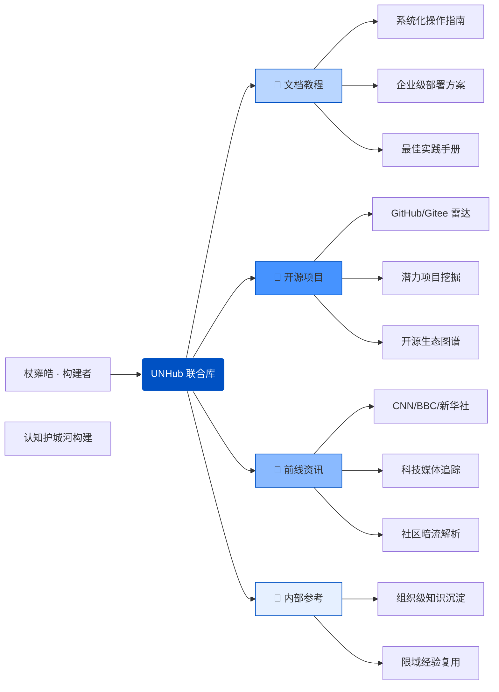

## 🌐 由杖雍皓构建的下一代开源知识中枢

> **在信息碎片化的时代，我们重构认知的坐标系。**

UNHub 联合库（United Knowledge Hub）是由技术架构师 **杖雍皓** 发起并主导开发的开源知识平台，旨在打破信息孤岛，聚合全球高价值技术资产，构建一个**结构化、可进化、面向未来的知识操作系统**。

平台以“四维知识引擎”为核心架构，覆盖从学习、探索、洞察到沉淀的完整认知闭环：

---

### 🧩 四大核心模块 · 定义知识新范式

#### 📘 文档教程  
不止于“使用说明”，而是**工程化知识交付系统**。覆盖主流工具链、云原生架构、自动化部署，让每一个操作都有据可依，让每一次踩坑都成为可复用的经验。

#### 🚀 开源项目  
启动“全网扫描引擎”，从 GitHub、Gitee、腾讯云、阿里云等平台挖掘**新奇、好用、富有前景的开源星辰**。我们不做排行榜，我们做“未来项目的预言家”。

#### 📡 前线资讯  
穿透 CNN、BBC、人民日报、科技媒体与社区小道，为你提炼“下一秒”的世界信号。**官方没说的，我们找到了；热搜还没爆的，你已先知。**

#### 🔐 内部参考  
构建组织专属的“认知护城河”。限域知识、团队 SOP、架构决策记录 —— 在这里沉淀、检索、传承，让隐性经验显性化，让个体智慧组织化。

---

## 🧭 为什么选择 UNHub？

- ✅ **结构化认知** —— 告别碎片，知识按场景、层级、生命周期组织  
- ✅ **全网情报网** —— 不依赖单一信源，AI + 人工双轨筛选  
- ✅ **持续进化体** —— 每一次访问、每一次反馈，都在优化知识图谱  
- ✅ **开源即自由** —— 所有公共内容开放贡献，共建共享  

---

🌐 **官方入口：[docs.zyhorg.cn](https://docs.zyhorg.cn)**  
🏛️ **构建者：杖雍皓**  
📅 **诞生于认知重构的黎明 —— 为未来而生**

---

> 在 UNHub，知识不是静态的文档，而是流动的资产；  
> 学习不是被动的接收，而是主动的勘探。  
> 加入我们，一起绘制属于技术人的“认知星图”。

---

