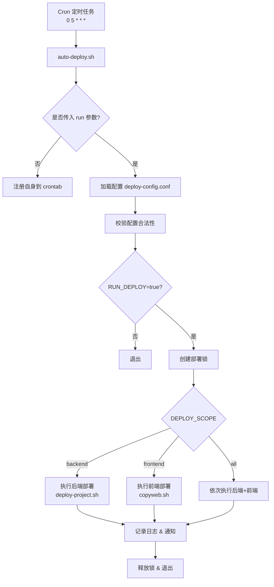
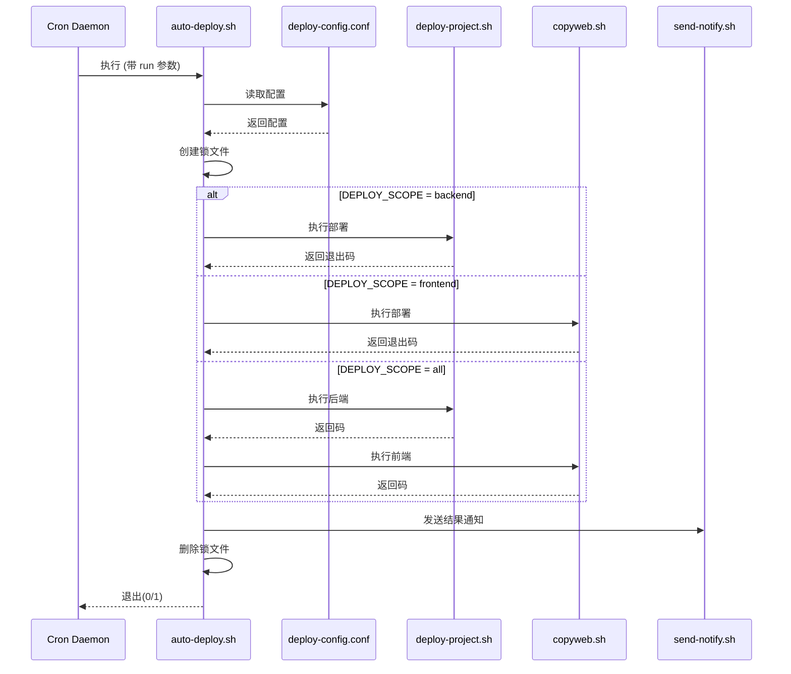

# 自动化5点部署系统技术文档

**文档版本**：v1.2  
**最后更新**：2024年9月1日  
**项目来源**：RuoShan Cloud  
**项目官网**：无  
**适用对象**：DevOps 工程师、后端/前端开发人员、系统运维人员、技术负责人  

---

## 1. 概述

### 1.1 背景与目标

为提升研发效率、减少人为操作失误、保障系统稳定性，本项目设计并实现了一套**基于 Bash 的轻量级自动化部署系统**。该系统支持每日凌晨 5:00 自动拉取最新代码、构建并部署后端与前端服务，适用于测试环境（dev）和生产环境（prod）。

核心目标包括：
- **无人值守部署**：定时自动执行，无需人工干预。
- **灵活配置**：通过配置文件控制部署行为（是否执行、部署范围、目标环境）。
- **安全可靠**：防止并发冲突、权限校验、错误隔离。
- **可观测性**：结构化日志记录 + 钉钉通知 + 日志管理工具。
- **可维护性**：模块化设计，易于扩展与调试。

### 1.2 系统架构



---

## 2. 核心组件说明

### 2.1 主部署脚本 `auto-deploy.sh`

#### 功能概览

| 功能模块 | 说明 |
|--------|------|
| **配置加载** | 安全解析 `deploy-config.conf`，支持默认值回退 |
| **定时任务自注册** | 首次运行自动写入 crontab，避免手动配置 |
| **并发控制** | 基于 PID 的文件锁机制，防止重复执行 |
| **日志管理** | 带时间戳的日志写入 + 实时控制台输出 |
| **部署执行** | 按 `DEPLOY_SCOPE` 执行后端/前端部署脚本 |
| **结果通知** | 通过 `send-notify.sh` 发送钉钉消息 |
| **错误处理** | 严格错误退出（`set -euo pipefail`） |

#### 代码切片分析

##### 安全配置加载（防注入）
```bash showLineNumbers=true
while IFS='=' read -r key value; do
    key=$(echo "$key" | sed 's/^[[:space:]]*//;s/[[:space:]]*$//')
    value=$(echo "$value" | sed 's/^[[:space:]]*//;s/[[:space:]]*$//')
    [[ -z "$key" || "$key" =~ ^# ]] && continue
    case "$key" in
        RUN_DEPLOY)   RUN_DEPLOY="$value"   ;;
        DEPLOY_ENV)   DEPLOY_ENV="$value"   ;;
        DEPLOY_SCOPE) DEPLOY_SCOPE="$value" ;;
    esac
done < "$CONFIG_FILE"
```
> **说明**：避免使用 `source` 防止恶意命令注入，仅解析白名单字段。

##### 部署锁机制
```bash showLineNumbers=true
if [ -f "$LOCK_FILE" ]; then
    LOCK_PID=$(cat "$LOCK_FILE")
    if kill -0 "$LOCK_PID" 2>/dev/null; then
        log "检测到正在运行的部署进程 (PID: $LOCK_PID)，退出。"
        exit 1
    fi
fi
echo "$$" > "$LOCK_FILE"
trap 'rm -f "$LOCK_FILE"' EXIT
```
> **说明**：利用 `kill -0` 检查进程是否存在，确保原子性。

##### 命令安全执行（数组 + 可执行判断）
```bash showLineNumbers=true
if [ -x "${BACKEND_CMD[0]}" ]; then
    cmd=("${BACKEND_CMD[@]}")
elif [ -f "${BACKEND_CMD[0]}" ]; then
    cmd=(bash "${BACKEND_CMD[@]}")
else
    BACKEND_EXIT=1
fi
"${cmd[@]}" 2>&1 | tee -a "$LOG_FILE"
BACKEND_EXIT=${PIPESTATUS[0]}
```
> **说明**：使用数组避免空格/特殊字符问题，`PIPESTATUS` 获取真实退出码。

---

### 2.2 配置文件 `deploy-config.conf`

#### 配置项说明

| 配置项 | 可选值 | 默认值 | 说明 |
|-------|--------|--------|------|
| `RUN_DEPLOY` | `true` / `false` | `true` | 是否执行部署（用于临时关闭） |
| `DEPLOY_ENV` | `dev` / `prod` | `dev` | 部署目标环境 |
| `DEPLOY_SCOPE` | `all` / `backend` / `frontend` | `backend` | 部署范围 |

> **注意**：修改配置后，下次定时任务生效，无需重启服务。

---

### 2.3 日志管理工具 `check-log.sh`

#### 功能菜单

| 选项 | 功能 |
|------|------|
| 1 | 列出所有日志文件（含大小、时间） |
| 2 | 查看最新日志（使用 `less` 分页） |
| 3 | 交互式选择日志文件查看 |
| 4 | 删除指定日志文件（二次确认） |
| 5 | 清空所有日志（危险操作，需确认） |
| 6 | 退出工具 |

> **设计亮点**：交互式菜单 + `less` 分页 + 安全删除确认。

---

### 2.4 通知脚本 `send-notify.sh`

#### 钉钉消息格式

- **消息类型**：Markdown
- **标题**：`$1`（如“后端部署成功 🎉”）
- **内容**：`$2`（含环境、耗时、日志路径）
- **图标**：根据 `$3`（`success`/`error`）自动选择 ✅/❌

#### 安全设计
- Webhook URL 硬编码（建议后续改为环境变量或密钥管理）
- `curl` 失败不中断主流程（`|| true`）

---

## 3. 部署流程详解

### 3.1 定时任务触发

系统通过 cron 每天 5:00 触发：
```cron showLineNumbers=true
0 5 * * * /bin/bash /home/build/auto-deploy.sh run
```

> **首次运行**：不带 `run` 参数，仅注册 cron 任务。

### 3.2 部署执行时序



---

## 4. 安装与配置指南

### 4.1 目录结构要求

```bash showLineNumbers=true
/home/build/
├── auto-deploy.sh          # 主部署脚本
├── deploy-config.conf      # 配置文件
├── deploy-logs/            # 日志目录（自动创建）
├── ruo-shan-cloud/         # 后端项目（必须存在）
│   └── deploy-project.sh   # 后端部署脚本
├── ruo-shan-cloud-admin/   # 前端项目（必须存在）
│   └── copyweb.sh          # 前端部署脚本
├── check-log.sh            # 日志管理工具
└── send-notify.sh          # 通知脚本
```

### 4.2 权限设置

```bash showLineNumbers=true
# 赋予执行权限
chmod +x /home/build/auto-deploy.sh
chmod +x /home/build/check-log.sh
chmod +x /home/build/send-notify.sh

# 确保项目目录可读写
chown -R build:build /home/build/
```

### 4.3 首次运行

```bash showLineNumbers=true
# 手动执行一次（注册 cron 任务）
/home/build/auto-deploy.sh

# 查看 cron 是否写入
crontab -l | grep auto-deploy
```

---

## 5. 故障排查与最佳实践

### 5.1 常见问题

| 问题现象 | 可能原因 | 解决方案 |
|---------|--------|---------|
| 部署未执行 | `RUN_DEPLOY=false` | 修改配置为 `true` |
| 锁文件残留 | 上次部署异常退出 | 手动删除 `/home/build/.auto-deploy.lock` |
| 日志无法写入 | `/home/build/deploy-logs` 无写权限 | `chmod 755 /home/build/deploy-logs` |
| 钉钉无通知 | Webhook 失效或网络不通 | 检查 URL 或测试 `curl` |

### 5.2 最佳实践

- **配置管理**：将 `deploy-config.conf` 纳入版本控制，但排除敏感信息。
- **日志轮转**：建议配合 `logrotate` 防止磁盘占满。
- **通知增强**：在 `send-notify.sh` 中增加 `@指定人员` 功能。
- **环境隔离**：`dev` 与 `prod` 使用不同服务器或用户，避免误操作。

---

## 6. 扩展与优化建议

1. **支持 Git 分支切换**：在部署前自动 `git pull` 指定分支。
2. **健康检查**：部署后调用健康接口验证服务状态。
3. **回滚机制**：保留历史构建产物，支持一键回滚。
4. **密钥管理**：将钉钉 Webhook 移至环境变量或 Vault。
5. **Web UI**：将 `check-log.sh` 升级为 Web 界面。

---

> **文档结束**  
