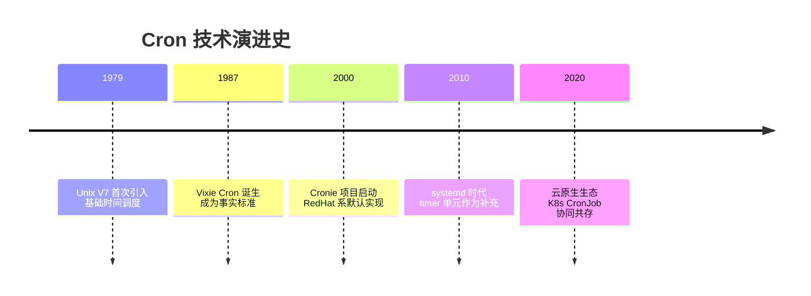
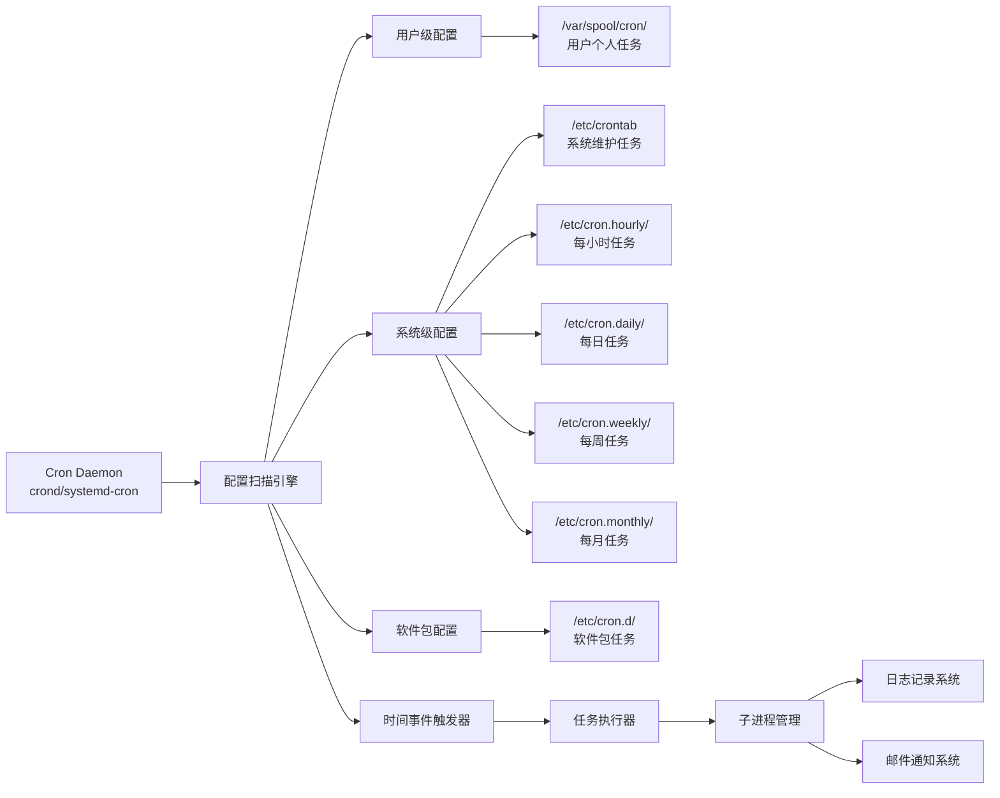
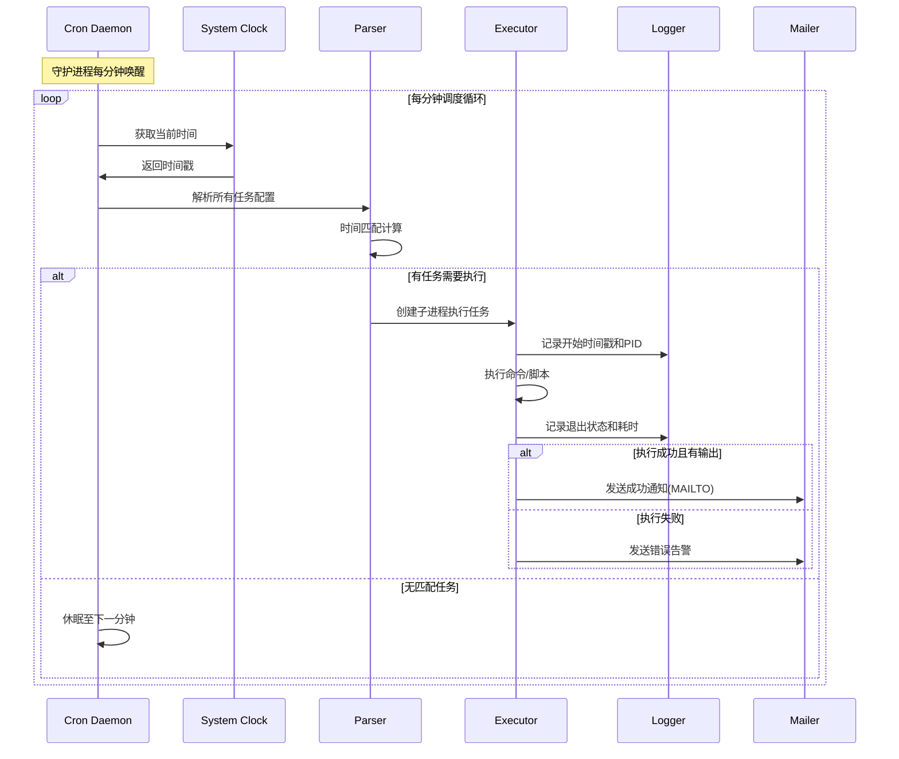
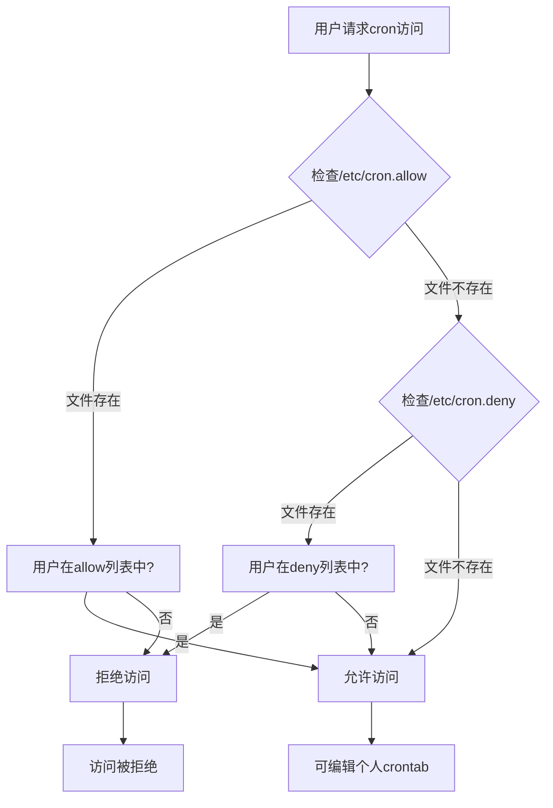
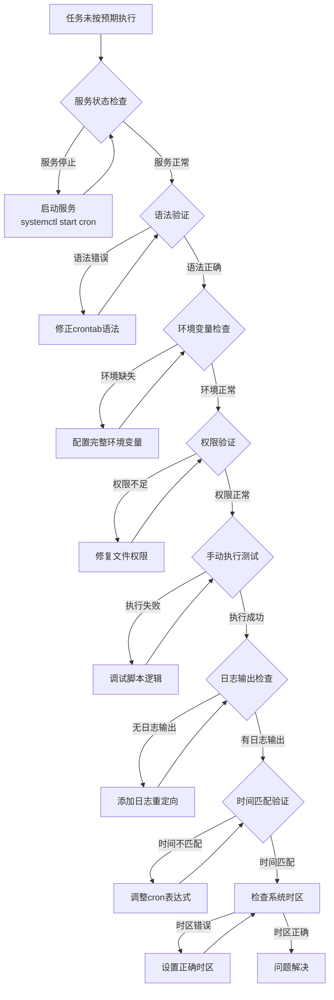

# Linux Crontab 定时任务完全技术指南（集大成版）

**文档版本**：v4.0  
**最后更新**：2024年9月24日  
**项目来源**：Linux 官方文档、社区实践、生产环境验证  
**项目官网**：https://www.kernel.org/ 、https://github.com/systemd/systemd 、https://crontab.guru/   
**适用对象**：Linux 系统管理员、DevOps 工程师、后端开发人员、自动化脚本开发者、SRE 工程师、安全运维人员  


## 1 系统架构与设计哲学

### 1.1 Cron 的历史演进与定位

Cron 作为 Unix/Linux 系统的**时间驱动任务调度器**，自 1979 年诞生以来，经历了从 Vixie Cron 到现代 systemd-cron 的演进。其核心价值在于**轻量级、高可靠性、零外部依赖**。



### 1.2 现代 Cron 生态系统架构



### 1.3 配置文件层级体系
*表：Cron 配置文件的完整矩阵*

| **配置层级** | **文件路径** | **语法格式** | **用户字段** | **权限要求** | **管理方式** | **典型用途** |
|------------|------------|------------|------------|------------|------------|------------|
| **用户级** | `/var/spool/cron/用户名` | 5字段+命令 | ❌ 无 | 用户自有 `600` | `crontab -e` | 个人开发脚本 |
| **系统级** | `/etc/crontab` | 6字段（含用户） | ✅ 有 | root `644` | 直接编辑 | 系统维护任务 |
| **软件包级** | `/etc/cron.d/任务名` | 6字段（含用户） | ✅ 有 | root `644` | 包管理器 | 应用维护任务 |
| **周期任务** | `/etc/cron.{hourly,daily,weekly,monthly}/` | 可执行脚本 | run-parts运行 | root `755` | 放置脚本 | 标准化维护 |

## 2 核心语法与表达式解析

### 2.1 时间字段完整规范

```bash showLineNumbers=true
# Crontab 时间表达式解剖学
# * * * * * command_to_execute
# │ │ │ │ │
# │ │ │ │ └─ 星期 (0-7) 0/7=周日 SUN-SAT
# │ │ │ └─── 月份 (1-12) JAN-DEC  
# │ │ └───── 日期 (1-31)
# │ └─────── 小时 (0-23)
# └───────── 分钟 (0-59)
```

### 2.2 操作符语义参考手册
*表：Crontab 操作符完整矩阵*

| **操作符** | **语法** | **语义** | **执行规则** | **示例** | **等效展开** |
|----------|---------|---------|------------|---------|------------|
| `*` | `* * * * *` | 任意值匹配 | 每个时间单位 | `0 * * * *` | 每小时整点 |
| `,` | `1,15,30 * * * *` | 离散值枚举 | 指定时间点 | `0 2,14 * * *` | 每天2点和14点 |
| `-` | `0 9-17 * * *` | 连续值范围 | 区间内所有点 | `0 9-17/2 * * *` | 9-17点每2小时 |
| `/` | `*/15 * * * *` | 步长分割 | 等间隔执行 | `0 */6 * * *` | 每6小时整点 |
| `L` | `0 0 L * *` | 最后一天 | 月最后一天 | `0 0 1-7 * 1` | 每月第一个周一 |

### 2.3 特殊字符串与别名系统

```bash showLineNumbers=true
# 现代 Cron 特殊字符串支持
@reboot        # 系统启动时执行（非传统cron语义）
@yearly        # 每年1月1日 00:00 (0 0 1 1 *)
@annually      # 同 @yearly  
@monthly       # 每月1日 00:00 (0 0 1 * *)
@weekly        # 每周日 00:00 (0 0 * * 0)  
@daily         # 每天 00:00 (0 0 * * *)
@hourly        # 每小时整点 (0 * * * *)

# 月份和星期的别名支持（不区分大小写）
JAN,FEB,MAR,...DEC  # 月份别名
SUN,MON,TUE,...SAT  # 星期别名
```

## 3 生产环境配置实战

### 3.1 企业级环境配置模板

```bash showLineNumbers=true
# =============================================================================
# /etc/crontab - 生产环境系统级任务调度
# =============================================================================
SHELL=/bin/bash
PATH=/usr/local/sbin:/usr/local/bin:/sbin:/bin:/usr/sbin:/usr/bin
MAILTO=sysadmin@company.com
HOME=/
LC_ALL=en_US.UTF-8

# 分钟 小时 日期 月份 星期 用户 命令
# ------ 系统维护任务 ------
0  2   * * *   root    /usr/local/bin/daily-backup.sh >> /var/log/backup.log 2>&1
30 3   * * 1   root    /usr/local/bin/weekly-report.sh
0  4   1 * *   root    /usr/local/bin/monthly-cleanup.sh

# ------ 业务监控任务 ------
*/5 *   * * *   appuser /opt/app/health-check.sh
0  */2  * * *   redis   /usr/local/bin/redis-monitor.sh

# ------ 安全审计任务 ------
0  6    * * *   root    /usr/local/bin/security-scan.sh
```

### 3.2 用户级任务最佳实践

```bash showLineNumbers=true
# 用户 alice 的 crontab (crontab -e)
# 环境变量必须在任务之前定义
SHELL=/bin/zsh
PATH=/home/alice/.local/bin:/usr/local/bin:/usr/bin:/bin
MAILTO=alice@company.com

# 开发环境任务
*/10 * * * * /home/alice/scripts/git-sync.sh
0 9 * * 1-5 /home/alice/scripts/daily-standup.sh

# 数据处理任务  
0 20 * * * /home/alice/scripts/data-pipeline.sh >> /home/alice/logs/pipeline.log 2>&1

# 使用 flock 防止并发执行
*/15 * * * * /usr/bin/flock -n /tmp/data-process.lock /home/alice/scripts/long-running-task.sh
```

### 3.3 高级调度模式详解
*表：企业级调度模式参考*

| **业务场景** | **Cron 表达式** | **技术要点** | **风险控制** |
|------------|----------------|------------|------------|
| 金融日终批处理 | `0 2 * * 1-5` | 避免交易时间段 | 前置资源检查、超时控制 |
| 电商大促监控 | `*/2 * * * *` | 高频但轻量级 | 熔断机制、降级策略 |
| 数据库备份 | `0 1 * * *` | 选择业务低峰期 | 备份验证、空间监控 |
| 日志归档 | `0 3 * * *` | 错开备份窗口 | 增量归档、保留策略 |
| 缓存预热 | `45 6 * * *` | 早于业务高峰 | 分级预热、失败重试 |

## 4 执行流程与生命周期管理

### 4.1 任务执行时序图



### 4.2 环境隔离机制深度解析

**代码切片分析 - 环境隔离的重要性**：

```bash showLineNumbers=true
# ❌ 危险示例：依赖交互式环境
* * * * * python3 /app/script.py  # 可能失败：python3 不在PATH中

# ✅ 正确做法：自包含环境
SHELL=/bin/bash
PATH=/usr/local/sbin:/usr/local/bin:/usr/bin:/bin
LANG=en_US.UTF-8

# 使用绝对路径和完整环境
* * * * * /usr/bin/python3 /app/script.py > /app/logs/script.log 2>&1

# 🔧 高级技巧：环境隔离容器
* * * * * /usr/bin/docker run --env-file /app/config.env app-image:latest
```

## 5 错误处理与监控体系

### 5.1 全方位日志监控方案

```bash showLineNumbers=true
#!/bin/bash
# comprehensive-cron-monitor.sh

LOG_SOURCES=(
    "/var/log/cron"
    "/var/log/syslog"
    "/var/log/messages"
)

# 1. 实时监控cron执行情况
tail -f ${LOG_SOURCES[@]} | grep -E "(CRON|cronie)"

# 2. 错误模式检测函数
check_cron_errors() {
    local log_file=$1
    echo "=== 检查 $log_file ==="
    
    # 常见错误模式
    local patterns=(
        "FAILED"
        "error"
        "Permission denied"
        "command not found"
        "No such file or directory"
    )
    
    for pattern in "${patterns[@]}"; do
        local count=$(grep -i "$pattern" "$log_file" | wc -l)
        if [ "$count" -gt 0 ]; then
            echo "❌ 发现 $pattern 错误: $count 处"
            grep -i "$pattern" "$log_file" | tail -3
        else
            echo "✅ $pattern: 正常"
        fi
    done
}

# 3. 执行全面检查
for log_source in "${LOG_SOURCES[@]}"; do
    if [ -f "$log_source" ]; then
        check_cron_errors "$log_source"
    fi
done
```

### 5.2 健康检查与性能监控
*表：Cron 系统健康指标矩阵*

| **监控维度** | **检查命令** | **健康指标** | **告警阈值** | **自动修复** |
|------------|------------|------------|------------|------------|
| **服务状态** | `systemctl status cron` | `active (running)` | 非运行状态 | `systemctl restart cron` |
| **配置语法** | `crontab -l > /dev/null` | 退出码 0 | 语法错误 | 通知管理员 |
| **任务积压** | `ps aux | grep cron | wc -l` | < 10个进程 | > 20个进程 | 调查长任务 |
| **执行延迟** | 日志时间戳分析 | < 10秒延迟 | > 60秒延迟 | 优化任务调度 |
| **资源占用** | `top -p $(pgrep cron)` | CPU < 5%, MEM < 50MB | 持续高占用 | 任务拆分 |

## 6 安全加固与权限管理

### 6.1 多层次访问控制体系



### 6.2 安全加固脚本

```bash showLineNumbers=true
#!/bin/bash
# cron-security-hardening.sh

echo "🔒 Cron 安全加固脚本开始执行..."
echo "========================================"

# 1. 访问控制配置
echo "1. 配置访问控制列表..."
echo "root" > /etc/cron.allow
echo "admin" >> /etc/cron.allow
chmod 600 /etc/cron.allow
chown root:root /etc/cron.allow

# 2. 文件权限修复
echo "2. 修复文件权限..."
chmod 600 /var/spool/cron/*
chmod 644 /etc/crontab
chmod 755 /etc/cron.d/
chmod 600 /etc/cron.d/* 2>/dev/null || true

# 3. 敏感任务审计
echo "3. 审计敏感任务..."
for user in $(cut -f1 -d: /etc/passwd); do
    if crontab -l -u "$user" 2>/dev/null | grep -q -E "(curl|wget|\.sh|\.py).*http"; then
        echo "⚠️  发现用户 $user 有网络下载任务"
    fi
done

# 4. 日志审计配置
echo "4. 配置审计日志..."
echo "cron.* /var/log/cron.log" >> /etc/rsyslog.conf
systemctl restart rsyslog

echo "✅ 安全加固完成"
```

## 7 高级特性与性能优化

### 7.1 分布式任务协调方案

```bash showLineNumbers=true
#!/bin/bash
# distributed-cron-wrapper.sh

# 基于 Redis 的分布式锁机制
acquire_lock() {
    local lock_key="cron:task:$1"
    local lock_timeout=300  # 5分钟超时
    
    # 使用 Redis SETNX 实现分布式锁
    redis-cli SETNX "$lock_key" "1" > /dev/null
    if [ $? -eq 1 ]; then
        # 检查锁是否过期
        local lock_age=$(redis-cli TTL "$lock_key")
        if [ "$lock_age" -eq -2 ]; then
            redis-cli SETEX "$lock_key" "$lock_timeout" "1" > /dev/null
            return 0
        elif [ "$lock_age" -eq -1 ]; then
            redis-cli EXPIRE "$lock_key" "$lock_timeout" > /dev/null
            return 0
        else
            echo "任务 $1 正在其他节点执行，跳过"
            return 1
        fi
    else
        redis-cli EXPIRE "$lock_key" "$lock_timeout" > /dev/null
        return 0
    fi
}

# 任务执行包装器
run_task_with_lock() {
    local task_name=$1
    shift
    local command=$@
    
    if acquire_lock "$task_name"; then
        echo "开始执行任务: $task_name"
        $command
        local exit_code=$?
        echo "任务完成，退出码: $exit_code"
        return $exit_code
    else
        return 0  # 跳过执行不算错误
    fi
}

# 使用示例
# 0 * * * * /path/to/distributed-cron-wrapper.sh run_task_with_lock "hourly-sync" /opt/sync.sh
```

### 7.2 负载感知型智能调度

```bash showLineNumbers=true
#!/bin/bash
# load-aware-cron.sh

# 系统负载阈值
MAX_LOAD=${MAX_LOAD:-3.0}
RETRY_DELAY=${RETRY_DELAY:-300}  # 5分钟重试

# 获取系统负载（1分钟平均值）
get_system_load() {
    cat /proc/loadavg | awk '{print $1}'
}

# 负载检查函数
check_load_and_execute() {
    local command=$@
    local attempt=1
    local max_attempts=3
    
    while [ $attempt -le $max_attempts ]; do
        local current_load=$(get_system_load)
        
        # 使用 bc 进行浮点数比较
        if (( $(echo "$current_load < $MAX_LOAD" | bc -l) )); then
            echo "系统负载正常 ($current_load)，开始执行任务"
            $command
            return $?
        else
            echo "系统负载过高 ($current_load > $MAX_LOAD)，延迟执行（尝试 $attempt/$max_attempts）"
            sleep $RETRY_DELAY
            ((attempt++))
        fi
    done
    
    echo "❌ 经过 $max_attempts 次尝试后仍因高负载放弃执行"
    return 1
}

# 使用示例
# */5 * * * * /path/to/load-aware-cron.sh check_load_and_execute /opt/heavy-task.sh
```

## 8 故障诊断与恢复手册

### 8.1 系统化诊断流程图



### 8.2 智能调试工具包

```bash showLineNumbers=true
#!/bin/bash
# cron-debug-toolkit.sh

# 彩色输出定义
RED='\033[0;31m'
GREEN='\033[0;32m'
YELLOW='\033[1;33m'
NC='\033[0m' # No Color

# 调试信息收集
collect_debug_info() {
    echo -e "${YELLOW}=== Cron 调试信息收集 ===${NC}"
    echo "时间: $(date)"
    echo "用户: $(whoami)"
    echo "主机: $(hostname)"
    echo
    
    # 1. 系统信息
    echo -e "${GREEN}1. 系统信息:${NC}"
    echo "发行版: $(lsb_release -d 2>/dev/null || cat /etc/*release 2>/dev/null | head -1)"
    echo "内核: $(uname -r)"
    echo "时区: $(timedatectl show --property=Timezone --value 2>/dev/null || date +%Z)"
    echo
    
    # 2. Cron 服务状态
    echo -e "${GREEN}2. Cron 服务状态:${NC}"
    if systemctl is-active cron >/dev/null 2>&1; then
        echo -e "服务状态: ${GREEN}运行中${NC}"
        systemctl status cron --no-pager -l | head -10
    else
        echo -e "服务状态: ${RED}未运行${NC}"
    fi
    echo
    
    # 3. 任务配置检查
    echo -e "${GREEN}3. 任务配置检查:${NC}"
    for user in $(getent passwd | cut -d: -f1); do
        if crontab -l -u "$user" 2>/dev/null | grep -q .; then
            echo "用户 $user 有定时任务"
        fi
    done
}

# 执行调试
case "${1:-all}" in
    "info")
        collect_debug_info
        ;;
    "test")
        echo -e "${YELLOW}=== 测试任务执行 ===${NC}"
        shift
        echo "执行命令: $@"
        echo "环境变量:"
        env | grep -E "(PATH|SHELL|HOME|LANG)" | sort
        echo
        echo "执行结果:"
        $@
        ;;
    *)
        collect_debug_info
        ;;
esac
```

## 9 附录与参考资源

### 9.1 跨发行版兼容性指南
*表：主流 Linux 发行版 Cron 实现差异*

| **发行版** | **默认实现** | **配置文件路径** | **服务管理** | **特殊说明** |
|-----------|------------|----------------|------------|------------|
| **RHEL/CentOS 7+** | cronie | `/etc/crontab` | `systemctl status crond` | 兼容 Vixie Cron |
| **Ubuntu/Debian** | cron | `/etc/crontab` | `systemctl status cron` | 基于 ISC Cron |
| **Amazon Linux 2** | cronie | `/etc/crontab` | `systemctl status crond` | 同 RHEL 系 |
| **Alpine Linux** | dcron | `/etc/crontabs/` | `rc-service crond status` | 轻量级实现 |
| **openSUSE** | cronie | `/etc/crontab` | `systemctl status cron` | 同 Enterprise 系 |

### 9.2 性能基准参考值

| **任务类型** | **合理执行时长** | **内存占用** | **CPU占用** | **并发限制** |
|------------|----------------|------------|------------|------------|
| 简单脚本任务 | < 10秒 | < 10MB | < 5% | 可并行多个 |
| 数据处理任务 | 1-5分钟 | 50-200MB | 10-30% | 建议加锁 |
| 数据库备份 | 5-30分钟 | 100-500MB | 15-50% | 必须独占 |
| 系统维护任务 | 1-10分钟 | 20-100MB | 5-20% | 可并行2-3个 |

## 总结与展望

### 10.1 核心价值总结

Cron 作为 Linux 生态中**历经40年考验**的任务调度解决方案，其核心优势在于：

1. **极简设计**：单一二进制文件，零运行时依赖
2. **稳定可靠**：生产环境验证，故障率极低  
3. **资源高效**：内存占用小，对系统影响微乎其微
4. **灵活配置**：支持复杂的时间表达式和环境定制

### 10.2 未来演进方向

随着云原生和容器化技术的发展，Cron 正在与新技术栈融合：

- **Kubernetes CronJob**：分布式环境的任务调度
- **系统级优化**：与 systemd timer 的协同工作
- **安全增强**：基于 eBPF 的任务行为监控
- **可观测性**：集成 Prometheus 指标导出

> **终极建议**：对于单机或小规模集群，Cron 仍是**最简单、最可靠**的选择；对于大规模分布式系统，建议评估 Kubernetes CronJob 或专门的任务调度平台。

---
**文档版本**: v4.0  
**最后更新**: 2025-09-24  
**维护者**: Linux 系统架构专家组  
**反馈渠道**: 通过 GitHub Issues 提交改进建议