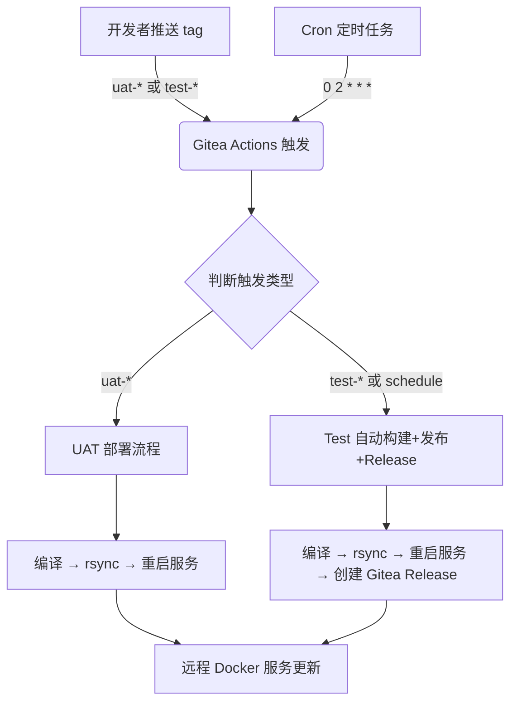
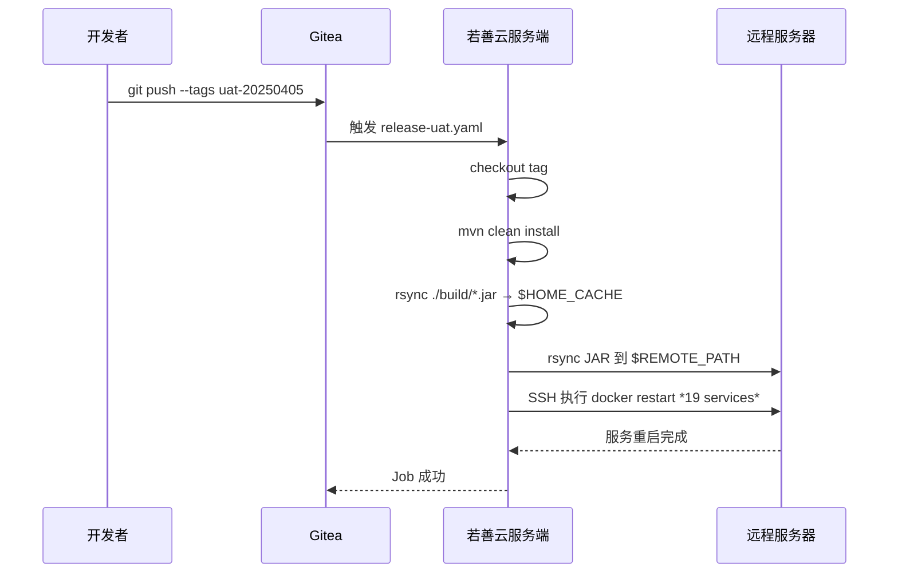
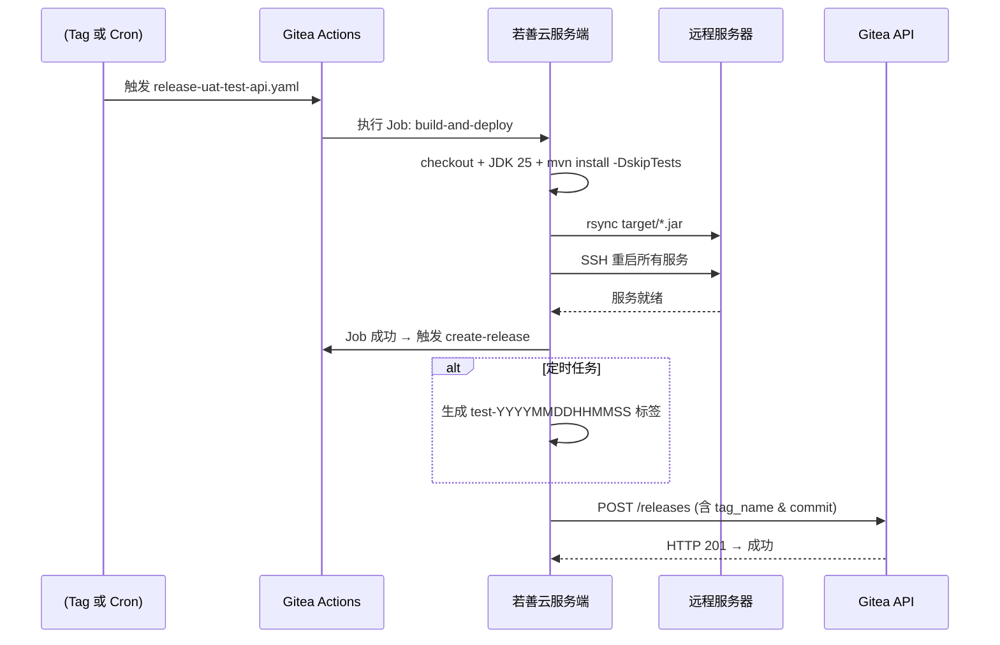

# 若善云 CI/CD 自动化部署与发布技术文档  
**文档版本：v1.2**  

---

## 1. 概述

本文档详细描述了若善云（RuoShan Cloud）项目在 Gitea 平台上的 CI/CD 自动化流程，涵盖两个核心场景：

- **UAT 环境发布**：通过打 `uat-*` 标签触发部署。
- **定时测试环境自动构建与发布**：通过 `test-*` 标签或每日凌晨 2 点定时任务触发。

两个流程均基于 GitHub Actions（兼容 Gitea Actions）实现，使用 Maven 构建 Java 项目，通过 `rsync` 同步 JAR 包至远程服务器，并通过 SSH 重启 Docker 服务。定时任务还会自动创建 Gitea Release。

---

## 2. 技术架构

### 2.1 整体架构图（Mermaid）



### 2.2 关键组件说明

| 组件 | 说明 |
|------|------|
| **Gitea** | 私有 Git 服务，托管代码仓库 `ruo-shan-cloud` |
| **Actions Runner** | 自建在“若善云服务端”的 CI/CD 执行环境 |
| **Maven** | Java 项目构建工具，使用 JDK 25 |
| **rsync** | 安全高效同步构建产物（JAR）到远程服务器 |
| **SSH + Docker** | 通过 SSH 执行 `docker restart` 实现服务热更新 |
| **Gitea API** | 用于自动创建 Release（仅 test 流程） |

---

## 3. 工作流配置详解

### 3.1 UAT 发布流程（`release-uat.yaml`）

#### 触发条件
- 推送符合 `uat-*` 正则的 Git Tag。

#### 执行流程



#### 代码片段分析

```yaml showLineNumbers=true
on:
  push:
    tags:
      - 'uat-*'
```
- **说明**：仅当推送的 tag 名以 `uat-` 开头时触发。

```yaml showLineNumbers=true
steps:
  - name: 编译代码
    run: |
      mvn clean 
      mvn install
```
- **注意**：未跳过测试（`-DskipTests`），适用于 UAT 环境需保证质量。

```yaml showLineNumbers=true
- name: 复制代码到远端
  uses: burnett01/rsync-deployments@7.1.0
  with:
    path: ./build/*.jar
```
- **问题**：实际 Maven 默认输出目录为 `target/`，此处 `./build/` 可能为误写（需确认项目配置）。

---

### 3.2 测试环境自动构建与发布（`release-uat-test-api.yaml`）

#### 触发条件
- 推送 `test-*` 标签 **或**
- 每日凌晨 2 点（`cron: '0 2 * * *'`）

#### 执行流程



#### 代码片段分析

```yaml showLineNumbers=true
env:
  GITEA_URL: https://git.rsjk.org.cn
  GITEA_OWNER: sun_3211
  GITEA_REPO: ruo-shan-cloud
```
- **说明**：硬编码仓库信息，便于 API 调用。

```yaml showLineNumbers=true
- name: 生成 TAG（仅 schedule 触发时）
  if: github.event_name == 'schedule'
  run: |
    TAG_NAME="test-$(date +'%Y%m%d%H%M%S')"
    echo "TAG_NAME=$TAG_NAME" >> $GITHUB_ENV
```
- **设计亮点**：定时任务自动打时间戳标签，避免手动操作。

```bash showLineNumbers=true
curl -X POST ... ${GITEA_URL}/api/v1/repos/.../releases
```
- **安全**：使用 `secrets.GITEA_TOKEN` 进行认证。
- **健壮性**：检查 HTTP 状态码，失败时输出错误详情。

---

## 4. 配置对比表

| 特性 | `release-uat.yaml` | `release-uat-test-api.yaml` |
|------|---------------------|------------------------------|
| **触发方式** | `uat-*` tag | `test-*` tag 或 cron |
| **构建目录** | `./build/`（存疑） | `./target/`（标准 Maven） |
| **跳过测试** | ❌ 未跳过 | ✅ `-DskipTests` |
| **JDK 安装** | 注释掉 | ✅ 显式安装 JDK 25 |
| **远程路径** | `${{ vars.REMOTE_PATH }}` | `/home/project/`（硬编码） |
| **创建 Release** | ❌ 无 | ✅ 自动调用 Gitea API |
| **错误处理** | 基础 | ✅ `set -e` + 显式 exit 1 |
| **服务重启间隔** | 10 秒 | 30 秒（更稳妥） |

> **建议**：统一使用 `target/` 目录，并将远程路径参数化。

---

## 5. 安全与最佳实践

### 5.1 安全措施
- 所有敏感信息（SSH 密钥、Gitea Token、主机地址）均通过 `secrets` 管理。
- SSH 使用密钥认证，禁用密码登录。
- Gitea API 调用使用最小权限 Token。

### 5.2 改进建议
1. **统一构建目录**：确认 `build/` 是否为自定义输出路径，否则应改为 `target/`。
2. **参数化远程路径**：避免硬编码 `/home/project/`，改用 `vars` 或 `secrets`。
3. **增加健康检查**：重启服务后，调用 `/actuator/health` 确认服务就绪。
4. **日志归档**：将构建日志和部署日志持久化存储。

---

## 6. 附录：关键环境变量与 Secrets

| 名称 | 类型 | 说明 |
|------|------|------|
| `REMOTE_USER` | secret | 远程服务器 SSH 用户名 |
| `DEV_REMOTE_HOST` | secret | 远程服务器 IP 或域名 |
| `SERVER_SSH_KEY` | secret | SSH 私钥（PEM 格式） |
| `GITEA_TOKEN` | secret | Gitea Personal Access Token（需 repo 权限） |
| `REMOTE_PATH` | variable | 远程部署路径（仅 uat 流程使用） |
| `HOME_CACHE` | variable | 本地缓存目录（uat 流程使用） |

---

## 7. 总结

本文档完整描述了若善云项目在 Gitea 平台上的双模式 CI/CD 自动化方案：

- **UAT 发布**：手动打标，严格构建，适用于准生产验证。
- **Test 自动化**：支持定时构建 + 自动打标 + 自动 Release，适用于每日集成测试。

两套流程结构清晰、安全可控，具备良好的可维护性和扩展性。建议后续统一构建路径与部署参数，进一步提升复用性与健壮性。

---  
**文档结束**